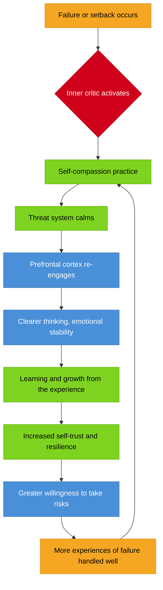
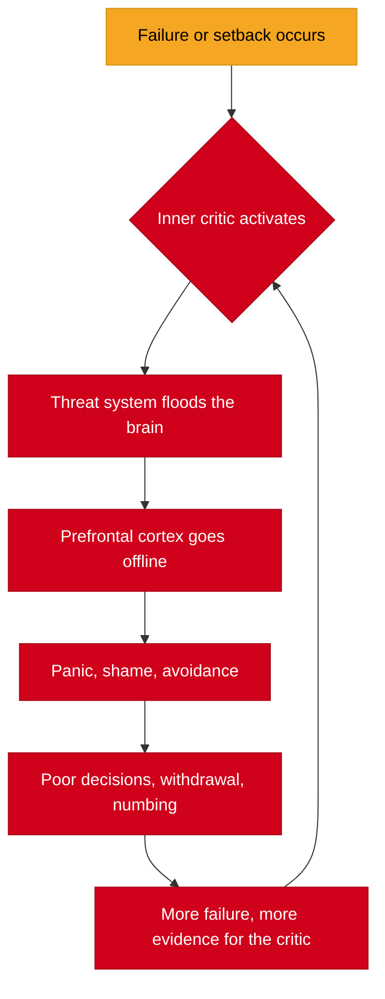

# Self-Compassion

## Description

The voice that drives you forward is often the same voice that destroys you when you fail. Self-compassion is not self-indulgence — it is the capacity to treat yourself with the same kindness you would offer a friend. This document explores why developers struggle with self-compassion and how to develop it.

## Prerequisites

- [Getting Back Up](getting-back-up.md) — the mechanics of recovery
- [Emotional Regulation](emotional-regulation.md) — managing emotions during rebuilding
- [The Lowest Point](../../intro/the-lowest-point.md) — understanding rock bottom

## Table of Contents

- [The Voice Inside You](#-the-voice-inside-you)
- [What Self-Compassion Actually Is](#-what-self-compassion-actually-is)
- [Why Developers Are Especially Bad at This](#-why-developers-are-especially-bad-at-this)
- [The Inner Critic](#-the-inner-critic)
- [Self-Compassion vs. Self-Esteem vs. Self-Indulgence](#-self-compassion-vs-self-esteem-vs-self-indulgence)
- [The Neuroscience of Self-Compassion](#-the-neuroscience-of-self-compassion)
- [The Self-Compassion Feedback Loop](#-the-self-compassion-feedback-loop)
- [Practical Self-Compassion Exercises](#-practical-self-compassion-exercises)
- [How Self-Compassion Accelerates Recovery](#-how-self-compassion-accelerates-recovery)
- [The Theological Dimension](#-the-theological-dimension)
- [Walkthrough: Ada Learns to Speak to Herself Differently](#-walkthrough-ada-learns-to-speak-to-herself-differently)
- [Learning Tips](#-learning-tips)
- [Glossary](#-glossary)
- [Quick References](#-quick-references)
- [Next Steps](#-next-steps)

## Content / Material

### 🗣️ The Voice Inside You

There is a voice in your head that narrates your life. It has been there as long as you can remember. It comments on your performance, your choices, your worth. It reacts to your failures with surgical precision, finding exactly the right words to make you feel small.

You know this voice. You have heard it after a failed deployment. After a code review that stung. After you could not solve a problem that someone junior cracked in ten minutes. After you said the wrong thing in a meeting. After you compared your career trajectory to someone who seems to be accelerating while you are standing still.

The voice says things like:

- "You are not good enough."
- "Everyone else figured this out years ago."
- "You are falling behind."
- "If they really knew how little you understand, they would not have hired you."
- "You always do this."

This voice feels like truth. It feels like honesty. It feels like the only thing standing between you and total complacency. You have been told, implicitly and explicitly, that this voice is useful. That it keeps you sharp. That without it, you would rot.

But consider the possibility that this voice is not protecting you. Consider the possibility that it is destroying you — slowly, methodically, in ways you have normalized because everyone around you is being destroyed by the same voice.

Self-compassion is the radical act of turning to that voice and saying: *I hear you, but you are wrong. I am allowed to be struggling. I am allowed to be human.*

### 🌿 What Self-Compassion Actually Is

Self-compassion, as researched by Kristin Neff at the University of Texas at Austin, is not a single feeling. It is a practice with three interconnected components. Understanding these components is essential, because most people misunderstand at least one of them.

**Self-kindness** is the first component. It means treating yourself with warmth and understanding when you suffer, fail, or feel inadequate, rather than attacking yourself with criticism. Self-kindness is not about lowering your standards. It is about not destroying yourself when you fail to meet them.

**Common humanity** is the second component. It means recognizing that suffering and personal inadequacy are part of the shared human experience — that every person struggles, every person fails, every person feels inadequate at times. You are not uniquely broken. You are ordinarily human.

**Mindfulness** is the third component. It means holding your painful thoughts and feelings in balanced awareness, neither suppressing them nor exaggerating them. Mindfulness prevents you from being consumed by your suffering. It creates a space between the pain and your response to it.

The three components work together as an integrated system:

| Component | What It Is | What It Is Not |
|-----------|-----------|---------------|
| Self-kindness | Warmth toward yourself in moments of failure | Letting yourself off the hook, avoiding responsibility |
| Common humanity | Recognition that struggle is universal | Minimizing your pain by comparing it to others |
| Mindfulness | Balanced awareness of suffering without over-identification | Detachment, emotional numbness, "thinking positive" |

When all three are present, self-compassion emerges. When one is missing, the practice breaks down. Without self-kindness, you get cold self-analysis. Without common humanity, you get isolated self-pity. Without mindfulness, you get drowning in suffering.

The critical misunderstanding: self-compassion is not about feeling good about yourself. It is about being kind to yourself when you do not feel good. The distinction matters enormously. Self-esteem requires you to succeed in order to feel worthy. Self-compassion does not. It is available to you in your worst moments — precisely when you need it most.

### 🖥️ Why Developers Are Especially Bad at This

Developers occupy a unique intersection of psychological conditions that make self-compassion particularly difficult. Understanding why is the first step toward changing it.

**Imposter syndrome.** The tech industry runs on imposter syndrome. Studies consistently show that 58% or more of developers experience it at some point in their careers. You feel like a fraud. You believe that at any moment, someone will discover that you do not really know what you are doing. The higher you advance, the worse it gets — not because the gap between your perceived and actual competence grows, but because the stakes feel higher.

Imposter syndrome and self-compassion are in direct opposition. Imposter syndrome says: "You are a fraud, and if anyone knew the truth, you would be exposed." Self-compassion says: "You are learning. Everyone is learning. The gap between what you know and what you do not know is not evidence of fraud — it is evidence of being alive in a complex field."

**Perfectionism.** Software development rewards perfectionism — or at least it appears to. Bugs are failures. Broken builds are failures. Missed edge cases are failures. The entire discipline is oriented toward finding and eliminating errors. This technical precision bleeds into personal standards. You begin to believe that you should be error-free. That you should always know the answer. That mistakes are evidence of inadequacy.

The problem is that technical perfectionism, when applied to the self, becomes toxic. You cannot debug a human being. You cannot write unit tests for self-worth. The standards that make you a good engineer will, if applied without self-compassion, make you a miserable person.

**Comparison culture.** The tech industry has an unusually transparent hierarchy. Open source contributions are public. Stack Overflow reputation is visible. GitHub profiles display your activity. Twitter showcases the projects, talks, and achievements of your peers. You are perpetually confronted with evidence that someone else is doing more, knowing more, building more.

Comparison is the enemy of self-compassion. Every time you measure yourself against someone else's highlight reel, you generate evidence for the inner critic. The inner critic does not contextualize. It does not note that the person you are comparing yourself to has advantages you do not. It simply concludes: "You are falling behind."

**The velocity trap.** Technology moves fast. The framework you learned last year is already deprecated. The language you mastered is being replaced. The skills that got you hired are becoming obsolete. This constant acceleration creates a perpetual sense of inadequacy. There is always something you should be learning, always a gap in your knowledge, always a new technology that everyone else seems to have adopted already.

When your industry is structured around perpetual inadequacy, self-compassion feels dangerous. The inner critic whispers: "If you stop pushing, you will fall behind." The idea that you might treat yourself kindly during a learning gap feels like inviting failure.

**The isolation of deep work.** Developers spend hours alone, in their heads, with their thoughts. Deep work requires concentration, and concentration requires isolation. But isolation feeds the inner critic. When you are alone with your thoughts for eight hours a day, the critical voice has ample time to build its case. There is no one there to offer a different perspective.

### 🎭 The Inner Critic

The inner critic is not a single voice. It is a cast of characters, each with a specific role in your psychological defense system. Understanding its architecture is essential to disarming it.

The inner critic is not evil. It evolved to protect you. The part of your psyche that generates self-criticism was, at some point in your development, trying to keep you safe. It learned that if it attacked you first, external criticism would hurt less. It learned that if it held you to impossible standards, you would never be caught unprepared. It learned that shame was an effective motivator.

The strategy worked — when you were a child, navigating an unpredictable environment. It does not work now. The inner critic is using a survival strategy that is destroying the thing it was designed to protect.

**The architecture of the inner critic:**

| Critic Type | What It Sounds Like | Its Hidden Agenda |
|-------------|--------------------|--------------------|
| The Perfectionist | "You should have done better." | Prevents shame by pre-empting external criticism |
| The Comparer | "Everyone else is ahead of you." | Motivates through fear of falling behind |
| The Catastrophizer | "This mistake will end your career." | Keeps you hypervigilant against threats |
| The Discounting Voice | "That success was just luck." | Prevents the vulnerability of pride |
| The Taskmaster | "You are not working hard enough." | Ensures survival through relentless productivity |
| The Abandoner | "No one actually cares about you." | Protects against the pain of rejection by pre-emptively withdrawing |

Each type serves a function. Each one believes it is helping you. The work of self-compassion is not to destroy the inner critic but to recognize its strategy, thank it for trying to protect you, and gently inform it that the strategy is no longer necessary.

```python
# The inner critic's logic
class InnerCritic:
    def __init__(self):
        self.strategy = "attack_preemptively"
        self.belief = "if_i_am_my_own_harshest_critic_no_one_else_can_hurt_me"

    def evaluate(self, performance):
        if performance < 1.0:  # anything less than perfect
            return "not_good_enough"
        elif performance >= 1.0:
            return "could_have_been_better"  # never satisfied

    def purpose(self):
        return "protection_through_shame"
        # But the cost is everything that matters
```

The inner critic is loudest at the moments when you need kindness most — after a failure, during a transition, in the middle of uncertainty. This is not a coincidence. The critic activates when your sense of safety is threatened. It believes that if it can shame you into action, you will be safe. But shame does not produce safety. It produces paralysis, hiding, and more shame.

### ⚖️ Self-Compassion vs. Self-Esteem vs. Self-Indulgence

The most common objections to self-compassion conflate it with two very different things: self-esteem and self-indulgence. Clarifying the distinction is essential.

**Self-esteem** is a evaluation of your worth based on comparison and achievement. It feels good when you succeed and collapses when you fail. It is conditional. It depends on being better than others, or at least meeting an internal standard of performance. Self-esteem is a house built on sand — stable only when conditions are favorable.

**Self-compassion** is a relationship with yourself that does not depend on performance. It is available in failure as much as in success. It does not require you to be special, talented, or better than anyone else. It requires only that you are a human being who is suffering. Self-compassion is a house built on rock.

**Self-indulgence** is the avoidance of discomfort through gratification. It says: "I feel bad, so I will eat this entire cake / skip the gym / binge-watch six hours of television / buy something I cannot afford." Self-indulgence is not kindness. It is avoidance dressed as kindness. It makes you feel worse in the long run.

| Dimension | Self-Esteem | Self-Compassion | Self-Indulgence |
|-----------|------------|----------------|-----------------|
| Source | Comparison, achievement | Recognition of shared humanity | Avoidance of discomfort |
| Stability | Fluctuates with performance | Consistent regardless of outcome | Temporary relief followed by guilt |
| Response to failure | Collapse, shame spiral | Kindness, learning, growth | Numbing, distraction, avoidance |
| Requires being better than others | Often, yes | Never | Not applicable |
| Long-term effect | Fragile confidence, chronic anxiety | Resilience, emotional stability, genuine growth | Increased shame, decreased self-trust |
| Feels like | "I am valuable because I am successful" | "I am valuable because I am human" | "I deserve to feel good right now" |

The confusion between self-compassion and self-indulgence is the most dangerous misunderstanding. Self-indulgence says: "I will do what feels good now." Self-compassion says: "I will treat myself with the same care I would offer a friend — which sometimes means doing the hard thing."

A friend who lets you destroy yourself is not being compassionate. A friend who tells you the truth, firmly but kindly, and helps you through the difficulty — that is compassion. Self-compassion holds you to the same standard. It does not lower the bar. It changes the way you pursue the bar.

### 🧠 The Neuroscience of Self-Compassion

Self-compassion is not a philosophical luxury. It has measurable effects on brain structure and function. Understanding the neuroscience grounds the practice in biology rather than sentimentality.

When you experience self-criticism, your brain activates the threat defense system — the amygdala, the hypothalamus, and the sympathetic nervous system. This is the same system that activates when you encounter a predator. Your body floods with cortisol and adrenaline. Your heart rate increases. Your muscles tense. Your prefrontal cortex — the part of your brain responsible for rational thought, planning, and emotional regulation — goes offline.

In other words, self-criticism puts your brain into survival mode. You cannot learn, create, or connect when your brain thinks it is being chased by a lion. The inner critic does not just make you feel bad — it makes you cognitively incapable of doing your best work.

When you practice self-compassion, something different happens. The care-oriented system activates — the oxytocin system, the vagus nerve, the parasympathetic nervous system. Oxytocin is released, reducing cortisol. Heart rate decreases. Blood pressure drops. The prefrontal cortex re-engages. You return to a state where learning, creativity, and connection are possible.

```python
# The neuroscience of self-criticism vs self-compassion
def brain_response(inner_state):
    if inner_state == "self_criticism":
        return {
            "system": "threat_defense",
            "hormones": ["cortisol", "adrenaline"],
            "prefrontal_cortex": "offline",
            "amygdala": "activated",
            "capacity": "survival_mode — no learning, no creativity",
            "body": "tense, shallow breathing, elevated heart rate"
        }
    elif inner_state == "self_compassion":
        return {
            "system": "care_orientation",
            "hormones": ["oxytocin", "endorphins"],
            "prefrontal_cortex": "online",
            "vagus_nerve": "activated",
            "capacity": "open — learning, creativity, connection possible",
            "body": "relaxed, slow breathing, lower heart rate"
        }
```

The implication is stark: self-criticism does not make you more effective. It makes you less effective. The voice that tells you to "push harder" is literally disabling the part of your brain you need to perform well. Self-compassion is not softness. It is the neurological prerequisite for peak performance.

Research by Christopher Neff and Paul Gilbert has shown that self-compassionate people demonstrate:

- Lower cortisol levels after stressful events
- Faster physiological recovery from stress
- Greater activation in brain regions associated with empathy and caregiving
- Reduced activation in the amygdala during emotional pain
- Increased heart rate variability, a marker of emotional resilience

The data is unambiguous: self-compassion produces better outcomes than self-criticism across every measurable dimension.

### 🔄 The Self-Compassion Feedback Loop

Self-compassion is not a one-time event. It is a self-reinforcing loop that, once activated, builds momentum over time. Understanding the loop helps you see why even small acts of self-compassion compound.



The counter-cycle — the self-criticism spiral — works in reverse:



The critical insight: both loops are self-reinforcing. The more you practice self-compassion, the easier it becomes. The more you practice self-criticism, the harder it becomes to stop. You are always in one of these loops. The question is which one you are feeding.

Every moment of self-compassion — every time you catch the inner critic and respond with kindness instead — is a vote for the positive loop. The loop does not require perfection. It requires consistency. A single act of self-compassion does not transform your life. But a thousand acts, accumulated over months, change the architecture of your inner world.

### 🛠️ Practical Self-Compassion Exercises

Self-compassion is not a concept. It is a practice. The following exercises are drawn from Kristin Neff's research and Christopher Germer's clinical work on mindful self-compassion.

**Exercise 1: The Self-Compassion Break**

This is the most foundational self-compassion practice. It takes less than two minutes and can be done anywhere — at your desk, in a meeting, during a debugging session at midnight.

When you notice you are suffering — frustration, shame, anxiety, failure — do the following:

1. **Acknowledge the suffering.** Say to yourself, silently or aloud: "This is a moment of suffering." or "This hurts." This is the mindfulness component. You are naming what is happening without exaggerating or minimizing.

2. **Connect to common humanity.** Say: "Suffering is a part of life." or "Other people feel this way too." or "I am not alone in this." This counters the isolation that suffering creates. The inner critic wants you to believe that your failure is unique, that your inadequacy is yours alone. Common humanity breaks that illusion.

3. **Offer yourself kindness.** Place your hand over your heart, or on your cheek, or wherever feels comforting. Say: "May I be kind to myself." or "May I give myself the compassion I need." The physical gesture matters. It activates the care system. It signals to your body that you are safe.

The entire practice takes sixty to ninety seconds. It is not a fix. It is a pattern interrupt — a momentary intervention that breaks the self-criticism spiral and creates a space for a different response.

**Exercise 2: Compassionate Letter Writing**

This exercise is more structured and is best done in a quiet moment, not in the heat of crisis.

1. Think of something about yourself that you do not like — a perceived flaw, a recurring failure, a quality you wish you could change. Write it down in one sentence.

2. Now write a letter to yourself about this thing, from the perspective of an unconditionally loving friend. This friend sees your flaw clearly — they do not deny it or minimize it — but they respond to it with warmth, understanding, and encouragement. They acknowledge that you are human. They remind you that this flaw does not define you. They express their care for you as you are, not as you wish you were.

3. Read the letter back to yourself. Notice how it feels. You may cry. You may feel resistance — the inner critic may protest that this is fake, that you do not deserve kindness, that this is self-indulgent. Notice the resistance. Continue reading anyway.

The purpose of this exercise is not to convince yourself that your flaw does not exist. It is to change your relationship to the flaw. You stop relating to it through shame and start relating to it through understanding. This is the foundation of genuine change — you cannot transform what you refuse to accept.

**Exercise 3: The Inner Critic Dialogue**

When the inner critic is active, instead of trying to silence it, engage with it.

1. Notice what the critic is saying. Write down its exact words.

2. Ask the critic: "What are you afraid will happen if you stop criticizing me?"

3. Listen to the answer. The critic will usually reveal a fear — that you will become lazy, that you will fail, that you will be rejected, that you will stop caring.

4. Respond to the fear with compassion. "I understand you are trying to protect me. But this strategy is hurting me more than it is helping. I can be motivated by kindness. I do not need shame."

This dialogue is not about winning an argument with yourself. It is about understanding the part of you that generates self-criticism and offering it an alternative strategy.

**Exercise 4: Mindful Self-Compassion Meditation**

Set aside ten to fifteen minutes. Sit comfortably. Close your eyes.

1. Bring to mind a situation that causes you emotional pain — a recent failure, a recurring inadequacy, a relationship difficulty.

2. Acknowledge the pain: "This is suffering." Let yourself feel it. Do not push it away.

3. Recognize common humanity: "All people suffer. I am not alone in this." Let the recognition connect you to the rest of humanity rather than isolating you in your pain.

4. Offer yourself kindness: "May I be kind to myself. May I give myself what I need." Repeat this as a gentle mantra.

5. If the inner critic protests, acknowledge it: "I hear you. I know you are trying to help. But I am choosing kindness now."

6. Stay with this practice for the full duration. When your mind wanders, return to the breath and begin again.

This meditation is not about achieving a particular state. It is about practicing a new relationship with yourself. Like any practice, it gets easier with repetition.

### 📈 How Self-Compassion Accelerates Recovery

There is a common fear that self-compassion will slow you down — that if you are kind to yourself, you will lose your edge, stop trying, and settle for mediocrity. The research says the opposite.

**Motivation.** Self-compassionate people are not less motivated. They are more motivated — and their motivation is more sustainable. Self-criticism produces avoidance motivation (do this or you are worthless), which is exhausting and brittle. Self-compassion produces approach motivation (do this because you care about yourself and your growth), which is energizing and durable.

A 2018 study published in *Personality and Individual Differences* found that self-compassionate students who received poor grades on an exam studied 43% more for the retake than students with low self-compassion. The kind response to failure produced more effort, not less.

**Resilience.** Self-compassion predicts faster recovery from stressful events. Research by Breines and Chen (2012) demonstrated that participants who were induced to be self-compassionate after a failure showed greater willingness to improve, better mood, and more adaptive behavior than those in the control group. Self-compassion does not prevent the pain of failure — it accelerates the recovery from it.

**Consistency.** Self-criticism produces a boom-and-bust cycle. You push hard, burn out, collapse, shame yourself for collapsing, and push hard again. This cycle is not sustainable. It leads to chronic stress, health problems, and eventual breakdown. Self-compassion produces a steady rhythm of effort and rest, challenge and recovery, striving and acceptance. This rhythm is sustainable across decades.

**Learning.** Self-compassion creates the psychological safety necessary for genuine learning. When you are afraid of failure, you avoid challenges, hide mistakes, and defend against feedback. When you are compassionate with yourself about failure, you can look at your mistakes honestly, extract the lesson, and move forward without the defensive armor that prevents growth.

```python
# Recovery speed comparison
def recovery_trajectory(self_compassion_level, failure_severity):
    """
    Models the recovery curve from a significant failure.
    self_compassion_level: 0.0 (none) to 1.0 (fully self-compassionate)
    failure_severity: 0.0 (minor) to 1.0 (devastating)
    """
    base_recovery_time = failure_severity * 30  # days
    compassion_modifier = 1.0 - (self_compassion_level * 0.6)

    recovery_days = base_recovery_time * compassion_modifier

    return {
        "recovery_days": round(recovery_days),
        "learning_rate": self_compassion_level * 0.8 + 0.2,
        "burnout_risk": (1.0 - self_compassion_level) * failure_severity,
        "growth_potential": self_compassion_level * failure_severity
    }

# A developer with low self-compassion recovering from a major failure
print(recovery_trajectory(0.2, 0.9))
# recovery_days: 22, learning_rate: 0.36, burnout_risk: 0.72, growth_potential: 0.18

# A developer with high self-compassion recovering from the same failure
print(recovery_trajectory(0.9, 0.9))
# recovery_days: 5, learning_rate: 0.92, burnout_risk: 0.09, growth_potential: 0.81
```

The numbers tell the story. Self-compassion does not make failure painless. It makes failure survivable. It transforms failure from a threat to be avoided into information to be integrated. And in a field where failure is constant — bugs, broken builds, failed deployments, wrong architectural decisions — this transformation is not optional. It is survival.

### ✝️ The Theological Dimension

There is a reason self-compassion resonates so deeply when it finally lands. It is not just a psychological technique. It connects to something ancient — something embedded in the deepest traditions of human meaning-making.

The Christian tradition has a word for what self-compassion attempts to practice: grace. Grace is the unmerited favor that precedes performance. It is the declaration that your worth is not contingent on your output. You are loved before you achieve, before you produce, before you earn. This is not a sentimental claim. It is the most radical claim in the history of human thought — that being precedes doing, that dignity is inherent, that the universe is oriented toward mercy rather than judgment.

Self-compassion, at its best, participates in this tradition. When you treat yourself with kindness after a failure, you are not excusing the failure. You are refusing to let the failure define you. You are asserting that your identity is larger than your worst moment. This is the logic of grace: you are more than your performance, and the ground beneath you does not collapse when you stumble.

The Christian tradition also contains a profound understanding of the inner critic. The concept of the accuser — the voice that condemns, that piles shame upon shame, that tells you that you are beyond redemption — is ancient. The tradition's response to this voice is not to agree with it. It is to name it, to recognize its strategy, and to refuse its authority. This is strikingly similar to the psychological practice of externalizing the inner critic.

The concept of forgiveness — forgiving yourself — is also deeply rooted. If you believe that grace is real, that forgiveness is available, then self-forgiveness is not self-indulgence. It is obedience to the deepest truth you know. To withhold forgiveness from yourself is to claim that your judgment is more final than grace — that your assessment of your failure overrides the mercy that sustains all things. This is not humility. It is a peculiar form of pride.

The dignity of being human — the conviction that every person carries an inherent worth that no failure can diminish — is the foundation on which self-compassion rests. If you are merely a productivity machine, self-compassion is inefficient. But if you are a person — a being of infinite depth, created for communion, capable of both devastating failure and astonishing restoration — then self-compassion is not optional. It is the only appropriate response to the reality of what you are.

This does not mean self-compassion is easy for people of faith. The internalization of harsh judgment — the belief that God is primarily disappointed in you, that the divine posture is one of condemnation rather than compassion — is a deep wound that many carry. The work of self-compassion, for the person of faith, often involves unlearning a false image of the divine and recovering the original radical mercy at the heart of the tradition.

Self-compassion is, in the end, a theological practice disguised as a psychological one. It is the lived experience of grace — not as an abstract doctrine, but as a daily, hourly, moment-by-moment choice to treat yourself as someone who matters, even when you have failed, even when the inner critic is screaming, even when every external metric confirms that you have fallen short. This is not weakness. It is the deepest strength there is.

### 👩‍💻 Walkthrough: Ada Learns to Speak to Herself Differently

Ada is a 28-year-old frontend developer at a mid-sized company. She has been programming for six years. She is competent. Her team likes her. Her manager gives her good reviews. By any external measure, she is doing well.

Internally, she is being destroyed.

**The daily erosion.** Ada's inner critic operates with a consistency that would be impressive if it were not devastating. Every morning, before she opens her laptop, the critic runs its script:

- "You are going to fail today."
- "Someone on the team is going to realize you do not know what you are doing."
- "The junior developer on your team understands React better than you do."
- "You are going to miss a deadline and everyone will know."

Ada does not recognize these thoughts as the inner critic. She recognizes them as truth.

After a particularly brutal code review — the tech lead pointed out a pattern she had implemented incorrectly across three components — Ada spent the evening on the couch, unable to move. Not because the feedback was cruel. The feedback was accurate. But because the inner critic used the feedback as proof of everything it had been saying:

"You always do this. You always miss things. You are not as smart as you pretend to be. They are going to find out."

**The breaking point.** Ada's partner, Jordan, found her on the couch at midnight, still staring at the ceiling.

"What is wrong?" Jordan asked.

"Nothing. I am fine."

"You have been on that couch for four hours."

Ada tried to explain. She described the code review, the feedback, the way the inner critic amplified every word into a comprehensive indictment of her worth. She expected Jordan to fix it — to say the feedback was wrong, or that the tech lead was harsh, or that she was being too hard on herself.

Instead, Jordan said: "If your best friend told you this story — same code review, same feedback — what would you say to her?"

Ada thought about it. "I would say the feedback is useful and the implementation was fixable. I would say she is a good developer having a normal experience."

"And what did you say to yourself?"

Ada paused. "I said I was a fraud."

The gap between those two responses — the one she would offer a friend and the one she offered herself — was the beginning of everything.

**The practice.** Ada started with the self-compassion break. Every time she noticed the inner critic activating — during code reviews, after standup, when she saw a junior developer's PR — she would pause, put her hand on her chest, and say the three phrases: "This is suffering. Suffering is part of life. May I be kind to herself."

The first week, it felt ridiculous. The inner critic laughed at her. "This is stupid. This will not help. You are wasting time."

She did it anyway.

The second week, something shifted. Not dramatically — no breakthrough, no transformation. But the inner critic's volume dropped from a shout to a normal speaking voice. She could hear it without being consumed by it.

The third week, she wrote the compassionate letter. She wrote about her fear of being exposed as a fraud. She wrote, from the perspective of an unconditionally loving friend, about the courage it takes to do her job — to sit in front of a screen every day and create something from nothing, to make decisions with incomplete information, to ship code that other people depend on. The letter made her cry. But it was the kind of crying that feels like something is being released rather than something breaking.

```python
# Ada's transformation
class AdaJourney:
    def __init__(self):
        self.inner_critic_volume = 1.0  # max
        self.self_compassion_practice = 0
        self.recovery_speed = 0.3  # very slow

    def practice_day(self):
        self.self_compassion_practice += 1
        days = self.self_compassion_practice

        # The critic does not disappear — its volume decreases
        self.inner_critic_volume = max(0.2, 1.0 - (days * 0.02))

        # Recovery speed improves gradually
        self.recovery_speed = min(0.9, 0.3 + (days * 0.01))

        return {
            "critic_volume": round(self.inner_critic_volume, 2),
            "recovery_speed": round(self.recovery_speed, 2),
            "day": days
        }
```

**The shift.** After two months, Ada noticed something. She still made mistakes. She still received critical feedback. But the response was different. Instead of a shame spiral that consumed her evening, she felt the familiar contraction — the inner critic activating — and then a counter-response. Kindness. Acknowledgment. A quiet voice that said: "This is hard. You are trying. That is enough."

She did not become a worse developer. She became a better one. She started taking on more challenging work because she was no longer terrified of failure. She started giving more honest feedback in code reviews because she was no longer protecting herself through silence. She started mentoring the junior developer she had been comparing herself to, and discovered that teaching deepened her own understanding.

The irony was not lost on her. The thing she feared self-compassion would produce — complacency, mediocrity, settling — was the thing she had been producing all along through self-criticism. Self-compassion did not lower her standards. It freed her to pursue them without terror.

### 💡 Learning Tips

**Start small, start now.** Self-compassion is not a skill you develop over a weekend retreat. It is a practice you build through daily repetition. Begin with the self-compassion break. Do it three times today — once in the morning, once after a difficult interaction, once before bed. The practice takes sixty seconds. There is no excuse for not starting.

**Expect resistance.** The inner critic will attack your self-compassion practice. It will say: "This is soft. This is self-indulgent. This is going to make you weak." Notice this resistance. It is the critic doing exactly what it always does — protecting itself against a strategy that threatens its dominance. The resistance is evidence that the practice is working.

**Do not confuse self-compassion with self-pity.** Self-pity says: "Poor me. My suffering is worse than anyone else's." Self-compassion says: "This is hard. Suffering is universal. I am not alone." Self-pity isolates. Self-compassion connects. If your practice is making you feel more isolated, you are doing self-pity, not self-compassion.

**Use physical gestures.** The hand-on-heart gesture is not optional decoration. It activates the parasympathetic nervous system through pressure on the vagus nerve. The body and the mind are not separate systems. A physical gesture of care produces a neurological response that pure thinking cannot. Use it.

**Keep a self-compassion journal.** Each evening, write down three things: (1) a moment when you were self-critical, (2) what you would say to a friend in the same situation, (3) what you actually said to yourself. The gap between (2) and (3) is the space where self-compassion lives. Over time, you will notice the gap narrowing.

**Practice with small failures first.** Do not start with your deepest wound. Start with the code review that stung. The deploy that broke. The meeting where you stumbled. Build the muscle with manageable experiences before you bring self-compassion to the existential-level failures.

**Remember: consistency over intensity.** Five minutes of daily self-compassion practice produces more change than a single hour-long session once a month. The neural pathways that self-compassion builds are strengthened through repetition, not through intensity. Show up every day. The compound effect is extraordinary.

## Glossary

| Term | Definition |
|------|------------|
| Approvimate motivation | Motivation driven by desire for growth and learning, as opposed to avoidance of shame or punishment |
| Avoidance motivation | Motivation driven by fear of negative outcomes — produces short-term effort but long-term burnout |
| Common humanity | The recognition that suffering and imperfection are shared human experiences, not personal failings |
| Inner critic | The internalized voice of judgment that generates self-critical thoughts, typically as a defense mechanism against shame |
| Mindful self-compassion | Kristin Neff and Christopher Germer's integrated framework combining mindfulness with self-kindness and common humanity |
| Oxytocin | A neuropeptide released during caregiving and social bonding that reduces cortisol and activates the parasympathetic nervous system |
| Parasympathetic nervous system | The branch of the autonomic nervous system responsible for rest, recovery, and calm — activated by self-compassion practices |
| Self-compassion | A practice of treating yourself with the same kindness you would offer a friend, consisting of self-kindness, common humanity, and mindfulness |
| Self-esteem | An evaluation of personal worth based on comparison and achievement — fluctuates with performance and is inherently conditional |
| Self-indulgence | The avoidance of discomfort through immediate gratification — produces temporary relief but increased long-term shame |
| Sympathetic nervous system | The branch of the autonomic nervous system responsible for fight-or-flight — activated by self-criticism |
| Threat defense system | The neurological system that activates in response to perceived danger, including the amygdala, cortisol release, and prefrontal cortex suppression |
| Vagus nerve | The longest cranial nerve, connecting the brain to the heart and digestive system — central to the body's care and calming response |

## Quick References

- [Neff, K. (2011). Self-Compassion: The Proven Power of Being Kind to Yourself](https://www.goodreads.com/book/show/11901248-self-compassion) — the foundational text on self-compassion research and practice
- [Germer, C. (2009). The Mindful Path to Self-Compassion](https://www.goodreads.com/book/show/6321515-the-mindful-path-to-self-compassion) — a clinical guide to integrating mindfulness and self-compassion
- [Neff, K. & Germer, C. (2018). The Mindful Self-Compassion Workbook](https://www.goodreads.com/book/show/36239276-the-mindful-self-compassion-workbook) — a structured program for developing self-compassion
- [Gilbert, P. (2009). The Compassionate Mind](https://www.goodreads.com/book/show/6421502-the-compassionate-mind) — the neuroscience and evolutionary psychology of compassion
- [Brown, B. (2012). Daring Greatly](https://www.goodreads.com/book/show/13588356-daring-greatly) — on vulnerability, shame, and the courage to be imperfect
- [Frankl, V. (1946). Man's Search for Meaning](https://www.goodreads.com/book/show/4069.Man_s_Search_for_Meaning) — the connection between grace, meaning, and the capacity to endure
- [Neff, K. (2003). Self-Compassion: An Alternative Conceptualization of a Healthy Attitude Toward Oneself](https://self-compassion.org/wp-content/uploads/2017/07/Neff2003_Handout.pdf) — the original academic paper defining self-compassion
- [Breines, J. & Chen, S. (2012). Self-Compassion Increases Self-Improvement Motivation](https://www.ncbi.nlm.nih.gov/pmc/articles/PMC3472924/) — empirical evidence that self-compassion enhances motivation after failure
- [Neff, K. et al. (2019). Self-Compassion, Stress, and Well-Being in a High-Demand Professional Setting](https://self-compassion.org/wp-content/uploads/2023/06/Neff-et-al.-2023-Self-compassion-stress-and-well-being.pdf) — self-compassion research in high-performance professional contexts

## Next Steps

- [Growing Through Pain](growing-through-pain.md) — transforming suffering into strength through post-traumatic growth
- [Recognizing the Void](../meaning/recognizing-the-void.md) — understanding the existential crisis that often precedes the need for self-compassion
- [The Decision to Change](../meaning/the-decision-to-change.md) — the moment of commitment that follows awakening
- [Emotional Regulation](emotional-regulation.md) — the complementary skill of feeling without being destroyed
- [Building a Support System](building-a-support-system.md) — the relational dimension of resilience
