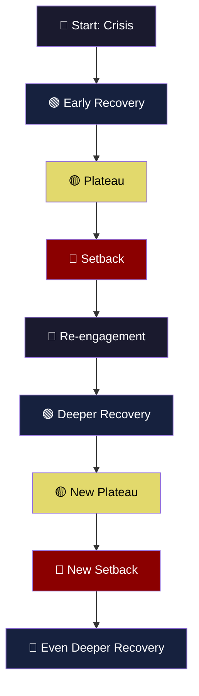
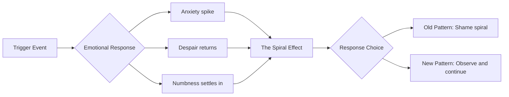
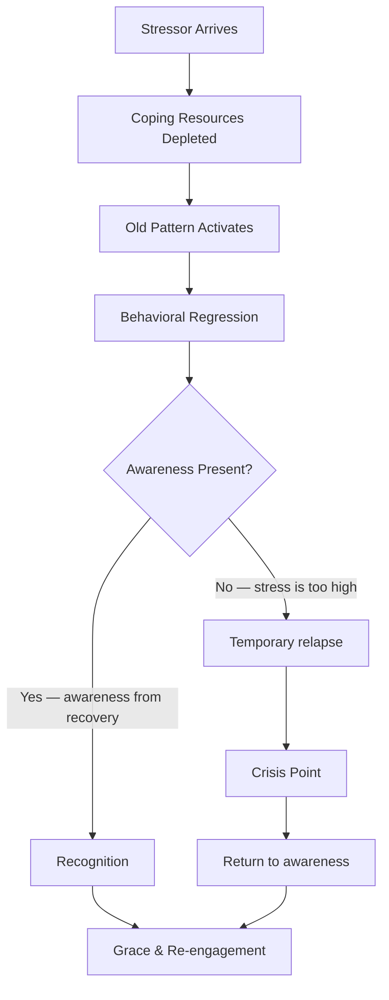

# The Myth of Linear Progress

## Description

Recovery does not move in a straight line. Setbacks, plateaus, and regressions are not failures — they are normal features of the healing process. This document dismantles the expectation of linear progress and builds a more honest framework for navigating the journey. For the developer who mapped out a clean recovery trajectory and watched it dissolve, for the person who felt they were "past this" only to find themselves back in the mud — this is the map of the spiral, and it explains why the detour was never a detour at all.

## Prerequisites

- [Getting Back Up](getting-back-up.md) — the mechanics of recovery after hitting bottom
- [Growing Through Pain](growing-through-pain.md) — transforming suffering into strength

## Table of Contents

- [The Line We Imagine](#the-line-we-imagine)
- [Why We Expect Linear Progress](#why-we-expect-linear-progress)
- [The Engineering Mindset Applied to Personal Growth](#the-engineering-mindset-applied-to-personal-growth)
- [The Reality: Recovery Is a Spiral, Not a Line](#the-reality-recovery-is-a-spiral-not-a-line)
- [Setbacks — The Reopened Wound](#setbacks--the-reopened-wound)
- [The Plateau — The Dangerous Middle](#the-plateau--the-dangerous-middle)
- [Regression — Back to Old Patterns Under Stress](#regression--back-to-old-patterns-under-stress)
- [The Comparison Trap](#the-comparison-trap)
- [Tracking Progress When It Is Non-Linear](#tracking-progress-when-it-is-non-linear)
- [The Theological Dimension: Patience and the Long Obedience](#the-theological-dimension-patience-and-the-long-obedience)
- [Walkthrough: Elena's Second Year](#walkthrough-elinas-second-year)
- [Learning Tips](#learning-tips)
- [Glossary](#glossary)
- [Quick References](#quick-references)
- [Next Steps](#next-steps)

## Content / Material

### The Line We Imagine

You imagined it like this: you hit bottom, you made a decision, you committed to change, and from that point onward, every day was incrementally better than the last. A clean upward slope. A regression line through scattered data points, trending positively. You would measure the distance from bottom to where you are now, divide by the days elapsed, and project forward. Six months of steady improvement. A year of full recovery. Two years and you would barely remember the darkness.

This is the line we imagine. It does not exist.

The line is a comforting fiction. It is the story you tell yourself because the alternative — that recovery is chaotic, recursive, and non-monotonic — is too frightening to contemplate when you are already afraid. The line gives you something to hold onto. A schedule. A promise that the pain has an endpoint and that endpoint is calculable.

But recovery does not follow a regression line. It follows a path that no sane project manager would put on a Gantt chart — one that doubles back, stalls, accelerates without warning, and occasionally lands you in a place you thought you had already left behind.

The sooner you abandon the line, the sooner you can start navigating what is actually in front of you.

### Why We Expect Linear Progress

The expectation of linear progress is not arbitrary. It is the product of deep cultural programming and cognitive architecture. You did not invent this expectation — it was given to you by every system you have ever interacted with.

**Education.** From kindergarten through university, progress was quantified and linear. Semester by semester, grade by grade, you advanced. The system was designed so that each year built predictably on the last. You internalized the model: effort produces proportional, steady advancement. The GPA is a linear metric. The credit hour is a linear unit. The degree is a linear path.

**Career.** The corporate ladder is linear by design. Junior, mid, senior, staff, principal. Each rung is a discrete step upward. The timeline is approximate but the direction is assumed: you go up, or you leave. The performance review measures progress against goals set at the start of the cycle. The expectation is improvement. Regression is failure.

**Technology.** Software development itself reinforces linearity. Sprints have velocity. Projects have burn-down charts. CI/CD pipelines move in one direction. Deployments are versioned — you do not roll back unless something is catastrophically broken, and even then, the rollback is treated as a failure of the process.

**Fitness culture.** The gym promises linear returns. Add weight progressively. Run farther each week. The app tracks your personal records. The body is treated as a machine that responds to inputs with proportional outputs. Rest days are scheduled, not emergent. Recovery is a variable, not a process.

| Domain | Linear Model | What It Ignores |
|--------|-------------|-----------------|
| Education | Each semester builds on the last | Learning plateaus, burnout, changing interests |
| Career | Promotions accumulate steadily | Market conditions, layoffs, personal crises, pivots |
| Technology | Sprints accumulate velocity | Technical debt, scope creep, team turnover, rework |
| Fitness | Progressive overload yields proportional gains | Injury, overtraining, genetic variance, life stress |
| Recovery | Each day is better than the last | Triggers, grief cycles, neuroplasticity timelines, trauma responses |

The problem is not that these domains are dishonest. The problem is that they present a simplified model as the complete truth. The simplified model is useful for systems. It is useless — and actively harmful — for people.

### The Engineering Mindset Applied to Personal Growth

Developers are especially vulnerable to the linear expectation because the engineering mindset is fundamentally a linear-computation mindset. You are trained to think in terms of inputs, outputs, and deterministic processes.

```python
# The engineering mindset applied to growth
def expected_recovery(day):
    """The clean, linear model we imagine."""
    base_recovery = 0.1  # recovery per day
    return min(1.0, base_recovery * day)

# Actual recovery data
actual_recovery = [
    0.05, 0.12, 0.08, 0.15, 0.03, 0.01,  # weeks 1-6
    -0.02, 0.06, 0.20, 0.18, 0.04, 0.11,  # weeks 7-12
    0.10, 0.07, -0.05, 0.14, 0.22, 0.09,  # weeks 13-18
    0.12, 0.08, 0.15, 0.06, 0.19, 0.25,  # weeks 19-24
]
```

The engineering mindset asks: "What is the algorithm? If I do X, I should get Y." This works for building systems. It does not work for healing a human being, because the human system is not deterministic. It is adaptive, recursive, and deeply non-linear.

You cannot debug your way out of a setback the way you debug a production incident. You cannot set a sprint goal for emotional regulation. You cannot optimize your trauma like you optimize a database query. The tools that make you excellent at engineering are the same tools that make you terrible at recovery, because they promise a control you do not have.

This does not mean the engineering mindset is wrong. It means it is incomplete. The same mind that can architect distributed systems must learn to hold ambiguity, tolerate uncertainty, and accept that some processes cannot be accelerated. The humbling truth is that you are not a machine that processes recovery at a fixed rate. You are a living system that heals at its own pace, on its own schedule, in its own spiral.

The first step is to abandon the Gantt chart of your soul.

### The Reality: Recovery Is a Spiral, Not a Line

The most accurate visual model of recovery is a spiral. You pass through the same themes, the same triggers, the same emotional territories — but each pass happens at a different altitude. You are not going in circles. You are going in a helix. The same ground is revisited, but you are not the same person revisiting it.



The spiral has several properties that distinguish it from the line:

**Repetition with variation.** You will encounter the same emotional territory multiple times. The anger at your past choices. The fear of change. The grief for the person you could have been. Each time you encounter these themes, they feel like failure — you thought you were past this. You are past this. But "past this" does not mean "finished with this." It means you are engaging it from a different altitude, with different tools, and a different understanding.

**Non-monotonic progress.** Your overall trajectory is upward, but the path includes downward movements. Some days are worse than yesterday. Some weeks are worse than last month. This is not regression — it is the nature of the spiral. The line goes down sometimes. The trend does not.

**Variable speed.** Some phases of the spiral pass quickly. Others take months. You cannot predict which phase you are in until you are already through it. The speed is determined by the depth of what you are processing, not by your effort or commitment.

**Deepening, not just advancing.** Each pass through the spiral deepens your understanding. The first time you confront anger about your past, it is raw and undifferentiated. The fifth time, you can name it, examine it, learn from it. The spiral is not just movement — it is depth.

| Property | Line | Spiral |
|----------|------|--------|
| Direction | Always forward | Forward with revisitations |
| Setbacks | Failures | Data points in the pattern |
| Speed | Constant or increasing | Variable and unpredictable |
| Depth | Surface-level advancement | Deepening understanding |
| Same themes | Should not recur | Recur at higher altitudes |
| End state | Arrival | Integration |

The spiral is harder to accept than the line because it denies you the comfort of a schedule. You cannot say "I will be healed by June." You can only say "I am processing something now, and I do not know how long it will take." This uncertainty is the price of honesty.

### Setbacks — The Reopened Wound

A setback is not a relapse. A relapse is a return to old destructive behavior patterns — substance use, self-harm, abusive relationships. A setback is a temporary return to earlier emotional states: the despair you thought you had moved past, the anxiety that had been quiet for weeks, the numbness that reappears without warning. A setback feels like a relapse. It is not one.

Setbacks happen. They are not optional. They are not signs that your recovery is failing. They are signs that your recovery is deep.



**Common triggers for setbacks:**

| Trigger | Why It Hits Hard | What It Activates |
|---------|-----------------|-------------------|
| Anniversary of the crisis | Temporal memory is powerful | Full re-exposure to the original pain |
| Seeing old patterns in others | Projection brings the past forward | Fear of returning to who you were |
| Success followed by failure | The contrast amplifies the fall | Impostor syndrome, unworthiness |
| Loneliness or isolation | Loss of the support that carried you | Vulnerability, old coping mechanisms |
| Physical illness or exhaustion | The body and mind are coupled | Lowered resilience, emotional flooding |
| Major life transition | Change destabilizes all systems | Identity confusion, existential questions |
| Unexpected kindness | Being seen can be overwhelming | Grief for the self that was not cared for |

**The anatomy of a setback:**

A setback follows a predictable sequence. Understanding the sequence gives you power over it — not the power to prevent it, but the power to recognize it as it unfolds.

1. **Trigger.** Something happens. It can be minor — a song, a comment, a smell, a dream. The trigger is disproportionate to the response because it is activating a deep memory, not a surface event.

2. **Emotional flooding.** The feeling arrives all at once. It does not build gradually. It crashes over you like a wave. You are fine, and then you are not fine. The transition is instantaneous.

3. **The narrative.** Your mind immediately generates a story: "I am back at square one." "I have not made any progress." "This was all for nothing." The narrative is false, but it feels true because the emotion is so intense.

4. **The shame.** The shame of the setback is often worse than the setback itself. You feel stupid for thinking you had recovered. You feel weak for being affected. You feel fraudulent for having told anyone that you were getting better.

5. **The fork.** At this point, the path splits. One direction leads to the shame spiral — self-blame, isolation, giving up. The other direction leads to the observation — acknowledging the setback, examining it, and continuing. The fork is the critical moment. It is also the only moment where you have genuine agency.

**How to respond to a setback:**

- Name it. Say it aloud or write it down: "This is a setback. Not a relapse. Not a failure. A setback."
- Do not analyze the trigger immediately. The emotion needs to pass through you first. Analysis while flooded leads to catastrophizing.
- Return to whatever baseline practice you have — walking, breathing, journaling. Do not try to solve the setback. Just stay present.
- Tell someone. The setback loses power when it is spoken. Isolation gives it room to grow.
- Wait. Setbacks are time-limited. They feel permanent but they are not. The duration is hours, days, maybe a week. Not months.

### The Plateau — The Dangerous Middle

The plateau is the phase that kills more recoveries than setbacks do. Setbacks are dramatic and therefore visible. Plateaus are invisible and therefore ignored. The plateau is the long stretch where nothing seems to be happening — where you are doing the work, maintaining the practices, showing up every day, and seeing no results.

The plateau is where the engineering mind rebels. "I have been consistent for three months. I should be seeing results. The system is broken." The system is not broken. The system is working on something you cannot see.

```python
# The plateau of latent potential
def growth_curve(day):
    """
    The deceptive curve of real growth.
    Visible progress stalls while invisible infrastructure develops.
    """
    if day < 30:
        return day * 0.02  # initial quick wins — easy motivation
    elif day < 90:
        return 0.6 + (day - 30) * 0.001  # the plateau — barely moving
    elif day < 120:
        return 0.66 + (day - 90) * 0.01  # acceleration — foundation pays off
    else:
        return min(1.0, 0.96 + (day - 120) * 0.005)  # sustained growth
```

**Why the plateau happens:**

The initial phase of recovery produces visible quick wins. The first week, you stop the most destructive behavior and feel immediately better. The first month, new routines produce tangible improvements. The dopamine of visible progress fuels motivation. Everyone talks about this phase. No one talks about what happens after it.

After the quick wins, the deeper work begins. The nervous system is re-wiring. The emotional patterns that took years to form are being re-learned. The identity that was built on the old patterns is being reconstructed. None of this is visible. It is all happening beneath the surface, like roots spreading under pavement before a tree pushes through.

The plateau is the period between the quick wins and the breakthrough. It is the longest phase of recovery, and it is the phase most likely to be mistaken for stagnation.

**The danger of the plateau:**

During the plateau, every doubt returns. The inner critic regroups and launches a sustained campaign:

- "You have not actually changed."
- "You were just on a high from the crisis."
- "This is your baseline. This is all you will ever be."
- "Other people recover faster. Something is wrong with you."
- "You are wasting your time."

These doubts are not insights. They are the voice of the plateau. They are the natural consequence of doing invisible work in a culture that only values visible results. The doubts feel like truth because they align with the evidence your eyes can see: no visible progress.

But your eyes are measuring the wrong thing.

**How to survive the plateau:**

- Accept that the plateau is part of the process, not a deviation from it.
- Reduce the evaluation frequency. Do not assess your progress daily. Weekly, at most.
- Track micro-indicators instead of milestones (see the section on tracking progress).
- Remember that the initial quick wins were built on something that took months of invisible preparation. The next breakthrough is being built on something you cannot see right now.
- Talk to someone who has been through recovery. They will tell you about their plateau. They will tell you it passed.

### Regression — Back to Old Patterns Under Stress

Regression is different from a setback. A setback is an emotional return to earlier states. Regression is a behavioral return to earlier patterns. You find yourself doing the thing you stopped doing — the substance, the avoidance, the people-pleasing, the perfectionism, the withdrawal.

Regression is terrifying because it feels like proof that you were never really changed. It feels like the mask slipped and the "real you" was underneath all along, waiting to re-emerge.

This is false.

Regression is not proof that change was fake. Regression is proof that change is incomplete — which is exactly what you would expect of someone in the middle of a non-linear process.



**What triggers regression:**

Regression almost always correlates with stress. The old patterns were coping mechanisms — they developed because they worked, at least in the short term. When your current coping resources are overwhelmed, the system defaults to its oldest, most deeply encoded strategies. This is not a moral failure. It is how brains work under load.

Common regression triggers:
- Severe work stress or deadline pressure
- Relationship conflict or loss
- Financial crisis
- Health problems
- Isolation from support systems
- Accumulated minor stressors that cross a threshold
- Fatigue, hunger, sleep deprivation — the physical basics

**How to respond to regression:**

The most important thing to know about regression is that it is temporary. The old patterns activate because they are the default, not because they are the truth. The new patterns are still there — they are just offline temporarily, like a server that has been taken down for maintenance but will come back up.

- Do not shame yourself. Shame is what feeds the regression. Self-compassion is what starves it.
- Reduce demand. When you are regressing, you are operating at reduced capacity. Accept this. Lower your expectations for the day. Cancel what you can.
- Return to the physical basics. Sleep. Food. Water. Movement. The body is the foundation. When the mind is chaotic, the body is the anchor.
- Re-engage with your support system. This is precisely when you need them most, and precisely when your shame will tell you to hide.
- Resume your practices when the regression eases. Not before. The practices will be there when you are ready.

### The Comparison Trap

You are measuring your Chapter 5 against someone else's Chapter 20. This is the comparison trap, and it is one of the most destructive forces in recovery.

The comparison trap works like this: you see another person who seems to be handling their struggles with grace, confidence, and steady progress. They talk about their recovery openly. They have milestones. They have a narrative that makes sense. They seem to have figured it out.

You have not figured it out. You are still confused, still struggling, still having days where you want to give up. The gap between their apparent progress and your actual experience is devastating.

The comparison trap has several layers of dishonesty:

**You are comparing your interior to their exterior.** You know everything that is happening inside you — the doubt, the fear, the shame, the confusion. You see only what they present to the world. Their composed Instagram caption, their eloquent podcast interview, their composed LinkedIn post about personal growth. You are comparing the full-resolution, unedited version of yourself to a curated public performance.

**Recovery timelines are not comparable.** Two people who experienced similar crises will recover at completely different rates because they carry different histories, different nervous systems, different support structures, different biological constitutions. Your friend who recovered in six months had different raw materials than you. Their timeline tells you nothing about yours.

**The comparison metric is wrong.** You are measuring progress in terms of visible outcomes — mood, productivity, social functioning, career advancement. But recovery is not primarily about visible outcomes. It is about internal restructuring. Two people can look identical on the surface while one is genuinely healing and the other is performing recovery without having done the work.

| What You See in Others | What Is Actually Happening |
|------------------------|---------------------------|
| They seem confident | They have learned to mask their anxiety |
| They talk about recovery openly | They are at a stage where sharing is therapeutic for them |
| They have clear milestones | They are using external validation to compensate for internal doubt |
| They seem to have moved on | They have suppressed rather than processed |
| They are "thriving" | They are performing thriving because the alternative is frightening |

**The antidote to the comparison trap:**

- Stop consuming recovery content that presents other people's narratives as templates. Their story is not your story.
- When you feel the comparison, name it: "This is the comparison trap. I am comparing my Chapter 5 to someone else's Chapter 20. This tells me nothing about my trajectory."
- Remember that the people who recovered fastest may have the most to learn in the long run. Deep healing is slow. Fast healing is often superficial.
- Measure yourself against your own past, not against others' present. Are you better than you were six months ago? That is the only comparison that matters.

### Tracking Progress When It Is Non-Linear

If the line is a myth and the spiral is the reality, then milestone-based tracking is a broken tool. You need a different way to measure progress — one that is sensitive enough to detect movement on the spiral and resilient enough to survive the plateau.

The answer is micro-indicators. Micro-indicators are small, observable behavioral or emotional shifts that are visible even during plateaus and setbacks. They are not goals. They are not achievements. They are signals that the invisible work is happening.

**Micro-indicators versus milestones:**

| Dimension | Milestones | Micro-Indicators |
|-----------|-----------|-----------------|
| Scale | Large, discrete events | Small, continuous observations |
| Frequency | Monthly, quarterly | Daily, weekly |
| Sensitivity | Miss small changes | Capture subtle shifts |
| During setback | Show nothing or negative | Still show movement |
| During plateau | Show nothing | Still show movement |
| Emotional impact | Motivating when met, devastating when missed | Low-stakes, non-judgmental |
| Relation to control | Partially within control | Mostly within observation |

**Examples of micro-indicators:**

| Category | Milestone (Traditional) | Micro-Indicator (Spiral-Aware) |
|----------|------------------------|-------------------------------|
| Emotional regulation | "I no longer get angry" | "I noticed I was angry before I reacted" |
| Self-awareness | "I understand my patterns" | "I recognized a pattern activating today" |
| Resilience | "I recovered from my setback" | "I returned to my routine after two days instead of five" |
| Social connection | "I have a strong support system" | "I told one person how I was feeling this week" |
| Purpose | "I found my mission" | "I spent twenty minutes on something that mattered to me" |
| Self-compassion | "I no longer feel shame" | "The shame lasted hours instead of days" |
| Coping | "I never use old patterns" | "I caught myself reaching for the old pattern and chose differently" |

**How to track micro-indicators:**

Choose three to five micro-indicators that resonate with where you are right now. Write them down. Review them weekly. Do not score them. Do not rate them. Simply note whether you observed them. Over weeks and months, the pattern will emerge — the slow, invisible accumulation of change that the plateau hides from your eyes but not from your attention.

```python
# Micro-indicator tracking
class SpiralTracker:
    def __init__(self):
        self.indicators = {
            "noticed_emotion_before_reacting": 0,
            "returned_to_routine_quickly": 0,
            "told_someone_how_i_feel": 0,
            "spent_time_on_meaningful_work": 0,
            "caught_old_pattern_and_chose_differently": 0,
        }
        self.weeks = []

    def log_week(self, observations):
        """observations: dict of indicator -> True/False"""
        week = {}
        for key in self.indicators:
            if observations.get(key, False):
                self.indicators[key] += 1
            week[key] = observations.get(key, False)
        self.weeks.append(week)
        return self.summary()

    def summary(self):
        total_weeks = len(self.weeks)
        if total_weeks == 0:
            return "No data yet."
        return {
            "weeks_tracked": total_weeks,
            "indicator_frequencies": {
                k: v / total_weeks
                for k, v in self.indicators.items()
            }
        }
```

The key insight is this: you are not looking for evidence that you are getting better. You are looking for evidence that you are getting more aware. Awareness is the leading indicator. Everything else follows.

### The Theological Dimension: Patience and the Long Obedience

There is a concept in the contemplative tradition often rendered as "the long obedience in the same direction." The phrase captures something that every recovering person eventually encounters: the moment when the initial motivation fades, the quick wins are spent, the plateau has drained your enthusiasm, and the only thing left is the daily choice to continue. Not because you feel like it. Not because you can see the progress. But because the direction is right, even when the destination is invisible.

This is the theological core of patience — not passive waiting, but active perseverance in the absence of visible reward.

The patience required in recovery is not the patience of someone standing in line at the grocery store. It is the patience of a farmer who has planted seeds in soil they cannot see. They water the ground. They tend the field. They cannot see the roots spreading underground. They cannot measure the growth. They can only trust that the process is working, even when the surface shows nothing.

Patience in recovery is an act of faith — not necessarily religious faith, though it may include that, but faith in the process itself. The faith that the invisible work matters. The faith that the spiral is moving, even when it feels stationary. The faith that the person you are becoming is worth the wait.

The Christian theological tradition has a word for this kind of endurance: *hypomonē* — often translated as "patient endurance" or "steadfastness." It is not the absence of suffering. It is the capacity to remain present within suffering without being destroyed by it. The tradition teaches that this capacity is not something you generate through willpower alone. It is something that is sustained by a trust in the meaningfulness of the process — that the suffering is not random, that the patience is not futile, that the waiting is itself a form of action.

This does not make the plateau easier. It does not make the setback less painful. But it provides a framework for interpreting the experience that is more honest than "I should be further along by now." The framework says: this is the work. This is the process. You are not behind. You are exactly where you need to be, and the patience you are learning in this moment is the foundation for everything that comes after.

The concept of sanctification in the Christian tradition offers another lens. Sanctification is understood as a gradual process of transformation — not an instantaneous change, but a progressive deepening that occurs through repeated cycles of effort, failure, grace, and renewed effort. The parallels to the recovery spiral are exact. The person in sanctification does not advance in a straight line. They revisit the same struggles, the same weaknesses, the same temptations — but each visit occurs at a different depth, with different tools, and a different relationship to the struggle.

The implication for recovery is this: the repetition is not failure. The return to old territory is not regression. It is the process working itself out. Every pass through the spiral deepens the transformation. Every setback that is met with grace rather than shame strengthens the capacity for future grace. Every plateau that is endured rather than escaped builds the kind of patience that cannot be learned any other way.

You are not just recovering. You are being formed.

### Walkthrough: Elena's Second Year

Elena is a 28-year-old frontend developer. She burned out eighteen months ago after a series of personal losses compounded by an increasingly toxic work environment. She hit bottom, she sought help, she started rebuilding. She is reading this document now because she thought she would be further along by now.

**Month one through three: The quick wins.** Elena stopped working sixty-hour weeks. She started sleeping eight hours. She found a therapist. She began journaling. The progress was immediate and visible. She felt better within weeks. She told her therapist, "I think I am through the worst of it." Her therapist nodded and said nothing.

```python
# Elena's perceived progress vs actual
def elena_perception(month):
    """What Elena thought was happening."""
    return min(1.0, month * 0.33)  # linear, reaching "done" by month 3

def elena_actual(month):
    """What was actually happening."""
    data = [0.08, 0.18, 0.30,   # months 1-3: quick wins
            0.32, 0.31, 0.29,   # months 4-6: the first plateau
            0.27, 0.30, 0.35,   # months 7-9: the first setback
            0.38, 0.42, 0.48,   # months 10-12: slow deepening
            0.50, 0.49, 0.52,   # months 13-15: the second plateau
            0.55, 0.60, 0.65,   # months 16-18: the spiral opening]
    return data[month - 1] if month <= len(data) else 0.65
```

**Month four through six: The plateau.** Elena maintained her routines but stopped feeling better. The journaling became mechanical. The therapy sessions circled the same themes. She stopped sleeping well. She started wondering if she was "doing recovery wrong." She compared herself to a colleague who seemed to have bounced back from burnout in six weeks. The comparison was devastating.

**Month seven: The setback.** A former colleague mentioned her old team at a party. The team was doing well without her. She had been replaced within a month. The grief and anger hit her with a force she had not felt since the initial crisis. She spent three days in bed. She canceled therapy. She stopped journaling.

**Month eight: The fork.** Elena recognized the setback for what it was. Not a relapse. Not a failure. A setback. She returned to her therapist. She resumed journaling. She told her support system what had happened. The setback lasted two weeks total — down from three days in bed to two weeks of reduced functioning. The recovery speed was improving even though the setback itself was painful.

**Month nine through twelve: The deepening.** Something shifted. The themes Elena had been circling in therapy started connecting. The burnout was not just about work hours — it was about a pattern of over-functioning that traced back to childhood. The losses were not just losses — they were activations of an attachment wound she had been carrying for decades. The setback at month seven was the catalyst. It broke open a layer that the first three months of recovery had not touched.

**Month thirteen through fifteen: The second plateau.** Elena was now dealing with deeper material. The surface recovery was stable. The work underneath was demanding. She felt less motivated, not more. The initial excitement of "getting better" had been replaced by the quiet, unglamorous reality of long-term healing. This plateau was harder than the first because she now knew what a plateau felt like, and she knew it could last months.

**Month sixteen through eighteen: The spiral opening.** Elena noticed something she had not noticed before. She was different. Not "healed" — different. She caught a pattern activating at work and responded differently. She set a boundary she would never have set before. She felt anger without being consumed by it. The changes were small. They were also undeniable.

She was not on a line. She was on a spiral. And the spiral was working.

Elena's story is not a story of success. It is a story of continuation. She is still in the middle. She does not know how long the spiral will take. She has stopped trying to predict it. What she knows is this: she is not where she was. She is not where she wants to be. And the space between those two points is not a straight line — it is a path that circles back, stalls, accelerates, and occasionally lands her in familiar darkness. Each time, though, she is a little deeper. A little more aware. A little more patient.

That is enough. That is progress. That is the spiral.

### Learning Tips

**Do not evaluate your recovery daily.** Daily evaluation produces noise. The signal is in the weeks and months, not in the days. Check your micro-indicators weekly. Review your trajectory monthly. Let the daily experience be what it is — unanalyzed, unjudged, simply lived.

**When you feel the comparison trap activating, write down three things.** (1) What you are comparing yourself to. (2) What you do not know about that person's situation. (3) What you know about your own progress that the comparison obscures. This practice breaks the automatic spiral of the comparison.

**The setback journal.** When a setback happens, write down three things: (1) what triggered it, (2) how long it lasted, and (3) what you did differently this time compared to the last setback. Over time, the journal will show you that your recovery speed is increasing even when the setbacks feel identical. The data will contradict the feeling.

**Name the plateau when you are in it.** "This is the plateau. It is not stagnation. It is the invisible work. It has a beginning and an end, even though I cannot see either." Naming the experience reduces its power to frighten you.

**Celebrate micro-indicators, not milestones.** Milestones celebrate outcomes. Micro-indicators celebrate awareness. Awareness is what you actually need. Every time you notice a micro-indicator, pause for a moment and acknowledge it. Not with grandiosity. With quiet recognition: "I saw that. I am paying attention."

**Remember the spiral altitude.** When you encounter the same emotional territory you thought you had left, ask: "Am I at the same altitude as before, or am I deeper?" The answer is almost always deeper. The terrain looks familiar. You are not the same person walking through it.

## Glossary

| Term | Definition |
|------|------------|
| Comparison trap | The destructive habit of measuring your recovery against another person's visible progress, ignoring the hidden context of both |
| Micro-indicator | A small, observable behavioral or emotional shift that signals progress even when milestones are not being met |
| Plateau of latent potential | A phase in recovery where visible progress stalls while invisible neurological and psychological restructuring continues |
| Regression | A temporary return to previously abandoned behavioral patterns, typically triggered by overwhelming stress |
| Relapse | A sustained return to destructive behavior patterns, distinguished from setback by duration and degree |
| Setback | A temporary emotional return to earlier states of recovery — despair, anxiety, numbness — without behavioral relapse |
| Spiral model | A framework for understanding recovery as a non-linear helix where themes are revisited at increasing depth |
| Steadfastness (*hypomonē*) | The theological and philosophical capacity to remain present within suffering without being destroyed by it |
| Trigger | An event, person, memory, or sensation that activates a deep emotional response connected to the original crisis |

## Quick References

- [James Clear — Atomic Habits](https://jamesclear.com/atomic-habits) — the plateau of latent potential explained in the context of habit formation and compound growth
- [Neff, K. D. (2011). Self-Compassion: The Proven Power of Being Kind to Yourself](https://www.harpercollins.com/products/self-compassion-kristin-neff) — the research foundation for responding to setbacks with grace rather than shame
- [Prochaska, J. O., & DiClemente, C. C. (1983). Stages and processes of self-change of smoking](https://doi.org/10.1037/0022-006X.51.3.390) — the transtheoretical model that normalizes regression as part of change
- [Frankl, V. (1946). Man's Search for Meaning](https://www.goodreads.com/book/show/4069.Man_s_Search_for_Meaning) — the foundational account of endurance through suffering without visible progress
- [Yalom, I. (1980). Existential Psychotherapy](https://www.goodreads.com/book/show/85170.Existential_Psychotherapy) — on the non-linear nature of therapeutic change and the confrontation with existential givens
- [Taleb, N. N. (2012). Antifragile: Things That Gain from Disorder](https://www.randomhouse.com/books/208230/antifragile-by-nassim-nicholas-taleb/) — how systems (including human ones) gain strength through stress and disorder
- [Dweck, C. S. (2006). Mindset: The New Psychology of Success](https://www.randomhouse.com/books/44305/mindset-by-carol-s-dweck/) — the growth mindset framework for interpreting plateaus and setbacks
- [Masten, A. S. (2001). Ordinary magic: Resilience processes in development](https://doi.org/10.1037/0003-066X.56.3.227) — the process model of resilience that underlies the spiral framework
- [Pennebaker, J. W. (1997). Opening Up: The Healing Power of Expressing Emotions](https://www.guilford.com/books/Opening-Up/James-Pennebaker/9781572302389) — research on how expressive writing supports non-linear recovery

## Next Steps

- [Self-Compassion](self-compassion.md) — the practice of responding to setbacks and plateaus with kindness rather than judgment
- [Building a Support System](building-a-support-system.md) — the practical work of building relationships that carry you through the spiral
- [Emotional Regulation](emotional-regulation.md) — managing emotions during the non-linear phases of recovery
- [The Decision to Change](../meaning/the-decision-to-change.md) — the awakening that precedes the recovery spiral
- [Stoicism for Resilience](../../philosophy/stoicism/stoicism-for-resilience.md) — ancient practices for maintaining composure during plateaus and setbacks
