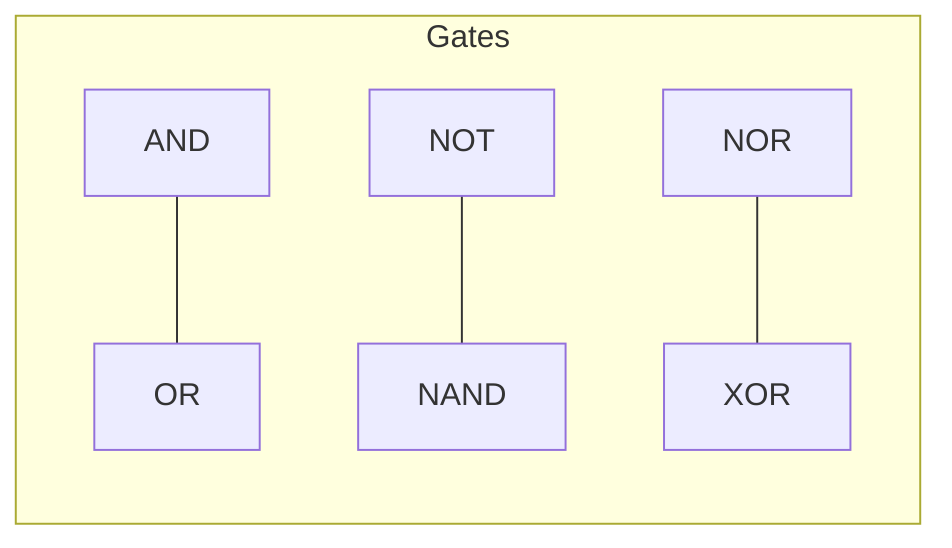

# Boolean Algebra

## Description

Boolean algebra is the algebra of true and false. It underpins every digital circuit, every conditional expression, every search query, and every bitwise operation in programming. Understanding Boolean algebra gives you the tools to simplify logic, optimize queries, design digital systems, and reason formally about conditions in code.

## Prerequisites

- [Set Theory](set-theory.md) — sets, operations, De Morgan's laws as set identities

## Table of Contents

- [Boolean Operations](#boolean-operations)
- [Boolean Functions](#boolean-functions)
- [Truth Tables](#truth-tables)
- [Canonical Forms](#canonical-forms)
- [Logic Gates](#logic-gates)
- [De Morgan's Laws](#de-morgans-laws)
- [Karnaugh Maps](#karnaugh-maps)
- [Quine-McCluskey Algorithm](#quine-mccluskey-algorithm)
- [Applications in Computing](#applications-in-computing)
- [Study Cases](#study-cases)
- [Examples](#examples)
- [Glossary](#glossary)
- [Quick References](#quick-references)
- [Next Steps](#next-steps)

## Content / Material

### Boolean Operations

Boolean algebra operates on the set {0, 1} (or {false, true}) with three fundamental operations:

**Negation (NOT, complement):**

$$\overline{0} = 1, \quad \overline{1} = 0$$

**Conjunction (AND):**

$$0 \land 0 = 0, \quad 0 \land 1 = 0, \quad 1 \land 0 = 0, \quad 1 \land 1 = 1$$

**Disjunction (OR):**

$$0 \lor 0 = 0, \quad 0 \lor 1 = 1, \quad 1 \lor 0 = 1, \quad 1 \lor 1 = 1$$

**Derived operations:**

- **NAND:** NOT AND: x NAND y = NOT(x AND y)
- **NOR:** NOT OR: x NOR y = NOT(x OR y)
- **XOR:** Exclusive OR: x XOR y = (x AND NOT y) OR (NOT x AND y)
- **XNOR:** NOT XOR (equivalence): x XOR y = NOT(x XOR y)
- **Implication:** x -> y = (NOT x) OR y
- **Biconditional:** x <-> y = (x -> y) AND (y -> x)

```python
# Boolean operations in Python
a, b = True, False
print(f"NOT a: {not a}")
print(f"a AND b: {a and b}")
print(f"a OR b: {a or b}")
print(f"a XOR b: {a != b}")  # Python uses != for XOR on booleans
print(f"a NAND b: {not (a and b)}")
print(f"a NOR b: {not (a or b)}")
```

```javascript
// Boolean operations in JavaScript
let a = true, b = false;
console.log("a AND b:", a && b);
console.log("a OR b:", a || b);
console.log("a XOR b:", a !== b);
```

### Boolean Functions

An n-variable Boolean function is a mapping f: {0,1}^n -> {0,1}.

**Number of functions:** There are 2^(2^n) distinct Boolean functions of n variables.

| n | Number of functions |
|---|-------------------|
| 0 | 2 |
| 1 | 4 |
| 2 | 16 |
| 3 | 256 |
| 4 | 65,536 |
| 5 | ~4.3 billion |

**Representations:**

1. **Truth table** — exhaustive list of inputs and outputs
2. **Boolean expression** — formula using AND, OR, NOT
3. **Circuit diagram** — logic gates
4. **Algebraic normal form** — XOR of ANDs (used in cryptography)

```python
def boolean_function(n, table):
    """Represent a Boolean function by its truth table.
    table: list of 2^n output bits (0/1)."""
    def f(*args):
        idx = sum(arg << (n-1-i) for i, arg in enumerate(args))
        return table[idx]
    return f

# Example: 2-input AND
and_table = [0, 0, 0, 1]  # 00->0, 01->0, 10->0, 11->1
and_fn = boolean_function(2, and_table)
print(f"AND(1, 1) = {and_fn(1, 1)}")  # 1
print(f"AND(1, 0) = {and_fn(1, 0)}")  # 0
```

### Truth Tables

A **truth table** enumerates all possible input combinations and the corresponding output.

**2-variable truth table (all 16 functions):**

| x | y | 0 | NOR | NOT x | NOT y | XOR | NAND | AND | XNOR | OR | NOR? |
|---|---|:-:|:-:|:-:|:-:|:-:|:-:|:-:|:-:|:-:|:-:|:-:|
| 0 | 0 | 0 | 1 | 1 | 1 | 0 | 1 | 0 | 1 | 0 | 1 |
| 0 | 1 | 0 | 0 | 1 | 0 | 1 | 1 | 0 | 0 | 1 | 1 |
| 1 | 0 | 0 | 0 | 0 | 1 | 1 | 1 | 0 | 0 | 1 | 1 |
| 1 | 1 | 0 | 0 | 0 | 0 | 0 | 0 | 1 | 1 | 1 | 1 |

**Building truth tables programmatically:**

```python
import itertools

def truth_table(n, expr_fn):
    """Generate truth table for an n-variable Boolean function."""
    headers = [chr(ord('x') + i) for i in range(n)] + ['out']
    print(' | '.join(headers))
    print('-|-'.join(['---'] * (n + 1)))

    for bits in itertools.product([0, 1], repeat=n):
        output = expr_fn(*bits)
        row = ' | '.join(str(b) for b in bits) + ' | ' + str(output)
        print(row)

# Half-adder: sum = x XOR y, carry = x AND y
def half_adder(x, y):
    s = x ^ y  # XOR
    c = x & y  # AND
    return s, c

print("Half-adder sum:")
truth_table(2, lambda x, y: half_adder(x, y)[0])
print("\nHalf-adder carry:")
truth_table(2, lambda x, y: half_adder(x, y)[1])
```

### Canonical Forms

Any Boolean function can be expressed in two standard canonical forms.

**Sum of Products (SOP) — Disjunctive Normal Form (DNF):**

OR of AND terms, where each AND term (minterm) covers exactly one row where the output is 1.

For f(x, y, z) = 1 when (x, y, z) = (0, 0, 1), (0, 1, 1), (1, 1, 1):

$$f(x, y, z) = (\overline{x} \cdot \overline{y} \cdot z) + (\overline{x} \cdot y \cdot z) + (x \cdot y \cdot z)$$

Simplify to: f(x, y, z) = yz + xyz (or further to yz with the right simplification).

**Product of Sums (POS) — Conjunctive Normal Form (CNF):**

AND of OR terms, where each OR term (maxterm) covers exactly one row where the output is 0.

For the same function:

$$f(x, y, z) = (x + y + z) \cdot (x + \overline{y} + z) \cdot (\overline{x} + y + z) \cdot (\overline{x} + \overline{y} + z) \cdot (\overline{x} + y + \overline{z})$$

**Converting truth table to SOP:**

```python
def truth_to_sop(table_vars):
    """Convert a truth table to SOP expression.
    table_vars: dict mapping (bits tuple) -> output"""
    terms = []
    for bits, out in table_vars.items():
        if out == 1:
            term_parts = []
            for i, b in enumerate(bits):
                var = chr(ord('x') + i)
                term_parts.append(f"({var})" if b else f"(NOT {var})")
            terms.append(" AND ".join(term_parts))
    return " OR\n".join(terms) if terms else "0"

# Example: XOR
xor_table = {(0,0): 0, (0,1): 1, (1,0): 1, (1,1): 0}
print("XOR SOP:")
print(truth_to_sop(xor_table))
# (NOT x) AND y
# OR
# x AND (NOT y)
```

**Minterm notation:**

A minterm is a product term that includes every variable. For n variables, there are 2^n minterms. Minterm i (where i is the decimal value of the input bits) is denoted m_i.

$$f(x, y, z) = \sum m(1, 3, 7)$$

**Maxterm notation:**

Maxterm i is the OR term that is 0 only for input combination i, denoted M_i.

$$f(x, y, z) = \prod M(0, 2, 4, 5, 6)$$

### Logic Gates

Logic gates are electronic implementations of Boolean operations.

**Basic gates:**



| Gate | Symbol | Expression | Truth table output |
|------|--------|-----------|-------------------|
| AND | A . B | A AND B | 1 iff all inputs 1 |
| OR | A + B | A OR B | 1 iff any input 1 |
| NOT | ~A or A' | NOT A | Invert input |
| NAND | A NAND B | NOT (A AND B) | 0 iff all inputs 1 |
| NOR | A NOR B | NOT (A OR B) | 1 iff all inputs 0 |
| XOR | A XOR B | A != B | 1 iff inputs differ |
| XNOR | A XNOR B | A == B | 1 iff inputs same |

**Universal gates:** NAND and NOR are universal — any Boolean function can be implemented using only NAND gates (or only NOR gates).

```python
# Implementing AND using only NAND gates
def nand(a, b):
    return not (a and b)

def and_via_nand(a, b):
    return nand(nand(a, b), nand(a, b))

# Implementing OR using only NAND gates (De Morgan's)
def or_via_nand(a, b):
    return nand(nand(a, a), nand(b, b))

# Verify
for a, b in [(0,0), (0,1), (1,0), (1,1)]:
    print(f"{a} AND {b} = {and_via_nand(a, b)} (expected {a & b})")
    print(f"{a} OR {b} = {or_via_nand(a, b)} (expected {a | b})")
```

**Building a half-adder from gates:**

```python
def half_adder_gates(a, b):
    """Half adder: sum = a XOR b, carry = a AND b"""
    sum_bit = (a != b)  # XOR
    carry_bit = a and b  # AND
    return sum_bit, carry_bit

def full_adder(a, b, carry_in):
    """Full adder: adds two bits with carry."""
    s1, c1 = half_adder_gates(a, b)
    s2, c2 = half_adder_gates(s1, carry_in)
    carry_out = c1 or c2
    return s2, carry_out

# Test: 1 + 1 + 0 = 0 with carry 1
print(full_adder(1, 1, 0))  # (0, 1)
# Test: 1 + 1 + 1 = 1 with carry 1
print(full_adder(1, 1, 1))  # (1, 1)
```

### De Morgan's Laws

De Morgan's laws relate conjunction and disjunction through negation:

$$\overline{x \land y} = \overline{x} \lor \overline{y}$$

$$\overline{x \lor y} = \overline{x} \land \overline{y}$$

**Generalized for n variables:**

$$\overline{\bigwedge_{i=1}^n x_i} = \bigvee_{i=1}^n \overline{x_i}$$

$$\overline{\bigvee_{i=1}^n x_i} = \bigwedge_{i=1}^n \overline{x_i}$$

**De Morgan's in programming — transforming conditions:**

```python
# Original: if NOT (x > 0 AND y > 0)
if not (x > 0 and y > 0):
    print("At least one is not positive")

# De Morgan transformed: if NOT (x > 0) OR NOT (y > 0)
if x <= 0 or y <= 0:
    print("At least one is not positive")
```

```javascript
// Original: if NOT (isAdmin OR isModerator)
if (!(isAdmin || isModerator)) {
    console.log("Access denied");
}

// De Morgan transformed: if NOT isAdmin AND NOT isModerator
if (!isAdmin && !isModerator) {
    console.log("Access denied");
}
```

**Circuit optimization:** De Morgan's laws allow converting AND-OR networks to NAND-only networks (since NAND = OR of complements):

```python
# Original circuit: (A AND B) OR (C AND D)
def original(a, b, c, d):
    return (a and b) or (c and d)

# NAND-only equivalent using De Morgan's
def nand_only(a, b, c, d):
    # NOT (NOT (A AND B) AND NOT (C AND D))
    # = NOT (NAND(A,B) AND NAND(C,D))
    ab_nand = nand(a, b)
    cd_nand = nand(c, d)
    return nand(ab_nand, cd_nand)

for a, b, c, d in [(0,0,0,0), (0,1,0,1), (1,1,0,0), (1,1,1,1)]:
    assert original(a,b,c,d) == nand_only(a,b,c,d)
```

### Karnaugh Maps

A **Karnaugh map** (K-map) is a graphical method for simplifying Boolean expressions. It arranges truth table values in a grid where adjacent cells differ by exactly one variable (Gray code ordering).

**2-variable K-map:**

```
       y=0  y=1
x=0  | m0 | m1 |
x=1  | m2 | m3 |
```

**3-variable K-map:**

```
        yz=00  yz=01  yz=11  yz=10
x=0   |  m0  |  m1  |  m3  |  m2  |
x=1   |  m4  |  m5  |  m7  |  m6  |
```

**4-variable K-map:**

```
        yz=00  yz=01  yz=11  yz=10
wx=00  |  m0  |  m1  |  m3  |  m2  |
wx=01  |  m4  |  m5  |  m7  |  m6  |
wx=11  |  m12 |  m13 |  m15 |  m14 |
wx=10  |  m8  |  m9  |  m11 |  m10 |
```

**Simplification process:**

1. Place 1s in cells corresponding to minterms
2. Group adjacent 1s into rectangles of size 1, 2, 4, 8, etc. (powers of 2)
3. Larger groups = simpler terms
4. Each group corresponds to a product term where the varying variable is eliminated
5. The simplified expression is the OR of all essential prime implicants

**Example — 3-variable K-map:**

Function f(x, y, z) = sum m(0, 1, 3, 5):

```
        yz=00  yz=01  yz=11  yz=10
x=0   |  1   |  1   |  1   |  0   |
x=1   |  0   |  1   |  0   |  0   |
```

Groups:
- m0 + m1 (yz=00, yz=01, x=0): eliminates z -> NOT x AND NOT y
- m1 + m3 (yz=01, yz=11, x=0): eliminates y -> NOT x AND z
- m1 + m5 (x=0,yz=01 and x=1,yz=01): eliminates x -> y AND NOT z (wait, m5 is yz=01, x=1)

Let me carefully compute: m0=000, m1=001, m3=011, m5=101

Group: m0(000) + m1(001): NOT x AND NOT y (z eliminated)
Group: m1(001) + m3(011): NOT x AND z (y eliminated)
Group: m1(001) + m5(101): z AND NOT y (x eliminated)

Simplified: (NOT x AND NOT y) OR (NOT x AND z) OR (z AND NOT y)

The last term is redundant (covered by the first two), so simplified:

f(x, y, z) = NOT(x) AND NOT(y) OR NOT(x) AND z

```python
def k_map_simplify_2var(table):
    """Simplified 2-variable K-map. table: [f(0,0), f(0,1), f(1,0), f(1,1)]"""
    terms = []
    # Check for constant
    if all(t == 1 for t in table):
        return "1"
    if all(t == 0 for t in table):
        return "0"

    # Check rows
    if table[0] == table[1] == 1:
        terms.append("NOT x")
    if table[2] == table[3] == 1:
        terms.append("x")
    # Check columns
    if table[0] == table[2] == 1:
        terms.append("NOT y")
    if table[1] == table[3] == 1:
        terms.append("y")
    # Check individual cells
    minterms = [(0, "NOT x AND NOT y"), (1, "NOT x AND y"),
                (2, "x AND NOT y"), (3, "x AND y")]
    for idx, term in minterms:
        if table[idx] == 1:
            terms.append(term)

    return " OR ".join(sorted(set(terms)))
```

**K-map limitations:**

- Works well for up to 4-6 variables
- For more variables, use Quine-McCluskey or computer-aided methods
- Manual grouping is error-prone for complex functions

### Quine-McCluskey Algorithm

The **Quine-McCluskey algorithm** is a tabular method for Boolean function minimization that is suitable for computer implementation.

**Steps:**

1. List all minterms by their binary representation
2. Group minterms by the number of 1s
3. Combine minterms that differ in exactly one bit (mark combined ones)
4. Repeat until no further combinations are possible
5. The uncombined terms are prime implicants
6. Select a minimal set of prime implicants that cover all minterms

```python
def qm_combine(t1, t2):
    """Try to combine two terms. Return combined term and differing position,
    or None if they can't be combined."""
    diff_pos = None
    for i, (b1, b2) in enumerate(zip(t1, t2)):
        if b1 != b2:
            if diff_pos is not None:
                return None  # Differ in more than one position
            diff_pos = i
    if diff_pos is None:
        return None  # Same term
    combined = list(t1)
    combined[diff_pos] = '-'
    return ''.join(combined), diff_pos

def quine_mccluskey(minterms, n_vars):
    """Simplified QM algorithm. minterms: list of ints."""
    # Convert to binary
    terms = [format(m, f'0{n_vars}b') for m in minterms]

    prime_implicants = set()
    while terms:
        next_terms = set()
        combined = set()
        for i, t1 in enumerate(terms):
            for t2 in terms[i+1:]:
                result = qm_combine(t1, t2)
                if result:
                    combined.add(t1)
                    combined.add(t2)
                    next_terms.add(result[0])

        # Terms that couldn't be combined are prime implicants
        for t in terms:
            if t not in combined:
                prime_implicants.add(t)

        if not next_terms:
            break
        terms = list(next_terms)

    return prime_implicants

# Example: f = sum m(0, 1, 3, 5) (3 variables)
primes = quine_mccluskey([0, 1, 3, 5], 3)
print(f"Prime implicants (as binary/dash): {primes}")
```

**Comparison with K-maps:**

| Method | Pros | Cons |
|--------|------|------|
| K-map | Visual, intuitive for small n | Manual, error-prone beyond 4 vars |
| Quine-McCluskey | Algorithmic, computer-friendly | Exponential worst-case complexity |
| Espresso | Heuristic, handles large circuits | May not find minimal solution |
| BDDs | Canonical representation, efficient | Complex implementation |

### Applications in Computing

**Digital circuit design:**

Every digital circuit — from a simple AND gate to a modern CPU — is built from Boolean operations. The ALU (Arithmetic Logic Unit) uses Boolean algebra for addition, subtraction, comparison, and bitwise operations.

```python
# 4-bit ripple-carry adder using Boolean logic
def bitwise_add(a, b):
    """Add two 4-bit numbers using Boolean logic."""
    carry = 0
    result = 0
    for i in range(4):
        bit_a = (a >> i) & 1
        bit_b = (b >> i) & 1
        # Full adder logic
        sum_bit = bit_a ^ bit_b ^ carry
        carry = (bit_a & bit_b) | (carry & (bit_a ^ bit_b))
        result |= (sum_bit << i)
    return result

# Verify
for a in range(8):
    for b in range(8):
        assert bitwise_add(a, b) == a + b
print("Adder works correctly")
```

**SQL query optimization — WHERE clause simplification:**

Boolean algebra is the foundation of SQL query planning. The query optimizer uses Boolean identities to rewrite WHERE clauses for faster execution.

```sql
-- Original query
SELECT * FROM orders
WHERE (status = 'shipped' OR status = 'delivered')
  AND (status = 'shipped' OR amount > 100);

-- Simplified using Boolean algebra (distributive law):
-- (A OR B) AND (A OR C) = A OR (B AND C)
SELECT * FROM orders
WHERE status = 'shipped'
   OR (status = 'delivered' AND amount > 100);
```

```python
# Boolean optimization for SQL WHERE clauses
def optimize_query(conditions):
    """Simple Boolean optimization of query conditions."""
    if isinstance(conditions, tuple):
        op, left, right = conditions
        if op == 'OR':
            # Distributive: (A AND B) OR (A AND C) = A AND (B OR C)
            if left[0] == 'AND' and right[0] == 'AND':
                left_left, left_right = left[1], left[2]
                right_left, right_right = right[1], right[2]
                if left_left == right_left:
                    return ('AND', left_left, ('OR', left_right, right_right))
        return conditions
    return conditions
```

**Search indexes and bitmaps:**

Boolean operations on bitmap indexes enable fast set operations in databases:

```python
class BitmapIndex:
    """Simple bitmap index for Boolean queries."""
    def __init__(self, n_docs):
        self.n_docs = n_docs
        self.bitmaps = {}  # term -> bitmask of documents

    def add_term(self, term, doc_bitmask):
        self.bitmaps[term] = doc_bitmask

    def search(self, query):
        """query: expression like 'term1 AND term2' or 'term1 OR NOT term3'"""
        # Tokenize and evaluate Boolean expression
        tokens = query.split()
        stack = []
        i = 0
        while i < len(tokens):
            if tokens[i] == 'AND':
                left = stack.pop()
                i += 1
                right = self.bitmaps.get(tokens[i], 0)
                stack.append(left & right)
            elif tokens[i] == 'OR':
                left = stack.pop()
                i += 1
                right = self.bitmaps.get(tokens[i], 0)
                stack.append(left | right)
            elif tokens[i] == 'NOT':
                i += 1
                mask = self.bitmaps.get(tokens[i], 0)
                stack.append(~mask & ((1 << self.n_docs) - 1))
            else:
                stack.append(self.bitmaps.get(tokens[i], 0))
            i += 1
        return stack[0] if stack else 0

# Example: search "algorithms AND data_structures"
idx = BitmapIndex(5)
idx.add_term('algorithms', 0b11010)
idx.add_term('data_structures', 0b01110)
result = idx.search('algorithms AND data_structures')
print(f"Matching docs: {bin(result)}")  # 01010
```

**Bitmasks and bitwise operations:**

Bitmasks use Boolean operations directly on integers:

```python
# Permission flags as bits
READ = 1     # 001
WRITE = 2    # 010
EXECUTE = 4  # 100

permissions = READ | EXECUTE  # 101 (can read and execute)

# Check permission
can_read = permissions & READ != 0      # True
can_write = permissions & WRITE != 0    # False
can_exec = permissions & EXECUTE != 0   # True

# Toggle permission
permissions ^= WRITE  # add write: 101 ^ 010 = 111
permissions ^= WRITE  # remove write: 111 ^ 010 = 101

# Check multiple permissions
required = READ | WRITE
has_all = (permissions & required) == required
```

```python
# Subset enumeration using bitmasks
def all_subsets(items):
    n = len(items)
    for mask in range(1 << n):
        subset = [items[i] for i in range(n) if mask & (1 << i)]
        yield subset

print(list(all_subsets(['a', 'b', 'c'])))
# [[], ['a'], ['b'], ['a', 'b'], ['c'], ['a', 'c'], ['b', 'c'], ['a', 'b', 'c']]
```

**Conditional logic simplification in code reviews:**

```python
# Complex condition
if (user.is_active and user.has_permission('write')) or \
   (user.is_active and user.role == 'admin'):
    allow_edit()

# Boolean simplification: (A AND B) OR (A AND C) = A AND (B OR C)
if user.is_active and (user.has_permission('write') or user.role == 'admin'):
    allow_edit()
```

## Study Cases

### Case 1: Simplifying a Search Query Optimizer

**Problem:** A search engine receives complex Boolean queries and needs to rewrite them for faster evaluation. Given a query "cats AND (dogs OR birds)" on an index where "cats" is rare (few matching docs) and "dogs", "birds" are common:

**Analysis:** Evaluate the rare term first to reduce intermediate result size:

```python
def query_cost_estimate(term_frequencies, query):
    """Estimate the cost of different Boolean evaluation orders."""
    # term_frequencies: dict of term -> number of matching docs

    if query[0] == 'AND':
        _, left, right = query
        left_cost = query_cost_estimate(term_frequencies, left)
        right_cost = query_cost_estimate(term_frequencies, right)
        # Intersection: evaluate smaller set first
        return min(left_cost, right_cost) + 1

    elif query[0] == 'OR':
        # Union: cost is sum
        _, left, right = query
        left_cost = query_cost_estimate(term_frequencies, left)
        right_cost = query_cost_estimate(term_frequencies, right)
        return left_cost + right_cost + 1

    elif query[0] == 'TERM':
        return 1  # just look up the term

# Example: "cats AND (dogs OR birds)"
# If cats = 100 docs, dogs = 10000, birds = 5000
freqs = {'cats': 100, 'dogs': 10000, 'birds': 5000}
query = ('AND', ('TERM', 'cats'), ('OR', ('TERM', 'dogs'), ('TERM', 'birds')))
# Original: AND(cats, OR(dogs, birds))
# Better: AND(OR(dogs, birds), cats) = evaluate cats first
print(f"Query cost estimate: {query_cost_estimate(freqs, query)}")
```

By applying Boolean algebra (AND is commutative), the optimizer evaluates the cheapest subquery first.

### Case 2: Register Bit Manipulation in Embedded Systems

**Problem:** An embedded system needs to configure a hardware register at address 0x4000. The register has:

- Bit 0-3: mode (4 bits)
- Bit 4: enable flag
- Bit 5-6: speed (2 bits)
- Bit 7: interrupt enable

Set mode to 7, enable the device, speed to 2, and enable interrupts.

```python
# Register manipulation using Boolean operations
REG_ADDR = 0x4000

def read_register(addr):
    # In real code: return *((volatile uint32_t*)addr)
    return 0x00  # placeholder

def write_register(addr, value):
    # In real code: *((volatile uint32_t*)addr) = value
    pass

# Setting specific fields without disturbing others
current = read_register(REG_ADDR)

# Clear mode field (bits 0-3)
current &= ~0b1111
# Set mode to 7
current |= 7

# Set enable (bit 4)
current |= (1 << 4)

# Clear speed (bits 5-6), set to 2
current &= ~(0b11 << 5)
current |= (2 << 5)

# Set interrupt enable (bit 7)
current |= (1 << 7)

write_register(REG_ADDR, current)
```

### Case 3: Query Optimization Using Karnaugh Maps

**Problem:** A database query has 4 conditions A, B, C, D. The result should be true for minterms 2, 3, 6, 7, 10, 11, 14, 15. Simplify the condition.

**Analysis:** This function is true for all minterms where A=0 and B=1 (minterms 2,3,6,7) OR A=1 and B=1 (minterms 10,11,14,15). That's simply B=1.

f(A,B,C,D) = B

```python
def analyze_condition(conditions_true):
    """Find simplified Boolean expression from truth table rows."""
    # conditions_true: list of (A,B,C,D) tuples where result is True
    if not conditions_true:
        return "FALSE"

    # Check if any single variable determines the result
    for var_idx, var_name in enumerate(['A', 'B', 'C', 'D']):
        all_same = all(row[var_idx] == conditions_true[0][var_idx]
                      for row in conditions_true)
        if all_same:
            val = conditions_true[0][var_idx]
            return f"{'NOT ' if val == 0 else ''}{var_name}"

    return "MORE_COMPLEX"

conditions = [
    (0,1,0,0), (0,1,0,1), (0,1,1,0), (0,1,1,1),
    (1,1,0,0), (1,1,0,1), (1,1,1,0), (1,1,1,1)
]
print(analyze_condition(conditions))  # B
```

The query optimizer can detect such patterns and replace a complex WHERE clause with a simple index lookup.

## Examples

### Example 1: De Morgan's in JavaScript

```javascript
// Negating compound conditions
const isLoggedIn = true;
const isAdmin = false;
const isActive = true;

// Complex negation: NOT (isLoggedIn AND (isAdmin OR isActive))
// Original
if (!(isLoggedIn && (isAdmin || isActive))) {
