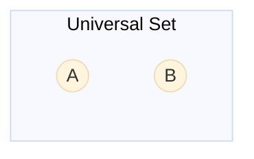
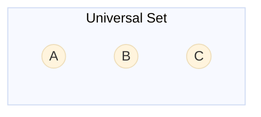

# Set Theory

## Description

Set theory is the foundation of all modern mathematics and one of the most directly useful branches of discrete math for developers. Sets model collections of objects — database rows, unique values, permission groups, type hierarchies — and the operations on them map directly to SQL queries, type checking, and algorithm design.

## Prerequisites

- [Mathematical Thinking](../intro/mathematical-thinking.md) — proof notation, logical reasoning, and the mindset for working with abstract structures

## Table of Contents

- [Set Definition and Notation](#set-definition-and-notation)
- [Subsets and Set Equality](#subsets-and-set-equality)
- [Power Sets](#power-sets)
- [Set Operations](#set-operations)
- [Cartesian Product](#cartesian-product)
- [Cardinality](#cardinality)
- [Venn Diagrams](#venn-diagrams)
- [Set Identities](#set-identities)
- [Applications in Computing](#applications-in-computing)
- [Study Cases](#study-cases)
- [Examples](#examples)
- [Glossary](#glossary)
- [Quick References](#quick-references)
- [Next Steps](#next-steps)

## Content / Material

### Set Definition and Notation

A **set** is an unordered collection of distinct elements. Sets are the primitive building block of mathematics — everything from numbers to functions can be defined in terms of sets.

**Roster notation** lists elements inside curly braces:

$$A = \{1, 2, 3, 4\}$$

$$B = \{\text{apple}, \text{banana}, \text{cherry}\}$$

**Set-builder notation** describes elements by a property:

$$C = \{x \mid x \in \mathbb{N}, x \text{ is even}\}$$

$$D = \{2n \mid n \in \mathbb{Z}\}$$

The symbol $\in$ means "is an element of":

$$2 \in A$$

$$5 \notin A$$

**Common number sets:**

- $\mathbb{N} = \{0, 1, 2, 3, \dots\}$ — natural numbers
- $\mathbb{Z} = \{\dots, -2, -1, 0, 1, 2, \dots\}$ — integers
- $\mathbb{Q}$ — rational numbers
- $\mathbb{R}$ — real numbers
- $\mathbb{C}$ — complex numbers

**Empty set:** $\emptyset = \{\}$ — the set with no elements.

**Singleton:** a set with exactly one element, e.g., $\{0\}$.

**Equality:** two sets are equal iff they contain exactly the same elements:

$$A = B \iff \forall x (x \in A \iff x \in B)$$

Order does not matter, and repetitions are irrelevant:

$$\{1, 2, 3\} = \{3, 1, 2\} = \{1, 1, 2, 3\}$$

In Python, sets behave exactly this way:

```python
A = {1, 2, 3}
B = {3, 1, 2}
print(A == B)  # True
```

In TypeScript, the `Set` type enforces uniqueness:

```typescript
const A = new Set([1, 2, 3]);
const B = new Set([3, 1, 2]);
console.log(A.size === B.size); // true
```

### Subsets and Set Equality

A set $A$ is a **subset** of $B$ if every element of $A$ is also in $B$:

$$A \subseteq B \iff \forall x (x \in A \implies x \in B)$$

**Proper subset:** $A \subsetneq B$ means $A \subseteq B$ and $A \neq B$.

**Superset:** $B \supseteq A$ is equivalent to $A \subseteq B$.

Examples:

$$\{1, 2\} \subseteq \{1, 2, 3\}$$

$$\emptyset \subseteq A \text{ for any set } A$$

$$A \subseteq A \text{ for any set } A$$

**Transitivity of subsets:**

If $A \subseteq B$ and $B \subseteq C$, then $A \subseteq C$.

In Python, subset checking is built in:

```python
A = {1, 2}
B = {1, 2, 3}
print(A.issubset(B))  # True
print(B.issuperset(A))  # True
```

**Equality via subsets:** $A = B$ iff $A \subseteq B$ and $B \subseteq A$. This is a common proof technique — show two-way containment.

In TypeScript, helper functions can model subset relationships:

```typescript
function isSubset<T>(A: Set<T>, B: Set<T>): boolean {
  for (const elem of A) {
    if (!B.has(elem)) return false;
  }
  return true;
}
```

### Power Sets

The **power set** of a set $A$, written $\mathcal{P}(A)$ or $2^A$, is the set of all subsets of $A$:

$$\mathcal{P}(A) = \{X \mid X \subseteq A\}$$

Example:

$$A = \{a, b\}$$

$$\mathcal{P}(A) = \{\emptyset, \{a\}, \{b\}, \{a, b\}\}$$

**Size of power set:** $|\mathcal{P}(A)| = 2^{|A|}$. Every element either is or is not in a given subset, giving $2^n$ possibilities.

Power sets are useful for modeling option combinations:

```python
from itertools import combinations

def power_set(A):
    result = []
    for r in range(len(A) + 1):
        for combo in combinations(A, r):
            result.append(set(combo))
    return result

print(power_set(['a', 'b']))
# [set(), {'a'}, {'b'}, {'a', 'b'}]
```

**Application — feature flags:** If a system has $n$ boolean feature flags, the set of all possible configurations is the power set of the feature set.

```typescript
type Feature = 'darkMode' | 'beta' | 'analytics';
type Config = Set<Feature>;
// All possible configs = PowerSet<Feature> — 2^3 = 8 possibilities
```

### Set Operations

**Union** — elements in $A$ or $B$ (or both):

$$A \cup B = \{x \mid x \in A \lor x \in B\}$$

```python
A = {1, 2, 3}
B = {3, 4, 5}
print(A | B)  # {1, 2, 3, 4, 5}
```

SQL equivalent: `SELECT * FROM A UNION SELECT * FROM B`

**Intersection** — elements in both $A$ and $B$:

$$A \cap B = \{x \mid x \in A \land x \in B\}$$

```python
print(A & B)  # {3}
```

SQL equivalent: `SELECT * FROM A INTERSECT SELECT * FROM B`

**Set difference** — elements in $A$ but not in $B$:

$$A \setminus B = \{x \mid x \in A \land x \notin B\}$$

```python
print(A - B)  # {1, 2}
```

SQL equivalent: `SELECT * FROM A EXCEPT SELECT * FROM B`

**Complement** — elements not in $A$ (relative to a universe $U$):

$$\overline{A} = U \setminus A$$

In a database context, if $U$ is all users and $A$ is active users, $\overline{A}$ is inactive users.

**Symmetric difference** — elements in $A$ or $B$ but not both:

$$A \triangle B = (A \setminus B) \cup (B \setminus A)$$

$$\phantom{A \triangle B} = (A \cup B) \setminus (A \cap B)$$

```python
print(A ^ B)  # {1, 2, 4, 5}
```

**Venn diagram summary:**

$$$$
\begin{array}{|c|c|c|}
\hline
\text{Operation} & \text{Notation} & \text{Python} \\
\hline
\text{Union} & A \cup B & A \mid B \\
\text{Intersection} & A \cap B & A \& B \\
\text{Difference} & A \setminus B & A - B \\
\text{Symmetric diff} & A \triangle B & A \^ B \\
\text{Complement} & \overline{A} & U - A \\
\hline
\end{array}
$$$$

**Properties worth noting:**

- $A \cap B \subseteq A \subseteq A \cup B$
- $A \cap \emptyset = \emptyset$
- $A \cup \emptyset = A$
- $A \setminus B = A \cap \overline{B}$

### Cartesian Product

The **Cartesian product** of sets $A$ and $B$ is the set of all ordered pairs where the first element comes from $A$ and the second from $B$:

$$A \times B = \{(a, b) \mid a \in A, b \in B\}$$

Example:

$$A = \{1, 2\}, \quad B = \{x, y\}$$

$$A \times B = \{(1, x), (1, y), (2, x), (2, y)\}$$

**Size:** $|A \times B| = |A| \cdot |B|$

**n-ary Cartesian product:**

$$A_1 \times A_2 \times \dots \times A_n = \{(a_1, a_2, \dots, a_n) \mid a_i \in A_i\}$$

Cartesian product is the mathematical model of:

- **Relational algebra CROSS JOIN** — every row of table $A$ paired with every row of table $B$
- **Type product** — a tuple type `(A, B)` in TypeScript or `pair<A,B>` in C++
- **Coordinate systems** — $\mathbb{R}^2 = \mathbb{R} \times \mathbb{R}$

```python
from itertools import product

A = [1, 2]
B = ['x', 'y']
print(list(product(A, B)))
# [(1, 'x'), (1, 'y'), (2, 'x'), (2, 'y')]
```

In SQL, Cartesian product is fundamental:

```sql
SELECT * FROM Employees CROSS JOIN Departments;
-- Every employee paired with every department
```

In TypeScript, product types are tuples:

```typescript
type Coordinate = [number, number]; // R x R
type UserWithRole = [User, Role];    // User x Role
```

### Cardinality

**Cardinality** $|A|$ is the number of elements in a set.

Finite sets have a natural cardinality:

$$|\{1, 2, 3\}| = 3$$

$$|\emptyset| = 0$$

**Cardinality of unions (inclusion-exclusion principle):**

$$|A \cup B| = |A| + |B| - |A \cap B|$$

For three sets:

$$|A \cup B \cup C| = |A| + |B| + |C| - |A \cap B| - |A \cap C| - |B \cap C| + |A \cap B \cap C|$$

This generalizes to the inclusion-exclusion principle for $n$ sets.

**Cardinality of Cartesian product:**

$$|A \times B| = |A| \times |B|$$

**Cardinality of power set:**

$$|\mathcal{P}(A)| = 2^{|A|}$$

**Infinite cardinalities:**

Countably infinite sets (like $\mathbb{N}$, $\mathbb{Z}$, $\mathbb{Q}$) have cardinality $\aleph_0$ (aleph-null). Uncountably infinite sets (like $\mathbb{R}$) have cardinality $2^{\aleph_0} = \mathfrak{c}$ (the continuum). Cantor's diagonal argument shows $|\mathbb{R}| > |\mathbb{N}|$.

For developers, the practical takeaway: some infinities are bigger than others. You cannot enumerate $\mathbb{R}$ with a loop — but you can enumerate $\mathbb{Q}$ with a pairing function.

### Venn Diagrams

Venn diagrams visually represent sets as overlapping circles. Each region corresponds to a combination of membership.

**Two-set Venn diagram:**



The regions:
- $A \cap B$ — overlap
- $A \setminus B$ — A only
- $B \setminus A$ — B only
- $\overline{A \cup B}$ — outside both

**Three-set Venn diagram:**



Venn diagrams are used in:

- **Database query planning** — visualizing which rows satisfy which WHERE clauses
- **Type compatibility** — subtype relationships in type theory
- **Test coverage** — which test cases cover which code paths

**Drawing Venn diagrams programmatically:**

```python
import matplotlib.pyplot as plt
from matplotlib_venn import venn2

A = {1, 2, 3}
B = {3, 4, 5}
venn2([A, B], ('A', 'B'))
plt.show()
```

### Set Identities

Set identities are equivalence laws that hold for all sets. They are the algebraic rules of set theory, analogous to the laws of Boolean algebra.

**Identity laws:**

$$A \cup \emptyset = A$$

$$A \cap U = A$$

**Domination laws:**

$$A \cup U = U$$

$$A \cap \emptyset = \emptyset$$

**Idempotent laws:**

$$A \cup A = A$$

$$A \cap A = A$$

**Complementation law:**

$$\overline{(\overline{A})} = A$$

**Commutative laws:**

$$A \cup B = B \cup A$$

$$A \cap B = B \cap A$$

**Associative laws:**

$$(A \cup B) \cup C = A \cup (B \cup C)$$

$$(A \cap B) \cap C = A \cap (B \cap C)$$

**Distributive laws:**

$$A \cap (B \cup C) = (A \cap B) \cup (A \cap C)$$

$$A \cup (B \cap C) = (A \cup B) \cap (A \cup C)$$

**De Morgan's laws:**

$$\overline{A \cup B} = \overline{A} \cap \overline{B}$$

$$\overline{A \cap B} = \overline{A} \cup \overline{B}$$

**Absorption laws:**

$$A \cup (A \cap B) = A$$

$$A \cap (A \cup B) = A$$

These identities can be used to simplify set expressions. For example, simplifying a complex permission check:

```
(A ∪ B) ∩ (A ∪ C) = A ∪ (B ∩ C)   [Distributive law]
```

This is the set-theoretic equivalent of factoring in algebra.

**Using identities for query optimization:**

Given a SQL condition like:

```sql
WHERE (department = 'Engineering' OR role = 'Admin')
  AND (department = 'Engineering' OR years > 5)
```

This can be simplified to:

```sql
WHERE department = 'Engineering' OR (role = 'Admin' AND years > 5)
```

Using the distributive law: $(A \cup B) \cap (A \cup C) = A \cup (B \cap C)$.

### Applications in Computing

**Relational algebra and SQL:**

Every SQL query operates on sets of rows. The core operations map directly:

| SQL | Set Theory |
|---|---|
| `UNION` | $A \cup B$ |
| `INTERSECT` | $A \cap B$ |
| `EXCEPT` | $A \setminus B$ |
| `CROSS JOIN` | $A \times B$ |
| `WHERE` clause | Subset selection $\{x \in A \mid P(x)\}$ |
| `DISTINCT` | Set (removes duplicates) |

```sql
-- Union: users who commented or liked
SELECT user_id FROM comments
UNION
SELECT user_id FROM likes;

-- Intersection: users who did both
SELECT user_id FROM comments
INTERSECT
SELECT user_id FROM likes;

-- Difference: users who commented but never liked
SELECT user_id FROM comments
EXCEPT
SELECT user_id FROM likes;
```

**Type theory and TypeScript:**

Types in programming languages are sets of values:

```typescript
type Status = 'active' | 'inactive' | 'pending';
// Status = {'active', 'inactive', 'pending'}

type AdminActions = 'create' | 'delete' | 'update';
type UserActions = 'read' | 'update';
type AllActions = AdminActions | UserActions;
// AllActions = {'create', 'delete', 'update', 'read'} — union

type CommonActions = AdminActions & UserActions;
// CommonActions = {'update'} — intersection
```

Union types in TypeScript correspond to set union. Intersection types correspond to set intersection. `never` is the empty set. `unknown` is the universal set.

**Permission systems:**

A user's effective permissions are the intersection of their role permissions and the resource's allowed operations:

```python
user_permissions = {'read', 'write', 'delete'}
resource_allowed = {'read', 'write'}
effective = user_permissions & resource_allowed  # {'read', 'write'}
```

**Bloom filters:**

A Bloom filter uses bit arrays (sets of indices) to test membership probabilistically. False positives are possible but false negatives are not:

```python
class BloomFilter:
    def __init__(self, size, hashes):
        self.bits = [0] * size
        self.hashes = hashes

    def add(self, item):
        for h in self.hashes:
            self.bits[h(item) % len(self.bits)] = 1

    def __contains__(self, item):
        return all(self.bits[h(item) % len(self.bits)] for h in self.hashes)
```

**Graph reachability as transitive closure:**

If $E$ is the set of edges in a graph, the transitive closure $E^+$ is the set of all reachable pairs — computed via repeated relational composition (itself a form of set operation).

## Glossary

| Term | Definition |
|------|------------|
| Set | An unordered collection of distinct elements |
| Element | A member of a set, denoted by $\in$ |
| Empty set | The set with no elements, denoted $\emptyset$ |
| Subset | $A \subseteq B$ means every element of $A$ is in $B$ |
| Proper subset | $A \subsetneq B$ means $A \subseteq B$ and $A \neq B$ |
| Power set | The set of all subsets of a given set, $\mathcal{P}(A)$ |
| Union | $A \cup B$ — elements in $A$ or $B$ |
| Intersection | $A \cap B$ — elements in both $A$ and $B$ |
| Set difference | $A \setminus B$ — elements in $A$ but not $B$ |
| Symmetric difference | $A \triangle B$ — elements in $A$ or $B$ but not both |
| Complement | $\overline{A}$ — elements not in $A$ (in a given universe) |
| Cartesian product | $A \times B$ — all ordered pairs from $A$ and $B$ |
| Cardinality | $|A|$ — number of elements in a set |
| Venn diagram | Visual representation of sets as overlapping regions |
| Inclusion-exclusion | Principle for counting elements in unions |
| Aleph-null | $\aleph_0$, the cardinality of countably infinite sets |
| Set identity | An equivalence law that holds for all sets |
| De Morgan's laws | Rules relating complement, union, and intersection |

## Quick References

- [Discrete Mathematics and Its Applications, Rosen](https://www.mheducation.com/highered/product/discrete-mathematics-its-applications-rosen/M9780073383095.html) — standard textbook covering all set theory fundamentals
- [Set Theory (Stanford Encyclopedia)](https://plato.stanford.edu/entries/set-theory/) — philosophical and mathematical foundations
- [Python frozenset documentation](https://docs.python.org/3/library/stdtypes.html#frozenset) — immutable sets for hash-based operations
- [MDN Set reference](https://developer.mozilla.org/en-US/docs/Web/JavaScript/Reference/Global_Objects/Set) — JavaScript Set API

## Next Steps

- [Functions & Relations](functions-and-relations.md) — build on sets to model mappings and connections
- [Combinatorics](combinatorics.md) — counting elements in sets using permutations and combinations
