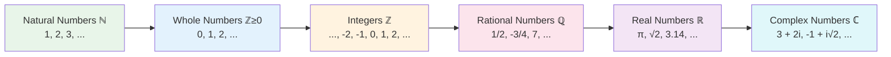

# Number Sense

## Description

Number sense is the intuitive understanding of numbers — what they represent, how they compare, and how they behave. Before performing any calculation, you need to understand what numbers are and how they relate to each other. This document builds that understanding from the ground up.

## Prerequisites

- [Why Mathematics Matters](intro/why-mathematics-matters.md) — understand why mathematics is essential for developers

## Table of Contents

- [What Is a Number?](#what-is-a-number)
- [Counting](#counting)
- [The Number Line](#the-number-line)
- [Comparing Numbers](#comparing-numbers)
- [Place Value](#place-value)
- [Rounding and Estimation](#rounding-and-estimation)
- [Number Patterns](#number-patterns)
- [Negative Numbers](#negative-numbers)
- [Zero](#zero)
- [How This Connects to Programming](#how-this-connects-to-programming)
- [Learning Tips](#learning-tips)
- [Glossary](#glossary)
- [Quick References](#quick-references)
- [Next Steps](#next-steps)

## Content / Material

### What Is a Number?

A number is an abstract concept that represents a quantity — how many of something there are. The number `5` is not any particular group of five objects; it is the idea of "fiveness" that applies to five apples, five seconds, five lines of code, or five users.

Numbers come in several types, each building on the one before. Each type is a **superset** of the one before it — every natural number is a whole number, every whole number is an integer, and so on. This nesting forms a hierarchy:



| Type | Definition | Includes | First appears |
|------|-----------|----------|---------------|
| **Natural numbers** ($\mathbb{N}$) | Counting numbers starting from 1 | 1, 2, 3, 4, 5, ... | Counting objects |
| **Whole numbers** ($\mathbb{Z}_{\geq 0}$) | Natural numbers plus zero | 0, 1, 2, 3, 4, ... | The concept of "nothing" |
| **Integers** ($\mathbb{Z}$) | Whole numbers and their negatives | ..., −3, −2, −1, 0, 1, 2, 3, ... | Debts, direction |
| **Rational numbers** ($\mathbb{Q}$) | Ratios of integers ($p/q$, where $q \neq 0$) | 1/2, −3/4, 7/1, 0.25, ... | Division, measurement |
| **Real numbers** ($\mathbb{R}$) | All points on the number line | $\pi$, $\sqrt{2}$, $3.14159$, $-7$, 0, 42 | Continuous measurement |
| **Complex numbers** ($\mathbb{C}$) | Numbers of the form $a + bi$ where $i = \sqrt{-1}$ | $3 + 2i$, $5 - i$, $-4i$ | Solving $x^2 + 1 = 0$ |

For now, focus on whole numbers and integers. Fractions and decimals are covered in [Fractions and Decimals](fractions-and-decimals.md).

### Counting

Counting is the most fundamental mathematical operation. It answers the question: "how many?"

**Counting is sequential:** each number is exactly one more than the number before it:

```
1, 2, 3, 4, 5, 6, 7, 8, 9, 10, ...
```

This sequence is called the **natural numbers** (or **counting numbers**). It goes on forever — there is no largest number.

**In programming, counting appears everywhere:**

```python
# Counting items in a list
fruits = ["apple", "banana", "cherry"]
count = 3                        # there are 3 items

# Counting with a loop
for i in range(1, 11):           # count from 1 to 10
    print(i)
```

**Common counting patterns:**

| Pattern | Sequence | Programming equivalent |
|---------|----------|----------------------|
| By ones | 1, 2, 3, 4, 5 | `range(1, 6)` |
| By twos | 2, 4, 6, 8, 10 | `range(2, 11, 2)` |
| By tens | 10, 20, 30, 40, 50 | `range(10, 51, 10)` |
| Countdown | 5, 4, 3, 2, 1 | `range(5, 0, -1)` |

#### Counting in Different Bases 🔢

The counting system described above uses **base 10** (decimal) — ten unique digits (0–9) and place values that are powers of 10. This is not the only possibility. Any positive integer $b \geq 2$ can serve as a base, producing a valid number system with $b$ unique digits.

**Why different bases exist:** Base 10 is a historical artifact — humans have ten fingers. Other bases arise from structural constraints. Computers use base 2 because their circuits have two states (on/off). Base 8 (octal) and base 16 (hexadecimal) are compact representations of binary data.

| Base | Name | Digits used | Example |
|------|------|-------------|---------|
| 2 | Binary | 0, 1 | `1011` |
| 8 | Octal | 0–7 | `752` |
| 10 | Decimal | 0–9 | `934` |
| 16 | Hexadecimal | 0–9, A–F | `3A7F` |

**Binary (base 2):** each position is a power of 2.

```
1011 (base 2) = 1×2³ + 0×2² + 1×2¹ + 1×2⁰
               = 8 + 0 + 2 + 1
               = 11 (decimal)
```

**Octal (base 8):** each position is a power of 8. Useful because each octal digit represents exactly three binary digits.

```
752 (base 8) = 7×8² + 5×8¹ + 2×8⁰
             = 7×64 + 5×8 + 2
             = 448 + 40 + 2
             = 490 (decimal)
```

**Hexadecimal (base 16):** each position is a power of 16. Each hex digit represents exactly four binary digits, making it the standard shorthand for binary data.

```
3A7F (base 16) = 3×16³ + 10×16² + 7×16¹ + 15×16⁰
               = 12288 + 2560 + 112 + 15
               = 14975 (decimal)
```

**Converting decimal to another base:** repeatedly divide by the target base and collect remainders.

```python
def decimal_to_base(n, base):
    if n == 0:
        return "0"
    digits = []
    while n > 0:
        digits.append(str(n % base))
        n //= base
    return "".join(reversed(digits))

# Decimal 42 to binary
print(decimal_to_base(42, 2))   # "101010"

# Decimal 42 to octal
print(decimal_to_base(42, 8))   # "52"

# Decimal 42 to hexadecimal
print(decimal_to_base(42, 16))  # "2a"
```

The relationship between binary, octal, and hexadecimal is direct — each octal digit maps to 3 bits, each hex digit maps to 4 bits:

```
Binary: 101 010 → Octal: 52 → Decimal: 42
Binary: 0010 1010 → Hex: 2A → Decimal: 42
```

### The Number Line

The **number line** is a visual representation of numbers as points on a line. Numbers increase to the right and decrease to the left:

```
←───────────────────────────────────────────────────→
   -3   -2   -1    0    1    2    3    4    5
                    ▲
                  origin
```

Key properties:

- **Each number occupies exactly one position** — there are no gaps between whole numbers
- **Numbers to the right are always larger** — 5 is to the right of 3, so 5 > 3
- **The distance between two numbers is their difference** — the distance between 3 and 7 is 4 (7 − 3 = 4)

**Why the number line matters for programming:**

- Array indices are positions on a number line (index 0, 1, 2, ...)
- Comparisons (`<`, `>`, `<=`, `>=`) are positions on the number line
- Ranges (`range(0, 10)`) are segments of the number line

#### Distance Between Numbers (Absolute Value) 📏

The **distance** between two points on the number line is the non-negative difference between them. This concept is formalized as **absolute value**, written $|x|$, which gives the distance of a number from zero:

$$|x| = \begin{cases} x & \text{if } x \geq 0 \\ -x & \text{if } x < 0 \end{cases}$$

**Examples:**

| Expression | Result | Reasoning |
|-----------|--------|-----------|
| $\|5\|$ | 5 | 5 is already positive — 5 units from zero |
| $\|-3\|$ | 3 | −3 is 3 units from zero (to the left) |
| $\|0\|$ | 0 | Zero is 0 units from itself |
| $\|7 - 3\|$ | 4 | Distance between 7 and 3 is 4 |
| $\|3 - 7\|$ | 4 | Distance is the same in either direction |

The distance between any two numbers $a$ and $b$ is always $|a - b|$. This is always non-negative — distance has no direction.

```python
a = 7
b = 3
distance = abs(a - b)    # 4
distance = abs(b - a)    # 4 (same result)

# Practical use: checking if two values are "close enough"
threshold = 0.001
if abs(computed - expected) < threshold:
    print("Close enough")
```

**Why absolute value matters in programming:**

- Measuring difference between coordinates in games and graphics
- Comparing floating-point numbers (exact equality is unreliable)
- Computing error margins in numerical algorithms
- Determining whether a value falls within a tolerance range

#### Midpoint 📍

The **midpoint** between two numbers $a$ and $b$ is the value exactly halfway between them:

$$\text{midpoint} = \frac{a + b}{2}$$

**Examples:**

| $a$ | $b$ | Midpoint | Verification |
|-----|-----|----------|-------------|
| 2 | 8 | 5 | $(2 + 8)/2 = 5$ |
| −4 | 6 | 1 | $(-4 + 6)/2 = 1$ |
| 0 | 100 | 50 | $(0 + 100)/2 = 50$ |
| −3 | −7 | −5 | $(-3 + (-7))/2 = -5$ |

```python
def midpoint(a, b):
    return (a + b) / 2

# Binary search relies on midpoint calculation
low, high = 0, 100
mid = midpoint(low, high)    # 50.0
```

**Why midpoint matters in programming:**

- **Binary search** repeatedly computes the midpoint of a search interval
- **Interpolation** between two values uses the midpoint formula
- **Bisection algorithms** in numerical methods divide intervals at the midpoint
- **Collision detection** in games checks whether an object is at the midpoint of a trajectory

### Comparing Numbers

Two numbers can be compared using six comparison operators:

| Operator | Meaning | Example | Result |
|----------|---------|---------|--------|
| `=` | Equal to | `5 = 5` | true |
| `≠` | Not equal to | `5 ≠ 3` | true |
| `<` | Less than | `3 < 7` | true |
| `>` | Greater than | `7 > 3` | true |
| `≤` | Less than or equal to | `5 ≤ 5` | true |
| `≥` | Greater than or equal to | `7 ≥ 3` | true |

**In programming:**

```python
x = 5
y = 3

print(x == y)      # False (5 is not equal to 3)
print(x != y)      # True  (5 is not equal to 3)
print(x < y)       # False (5 is not less than 3)
print(x > y)       # True  (5 is greater than 3)
print(x <= 5)      # True  (5 is less than or equal to 5)
print(x >= 3)      # True  (5 is greater than or equal to 3)
```

**Ordering exercise:** arrange these numbers from smallest to largest:

```
17, 3, 42, 8, 100, 1, 25
```

Answer: `1, 3, 8, 17, 25, 42, 100`

### Place Value

In our number system (base 10), the position of each digit determines its value:

```
Number:  3  4  7  2
Position: 1000s  100s  10s  1s
Value:   3000 +  400 +  70 +  2 = 3472
```

**Why place value matters:**

- The digit `3` in `3472` means three thousand
- The digit `3` in `347` means three hundred
- The digit `3` in `37` means three tens (thirty)
- The digit `3` alone means three

**The same digit in different positions has different values.** This is the fundamental insight of place-value notation.

**Place value in other bases:**

Computers use **base 2 (binary)** — each position is a power of 2 instead of a power of 10:

```
Binary:     1   0   1   1
Position:   2³  2²  2¹  2⁰
Value:      8 + 0 + 2 + 1 = 11 (in decimal)
```

| Binary | Decimal | Calculation |
|--------|---------|-------------|
| `0001` | 1 | 1 |
| `0010` | 2 | 2 |
| `0011` | 3 | 2 + 1 |
| `0100` | 4 | 4 |
| `0101` | 5 | 4 + 1 |
| `1000` | 8 | 8 |
| `1010` | 10 | 8 + 2 |
| `1111` | 15 | 8 + 4 + 2 + 1 |

Here is a fuller mapping of decimal values 0 through 15 in binary:

| Decimal | Binary | Powers of 2 used |
|---------|--------|-------------------|
| 0 | `0000` | (none) |
| 1 | `0001` | $2^0$ |
| 2 | `0010` | $2^1$ |
| 3 | `0011` | $2^1 + 2^0$ |
| 4 | `0100` | $2^2$ |
| 5 | `0101` | $2^2 + 2^0$ |
| 6 | `0110` | $2^2 + 2^1$ |
| 7 | `0111` | $2^2 + 2^1 + 2^0$ |
| 8 | `1000` | $2^3$ |
| 9 | `1001` | $2^3 + 2^0$ |
| 10 | `1010` | $2^3 + 2^1$ |
| 11 | `1011` | $2^3 + 2^1 + 2^0$ |
| 12 | `1100` | $2^3 + 2^2$ |
| 13 | `1101` | $2^3 + 2^2 + 2^0$ |
| 14 | `1110` | $2^3 + 2^2 + 2^1$ |
| 15 | `1111` | $2^3 + 2^2 + 2^1 + 2^0$ |

**Why computers use binary:**

Binary is not an arbitrary engineering choice — it is the most reliable system for physical hardware. A transistor can be in one of two states: conducting (on) or not conducting (off). A wire can carry one of two voltage levels: high or low. A magnetic domain can point in one of two directions. These two-state systems map directly to binary digits.

Higher bases (base 10, for example) would require distinguishing between ten distinct voltage levels on a single wire. This introduces ambiguity — the voltages drift with temperature, noise, and wear. With binary, the margin for error is maximized: the hardware only needs to distinguish "high" from "low." This simplicity is what makes billions of transistors on a single chip possible.

```
A 3-bit binary number can represent 2³ = 8 distinct values (0–7)
A 4-bit binary number can represent 2⁴ = 16 distinct values (0–15)
An 8-bit binary number (1 byte) can represent 2⁸ = 256 distinct values (0–255)
A 32-bit binary number can represent 2³² ≈ 4.3 billion distinct values
A 64-bit binary number can represent 2⁶⁴ ≈ 18.4 quintillion distinct values
```

```python
# Converting between decimal and binary
decimal_value = 42
binary_string = bin(decimal_value)   # '0b101010'
hex_string = hex(decimal_value)     # '0x2a'
oct_string = oct(decimal_value)     # '0o52'

# Back from binary string to integer
back_to_int = int("101010", 2)      # 42
```

### Rounding and Estimation

**Rounding** replaces a number with an approximate value that is easier to work with.

**Rounding to the nearest ten:**

| Number | Closer to | Rounded |
|--------|-----------|---------|
| 23 | 20 | 20 |
| 27 | 30 | 30 |
| 25 | Exactly halfway | 30 (round up) |

**Rule:** if the last digit is 5 or more, round up. If it is 4 or less, round down.

**Rounding to the nearest hundred:**

| Number | Rounded |
|--------|---------|
| 347 | 300 |
| 352 | 400 |
| 650 | 700 |

**Estimation** uses rounding to quickly calculate an approximate answer:

```
Exact:    347 + 218 = 565
Estimate: 350 + 200 = 550  (close enough to check if the exact answer is reasonable)
```

**Why estimation matters in programming:**

- Before writing a loop, estimate how many iterations it will have
- Before allocating memory, estimate how much data you will store
- Before optimizing, estimate whether the optimization will make a meaningful difference

#### Estimation in Code Review 🔍

When reviewing code, estimation is not about arithmetic — it is about **mental models of scale**. A developer who can quickly estimate the consequences of a code path identifies bugs and performance issues before they reach production.

**Estimating loop counts:**

```python
# How many times does this loop run?
for i in range(n):
    for j in range(n):
        process(i, j)

# Answer: n × n = n² iterations.
# If n = 1000, that is 1,000,000 calls to process().
# If each call takes 1 microsecond, the total is 1 second.
```

**Estimating data sizes:**

| Component | Calculation | Estimate |
|-----------|------------|----------|
| Keys: 10M × 50-byte strings | 500 MB | Fits in memory |
| Values: 10M × 200-byte objects | 2 GB | Large but manageable |
| Hash table overhead | 1–2 GB | Depends on load factor |
| **Total** | **~4 GB** | **Will this fit in RAM?** |

**Estimating time complexity:**

| Code pattern | Complexity | Estimation rule |
|-------------|------------|-----------------|
| Single loop over $n$ items | $O(n)$ | Double the input → double the time |
| Nested loops over $n$ items | $O(n^2)$ | Double the input → quadruple the time |
| Divide and conquer (merge sort) | $O(n \log n)$ | Double the input → slightly more than double |
| Binary search | $O(\log n)$ | Double the input → add one more step |

**Quick estimation heuristics for code review:**

- If a loop runs $n$ times and contains another loop that runs $n$ times, the total is $n^2$. For $n = 10{,}000$, that is 100 million operations — likely too slow for real-time code.
- If a function reads a file line by line, the memory usage is $O(1)$ (constant), regardless of file size. If it reads the entire file into a list, the memory usage is $O(n)$.
- Database queries inside a loop are a common source of $O(n^2)$ behavior. If the loop runs $n$ times and each query takes $k$ milliseconds, the total is $n \times k$ milliseconds.
- Network calls are orders of magnitude slower than local operations. A single network call may take 100 ms; a million calls take 100,000 seconds (over a day). Batching is essential.

```python
# Red flag: O(n) database queries inside an O(n) loop = O(n²)
for user_id in user_ids:                    # n iterations
    user = db.query(user_id)                # each query: ~5 ms
    process(user)

# Fixed: batch query = O(n) total
users = db.query_many(user_ids)             # single query: ~50 ms
for user in users:
    process(user)
```

### Number Patterns

Numbers follow patterns. Recognizing patterns helps you predict what comes next and understand relationships:

**Even and odd numbers:**

```
Even: 0, 2, 4, 6, 8, 10, ...  (divisible by 2, remainder is 0)
Odd:  1, 3, 5, 7, 9, 11, ...  (divisible by 2, remainder is 1)
```

In programming, a number is even if `number % 2 == 0` (modulo gives remainder 0).

**Powers of 2:**

```
1, 2, 4, 8, 16, 32, 64, 128, 256, 512, 1024, 2048, 4096, ...
```

Powers of 2 are everywhere in computing:
- Memory is measured in powers of 2 (256 MB, 512 MB, 1024 MB = 1 GB)
- Binary uses powers of 2 for place values
- Arrays are often powers of 2 in size
- Hash tables use powers of 2

**Powers of 10:**

```
1, 10, 100, 1000, 10000, 100000, ...
```

Used in: kilobytes (1000 or 1024), megabytes, gigabytes, scientific notation.

#### Prime Numbers 🔐

A **prime number** is a natural number greater than 1 that has no positive divisors other than 1 and itself. A number that is not prime is called **composite** (it can be formed by multiplying smaller integers).

$$n \text{ is prime} \iff \text{the only positive divisors of } n \text{ are } 1 \text{ and } n$$

**The first 25 prime numbers:**

```
2, 3, 5, 7, 11, 13, 17, 19, 23, 29,
31, 37, 41, 43, 47, 53, 59, 61, 67, 71,
73, 79, 83, 89, 97
```

Note that 2 is the only even prime — every other even number is divisible by 2 and therefore composite.

**Checking whether a number is prime:**

```python
def is_prime(n):
    if n < 2:
        return False
    if n < 4:
        return True
    if n % 2 == 0 or n % 3 == 0:
        return False
    i = 5
    while i * i <= n:
        if n % i == 0 or n % (i + 2) == 0:
            return False
        i += 6
    return True

# First 10 primes
primes = [n for n in range(2, 50) if is_prime(n)]
# [2, 3, 5, 7, 11, 13, 17, 19, 23, 29]
```

**Why primes matter in programming — cryptography:**

Modern encryption (RSA, Diffie-Hellman, elliptic curve cryptography) relies on the fact that **multiplying two large primes is easy, but factoring their product is computationally infeasible**. A 2048-bit RSA key is the product of two primes each roughly 1024 bits long. Finding those two primes from the product would take current computers longer than the age of the universe.

```
Easy direction:   61 × 53 = 3233
Hard direction:   Given 3233, find which two primes multiply to give it

For small numbers this is trivial. For 600-digit numbers, it is impossible.
```

**Euclid's theorem** (circa 300 BCE) proves that there are infinitely many primes. No matter how many primes you list, there is always another one. This is not merely a curiosity — it guarantees that cryptographic key spaces can always be extended with larger primes.

#### Fibonacci Sequence 🌀

The **Fibonacci sequence** is defined by a simple recurrence relation: each number is the sum of the two preceding ones.

$$F(0) = 0, \quad F(1) = 1, \quad F(n) = F(n-1) + F(n-2)$$

```
0, 1, 1, 2, 3, 5, 8, 13, 21, 34, 55, 89, 144, 233, 377, ...
```

```python
def fibonacci(n):
    if n <= 1:
        return n
    a, b = 0, 1
    for _ in range(2, n + 1):
        a, b = b, a + b
    return b

# First 15 Fibonacci numbers
for i in range(15):
    print(f"F({i}) = {fibonacci(i)}")
```

**Why Fibonacci appears in nature and computing:**

- **Nature:** The arrangement of leaves on a stem (phyllotaxis), the spiral of a sunflower, the branching of trees, and the spirals of a nautilus shell all follow Fibonacci-like patterns. These patterns optimize space and resource distribution.
- **Algorithms:** The Fibonacci sequence is a classic teaching example for recursion, dynamic programming, and memoization. A naive recursive implementation is $O(2^n)$; a memoized version is $O(n)$.
- **Data structures:** Fibonacci heaps are a priority queue data structure with excellent amortized time complexity for decrease-key operations, used in Dijkstra's shortest-path algorithm.
- **The golden ratio:** The ratio of consecutive Fibonacci numbers converges to the **golden ratio** $\phi \approx 1.618$, which appears throughout geometry, art, and architecture.

$$\lim_{n \to \infty} \frac{F(n+1)}{F(n)} = \phi = \frac{1 + \sqrt{5}}{2} \approx 1.618$$

#### Factorial (n!) 🧮

The **factorial** of a non-negative integer $n$, written $n!$, is the product of all positive integers up to $n$:

$$n! = n \times (n-1) \times (n-2) \times \cdots \times 2 \times 1$$

By convention, $0! = 1$.

| $n$ | $n!$ |
|-----|------|
| 0 | 1 |
| 1 | 1 |
| 2 | 2 |
| 3 | 6 |
| 4 | 24 |
| 5 | 120 |
| 10 | 3,628,800 |
| 20 | 2,432,902,008,176,640,000 |

**Why factorial grows fast:**

Each multiplication roughly doubles the result. By $n = 20$, the value exceeds 2.4 quintillion. By $n = 100$, the value has approximately 158 digits. Factorials grow faster than exponentials — $n!$ eventually exceeds $a^n$ for any fixed $a$.

```python
import math

math.factorial(5)     # 120
math.factorial(10)    # 3628800
math.factorial(50)    # 30414093201713378043612608166064768844377641568960512000000000000
```

**Why factorials matter in programming:**

- **Permutations:** The number of ways to arrange $n$ distinct objects is $n!$. For a deck of 52 cards, there are $52! \approx 8 \times 10^{67}$ possible arrangements — more than the number of atoms in the observable universe.
- **Combinations:** The binomial coefficient $\binom{n}{k} = \frac{n!}{k!(n-k)!}$ counts the number of ways to choose $k$ items from $n$ without regard to order.
- **Algorithm complexity:** Sorting algorithms that compare pairs of elements have a lower bound of $O(n!)$ for brute-force approaches (try all permutations). This is why efficient sorting (merge sort, quicksort at $O(n \log n)$) is essential.
- **Stirling's approximation:** For large $n$, $n! \approx \sqrt{2\pi n}\left(\frac{n}{e}\right)^n$, which is useful for estimating factorial magnitudes without computing the exact value.

### Negative Numbers

Negative numbers represent values less than zero: debts, temperatures below freezing, positions to the left of origin.

```
←───────────────────────────────────────────────→
  -5   -4   -3   -2   -1    0    1    2    3    4    5
```

**Key rules:**

| Operation | Rule | Example |
|-----------|------|---------|
| Adding a negative | Subtract the absolute value | `5 + (-3) = 2` |
| Subtracting a negative | Add the absolute value | `5 - (-3) = 8` |
| Multiplying negatives | Negative × negative = positive | `(-3) × (-2) = 6` |
| Multiplying mixed | Positive × negative = negative | `3 × (-2) = -6` |

**In programming:**

```python
temperature = -5          # 5 degrees below zero
balance = -120.50         # you owe $120.50
depth = -100              # 100 meters below sea level
```

### Zero

Zero is one of the most important numbers in mathematics and computing:

| Concept | Role of zero |
|---------|-------------|
| **Identity for addition** | Any number + 0 = that number (`5 + 0 = 5`) |
| **Annihilator for multiplication** | Any number × 0 = 0 (`5 × 0 = 0`) |
| **Array indexing** | Arrays start at index 0 in most languages |
| **Boolean false** | In many languages, 0 is treated as false |
| **Null/empty** | `null`, `None`, `nil` often represent the absence of a value |

**The zero-based indexing convention:**

```
Array:     ["apple", "banana", "cherry", "date"]
Index:        0         1          2         3
```

This is confusing at first — why not start counting at 1? The reason is historical and mathematical: the index tells you the **offset from the start**. The first element is 0 positions from the start. The second element is 1 position from the start.

#### NaN and Infinity ♾️

Beyond the standard numbers discussed so far, programming languages define several **special numeric values** that represent edge cases in computation. These values are not mathematical abstractions — they are concrete values stored in variables and propagated through calculations.

| Value | Meaning | Example expression |
|-------|---------|-------------------|
| `Infinity` | Result of overflow or division by zero (positive) | `1 / 0` |
| `-Infinity` | Negative overflow or division by zero (negative) | `-1 / 0` |
| `NaN` | "Not a Number" — result of undefined or invalid operation | `0 / 0`, `float('inf') - float('inf')` |

**NaN is unique:** it is not equal to anything — not even itself.

```python
import math

float('nan') == float('nan')   # False!
math.isnan(float('nan'))        # True — use this to check for NaN

# NaN propagates through calculations
x = float('nan')
print(x + 1)        # nan
print(x * 0)        # nan

# Infinity propagates too
inf = float('inf')
print(inf + 1000)   # inf
print(inf / inf)    # nan (infinity / infinity is undefined)
print(1 / inf)      # 0.0
```

**Why these values matter in programming:**

- **Division by zero** in floating-point does not raise an exception in many languages — it silently produces `Infinity` or `NaN`. This can propagate through calculations and corrupt results without triggering errors.
- **NaN is a common source of bugs.** A single NaN in a data pipeline can silently turn every downstream calculation into NaN. Debugging requires tracking the origin of the first NaN.
- **Comparisons with NaN always return false.** This means `if x > threshold` will be `False` when `x` is NaN — the condition silently fails rather than raising an error.
- **IEEE 754** is the international standard defining how floating-point arithmetic works. It specifies the behavior of `Infinity`, `NaN`, and `0` (which has both positive and negative zero in this standard).

### How This Connects to Programming

Every concept in this document has a direct programming application:

| Number sense concept | Programming application |
|---------------------|----------------------|
| Counting | Loop iterations, array length |
| Comparison | If statements, while conditions |
| Place value | Binary, hexadecimal, data representation |
| Rounding | Integer division, data sampling |
| Even/odd | Modulo for alternating, parity checks |
| Negative numbers | Signed integers, coordinates, temperatures |
| Zero | Array indexing, null values, initialization |
| Absolute value | Distance calculations, tolerance checks, floating-point comparison |
| Midpoint | Binary search, interpolation, bisection |
| Number bases | Network protocols (hex), bit manipulation, color codes (`#FF5733`) |
| Primes | Cryptography (RSA, Diffie-Hellman), hash table sizing, pseudorandom generators |
| Fibonacci | Dynamic programming examples, Fibonacci heaps, algorithm analysis |
| Factorials | Permutations, combinations, combinatorial search bounds |
| NaN/Infinity | Floating-point edge cases, error propagation, debugging silent failures |
| Estimation | Performance analysis, memory profiling, capacity planning |

**Example — number bases in real code:**

```python
# Color codes in CSS/web development are hexadecimal
color = 0xFF5733    # RGB: red=255, green=87, blue=51

# Bit masks use binary and hexadecimal
READ权限 = 0o4       # octal: 0o4 = 0b100
WRITE权限 = 0o2       # octal: 0o2 = 0b010
EXECUTE权限 = 0o1     # octal: 0o1 = 0b001
ALL = READ | WRITE | EXECUTE   # 0o7 = 0b111 = 7
```

**Example — estimation in practice:**

```python
import time

# Before writing this loop, estimate its cost:
start = time.time()
total = 0
for i in range(10_000_000):
    total += i
elapsed = time.time() - start
print(f"Elapsed: {elapsed:.3f}s")
# With n = 10,000,000: O(n) loop, single addition per iteration.
# Expected: well under 1 second on modern hardware. Actual: ~0.5s.
```

## Learning Tips

- **Visualize the number line.** When comparing numbers, picture them on the number line. The one to the right is larger.
- **Practice estimation.** Before calculating exactly, estimate the answer. This builds intuition for what answers should look like.
- **Connect to code.** Every time you learn a number concept, write a one-line program that demonstrates it.
- **Learn powers of 2.** Memorize: 1, 2, 4, 8, 16, 32, 64, 128, 256, 512, 1024. These appear everywhere in computing.
- **Do not skip negative numbers.** Understanding how negatives behave is essential for debugging off-by-one errors, signed integers, and coordinate systems.

## Glossary

| Term | Definition |
|------|------------|
| Absolute value | The distance of a number from zero, always non-negative |
| Base | The number of unique digits in a number system (base 10 uses 0–9) |
| Binary | Base-2 number system using only 0 and 1 |
| Complex number | A number of the form $a + bi$ where $i = \sqrt{-1}$ |
| Composite number | A natural number greater than 1 that is not prime |
| Digit | A single character in a number (0–9 in base 10) |
| Even number | A number divisible by 2 with remainder 0 |
| Factorial | The product of all positive integers up to $n$, written $n!$ |
| Fibonacci sequence | A sequence where each number is the sum of the two preceding ones |
| Hexadecimal | Base-16 number system using digits 0–9 and letters A–F |
| Integer | A whole number, positive, negative, or zero |
| Midpoint | The value exactly halfway between two numbers: $(a+b)/2$ |
| Modulo | The remainder after dividing one number by another |
| NaN | "Not a Number" — a special floating-point value representing undefined results |
| Natural number | A counting number: 1, 2, 3, ... |
| Number line | A visual representation of numbers as points on a line |
| Octal | Base-8 number system using digits 0–7 |
| Odd number | A number divisible by 2 with remainder 1 |
| Place value | The value of a digit based on its position in a number |
| Prime number | A natural number greater than 1 with no divisors other than 1 and itself |
| Rounding | Replacing a number with an approximate value |
| Zero | The number representing nothing; the additive identity |

## Quick References

- [Khan Academy — Place Value](https://www.khanacademy.org/math/cc-third-grade-math/imp-place-value-and-problem-solving-with-units-of-measure) — interactive lessons on place value
- [Khan Academy — Negative Numbers](https://www.khanacademy.org/math/cc-sixth-grade-math/cc-6th-negative-number-topic) — introduction to negative numbers
- [Math Is Fun — Number Line](https://www.mathsisfun.com/number-line.html) — visual explanation of the number line

## Next Steps

- [Arithmetic Basics](arithmetic-basics.md) — perform addition, subtraction, multiplication, and division
- [Fractions and Decimals](fractions-and-decimals.md) — work with parts of wholes
- Back to [Mathematics Introduction](../intro/index.md)
