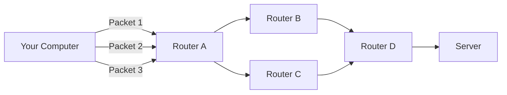
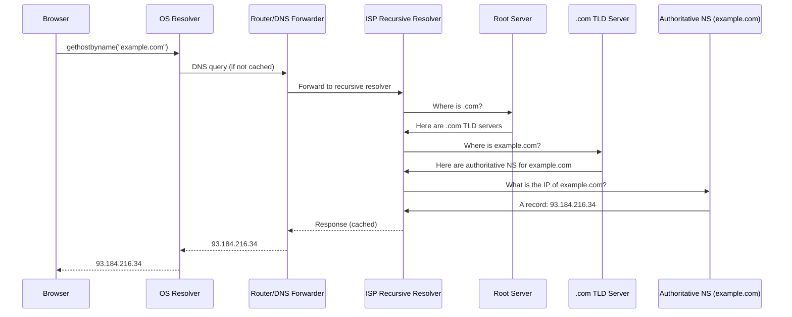
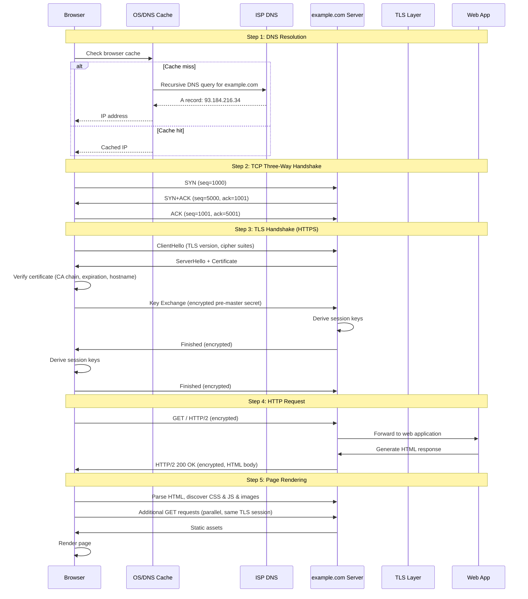

# What Is a Computer Network?

## Description

Every time you load a web page, send an API request, or connect a database client, you are using a computer network. This document explains what a network is, how data moves between machines, and the foundational protocols that make modern software possible — all from a developer's perspective.

## Prerequisites

- [Programming Fundamentals](../../programming/fundamentals/index.md) — basic programming knowledge
- [How Computers Work](../../computer-science/fundamentals/how-computers-work.md) — how CPUs, memory, and storage operate

## Table of Contents

- [What Is a Network?](#what-is-a-network)
- [LAN, WAN, and the Internet](#lan-wan-and-the-internet)
- [The Client-Server Model](#the-client-server-model)
- [Packet-Switching: How Data Travels](#packet-switching-how-data-travels)
- [IP Addresses](#ip-addresses)
- [DNS: The Phonebook of the Internet](#dns-the-phonebook-of-the-internet)
- [Ports: Multiplexing Connections](#ports-multiplexing-connections)
- [TCP vs UDP: Reliable vs Fast](#tcp-vs-udp-reliable-vs-fast)
- [HTTP Basics](#http-basics)
- [What Happens When You Visit a Website](#what-happens-when-you-visit-a-website)

## Content / Material

### What Is a Network?

A **computer network** is two or more devices connected so they can exchange data. The devices are called **nodes** (computers, phones, servers, routers, switches), and the connections are called **links** (Ethernet cables, fiber optics, Wi-Fi radio waves).

A network exists whenever data moves between devices. When your laptop talks to your router over Wi-Fi, that is a network. When a frontend app calls a backend API across the Atlantic, that is also a network — just built from many smaller networks stitched together.

Every network operates under **protocols** — agreed-upon rules that define how data is formatted, addressed, transmitted, and received. Without protocols, a sender might transmit bits in an order the receiver cannot interpret. Protocols solve that problem at every level: how electrical signals encode bits, how packets are addressed, how lost data is retransmitted, and how applications interpret the bytes they receive.

```text
  +--------+        Link         +--------+
  | Node A | =================== | Node B |
  +--------+                     +--------+
```

A network is defined by three properties:

- **Topology** — how nodes are physically or logically arranged (bus, star, mesh, ring).
- **Scope** — how far the network reaches (LAN, WAN).
- **Medium** — what carries the signal (copper, fiber, radio).

### LAN, WAN, and the Internet

Networks are categorized by their geographic and organizational scope.

#### LAN (Local Area Network)

A LAN covers a small area — a single home, office, or floor. Devices on a LAN are typically connected via Ethernet or Wi-Fi through a switch or wireless access point. Latency is under a millisecond, bandwidth is high, and the network is usually owned by a single organization.

Example: your home Wi-Fi network. Your phone, laptop, printer, and smart TV all belong to the same LAN. They can talk to each other directly without going through the internet.

```text
  [Laptop] --\
              \
  [Phone] ----[Router/Switch]---- Internet
              /
  [Printer] --/
```

Devices on a LAN can discover each other using protocols like ARP (Address Resolution Protocol) at the link layer or mDNS (multicast DNS) at the application layer. This is how "Hey, print to the office printer" works without typing an IP.

#### WAN (Wide Area Network)

A WAN spans a large geographic area — cities, countries, or continents. WANs are built by leasing fiber-optic lines from telecommunications providers or by tunneling over public networks via VPNs. Latency can be tens to hundreds of milliseconds.

The internet itself is the largest WAN, but private WANs also exist. A bank with offices in New York, London, and Tokyo might lease dedicated lines between them to create a private WAN, keeping traffic off the public internet for security and reliability.

#### The Internet

The internet is a **network of networks** — a global system of interconnected LANs and WANs that all speak the same protocol suite: **TCP/IP**. No single company owns the internet. It is a federation of thousands of independent networks called **Autonomous Systems** (ISPs, cloud providers, universities), each managed by a different organization, that voluntarily agree to exchange traffic through peering and transit agreements.

When you "connect to the internet," your ISP (Internet Service Provider) plugs your home LAN into their WAN, which in turn peers with other ISPs and backbone providers to reach any destination on the planet.

```text
  Your LAN --> ISP WAN --> Tier-1 Backbone --> ISP WAN --> Server's LAN
```

### The Client-Server Model

Most network communication follows the **client-server model**. A **client** sends a request; a **server** receives it, processes it, and sends back a response.

| Role | Who | Example |
|------|-----|---------|
| **Client** | Initiates the connection | Browser, `curl`, mobile app |
| **Server** | Listens and responds | Web server, database, API |

```text
  +--------+   Request    +--------+
  | Client | -----------> | Server |
  |        | <----------- |        |
  +--------+   Response   +--------+
```

The client always initiates. A server cannot push data to a client without the client first asking or establishing a persistent connection (like WebSockets, which start as an HTTP request and then upgrade).

An **alternative model** is peer-to-peer (P2P), where every node acts as both client and server. BitTorrent and IPFS use P2P. In practice, most developer-facing tools use client-server.

#### Server Identifiers

For a client to reach a server, it needs two things:

1. **An address** — the server's IP address on the network.
2. **A port** — which application on that server should handle the request.

Both concepts are explained in the sections that follow.

### Packet-Switching: How Data Travels

Data does not travel across a network as one continuous stream. It is broken into small chunks called **packets**, sent independently, and reassembled at the destination. This is **packet-switching**.

#### Why Packets?

Imagine you need to send a 10 MB file from your computer to a server in another country. If you sent it as one continuous block, a single error on the line would require retransmitting the entire 10 MB. Worse, the connection would be tied up for the whole duration — no other device could use that link until the transfer finished.

Packet-switching solves both problems:

- **Error isolation.** Each packet is small (typically 1500 bytes for Ethernet). If one packet is corrupted, only that packet is retransmitted.
- **Multiplexing.** Packets from different conversations are interleaved on the same link. Your Spotify stream, Zoom call, and browser tabs all share your Wi-Fi without waiting for each other.

#### Anatomy of a Packet

Every packet has two parts:

```
+-------------------------------+------------------------------+
|         HEADER                |          PAYLOAD             |
| (source IP, dest IP,          | (chunk of the actual data)   |
|  protocol, TTL, checksum...)  |                              |
+-------------------------------+------------------------------+
```

- **Header** — metadata about the packet: where it came from, where it is going, what protocol it belongs to, how long it can live (TTL — Time To Live), and a checksum for error detection.
- **Payload** — the actual data being carried. For a TCP packet, this is a segment of the application data. For a DNS query, it is the domain name being resolved.

#### How Packets Route Through the Network

When you send data to a remote server, it does not travel on a direct wire. It hops through multiple **routers**, each one reading the destination IP and forwarding the packet toward the next hop.

```
  Your Computer
       |
   [Router A]  (sees: destination is not local, forward to ISP)
       |
   [Router B]  (ISP gateway)
       |
  ~~~ internet ~~~
       |
   [Router C]  (destination ISP)
       |
   [Router D]  (server's LAN gateway)
       |
   Server
```

Each router independently decides where to send a packet using **routing tables** built by routing protocols like BGP (Border Gateway Protocol). Two packets from the same message can take entirely different paths to the destination and arrive out of order. The receiving device reorders them using sequence numbers in the transport layer (TCP).



#### Maximum Transmission Unit (MTU)

The largest packet a given link can carry is its **MTU**. Ethernet's MTU is 1500 bytes. If your application sends 3000 bytes, TCP (or IP) fragments it into two packets of 1500 bytes each (assuming no options). If a packet encounters a link with a smaller MTU along the path, intermediate routers may fragment it further, though modern systems avoid this by using **Path MTU Discovery**.

#### Packet Loss

Packets can be lost for many reasons:

- A router's buffer is full and it drops the packet (congestion).
- A link is noisy and the checksum fails, so the packet is discarded.
- A routing loop causes the TTL to expire.

Reliable protocols like TCP detect loss and retransmit. Unreliable protocols like UDP do not — the application must handle it.

### IP Addresses

Every device on an IP network needs a unique address so packets can reach it. That address is an **IP address**.

#### IPv4 (Internet Protocol version 4)

IPv4 addresses are 32 bits, written as four decimal octets separated by dots: `192.168.1.1`. This gives about 4.3 billion possible addresses (2^32).

```
Example:   172 . 16 . 254 . 1
Binary:    10101100 . 00010000 . 11111110 . 00000001
```

The address is split into two parts:

- **Network portion** — identifies the network the device belongs to.
- **Host portion** — identifies the specific device on that network.

The split is determined by the **subnet mask** (e.g., `255.255.255.0` means the first 24 bits are the network, the last 8 bits identify the host). The shorthand notation uses CIDR: `192.168.1.0/24` means a 24-bit network prefix.

#### IPv6 (Internet Protocol version 6)

IPv4 exhaustion was predicted in the 1990s and is now a reality. IPv6 solves this with 128-bit addresses: 2^128 addresses — enough to assign an IP to every atom on Earth with room to spare.

An IPv6 address is written as eight groups of four hexadecimal digits:

```
2001:0db8:85a3:0000:0000:8a2e:0370:7334
```

Leading zeros can be omitted, and one contiguous block of zeros can be replaced with `::`:

```
2001:db8:85a3::8a2e:370:7334
```

IPv6 eliminates NAT (see below) and includes built-in security (IPsec). Adoption is growing but uneven. Major cloud providers and mobile networks use IPv6 extensively, but many legacy networks still rely on IPv4.

#### Public vs Private IP Addresses

Not all IPs are publicly routable on the internet. Some ranges are reserved for private use:

| Range | CIDR | Purpose |
|-------|------|---------|
| `10.0.0.0` – `10.255.255.255` | `10.0.0.0/8` | Large private networks |
| `172.16.0.0` – `172.31.255.255` | `172.16.0.0/12` | Medium private networks |
| `192.168.0.0` – `192.168.255.255` | `192.168.0.0/16` | Small home/office networks |

Private IPs are not routable on the public internet. A packet with a private source or destination will be dropped by public routers. Devices with private IPs reach the internet through **NAT (Network Address Translation)** — a router rewrites the private source IP to its own public IP and tracks which internal device sent the packet so it can forward the response back.

```text
  Laptop (192.168.1.5) --\
                           \
  Phone (192.168.1.6) ---[Router: 203.0.113.1]--- Internet
                           /
  TV    (192.168.1.7) --/
```

The router maintains a NAT table:

| Internal IP | Internal Port | External Port | Destination |
|-------------|--------------|---------------|-------------|
| 192.168.1.5 | 54321 | 65001 | 93.184.216.34:80 |
| 192.168.1.6 | 12345 | 65002 | 142.250.80.46:443 |

#### Localhost

`127.0.0.1` (IPv4) and `::1` (IPv6) are **loopback** addresses. Packets sent to loopback never leave the machine — the OS routes them directly back to the receiving application. This is how you run a local development server and connect to it from your own browser:

```bash
python3 -m http.server 8000
# Now visit http://127.0.0.1:8000 in your browser
```

Every developer should understand that `localhost` and `127.0.0.1` are synonymous by convention, but `127.0.0.1` is the actual IP. The name `localhost` is resolved through the hosts file (`/etc/hosts` on Linux/macOS, `C:\Windows\System32\drivers\etc\hosts` on Windows):

```
127.0.0.1   localhost
::1         localhost
```

#### Special-Purpose Addresses

| Address | Purpose |
|---------|---------|
| `0.0.0.0` | "All interfaces" — bind to this to listen on every network interface |
| `127.0.0.0/8` | Loopback block (entire `127.x.x.x` range, though `127.0.0.1` is standard) |
| `169.254.0.0/16` | Link-local — auto-assigned when DHCP fails |
| `224.0.0.0/4` | Multicast — one-to-many communication |
| `255.255.255.255` | Broadcast — send to all devices on the local subnet |

#### How to Check Your Own IP

```bash
# Linux
ip addr show

# macOS
ifconfig

# Windows (PowerShell)
ipconfig

# Public IP (as seen by the internet)
curl ifconfig.me
```

### DNS: The Phonebook of the Internet

Typing `93.184.216.34` into a browser to visit a website would be impractical. Humans use domain names like `example.com`. **DNS (Domain Name System)** translates those human-readable names into machine-readable IP addresses.

#### The DNS Hierarchy

DNS is a distributed, hierarchical database. No single server knows every domain. Instead, the system is organized in a tree:

```
         . (root)
        / \
       .com .org .net ...
      /      \
  example    wikipedia
    /            \
  www         www
```

**Root servers** (13 logical root zones, each with many physical servers distributed globally) know where the top-level domain (TLD) servers are. TLD servers (`.com`, `.org`, `.net`, etc.) know where authoritative nameservers for each domain are. Authoritative nameservers know the actual IP addresses.

#### Resolution Process

When your browser needs the IP for `example.com`:



DNS resolution involves multiple layers of caching to speed things up:

1. **Browser cache** — Chrome caches DNS for ~60 seconds by default.
2. **OS cache** — the operating system caches DNS results.
3. **Router cache** — your home router may cache DNS.
4. **ISP recursive resolver** — your ISP's DNS server caches aggressively.

A developer can inspect DNS resolution with `dig` or `nslookup`:

```bash
dig example.com

; <<>> DiG 9.18.28 <<>> example.com
;; ANSWER SECTION:
example.com.    3600    IN    A    93.184.216.34
```

The `3600` is the TTL (Time To Live) in seconds — how long the result can be cached before it must be re-queried.

#### DNS Record Types

| Record | Purpose | Example |
|--------|---------|---------|
| **A** | Maps domain to IPv4 address | `example.com A 93.184.216.34` |
| **AAAA** | Maps domain to IPv6 address | `example.com AAAA 2606:2800:220:1:248:1893:25c8:1946` |
| **CNAME** | Canonical name — alias to another domain | `www.example.com CNAME example.com` |
| **MX** | Mail exchange — where to deliver email | `example.com MX 10 mail.example.com` |
| **TXT** | Arbitrary text data (used for verification, SPF, DKIM) | `example.com TXT "v=spf1 include:_spf.google.com ~all"` |
| **NS** | Nameserver — which servers are authoritative for the domain | `example.com NS ns1.example.com` |
| **SRV** | Service-specific location | `_sip._tcp.example.com SRV 10 5 5060 sip.example.com` |

#### Common DNS Configurations for Developers

**Local development with `/etc/hosts`:** You can override DNS resolution for any domain by editing your hosts file:

```
127.0.0.1   myapp.local
```

This makes `myapp.local` resolve to localhost on your machine only. Tools like `dnsmasq` extend this pattern to the whole LAN.

**Split-horizon DNS:** In cloud environments, the same domain might resolve to a public IP outside the VPC and a private IP inside the VPC. AWS Route 53 supports this natively.

**DNS-based load balancing:** A domain can have multiple A records. DNS returns them in a different order for each client (round-robin), distributing traffic across servers.

```bash
dig google.com
;;
google.com.    300    IN    A    142.250.80.46
google.com.    300    IN    A    142.250.80.78
google.com.    300    IN    A    142.250.80.110
```

### Ports: Multiplexing Connections

An IP address gets a packet to the right machine. A **port** gets the packet to the right application on that machine.

A port is a 16-bit number (0–65535). When a server application starts, it **binds** to a port and listens for incoming connections. When a client connects, it specifies both the destination IP and the destination port.

```text
  Client                       Server (93.184.216.34)
  :54321                        :80
  |------- TCP SYN ----------->|
  |<--------- TCP SYN+ACK -----|   Browser connects to port 80
  |--------- TCP ACK --------->|   (the default HTTP port)
  |------- HTTP GET / -------->|
  |<------- HTTP 200 OK -------|
```

#### Port Ranges

| Range | Category | Description |
|-------|----------|-------------|
| 0–1023 | **Well-known ports** | Reserved for system services. Requires root/admin to bind. |
| 1024–49151 | **Registered ports** | Used by user-level applications. |
| 49152–65535 | **Dynamic/private ports** | Ephemeral ports used by clients. |

#### Well-Known Ports Every Developer Should Know

| Port | Protocol | Service |
|------|----------|---------|
| 20, 21 | TCP | FTP |
| 22 | TCP | SSH |
| 23 | TCP | Telnet |
| 25 | TCP | SMTP (email sending) |
| 53 | TCP/UDP | DNS |
| 67, 68 | UDP | DHCP |
| 80 | TCP | HTTP |
| 110 | TCP | POP3 (email retrieval) |
| 143 | TCP | IMAP (email retrieval) |
| 443 | TCP | HTTPS |
| 3306 | TCP | MySQL |
| 5432 | TCP | PostgreSQL |
| 6379 | TCP | Redis |
| 8080 | TCP | HTTP alternate (common for dev servers) |
| 27017 | TCP | MongoDB |

Most development frameworks default to port 8080 or 3000 for local servers, both in the registered range, so they do not require root privileges.

#### How Ports Work in Practice

When your browser opens multiple tabs to the same server, each tab gets a different **ephemeral source port**. The server sees three connections all arriving on port 80, but each has a unique `(client_ip, client_port)` tuple, so the OS can demultiplex them:

```
Connection 1: (192.168.1.5:51001, 93.184.216.34:80)
Connection 2: (192.168.1.5:51002, 93.184.216.34:80)
Connection 3: (192.168.1.5:51003, 93.184.216.34:80)
```

Each tuple must be unique. If two applications on the same machine try to bind the same port, the second one gets `EADDRINUSE`:

```bash
python3 -m http.server 8000 &
python3 -m http.server 8000
# OSError: [Errno 98] Address already in use
```

### TCP vs UDP: Reliable vs Fast

TCP and UDP are the two dominant **transport layer** protocols. They sit on top of IP and provide different guarantees to applications.

#### TCP (Transmission Control Protocol)

TCP is **connection-oriented**, **reliable**, and **ordered**. Before any application data can be exchanged, the client and server perform a **three-way handshake** to establish a connection.

```
  Client                         Server
    |                              |
    |------ SYN (seq=100) -------->|  Step 1: Client sends SYN
    |<---- SYN+ACK (seq=300,      |  Step 2: Server acknowledges
    |           ack=101) ---------|          and sends its own SYN
    |------ ACK (seq=101, ------->|  Step 3: Client acknowledges
    |           ack=301) ---------|
    |                              |
    |====== DATA EXCHANGE ========|
    |                              |
    |------ FIN ----------------->|  Connection teardown
    |<----- ACK ------------------|
    |<----- FIN ------------------|
    |------ ACK ----------------->|
```

Key properties of TCP:

- **Reliability.** Every packet is acknowledged. If no ACK arrives within a timeout, the packet is retransmitted.
- **Ordering.** Packets have sequence numbers. If they arrive out of order, TCP reorders them before delivering to the application.
- **Flow control.** The receiver advertises a window size — how much data it is willing to accept. The sender cannot exceed this.
- **Congestion control.** TCP dynamically adjusts its sending rate based on perceived network congestion (packet loss = slow down, no loss = speed up).
- **Head-of-line blocking.** If a packet is lost, all subsequent packets must wait in the buffer until it is retransmitted and received, even if they arrived already.

#### UDP (User Datagram Protocol)

UDP is **connectionless** and **unreliable**. It sends **datagrams** — discrete messages — with no handshake, no acknowledgment, no ordering, and no retransmission.

```text
  Client                         Server
    |                              |
    |------ Datagram 1 ---------->|  Sent, no ACK expected
    |------ Datagram 2 ---------->|  Sent immediately after
    |------ Datagram 3 ---------->|  May arrive before or after Datagram 2
    |                              |
    |<----- Datagram 4 -----------|  Server can also send unprompted
```

Key properties of UDP:

- **No connection overhead.** Send data immediately without handshake.
- **No reliability guarantees.** Packets may be lost, duplicated, or arrive out of order. The application must handle this if needed.
- **No congestion control.** Applications can send at any rate, which makes UDP suitable for real-time media but also means a badly behaved UDP app can congest a network.
- **No head-of-line blocking.** Each datagram is independent.

#### TCP vs UDP Comparison

| Property | TCP | UDP |
|----------|-----|-----|
| Connection | Connection-oriented (handshake) | Connectionless |
| Reliability | Guaranteed delivery & retransmission | Best-effort, no retransmission |
| Ordering | Ordered (sequence numbers) | No ordering guarantee |
| Speed | Slower (overhead of ACKs, flow control) | Faster (no overhead) |
| Data boundary | Stream of bytes (no message boundaries) | Message boundaries preserved |
| Use cases | Web browsing, email, file transfer, databases | DNS, VoIP, video streaming, gaming |

#### What This Means for Developers

**Use TCP when:** you need all data to arrive intact and in order. HTTP, HTTPS, SSH, SMTP, FTP, and almost all databases use TCP. If your application sends a request and expects a complete response, you want TCP.

**Use UDP when:** speed matters more than perfect accuracy and you can tolerate loss. Real-time video calls (Zoom, WebRTC) use UDP because a lost frame is acceptable; a retransmitted frame arriving 200ms late is worse. DNS queries use UDP because a single-packet request/response is fast and cheap; DNS falls back to TCP only for large responses (truncation).

**Hybrid approach:** QUIC (HTTP/3) is built on top of UDP but implements TCP-like reliability and congestion control at the application layer. This avoids TCP's head-of-line blocking problem while keeping reliability.

### HTTP Basics

HTTP (**H**yper**T**ext **T**ransfer **P**rotocol) is the foundation of data communication on the web. It is a **request-response** protocol that runs over TCP (or QUIC for HTTP/3).

#### Request Structure

An HTTP request has three parts:

```http
GET /index.html HTTP/1.1                    <- Request line (method, path, version)
Host: example.com                           <- Headers (key-value metadata)
User-Agent: curl/7.68.0
Accept: */*

                                            <- Empty line separates headers from body
                                            <- Body (empty for GET)
```

The **method** indicates the desired action:

| Method | Purpose | Has Body? | Idempotent? |
|--------|---------|-----------|-------------|
| `GET` | Retrieve a resource | No | Yes |
| `POST` | Create a resource | Yes | No |
| `PUT` | Replace a resource | Yes | Yes |
| `PATCH` | Partially update a resource | Yes | No |
| `DELETE` | Remove a resource | Maybe | Yes |
| `HEAD` | Same as GET but only headers | No | Yes |
| `OPTIONS` | Discover allowed methods | No | Yes |

#### Response Structure

```http
HTTP/1.1 200 OK                              <- Status line (version, code, phrase)
Content-Type: text/html                      <- Headers
Content-Length: 1234
Date: Mon, 15 May 2026 12:00:00 GMT

<!DOCTYPE html>                              <- Body
<html>...
```

**Status codes** are grouped into five classes:

| Code Range | Category | Examples |
|-----------|----------|----------|
| 1xx | Informational | `100 Continue`, `101 Switching Protocols` |
| 2xx | Success | `200 OK`, `201 Created`, `204 No Content` |
| 3xx | Redirection | `301 Moved Permanently`, `302 Found`, `304 Not Modified` |
| 4xx | Client Error | `400 Bad Request`, `401 Unauthorized`, `403 Forbidden`, `404 Not Found`, `429 Too Many Requests` |
| 5xx | Server Error | `500 Internal Server Error`, `502 Bad Gateway`, `503 Service Unavailable` |

#### Common Headers

| Header | Purpose | Example |
|--------|---------|---------|
| `Host` | Target hostname (required in HTTP/1.1) | `Host: example.com` |
| `Content-Type` | Format of the body | `Content-Type: application/json` |
| `Content-Length` | Body size in bytes | `Content-Length: 42` |
| `Authorization` | Credentials for authentication | `Authorization: Bearer <token>` |
| `Cache-Control` | Caching directives | `Cache-Control: max-age=3600` |
| `Set-Cookie` | Server sets a cookie | `Set-Cookie: session=abc123; HttpOnly` |
| `Location` | Redirect URL (used with 3xx) | `Location: /new-path` |

#### Statelessness

HTTP is **stateless** — each request is independent. The server does not remember previous requests from the same client by default. State is added through mechanisms like cookies, sessions (backed by a database), and tokens (JWTs). This property makes HTTP scalable (any server can handle any request) but forces developers to explicitly manage session state.

### What Happens When You Visit a Website

This section walks through every step that occurs when you type `https://example.com` into a browser and press Enter.



#### Step-by-Step Breakdown

**Step 1 — URL Parsing.** The browser parses the URL `https://example.com` into components:

- **Scheme:** `https` — use TLS encryption.
- **Host:** `example.com` — the domain to resolve.
- **Port:** Implicit — `443` for HTTPS (default).
- **Path:** `/` — the root resource.

**Step 2 — HSTS Check.** The browser checks if `example.com` is in its HSTS (HTTP Strict Transport Security) preload list. If so, it refuses to connect over plain HTTP regardless of what the user typed. This prevents SSL-stripping attacks.

**Step 3 — DNS Resolution.** The browser needs the IP address of `example.com`. It checks, in order:

1. **Browser DNS cache** — was this domain resolved recently?
2. **OS DNS cache** — has another application resolved it?
3. **Local hosts file** — is there a manual override?
4. **Recursive DNS resolver** — usually your ISP's DNS or a public resolver like `8.8.8.8`.

The recursive resolver walks the DNS hierarchy (root → .com TLD → authoritative nameserver) and returns `93.184.216.34`.

**Step 4 — TCP Handshake.** The browser initiates a TCP connection to `93.184.216.34:443`. The three-way handshake establishes a reliable byte stream between the two machines. Without this, either side could send data without knowing the other is ready.

**Step 5 — TLS Handshake.** Since the scheme is `https`, the browser and server negotiate encryption:

1. **ClientHello** — browser sends supported TLS versions and cipher suites.
2. **ServerHello** — server picks the strongest mutual version and cipher.
3. **Certificate** — server sends its X.509 certificate, which includes the public key and is signed by a Certificate Authority (CA).
4. **Verification** — browser checks the certificate: is it signed by a trusted CA? Is the hostname correct? Has it expired? Has it been revoked (via CRL or OCSP)?
5. **Key Exchange** — browser generates a pre-master secret, encrypts it with the server's public key, and sends it. Both sides derive the same session keys from this secret.
6. **Finished** — both sides send an encrypted "Finished" message to confirm the handshake succeeded.

After TLS, all data is encrypted with symmetric session keys. The overhead of the handshake is about 1–2 round trips, which is why HTTPS connections feel slower on the first request but can be reused for subsequent requests via connection keep-alive.

**Step 6 — HTTP Request.** The browser sends an HTTP request over the encrypted TLS connection:

```
GET / HTTP/2
Host: example.com
Accept: text/html,application/xhtml+xml,...
User-Agent: Mozilla/5.0 ...
```

HTTP/2 multiplexes multiple requests over a single TCP connection, so the browser can request the HTML page, discover linked resources in the response, and request them immediately without opening new connections.

**Step 7 — Server Processing.** The server receives the request, routes it to the web application (e.g., Nginx → Node.js/Python/Rails), which generates an HTML response. The server adds headers:

```
HTTP/2 200 OK
Content-Type: text/html; charset=UTF-8
Content-Length: 12345
Cache-Control: max-age=300
Set-Cookie: session=abc123; Path=/; HttpOnly; Secure
```

**Step 8 — Response & Rendering.** The browser receives the HTML and starts parsing. It immediately discovers references to CSS files, JavaScript files, images, and fonts. It issues parallel requests for these resources over the same TLS session.

**Step 9 — Resource Loading.** For each subresource, the browser repeats the HTTP request/response cycle (steps 6–7) but skips the DNS and TCP/TLS handshakes if connections are reused. This is why a page with 100 images does not require 100 DNS lookups and 100 TCP handshakes.

**Step 10 — Page Load Complete.** The browser fires the `load` event. JavaScript deferred scripts execute. The page becomes interactive.

Total latency for a typical page load on a fast connection: 100–500 ms for the initial request, plus additional time for resource loading. On a slow connection (high latency or low bandwidth), the DNS and TLS handshakes alone can take 1–3 seconds.

#### Why This Matters for Developers

Understanding this walkthrough helps you debug performance issues:

- **Slow DNS?** Preconnect hints (`<link rel="dns-prefetch">`), use a faster DNS provider, or reduce unique domain names.
- **Slow TLS?** Use TLS 1.3 (1 round trip instead of 2), enable session resumption, or use OCSP stapling.
- **Too many connections?** Use HTTP/2 multiplexing, combine assets, or use service workers to cache.
- **Large responses?** Compress with gzip/brotli, use CDN edge caching, or implement incremental rendering.

## Learning Tips

- **Use `curl -v`** to see every step of an HTTP request live — the DNS resolution, TCP connection, TLS handshake, request headers, and response headers. It is the single best debugging tool for network issues.
- **Learn `dig`** for DNS debugging. Running `dig +trace example.com` shows the entire resolution chain from root to authoritative server.
- **Run a local server** (e.g., `python3 -m http.server 8000`) and connect to `http://127.0.0.1:8000` to see the client-server model with zero network complexity. Then try connecting from another device on your LAN to understand IP addressing.
- **Use Wireshark or tcpdump** to see actual packets on the wire. Watching a TCP three-way handshake in real time solidifies the concept better than any diagram.
- **Common pitfall:** confusing ports with protocols. Port 443 is not "HTTPS" — it is a number that convention associates with HTTPS. You can run any protocol on any port (e.g., SSH on port 2222).
- **Common pitfall:** forgetting that DNS has TTLs. When you change a DNS record, propagation is not instant — clients and intermediate resolvers cache the old value until TTL expires.
- **Common pitfall:** assuming `localhost` and `127.0.0.1` behave the same in all contexts. Some applications bind to IPv4 only, some to IPv6 only, and some to both. `localhost` may resolve to `::1` on systems with IPv6 enabled, causing connection failures if the server only listens on IPv4.

## Glossary

| Term | Definition |
|------|------------|
| **ARP** | Address Resolution Protocol — maps IP addresses to MAC addresses on a local network |
| **BGP** | Border Gateway Protocol — the routing protocol that connects autonomous systems on the internet |
| **CIDR** | Classless Inter-Domain Routing — notation for IP address ranges (e.g., `192.168.1.0/24`) |
| **Client** | A device or program that initiates a network connection and sends requests |
| **DNS** | Domain Name System — translates domain names to IP addresses |
| **Ephemeral port** | A short-lived port number assigned by the OS to a client application for the duration of a connection |
| **HTTP** | Hypertext Transfer Protocol — the application-layer protocol for the web |
| **HTTPS** | HTTP over TLS — encrypted HTTP |
| **IP address** | A numerical label assigned to each device on an IP network |
| **ISP** | Internet Service Provider — the company that provides internet access |
| **LAN** | Local Area Network — a network confined to a small geographic area |
| **localhost** | The loopback interface (`127.0.0.1` or `::1`) — used to connect to services on the same machine |
| **MTU** | Maximum Transmission Unit — the largest packet size a link can carry |
| **NAT** | Network Address Translation — maps private IPs to a public IP for internet access |
| **Node** | Any device connected to a network |
| **Packet** | A formatted unit of data carried over a network |
| **Port** | A 16-bit number identifying a specific application on a device |
| **Protocol** | A set of rules governing data format and exchange between network devices |
| **Router** | A device that forwards packets between networks based on IP addresses |
| **Server** | A device or program that listens for and responds to network requests |
| **Subnet mask** | A bitmask that separates the network and host portions of an IP address |
| **TCP** | Transmission Control Protocol — reliable, connection-oriented transport protocol |
| **TLS** | Transport Layer Security — cryptographic protocol for secure communication |
| **TTL** | Time To Live — limits how long a packet or DNS record is valid |
| **UDP** | User Datagram Protocol — unreliable, connectionless transport protocol |
| **WAN** | Wide Area Network — a network spanning a large geographic area |

## Quick References

- [TCP/IP Illustrated, Volume 1](https://www.amazon.com/TCP-Illustrated-Protocols-Addison-Wesley-Professional/dp/0321336313) (Stevens) — the definitive reference on TCP/IP internals, with packet traces and protocol detail
- [How DNS Works](https://howdns.works/) — a comic-style introduction to DNS resolution
- [HTTP: The Definitive Guide](https://www.amazon.com/HTTP-Definitive-Guide-David-Gourley/dp/1565925092) — comprehensive coverage of the HTTP protocol
- [Cloudflare Learning Center](https://www.cloudflare.com/learning/) — well-written articles on DNS, TLS, HTTP, and security topics
- [High Performance Browser Networking](https://hpbn.co/) (Grigorik) — free online book covering networking from the browser's perspective, with deep dives into TCP, UDP, TLS, and HTTP/2
- [Wireshark](https://www.wireshark.org/) — network protocol analyzer for seeing packets in real time
- [Beej's Guide to Network Programming](https://beej.us/guide/bgnet/) — practical guide to socket programming in C

## Next Steps

- [How the Internet Works](how-the-internet-works.md) (planned)
- [What Is HTTP?](../http-api/intro/what-is-http.md)
- Back to [Networks Introduction](index.md)
