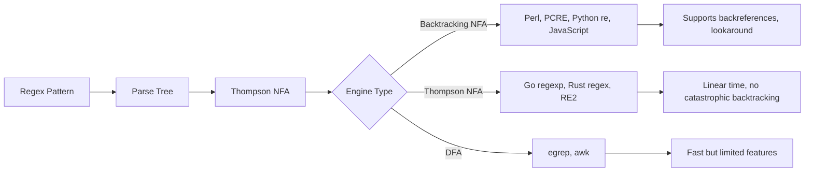

# What Are Regular Expressions?

## Description

Regular expressions are a pattern-matching language for text that every developer needs. They provide a concise and flexible way to search, validate, parse, and transform strings using a symbolic notation that describes patterns rather than exact matches.

## Prerequisites

- None. This is a foundational introduction to regular expressions.

## Table of Contents

- [Definition](#definition)
- [A Brief History](#a-brief-history)
- [Formal Language Theory Connection](#formal-language-theory-connection)
- [Why Regex Matters](#why-regex-matters)
- [Types of Regex Engines](#types-of-regex-engines)
- [Common Use Cases](#common-use-cases)
- [The Power and Danger](#the-power-and-danger)
- [Regex as a DSL](#regex-as-a-dsl)
- [When NOT to Use Regex](#when-not-to-use-regex)
- [The Learning Curve](#the-learning-curve)

## Content / Material

### Definition

A regular expression (regex) is a sequence of characters that defines a search pattern. The term comes from formal language theory, where a regular expression describes a regular language — the most restricted class of languages in the Chomsky hierarchy. In practice, regex is a tool for describing text patterns: sequences of characters, optional elements, repetitions, alternatives, and context-sensitive positions.

Every regex pattern is compiled into an internal representation — typically a finite automaton — that can be executed against input text to find matches. The pattern `\b\w{6}\b` matches any six-letter word. The pattern `^[a-zA-Z0-9._%+-]+@[a-zA-Z0-9.-]+\.[a-zA-Z]{2,}$` approximates an email address. The pattern `color` matches the literal string "color" wherever it appears.

Regex is not a programming language in the traditional sense. It has no variables, no functions, no conditionals, and no loops. But it has alternation, grouping, quantification, character classes, anchors, and assertions — enough expressive power to handle most text-processing needs in a single line.

```regex
^[A-Z][a-z]+$
```

The pattern above matches a string that starts with an uppercase letter followed by one or more lowercase letters. This is the simplest kind of pattern: an anchor, a character class, a quantifier, and another anchor.

```python
import re
pattern = r'^[A-Z][a-z]+$'
print(re.match(pattern, 'Hello'))   # match
print(re.match(pattern, 'hello'))   # None
print(re.match(pattern, 'HELLO'))   # None
```

Three lines of code answer the question: does this text look like a capitalized word? Without regex, the same check would require iterating over characters, checking ASCII ranges, and managing edge cases.

### A Brief History

Regular expressions trace back to the 1950s and the work of mathematician Stephen Cole Kleene. He defined regular sets as a formal way to describe the patterns that could be recognized by a finite automaton. His notation used union, concatenation, and Kleene star (the `*` operator, meaning zero or more repetitions). This was pure mathematics — no computers involved.

In the 1960s, Ken Thompson, one of the creators of Unix, implemented Kleene's regular expressions in the QED editor and later in ed, the standard Unix text editor. This was the first practical regex implementation. The syntax was terse: `*` for Kleene star, `^` and `$` for line anchors, `[ ]` for character classes. Thompson also wrote a paper on how to compile regex into efficient machine code using Thompson's construction — an algorithm that converts a regex into a nondeterministic finite automaton (NFA).

In 1973, Thompson wrote the first version of grep (global/regular expression/print), a standalone tool that prints lines matching a pattern. Grep became a Unix cornerstone and spread regex awareness across the programming world.

The 1980s saw regex appear in awk and sed, extending the pattern language with variables and commands. Henry Spencer wrote a widely used regex library in C that became the basis for many tools.

The watershed moment came in 1987 when Larry Wall released Perl. Perl's regex engine introduced features far beyond Kleene's original vision: lazy quantifiers, lookahead and lookbehind assertions, named captures, non-capturing groups, conditionals, recursive patterns, and embedded code. Perl's regex became the de facto standard for power and expressiveness. Philip Hazel extracted Perl's regex engine into a standalone C library called PCRE (Perl Compatible Regular Expressions) in 1997. PCRE is now used by PHP, R, Python's `regex` module, Apache, Nginx, Postfix, and many other tools.

JavaScript got regex support in its 1999 ECMAScript 3 specification. Python's `re` module came with the 1.5 release. Go's `regexp` package (2022) uses a RE2-based engine. Rust's `regex` crate prioritizes safety and linear-time guarantees. Every modern language includes regex as a standard library feature — a testament to its universal value.

```python
import re

# A real grep-like function in Python using regex
def grep(pattern, lines):
    return [line for line in lines if re.search(pattern, line)]

log_lines = [
    '2024-01-15 10:30:00 ERROR Connection timeout',
    '2024-01-15 10:30:01 INFO Retry attempt 1',
    '2024-01-15 10:30:02 ERROR Connection refused',
    '2024-01-15 10:30:03 INFO Retry attempt 2',
]

errors = grep(r'ERROR', log_lines)
print(len(errors))  # 2
```

### Formal Language Theory Connection

Regex sits at the intersection of practical programming and theoretical computer science. Understanding this connection clarifies what regex can and cannot do.

The Chomsky hierarchy classifies formal languages into four types:

- Type 0: Recursively enumerable (Turing machine)
- Type 1: Context-sensitive (linear-bounded automaton)
- Type 2: Context-free (pushdown automaton)
- Type 3: Regular (finite automaton)

Regular expressions describe Type 3 languages. A language is regular if it can be recognized by a finite automaton — a machine with a finite number of states and no external memory. This means regex cannot count arbitrarily, cannot match nested structures of arbitrary depth, and cannot remember an arbitrary amount of previously seen text (though backreferences extend practical regex beyond theoretical regularity).

The three fundamental operations of regular languages are:

1. **Concatenation**: matching `ab` means match `a` followed by `b`
2. **Alternation**: matching `a|b` means match `a` or `b`
3. **Kleene star**: matching `a*` means match `a` zero or more times

Every regex pattern is built from these three operations. Character classes (`[abc]`) are syntactic sugar for alternation (`a|b|c`). Quantifiers like `+` and `?` are sugar for combinations of Kleene star and alternation (`a+` = `aa*`, `a?` = `a|`).

```regex
# These patterns are equivalent:
colou?r      # "color" or "colour"
colou|r      # "colou" or "r"  -- WRONG, different grouping
color|colour # correct alternation
```

A finite automaton can be deterministic (DFA) or nondeterministic (NFA). DFAs run in linear time but can be exponentially larger than the pattern. NFAs are compact but can require backtracking. Most practical regex engines use NFA with backtracking, which gives them the ability to support backreferences and lookahead but introduces the risk of catastrophic backtracking on pathological inputs.

Thompson's construction converts any regex to an NFA in linear time. The NFA has at most 2×n states for a regex of length n. Simulating the NFA can be done in O(n×m) time for input length m using the powerset construction or in O(n×m) using Thompson's NFA simulation — but this simulation does not support backreferences or lookahead. That is why Go's `regexp` package (which uses RE2, a Thompson NFA engine) does not support backreferences: they chose safety over power.



### Why Regex Matters

Text processing is universal. Every program reads input, validates data, extracts information, or transforms strings. Regex is the most compact way to express text patterns, and compactness translates to readability and maintainability when the pattern is well-crafted.

A single regex can replace dozens of lines of imperative string manipulation. Validating an email format, extracting all URLs from a document, normalizing whitespace, removing HTML tags, parsing log lines, extracting function signatures from source code — all of these are one-liners with regex and multi-line procedures without it.

```javascript
// JavaScript: extract all hex color codes from CSS
const css = `
  body { background: #ffffff; color: #333; }
  a { color: #0066cc; }
  .error { border: 1px solid #ff0000; }
`;
const hexColors = css.match(/#[0-9a-fA-F]{3,8}\b/g);
// ['#ffffff', '#333', '#0066cc', '#ff0000']
```

Without regex, extracting hex colors requires scanning character by character, detecting `#`, collecting hexadecimal digits, and validating lengths. The code would be 15–20 lines and more error-prone.

Regex is also portable. The same pattern `\b[A-Z][a-z]+\b` works in Python, JavaScript, Java, Rust, Go, Perl, Ruby, PHP, and grep. This portability means a developer who knows regex can work in any language's text-processing domain without re-learning fundamentals.

### Types of Regex Engines

Different regex engines make different tradeoffs between expressiveness, performance, and safety. Understanding the engine under your tool is crucial.

**POSIX BRE (Basic Regular Expressions)** — The original Unix standard. Metacharacters `?`, `+`, `{`, `|`, `(`, `)` must be escaped to gain their special meaning: `\+`, `\?`, `\{`, `\|`, `\(`, `\)`. Used by sed and grep (with `-E` for ERE).

**POSIX ERE (Extended Regular Expressions)** — Metacharacters are special without escaping. Used by `grep -E`, `awk`. Lacks backreferences and lookahead.

**PCRE (Perl Compatible Regular Expressions)** — The most feature-rich engine. Supports backreferences, lookahead, lookbehind, named groups, atomic groups, possessive quantifiers, recursive patterns, and callouts. Used by PHP, R, Nginx, Postfix, and many command-line tools (`pcregrep`, `pcretest`).

**Perl regex** — The reference implementation. All PCRE features plus embedded code execution, `(?{ code })` constructs, and regex overloading. Perl's regex engine is the most powerful and the most dangerous.

**Python `re` module** — Supports most PCRE features but lacks possessive quantifiers, atomic groups (before Python 3.11), and recursive patterns. Python 3.11 added atomic groups `(?>...)` and possessive quantifiers.

**Python `regex` module (third-party)** — Backward-compatible replacement for `re` that adds support for recursive patterns, fuzzy matching, and overlapping matches.

**JavaScript `RegExp`** — Supports the standard features plus named groups (ES2018), lookahead, and lookbehind (ES2018). Lacks possessive quantifiers and atomic groups.

**Go `regexp`** — Uses RE2, a Thompson NFA engine that guarantees linear time. No backreferences, no lookahead, no lookbehind. Safe by design.

**Rust `regex`** — Uses a DFA with linear-time guarantees. No backreferences, no lookaround. Extremely fast. The `fancy-regex` crate adds backreferences and lookahead at the cost of worst-case guarantees.

**`grep`** — Default mode uses POSIX BRE. `grep -P` uses PCRE (if compiled with support). `grep -E` uses POSIX ERE.

```python
import re

# Python re module - standard features
pattern = r'(?P<year>\d{4})-(?P<month>\d{2})-(?P<day>\d{2})'
match = re.search(pattern, '2024-01-15')
print(match.group('year'))   # 2024
print(match.group('month'))  # 01
```

```go
// Go regexp - RE2 engine, no backreferences
package main
import (
    "fmt"
    "regexp"
)
func main() {
    re := regexp.MustCompile(`\d{4}-\d{2}-\d{2}`)
    fmt.Println(re.FindString("2024-01-15")) // 2024-01-15
}
```

```javascript
// JavaScript RegExp - named groups and lookbehind
const date = '2024-01-15'.match(/(?<year>\d{4})-(?<month>\d{2})-(?<day>\d{2})/)
console.log(date.groups.year)  // 2024
```

```rust
// Rust regex crate - linear time, no backreferences
use regex::Regex;
fn main() {
    let re = Regex::new(r"\d{4}-\d{2}-\d{2}").unwrap();
    println!("{}", re.is_match("2024-01-15")); // true
}
```

### Common Use Cases

**Validation** — Checking that input matches a required format before processing it. Used for emails, phone numbers, passwords, dates, URLs, credit card numbers, and identifiers.

```python
import re

def validate_username(name: str) -> bool:
    """Username: 3-16 chars, letters, digits, underscores, no leading digit."""
    return bool(re.match(r'^[a-zA-Z_][a-zA-Z0-9_]{2,15}$', name))

print(validate_username('john_doe'))    # True
print(validate_username('2john_doe'))   # False
print(validate_username('jd'))          # False
```

**Parsing and Extraction** — Pulling structured data from unstructured or semi-structured text. Log files, configuration files, plain-text reports, and web scrapers all benefit.

```python
import re

log_line = '2024-01-15 10:30:00 ERROR [user123] Connection timeout from 192.168.1.1'
pattern = r'(?P<timestamp>\d{4}-\d{2}-\d{2} \d{2}:\d{2}:\d{2}) (?P<level>\w+) \[(?P<user>\w+)\] (?P<message>.+)'

m = re.match(pattern, log_line)
print(m.groupdict())
# {'timestamp': '2024-01-15 10:30:00', 'level': 'ERROR',
#  'user': 'user123', 'message': 'Connection timeout from 192.168.1.1'}
```

**Search and Replace** — Finding and transforming text patterns. Renaming variables, normalizing line endings, stripping whitespace, converting markup.

```python
# Normalize all whitespace to single spaces
text = 'hello    world\n\n\tfoo   bar'
normalized = re.sub(r'\s+', ' ', text)
print(repr(normalized))  # 'hello world foo bar'

# Convert snake_case to camelCase
def snake_to_camel(name: str) -> str:
    return re.sub(r'_([a-z])', lambda m: m.group(1).upper(), name)

print(snake_to_camel('get_user_by_id'))  # getUserById
```

**Code Linting and Analysis** — Linters use regex to detect patterns in source code: unused variables, dangerous function calls, formatting violations, security vulnerabilities.

```python
import re

# Detect potential SQL injection in Python code
source = '''
query = "SELECT * FROM users WHERE id = " + user_input
'''
if re.search(r'\+\s*user_input', source):
    print('Warning: possible SQL injection via string concatenation')

# Detect hardcoded passwords or secrets
code = '''
password = "supersecret"
api_key = "sk-1234567890abcdef"
'''
secrets = re.findall(r'(password|api_key|secret|token)\s*=\s*["\'][^"\']+["\']', code, re.IGNORECASE)
print(f'Potential secrets found: {len(secrets)}')
```

**Log Analysis** — Extracting metrics, errors, and patterns from server logs, application traces, and system logs.

```python
import re
from collections import Counter

logs = [
    '10.0.0.1 - - [15/Jan/2024:10:30:15 +0000] "GET /api/users HTTP/1.1" 200 1234',
    '10.0.0.2 - - [15/Jan/2024:10:30:16 +0000] "POST /api/login HTTP/1.1" 401 56',
    '10.0.0.1 - - [15/Jan/2024:10:30:17 +0000] "GET /api/users HTTP/1.1" 200 1234',
    '10.0.0.3 - - [15/Jan/2024:10:30:18 +0000] "POST /api/login HTTP/1.1" 200 89',
]

pattern = r'(?P<ip>\d+\.\d+\.\d+\.\d+).*"(?P<method>\w+) (?P<path>[^"]+).*" (?P<status>\d+)'

status_counts = Counter()
for line in logs:
    m = re.match(pattern, line)
    if m:
        status_counts[m.group('status')] += 1

print(dict(status_counts))  # {'200': 3, '401': 1}
```

**Data Cleaning** — Normalizing messy data from spreadsheets, CSVs, user input, or legacy systems.

```python
import re

# Normalize phone numbers to E.164 format
phones = ['(555) 123-4567', '555.123.4567', '555-123-4567', '+1 555 123 4567']
def normalize_phone(p: str) -> str:
    digits = re.sub(r'\D', '', p)
    if len(digits) == 10:
        return f'+1{digits}'
    if len(digits) == 11 and digits.startswith('1'):
        return f'+{digits}'
    raise ValueError(f'Unrecognized format: {p}')

for p in phones:
    print(normalize_phone(p))
# +15551234567
# +15551234567
# +15551234567
# +15551234567
```

**Syntax Highlighting** — Text editors and IDEs use regex-based grammars (TextMate, Sublime, VS Code) to colorize code. Every token type — keywords, strings, comments, numbers — is defined by a regex pattern.

```xml
<!-- TextMate grammar snippet for string detection -->
<dict>
    <key>name</key>
    <string>string.quoted.double.js</string>
    <key>match</key>
    <string>"(?:[^"\\]|\\.)*"</string>
</dict>
```

**Router and URL Matching** — Web frameworks use regex patterns to route incoming requests to handlers.

```python
# Simplified URL routing with regex
routes = [
    (r'^/users/(\d+)$', 'user_detail'),
    (r'^/posts/(\d+)/comments$', 'post_comments'),
    (r'^/search\?q=(.+)$', 'search'),
]

def route_request(path: str):
    for pattern, handler in routes:
        m = re.match(pattern, path)
        if m:
            return handler, m.groups()
    return '404_not_found', ()

print(route_request('/users/42'))           # ('user_detail', ('42',))
print(route_request('/posts/7/comments'))   # ('post_comments', ('7',))
print(route_request('/search?q=regex'))     # ('search', ('regex',))
```

### The Power and Danger

Regex is a two-edged sword. A well-crafted pattern is elegant and fast. A poorly-crafted one is fragile, slow, and dangerous.

**Catastrophic Backtracking** — The most common regex performance pitfall. When a pattern fails to match, a backtracking engine tries every possible way the quantifiers could distribute the input before concluding failure. With nested quantifiers, the number of paths grows exponentially.

```python
import re, time

# Catastrophic backtracking: nested quantifiers on overlapping patterns
pattern = r'^(a+)+b$'
text = 'a' * 30

start = time.time()
match = re.match(pattern, text)
elapsed = time.time() - start
print(f'Match (success): {elapsed:.4f}s')  # fast

text_fail = 'a' * 30
start = time.time()
match = re.match(pattern, text_fail + 'c')
elapsed = time.time() - start
print(f'Match (failure): {elapsed:.4f}s')  # could take seconds or minutes
```

The pattern `^(a+)+b$` tries to distribute 30 `a` characters across the outer `(a+)+` and the inner `a+`. On failure, the engine explores all possible partitions of 30 items across two groups — that is 2^30 = 1,073,741,824 paths. This is exponential blowup.

The fix is to make the pattern more specific, use possessive quantifiers, or use an atomic group:

```python
# Safe alternatives:
pattern1 = r'^a+b$'           # simpler, no nested quantifiers
pattern2 = r'^(?>(a+)+)b$'    # atomic group (Python 3.11+)
pattern3 = r'^(a++)+b$'       # possessive quantifier (Python 3.11+)
```

**ReDoS (Regular Expression Denial of Service)** — Catastrophic backtracking is exploitable. An attacker can craft an input that causes a regex to consume excessive CPU time, effectively performing a denial-of-service attack. Many real-world ReDoS vulnerabilities have been found in popular software: Stack Overflow's tag parser, CloudFlare's WAF bypass, Node.js validation modules.

```python
# Vulnerable pattern example: email validation with nested quantifiers
# DO NOT USE - vulnerable to ReDoS
bad_pattern = r'^([a-zA-Z0-9_\.\-])+@[a-zA-Z0-9-]+\.[a-zA-Z0-9\-\.]+$'

# The nested + on the character class causes exponential backtracking
# when the input is almost-but-not-quite a valid email.
```

**ReDoS Prevention Strategies**:

1. Avoid nested quantifiers. Never write patterns like `(a+)+`, `(a*)*`, `(a|)*`, `(a*)+`.
2. Use possessive quantifiers (`a++`, `a*+`, `a?+`) where available — they never backtrack.
3. Use atomic groups `(?>...)` to prevent backtracking into a group.
4. Set timeouts on regex execution. Python's `re` module has no timeout, but the third-party `regex` module does.
5. Prefer RE2-based engines (Go, Rust) for untrusted input.
6. Limit input size before applying regex.

```python
import re

# Safe pattern design: avoid nested quantifiers
# Instead of: r'^([a-zA-Z0-9_\.\-])+@[a-zA-Z0-9-]+\.[a-zA-Z0-9\-\.]+$'
# Use:       r'^[a-zA-Z0-9_\.\-]+@[a-zA-Z0-9-]+\.[a-zA-Z0-9\-\.]+$'
safe_pattern = r'^[a-zA-Z0-9_\.\-]+@[a-zA-Z0-9-]+\.[a-zA-Z0-9\-\.]+$'

# Still not perfect for email validation, but not vulnerable to ReDoS
# from the same class of nested quantifier attack.
```

**False Positives and Negatives** — Regex matches are exact pattern matches, not semantic validations. A valid-looking email like `user@localhost` passes most email regex patterns but is not deliverable over the public internet. A pattern like `\d{5}` matches "12345" but also matches "12345" inside "123456" or "abc12345xyz".

```python
import re

# False positive: "123456" contains a 5-digit match
print(re.findall(r'\d{5}', 'zip 12345 and 123456'))  # ['12345', '12345']

# Fix with word boundary
print(re.findall(r'\b\d{5}\b', 'zip 12345 and 123456'))  # ['12345']
```

**Readability Decay** — As regex patterns grow, they become harder to read and maintain. A 50-character regex written by one developer can take another developer an hour to understand. Verbose mode (the `x` flag in Perl and PCRE) allows whitespace and comments to improve readability.

```python
import re

# Compact and unreadable:
pattern1 = r'^(?:(?:25[0-5]|2[0-4]\d|[01]?\d?\d)\.){3}(?:25[0-5]|2[0-4]\d|[01]?\d?\d)$'

# Verbose and maintainable (Python re.X flag):
pattern2 = re.compile(r'''
    ^
    (?:                               # first 3 octets
        (?:25[0-5]|2[0-4]\d|[01]?\d?\d)  # 0-255
        \.                            # dot separator
    ){3}
    (?:25[0-5]|2[0-4]\d|[01]?\d?\d)      # last octet
    $
''', re.X)

print(pattern2.match('192.168.1.1') is not None)  # True
```

### Regex as a DSL

A domain-specific language (DSL) is a language specialized to a particular application domain. Regex is one of the most successful DSLs in history. It has its own syntax, its own semantics, its own idioms, and its own debugging tools. It is embedded inside general-purpose languages but operates independently.

Unlike a general-purpose language, regex has no variables, no I/O, no functions, and no control flow beyond alternation and quantification. But within its domain — text pattern matching — it is more expressive than any general-purpose alternative.

Regex as a DSL has these characteristics:

1. **Declarative**: You describe what to match, not how to find it. The engine handles the search strategy.
2. **Composable**: Small patterns combine to form larger ones. Character classes combine with quantifiers, which combine with anchors, which combine with groups.
3. **Portable**: The same pattern works across languages with minor dialect differences.
4. **Succinct**: One line of regex replaces many lines of imperative code.
5. **Testable**: Patterns can be tested in isolation with tools like regex101, RegExr, and `pcretest`.

```text
Example of regex as DSL composition:

\d{3}        -- three digits, building block
\d{3}-\d{4}  -- US phone local part (555-1234)
\(\d{3}\) \d{3}-\d{4}  -- full US phone (555) 555-1234
^\(\d{3}\) \d{3}-\d{4}$  -- anchored full match
```

Each step adds a layer of specificity. The final pattern is a complete specification for a US phone number format.

### When NOT to Use Regex

Regex is not a universal tool. Some problems are better solved with other approaches.

**Parsing HTML** — HTML is not a regular language. It has nested tags, attributes with quoted values, self-closing tags, comments, CDATA sections, and doctype declarations. A regex can handle simple cases but fails on valid HTML that differs from expectations.

```python
import re

# Naive HTML tag removal -- BROKEN for many valid HTML inputs
html = '<div class="main">Hello <b>world</b></div>'
# This fails on nested tags, attributes with >, comments, etc.
result = re.sub(r'<[^>]+>', '', html)
print(result)  # 'Hello world'
```

Use a proper HTML parser (html.parser, BeautifulSoup, lxml) instead.

**Nested Structures** — Regex cannot match balanced parentheses, nested brackets, or deeply nested JSON/XML structures. The theoretical limit is the regular language class — context-free languages require a stack.

```python
# Problem: match balanced parentheses
text = '( ( ( ) ) )'  # valid nesting
text2 = '( ( )'       # unbalanced

# Regex cannot solve this for arbitrary depth.
# A simple counter-based parser is the right tool:

def has_balanced_parens(s: str) -> bool:
    depth = 0
    for c in s:
        if c == '(':
            depth += 1
        elif c == ')':
            depth -= 1
        if depth < 0:
            return False
    return depth == 0

print(has_balanced_parens('( ( ( ) ) )'))  # True
print(has_balanced_parens('( ( )'))        # False
```

**Mathematical Expressions** — Parsing arithmetic requires understanding operator precedence, associativity, and nested sub-expressions. A proper parser (shunting-yard, recursive descent, or parser combinator) is needed.

**JSON Parsing** — JSON can be parsed with regex for trivial cases, but a full JSON parser handles string escaping, Unicode, nesting, numbers, booleans, null, and edge cases. Always use `json.loads()` or equivalent.

**Email Validation** — The full RFC 5322 specification for email addresses is extremely complex: quoted strings, comments, internationalized domain names, and obscure constructs. A practical regex for email validation is a compromise. For production systems, send a verification email instead of validating the format.

```python
# Practical email regex (not RFC-compliant, but good enough for most apps)
email_pattern = r'^[a-zA-Z0-9._%+-]+@[a-zA-Z0-9.-]+\.[a-zA-Z]{2,}$'

# RFC 5322 compliant regex is hundreds of characters and still imperfect.
# Better approach: send a confirmation email.
```

**Large File Processing** — For very large files, streaming line-by-line with simple string methods (`startswith`, `in`, `split`) can be faster than regex. Regex compilation and backtracking overhead matters at scale.

**Numbers with Precision** — Regex can match digit patterns but cannot evaluate numeric ranges. Matching "a number between 100 and 999" requires parsing the digits and converting to an integer.

```python
import re

# Regex matches the pattern, not the value
text = 'response time: 250ms, limit: 300ms'
matches = re.findall(r'(\d+)ms', text)
times = [int(t) for t in matches]
over_limit = [t for t in times if t > 200]
print(over_limit)  # [250, 300]
```

### The Learning Curve

Simple regex patterns are intuitive. `cat` matches the literal "cat". `[0-9]` matches any digit. `a+` matches one or more "a" characters. A beginner can write useful patterns after five minutes of study.

Intermediate patterns require understanding metacharacters, escaping, quantifier greediness, character class mechanics, and anchor behavior. This is where most developers stop — they know enough to get by with trial and error.

Advanced patterns involve grouping, backreferences, lookahead and lookbehind assertions, atomic groups, recursive patterns, and engine internals. This level separates casual users from regex practitioners.

Mastery means understanding how the engine processes a pattern — the order of operations, where backtracking occurs, how to optimize performance, and how to avoid catastrophic failure. At this level, regex becomes a design tool rather than a guessing game.

```python
# Beginner: find all digits
re.findall(r'\d+', 'order 42: price $19.99')  # ['42', '19', '99']

# Intermediate: extract price with decimal
re.findall(r'\$\d+\.\d{2}', 'order 42: price $19.99')  # ['$19.99']

# Advanced: capture groups with named fields
m = re.search(r'order\s+(?P<id>\d+):\s+price\s+(?P<price>\$\d+\.\d{2})', 'order 42: price $19.99')
print(m.groupdict())  # {'id': '42', 'price': '$19.99'}

# Expert: use atomic groups to prevent backtracking in complex patterns
re.findall(r'(?>(cat|dog)+)', 'catdogcatdog', re.IGNORECASE)
```

The best way to learn regex is to write patterns, test them against real data, and iterate. Online tools like regex101.com, RegExr, and debuggex.com visualize the matching process. Every major language has excellent documentation for its regex engine. Mastery comes from recognizing patterns in the patterns themselves.

```text
The four stages of regex learning:

Stage 1: "I can match literal text."
Stage 2: "I can match patterns with character classes and quantifiers."
Stage 3: "I can extract groups, use lookaround, and write readable patterns."
Stage 4: "I understand engine internals, avoid catastrophic backtracking,
          and design patterns for performance and maintainability."
```

## Glossary

| Term | Definition |
|------|------------|
| Alternation | The `|` operator that matches one of several alternatives (e.g., `cat|dog` matches "cat" or "dog") |
| Anchor | A zero-width assertion that matches a position rather than a character (e.g., `^` for start, `$` for end, `\b` for word boundary) |
| Atomic group | A group `(?>...)` that prevents backtracking into its contents once matched |
| Backreference | A reference to a previously captured group, denoted by `\1`, `\2`, etc. |
| Backtracking | The engine's process of trying alternative paths when a match fails |
| Catastrophic backtracking | Exponential explosion of backtracking paths caused by nested quantifiers |
| Character class | A set of characters in brackets that matches any single character from the set (e.g., `[abc]`) |
| Chomsky hierarchy | A classification of formal languages into four types based on their generative power |
| Concatenation | The implicit operation of matching one pattern after another (e.g., `ab` matches "a" then "b") |
| DFA | Deterministic Finite Automaton — a state machine with exactly one transition per input per state |
| Domain-specific language | A language specialized to a particular domain (regex is a DSL for pattern matching) |
| Escape sequence | A backslash followed by a character to give it special meaning or to match a metacharacter literally |
| Finite automaton | A theoretical machine with a finite number of states that processes input symbols sequentially |
| Greedy quantifier | A quantifier that matches as many characters as possible (the default behavior) |
| Kleene star | The `*` operator meaning zero or more repetitions of the preceding element |
| Lazy quantifier | A quantifier that matches as few characters as possible, denoted by appending `?` |
| Lookahead | A zero-width assertion `(?=...)` that checks what follows without consuming characters |
| Lookbehind | A zero-width assertion `(?<=...)` that checks what precedes without consuming characters |
| Metacharacter | A character with special meaning in regex (e.g., `.`, `*`, `+`, `?`, `^`, `$`) |
| NFA | Nondeterministic Finite Automaton — a state machine that can have multiple possible transitions for the same input |
| PCRE | Perl Compatible Regular Expressions — a C library implementing Perl-style regex |
| POSIX | Portable Operating System Interface — a standard defining BRE and ERE regex flavors |
| Possessive quantifier | A quantifier that matches as many as possible and refuses to give back (e.g., `a++`, `a*+`) |
| Quantifier | A metacharacter or sequence that specifies how many times the preceding element must match |
| RE2 | A regex library by Google using Thompson NFA construction for linear-time guarantees |
| ReDoS | Regular Expression Denial of Service — using catastrophic backtracking as an attack vector |
| Regular expression | A sequence of characters defining a search pattern for text |
| Regular language | A Type 3 language in the Chomsky hierarchy, recognizable by a finite automaton |
| Thompson's construction | An algorithm to convert a regex into an equivalent NFA in linear time |
| Verbose mode | A regex flag that ignores whitespace and comments for better readability |
| Zero-width assertion | A regex construct that matches a position rather than consuming characters |

## Quick References

- [regex101](https://regex101.com) — Interactive regex tester with engine selection and debugger
- [Regular-Expressions.info](https://www.regular-expressions.info) — Comprehensive regex tutorial and reference by Jan Goyvaerts
- [Mastering Regular Expressions (O'Reilly)](https://www.oreilly.com/library/view/mastering-regular-expressions/0596528124/) — Jeffrey Friedl's definitive book on regex engines and optimization
- [PCRE Documentation](https://www.pcre.org/current/doc/html/) — Official PCRE man pages
- [swtch.com/~rsc/regexp/regexp1.html](https://swtch.com/~rsc/regexp/regexp1.html) — Russ Cox's excellent series on regex engine implementation
- [RE2 Syntax](https://github.com/google/re2/wiki/Syntax) — Go/RE2 regex syntax reference
- [Rust regex crate docs](https://docs.rs/regex/latest/regex/) — Rust's modern regex implementation

## Next Steps

- [Regex Syntax Fundamentals](../regex-syntax-fundamentals.md) — learn the core building blocks every pattern uses
- [Groups, Capture & Backreferences](../groups-and-backreferences.md) — extracting and reusing matched text
- [Lookahead & Lookbehind Assertions](../lookahead-and-lookbehind.md) — zero-width context matching
- [Regex Engine Internals](../regex-engine-internals.md) — how the engine processes your patterns
- [Regex Performance & Security](../regex-performance-and-security.md) — writing fast, safe regex
