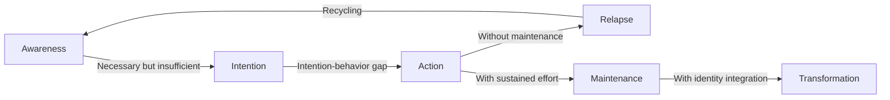
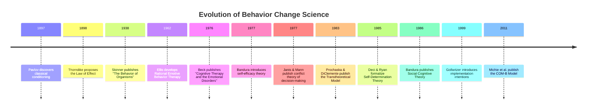
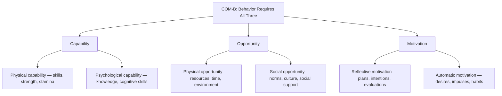
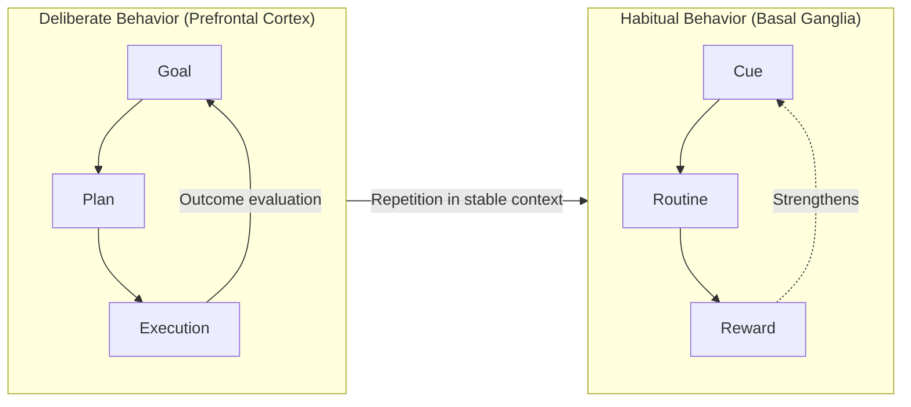
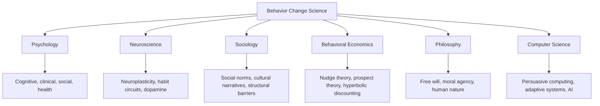

# What Is Behavior Change?

## Description

Behavior change is the scientific study of how individuals alter their behaviors, habits, thoughts, and identity structures over time. It draws on clinical psychology, health psychology, social psychology, neuroscience, and philosophy to understand the mechanisms that drive both transient modifications and lasting transformation. For developers, the field offers a rigorous framework for understanding why users adopt or abandon tools, why personal productivity systems fail, and why knowledge of what is right does not automatically produce action.

## Prerequisites

- [What Is Philosophy?](../../../philosophy/intro/what-is-philosophy.md) — the philosophical foundations of human nature, free will, and moral agency that underpin behavior change theory
- [What Is Psychology?](../../intro/what-is-psychology.md) — the core branches and methods of psychological science

## Table of Contents

- [Defining Behavior Change](#defining-behavior-change)
- [Historical Foundations](#historical-foundations)
- [Major Theoretical Perspectives](#major-theoretical-perspectives)
- [Mechanisms of Change](#mechanisms-of-change)
- [The Architecture of Habits Versus Deliberate Change](#the-architecture-of-habits-versus-deliberate-change)
- [Why Behavior Change Is Difficult](#why-behavior-change-is-difficult)
- [Measurement and Assessment](#measurement-and-assessment)
- [Behavior Change in the Digital Age](#behavior-change-in-the-digital-age)
- [Ethical Considerations](#ethical-considerations)
- [Cross-Disciplinary Connections](#cross-disciplinary-connections)
- [Implications for Software Development](#implications-for-software-development)
- [Learning Tips](#learning-tips)
- [Glossary](#glossary)
- [Quick References](#quick-references)
- [Next Steps](#next-steps)

## Content / Material

### Defining Behavior Change 🎯

Behavior change, in its broadest sense, refers to any modification in an individual's observable actions, cognitive patterns, emotional responses, or identity structures. The field investigates three fundamental questions:

1. **What changes?** — The target of change, which may range from a single discrete behavior (e.g., flossing daily) to a complex behavioral pattern (e.g., adopting a growth mindset) to an entire identity structure (e.g., transitioning from "person who smokes" to "person who does not smoke").
2. **How does change occur?** — The processes, stages, and mechanisms through which change unfolds, including cognitive reappraisal, environmental restructuring, social influence, and neuroplastic adaptation.
3. **Why does change succeed or fail?** — The determinants of change outcomes, including self-efficacy, motivation, social support, systemic barriers, and the interaction between individual agency and environmental constraints.

The field distinguishes between several types of change:

| Type | Description | Example |
|------|-------------|---------|
| **Behavioral change** | Modification of a specific observable action | Reducing screen time before bed |
| **Habit change** | Alteration of an automatic behavioral pattern triggered by a cue | Replacing a morning coffee ritual with exercise |
| **Cognitive change** | Shift in thought patterns, beliefs, or mental models | Moving from a fixed mindset to a growth mindset |
| **Identity change** | Transformation of self-concept and personal narrative | From "I am not a runner" to "I am a person who runs" |
| **Emotional regulation change** | Modification of affective responses to stimuli | Developing healthier anger management strategies |

The critical insight that distinguishes behavior change science from folk psychology is that **knowing what to change is necessary but profoundly insufficient for producing change**. The intention-behavior gap — the well-documented disconnect between what people intend to do and what they actually do — is one of the most robust findings in behavioral science. Understanding this gap and the mechanisms that bridge it is the central project of the field.



### Historical Foundations 📜

The scientific study of behavior change did not emerge from a single discipline. It is a convergence of several intellectual traditions, each contributing essential insights.

#### The Behaviorist Revolution (1900s–1960s)

The earliest systematic approach to behavior change arose from behaviorism — the school of psychology founded on the principle that behavior is determined by its consequences. Ivan Pavlov's discovery of classical conditioning (1897) demonstrated that automatic physiological responses could be acquired through association. John B. Watson extended this principle to emotional responses, arguing that fears and preferences are conditioned, not innate.

B.F. Skinner's work on operant conditioning (1938) provided the most influential framework for deliberate behavior change in the twentieth century. Skinner demonstrated that behavior is shaped by its consequences: behaviors followed by reinforcement increase in frequency, while behaviors followed by punishment decrease. This principle — the Law of Effect, originally articulated by Edward Thorndike in 1898 — remains the foundation of contingency management, token economies, and many gamification systems.

**Key contributions from behaviorism:**

- Behavior is observable, measurable, and modifiable
- Environmental contingencies shape behavior more powerfully than internal states
- Reinforcement schedules determine the persistence and resistance to extinction of behaviors
- Behavioral shaping — reinforcing successive approximations of a target behavior — is the most reliable method for producing complex new behaviors

**Limitations that drove the cognitive revolution:**

Behaviorism treated the mind as a "black box" — unobservable and therefore irrelevant to scientific psychology. This created a fundamental blind spot: it could describe what people do and under what conditions, but it could not explain why people sometimes act against their own reinforcement history, why insight and understanding matter, or how internal representations of the future guide present behavior.

#### The Cognitive Revolution (1960s–1980s)

The cognitive revolution reintroduced mental processes as legitimate objects of scientific study. Key figures — George Miller, Ulric Neisser, Daniel Kahneman, and Amos Tversky — demonstrated that human behavior is governed not just by environmental contingencies but by mental models, heuristics, biases, and information-processing limitations.

For behavior change, the cognitive revolution introduced several transformative ideas:

- **Self-efficacy** (Bandura, 1977): The belief in one's ability to execute a behavior is a stronger predictor of action than objective skill or knowledge.
- **Cognitive restructuring** (Beck, 1976; Ellis, 1962): Changing thought patterns can change emotional responses and behaviors, even without direct environmental manipulation.
- **Implementation intentions** (Gollwitzer, 1999): Specifying when, where, and how a behavior will be performed dramatically increases follow-through compared to vague intentions.
- **Decisional balance** (Janis & Mann, 1977): People weigh the pros and cons of change versus status quo, and the balance shifts across the stages of readiness.

#### The Social Turn (1980s–Present)

Social psychology added the recognition that behavior change does not occur in a vacuum. Humans are social animals whose behaviors are profoundly shaped by observational learning, social norms, group identity, and relational context. Bandura's Social Cognitive Theory (1986) integrated the cognitive and social perspectives, proposing that people learn behaviors through observation (modeling), that self-efficacy is shaped by social comparison, and that reciprocal determinism — the continuous interaction between person, behavior, and environment — governs behavioral trajectories.

The social turn also brought attention to systemic and structural determinants of behavior. Individual behavior change is constrained or enabled by social norms, economic conditions, institutional policies, and cultural narratives. This insight underlies modern public health approaches that target environments and systems rather than just individual motivation.

#### The Integration Era (1990s–Present)

The Transtheoretical Model (Prochaska & DiClemente, 1983) represents the most ambitious attempt to integrate these traditions into a single framework. By identifying common processes of change across multiple therapeutic systems, Prochaska demonstrated that behavior change follows a stage progression regardless of the specific intervention used. This model, along with COM-B (Michie et al., 2011) and Self-Determination Theory (Deci & Ryan, 1985), forms the contemporary backbone of behavior change science.



### Major Theoretical Perspectives 🧠

Behavior change science is not dominated by a single theory. Instead, several complementary frameworks address different aspects of the change process. Understanding these frameworks provides a multidimensional view of how and why people change.

#### Behaviorist and Operant Conditioning Perspectives

The behaviorist perspective holds that behavior is a function of its environmental consequences. From this viewpoint, behavior change is fundamentally about modifying the contingency structure surrounding a behavior. If a behavior is reinforced, it persists. If it is not reinforced, it extinguishes. If an alternative behavior is reinforced, it replaces the original.

The practical implications are significant:

- **Positive reinforcement** (adding a desirable consequence) is more effective than punishment for producing lasting behavior change.
- **Shaping** (reinforcing successive approximations) is the most reliable method for establishing complex new behaviors.
- **Stimulus control** (modifying environmental cues that trigger behavior) can bypass the need for willpower entirely.
- **Extinction** (withholding reinforcement) produces temporary increases in the targeted behavior (the "extinction burst") before the behavior diminishes — a phenomenon that explains why people often feel worse before they feel better when trying to break a habit.

```python
# Illustrating reinforcement schedules and behavior frequency
import random

def simulate_operant_conditioning(days=90, schedule="variable_ratio"):
    """
    Simulate behavior frequency under different reinforcement schedules.
    
    Variable ratio schedules (like slot machines) produce the highest
    and most persistent response rates — they are the most resistant
    to extinction.
    """
    behavior_count = 0
    behaviors = []
    
    reinforcement_map = {
        "continuous": lambda: True,                      # reinforced every time
        "fixed_ratio": lambda: (behavior_count % 5 == 0),  # every 5th time
        "variable_ratio": lambda: random.random() < 0.2,    # ~20% of the time
        "fixed_interval": lambda: day % 7 == 0,             # once per week
        "variable_interval": lambda: random.random() < 0.15, # ~15% of days
    }
    
    for day in range(days):
        behavior_count += 1
        reinforced = reinforcement_map[schedule]()
        behaviors.append({
            "day": day + 1,
            "behavior_count": behavior_count,
            "reinforced": reinforced
        })
    
    return behaviors

# Variable ratio schedules produce the most persistent behavior
results = simulate_operant_conditioning(days=90, schedule="variable_ratio")
reinforced_count = sum(1 for r in results if r["reinforced"])
print(f"Schedule: variable_ratio")
print(f"Total behaviors: {len(results)}")
print(f"Reinforced: {reinforced_count} ({reinforced_count/len(results)*100:.1f}%)")
```

#### Cognitive-Behavioral Perspective

The cognitive-behavioral perspective holds that behavior is mediated by thoughts, beliefs, and mental representations. Behavior change requires modifying the cognitive structures that generate and maintain the behavior. This perspective is the foundation of Cognitive Behavioral Therapy (CBT), one of the most empirically supported psychotherapeutic approaches.

Core principles relevant to behavior change:

- **Automatic thoughts** — the rapid, unconscious interpretations of events that drive emotional and behavioral responses — often contain distortions (catastrophizing, black-and-white thinking, overgeneralization) that maintain maladaptive behaviors.
- **Core beliefs** — deep, stable assumptions about oneself, others, and the world — shape the automatic thoughts that generate behavior. Changing core beliefs produces more durable behavior change than targeting automatic thoughts alone.
- **Cognitive restructuring** — the systematic identification and modification of distorted thoughts — is a core process of change in the TTM and a central technique in CBT.
- **Behavioral experiments** — testing beliefs through direct action — provide the experiential evidence that shifts deep cognitive structures.

#### Social Cognitive Theory

Bandura's Social Cognitive Theory (1986) posits that behavior change is governed by the interaction of three factors:

1. **Personal factors** — cognitive abilities, self-efficacy beliefs, outcome expectations, and emotional states.
2. **Behavioral factors** — the person's repertoire of skills, past experiences with the behavior, and self-regulatory capabilities.
3. **Environmental factors** — social norms, physical environment, institutional structures, and available resources.

This triadic reciprocal determinism means that behavior change cannot be understood as a purely individual process. The environment shapes behavior, behavior shapes the environment, and both are mediated by cognitive processes. This framework explains why identical interventions produce different results in different contexts and why individual willpower is insufficient without environmental support.

#### Self-Determination Theory

Deci and Ryan's Self-Determination Theory (SDT, 1985) distinguishes between intrinsic motivation (engaging in a behavior because it is inherently satisfying) and extrinsic motivation (engaging in a behavior for external rewards or to avoid punishment). SDT proposes that lasting behavior change requires the satisfaction of three basic psychological needs:

- **Autonomy** — the sense that one is the origin of one's own actions.
- **Competence** — the sense that one is effective in one's interactions with the environment.
- **Relatedness** — the sense of connection and belonging with others.

When these needs are satisfied, behavior change is more likely to be internalized — integrated into one's identity and values — rather than merely compliance-based. This distinction is critical: externally motivated behavior change is fragile and typically collapses when external pressure is removed.

#### The COM-B Model

Michie and colleagues (2011) proposed the COM-B Model as a comprehensive framework for understanding behavior and designing interventions. COM-B holds that any behavior (B) requires the simultaneous presence of three components:

- **Capability (C)** — the individual must have the physical and psychological skills to perform the behavior.
- **Opportunity (O)** — the environment must provide the conditions that enable the behavior.
- **Motivation (M)** — the individual must have the reflective and automatic motivation to perform the behavior.

The COM-B Model is particularly useful for intervention design because it provides a systematic way to identify barriers to change. If a behavior is not occurring, the model directs the analyst to ask: is the person lacking capability? Is the environment missing opportunity? Is motivation insufficient? Each barrier suggests a different intervention strategy.



### Mechanisms of Change ⚙️

Understanding that change occurs is less useful than understanding how it occurs. The mechanisms of change are the psychological processes through which behavioral modification is produced. Research has identified several universal mechanisms that operate across different behaviors and contexts.

#### The Role of Motivation

Motivation is frequently invoked as the explanation for behavior change, but it is a more complex construct than colloquial usage suggests. Motivation comprises:

- **Direction** — what the person is trying to achieve.
- **Intensity** — how much effort they are willing to invest.
- **Persistence** — how long they sustain the effort.

Importantly, motivation is not a fixed trait. It fluctuates in response to internal states (mood, fatigue, self-efficacy) and external conditions (social support, environmental cues, competing demands). The Transtheoretical Model captures this fluctuation through the concept of decisional balance — the shifting ratio of perceived pros and cons of change across stages.

A critical finding from motivation research is that **extrinsic rewards can undermine intrinsic motivation** — a phenomenon known as the overjustification effect (Lepper, Greene, & Nisbett, 1973). When people who already find an activity rewarding are given external rewards for performing it, their intrinsic interest often decreases. This has profound implications for incentive design in both clinical and software contexts.

#### Self-Regulation and Executive Function

Self-regulation — the capacity to override automatic impulses in favor of goal-directed behavior — is the psychological muscle of behavior change. Roy Baumeister's ego depletion model (1998) proposed that self-regulation draws on a limited resource that depletes with use, analogous to muscle fatigue. While the specific resource model has been challenged by recent replication failures, the broader finding that sustained self-regulation is effortful and imperfect remains well-supported.

Self-regulation involves several executive functions:

- **Inhibitory control** — suppressing prepotent responses (e.g., resisting the urge to check social media during focused work).
- **Working memory** — holding goals and plans in mind while executing tasks.
- **Cognitive flexibility** — shifting between strategies when the current approach is not working.

The practical implication is that behavior change systems should minimize the demand on self-regulation. Environment design, habit formation, implementation intentions, and default settings all serve to reduce the cognitive load of change by offloading regulatory demands onto external structures.

#### Neuroplasticity and Habit Formation

At the neurological level, behavior change involves the formation and modification of neural pathways. Habits are encoded in the basal ganglia — a brain region responsible for automatic behavioral routines. Deliberate behavior change initially requires prefrontal cortex engagement (effortful, conscious control), but with repetition, the behavior gradually transfers to the basal ganglia and becomes automatic.

This neurological transition explains the characteristic learning curve of behavior change:

1. **Cognitive stage** — the behavior requires full attention, is performed slowly, and is error-prone.
2. **Associative stage** — with practice, performance improves, errors decrease, and the behavior becomes more fluid.
3. **Autonomous stage** — the behavior is performed automatically, with minimal cognitive effort.

The time required for this transition varies enormously by behavior complexity and individual differences. Simple habits (e.g., taking a pill at breakfast) may become automatic within weeks. Complex behavioral patterns (e.g., regular exercise) may require months of consistent practice before becoming habitual.

#### Emotional Processes

Behavior change is not a purely cognitive enterprise. Emotional processes play a central role in both initiating and sustaining change. Dramatic relief — the emotional arousal that comes from recognizing the negative consequences of a behavior — is one of the most powerful triggers for moving from Precontemplation to Contemplation. Fear appeals, narrative transportation, and vivid personal testimonials all work through emotional arousal.

Equally important is the role of positive affect in sustaining change. Behaviors that produce immediate positive emotional rewards are far more likely to be maintained than behaviors that produce only delayed benefits. This explains why exercise programs that incorporate enjoyment produce better long-term adherence than programs focused exclusively on health outcomes.

### The Architecture of Habits Versus Deliberate Change 🏗️

One of the most important distinctions in behavior change science is between habitual behavior and deliberate behavior. This distinction has practical consequences for intervention design.

#### Habit: The Automatic Route

Habits are behavioral patterns that have been repeated in stable contexts until they are automatically triggered by contextual cues. Charles Duhigg's habit loop model (cue → routine → reward), drawn from neuroscience research, captures the basic architecture:

- **Cue** — a contextual trigger (time of day, location, emotional state, preceding action) that initiates the behavioral sequence.
- **Routine** — the behavior itself, which may be physical, cognitive, or emotional.
- **Reward** — the positive outcome that reinforces the association between cue and routine, strengthening the habit over repetitions.

Habits are cognitively efficient — they free up executive function by automating routine behaviors. However, this same automaticity makes habits resistant to change. Once a habit is established, it persists even when the person consciously intends to stop, because the neural pathways encoding the habit continue to fire in response to the cue.

#### Deliberate Change: The Effortful Route

Deliberate behavior change operates through the prefrontal cortex — the brain region responsible for planning, decision-making, and impulse control. Unlike habits, deliberate behaviors require conscious attention, are cognitively expensive, and are vulnerable to disruption by stress, fatigue, or competing demands.

This asymmetry explains why behavior change is so difficult: **habits operate on autopilot, while deliberate change requires constant manual control**. The practical solution is to convert deliberate behaviors into habits through repetition in stable contexts, thereby transferring them from the effortful prefrontal system to the automatic basal ganglia system.



```python
# Modeling habit formation through repetition
def model_habit_formation(total_days=66, context_stability=0.8):
    """
    Model the gradual transition from deliberate to habitual behavior.
    
    Research suggests that habit formation follows a power curve:
    automaticity increases rapidly at first, then asymptotically
    approaches a ceiling. The median time to reach 95% automaticity
    is approximately 66 days (Lally et al., 2010), but with high
    variance (18-254 days).
    
    Parameters:
        total_days: number of days to simulate
        context_stability: probability that the cue context is stable (0-1)
    
    Returns:
        List of daily automaticity scores
    """
    automaticity = 0.0
    history = []
    
    for day in range(1, total_days + 1):
        # Context instability resets some progress
        context_present = random.random() < context_stability
        
        if context_present:
            # Automaticity follows a power law: rapid initial growth, diminishing returns
            # Based on Lally et al. (2010) habit formation data
            automaticity = 1 - (1 - automaticity * 0.95) * 0.85
        else:
            # Missed contexts cause slight regression
            automaticity *= 0.92
        
        history.append({
            "day": day,
            "automaticity": round(automaticity, 3),
            "stage": (
                "Cognitive" if automaticity < 0.33
                else "Associative" if automaticity < 0.75
                else "Autonomous"
            ),
            "context_stable": context_present
        })
    
    return history

random.seed(42)
results = model_habit_formation(total_days=90, context_stability=0.85)
milestones = [r for r in results if r["day"] in [7, 21, 33, 66, 90]]
for m in milestones:
    print(f"Day {m['day']:3d}: automaticity={m['automaticity']:.3f}, "
          f"stage={m['stage']}, context_stable={m['context_stable']}")
```

### Why Behavior Change Is Difficult 🔒

The difficulty of behavior change is not a personal failing — it is a predictable consequence of how human psychology, neurology, and social environments interact. Understanding these barriers is essential for designing effective interventions.

#### The Intention-Behavior Gap

Sheeran and Webb's (2016) meta-analysis found that intentions account for only about 28% of the variance in behavior. This means that approximately 72% of what people do is not predicted by what they intend to do. The intention-behavior gap arises from several sources:

- **Competing intentions** — people hold multiple goals simultaneously, and these goals often conflict.
- **Habit interference** — existing habits override new intentions, especially in familiar contexts.
- **Environmental barriers** — structural obstacles (cost, access, time) prevent action even when intention is strong.
- **Self-regulatory failure** — the inability to sustain effort toward a goal in the face of temptations, distractions, and delays.

#### Temporal Discounting

Humans systematically prefer smaller, immediate rewards over larger, delayed rewards — a phenomenon known as temporal discounting or delay discounting. The discounting function is typically hyperbolic:

$$V = \frac{A}{1 + kD}$$

Where $V$ is the present value, $A$ is the delayed amount, $D$ is the delay, and $k$ is the individual discounting rate.

This means that a benefit six months from now (e.g., improved health from exercise) is psychologically worth far less than a cost experienced today (e.g., the discomfort of waking early). Temporal discounting explains why people repeatedly choose the immediate comfort of the status quo over the delayed benefits of change, even when they know the long-term consequences.

#### Ego Depletion and Decision Fatigue

While the specific resource model of ego depletion has been debated, the broader phenomenon of decision fatigue is well-documented. Baumeister and colleagues found that making decisions depletes self-regulatory capacity, leading to poorer decisions over time. This has direct implications for behavior change: people are most likely to succeed at change during periods of low decision demand (morning, after rest, before stressful events).

#### Social Influence and Norm Pressure

Humans are social creatures who conform to group norms with remarkable consistency. Asch's conformity experiments (1951) demonstrated that people will deny the evidence of their own senses to align with a group. This social pressure can both help and hinder behavior change. When the social norm supports the old behavior (e.g., a team that does not write tests), change is resisted. When the social norm supports the new behavior (e.g., a community of developers who practice test-driven development), change is facilitated.

#### The Fresh Start Effect

Dai, Milkman, and Riis (2014) documented the "fresh start effect" — temporal landmarks (birthdays, New Year's, Mondays, the start of a new semester) create psychological boundaries that motivate behavior change by enabling people to view their current self as distinct from their past self. However, the motivational boost from fresh starts is typically transient without structural support for sustained change.

### Measurement and Assessment 📊

Behavior change science relies on rigorous measurement to track progress and evaluate interventions. The key measurement challenges include:

#### Stage Assessment

The Transtheoretical Model requires accurate classification of an individual's current stage. The most common instruments are:

- **Readiness to Change Questionnaire** (RCQ) — a 12-item instrument measuring readiness for change on a continuum.
- **Stage of Change Scale** (SOCS) — a categorical instrument that classifies individuals into discrete stages based on temporal markers and behavioral indicators.
- **University of Rhode Island Change Assessment** (URICA) — an 84-item instrument that measures stage of change across multiple behaviors.

These instruments rely on self-report, which introduces measurement error. People may overestimate their readiness due to social desirability bias or misclassify themselves due to misunderstanding the questions.

#### Behavioral Measurement

Objective behavioral measurement is preferred over self-report but is more costly and intrusive:

- **Self-monitoring** — tracking behavior through journals, apps, or wearables.
- **Biochemical verification** — objective physiological measures (e.g., cotinine levels for smoking cessation, accelerometry for physical activity).
- **Ecological Momentary Assessment (EMA)** — real-time measurement of behavior and psychological states in naturalistic settings.
- **Experience Sampling Method (ESM)** — random prompting throughout the day to capture in-situ behavioral data.

#### Process Measurement

Measuring which processes of change a person is using provides diagnostic information for tailoring interventions. The Processes of Change Questionnaire (POC-Q) assesses the frequency of the 10 processes of change identified in the TTM. This enables stage-process matching — ensuring that the intervention activates the processes most relevant to the person's current stage.

### Behavior Change in the Digital Age 💻

The digital revolution has created unprecedented opportunities for behavior change intervention and research. Mobile health (mHealth) technologies, persuasive computing, and artificial intelligence are transforming the field.

#### Digital Nudges

Digital environments enable micro-interventions — small, contextually triggered prompts that influence behavior at the moment of decision. These include:

- **Choice architecture** in user interfaces (default settings, smart defaults, opt-out vs. opt-in).
- **Social comparison feedback** (showing users how their behavior compares to peers).
- **Goal-setting prompts** that trigger implementation intentions at relevant moments.
- **Gamification** — applying game design elements (points, badges, leaderboards, streaks) to non-game contexts to increase engagement.

#### Passive Sensing and Adaptive Interventions

Wearable devices and smartphone sensors enable continuous, passive measurement of behavior (activity levels, sleep patterns, location, social interactions). This data feeds into adaptive interventions — systems that modify their behavior change strategies in real time based on the user's current state, context, and history.

The Just-in-Time Adaptive Intervention (JITAI) framework (Nahum-Shani et al., 2018) represents the cutting edge of digital behavior change. JITAIs deliver the right intervention, at the right time, in the right format, based on real-time assessment of the person's needs. For example, a stress management app might detect elevated heart rate and time of day, then deliver a brief breathing exercise precisely when the user is most likely to benefit.

#### Data-Driven Personalization

Machine learning enables the personalization of behavior change interventions at scale. Rather than applying the same intervention to all individuals, algorithms can learn from individual behavior patterns to predict which interventions will be most effective for which people, at which times, in which contexts. This represents the convergence of behavior change science and data science — a domain of direct relevance to developers.

### Ethical Considerations ⚖️

Behavior change science raises significant ethical questions that developers must consider when designing systems that influence user behavior.

#### Persuasion Versus Manipulation

The line between legitimate persuasion and unethical manipulation is often unclear. Legitimate persuasion respects autonomy — it provides information, frames choices, and supports informed decision-making. Manipulation exploits cognitive biases, emotional vulnerabilities, or information asymmetries to produce behavior that serves the persuader's interests at the expense of the persuaded.

Key ethical criteria:

- **Transparency** — does the user understand that the system is attempting to influence their behavior?
- **Autonomy** — does the user have genuine freedom to resist the influence?
- **Beneficence** — does the behavior change serve the user's interests, or only the designer's?
- **Proportionality** — is the intensity of the influence proportionate to the importance of the outcome?

#### Dark Patterns and Coercive Design

Dark patterns are design choices that exploit cognitive biases to produce behavior that the user would not endorse upon reflection. Examples include hidden costs, forced continuity (making subscriptions difficult to cancel), confirmshaming (guilt-tripping users who decline), andRoach Motels (easy to get in, hard to get out). These practices represent the misuse of behavior change knowledge and are increasingly subject to regulatory scrutiny.

#### The Responsibility of Influence

Developers who build systems that influence behavior bear a moral responsibility for the consequences of that influence. This responsibility extends beyond legal compliance to a stewardship obligation — the recognition that power to shape human behavior carries a corresponding duty to use that power wisely. This is not merely a philosophical abstraction; it has practical implications for feature design, algorithm optimization, and business model selection.

### Cross-Disciplinary Connections 🌐

Behavior change science sits at the intersection of multiple disciplines, each contributing unique methods and insights.



- **Neuroscience** reveals the neural substrates of habit formation, reward processing, and self-regulation, providing the biological foundation for psychological theories.
- **Behavioral economics** (Kahneman, Tversky, Thaler) contributes prospect theory, nudge theory, and the analysis of cognitive biases that systematically distort decision-making.
- **Sociology** illuminates how social structures, cultural narratives, and institutional policies constrain and enable individual behavior change.
- **Philosophy** addresses the foundational questions: What does it mean to change? Is authentic change possible, or are we prisoners of our conditioning? What is the relationship between knowledge and action? These questions connect to ancient philosophical debates about free will, moral responsibility, and human flourishing.
- **Computer science** provides the tools for measurement, modeling, and intervention delivery at scale — from mobile health applications to adaptive learning systems to persuasive interfaces.

### Implications for Software Development 🛠️

Understanding behavior change is not merely academically interesting for developers — it has direct, practical implications for nearly every aspect of professional practice.

#### User Adoption and Onboarding

Users do not adopt new tools instantaneously. They progress through stages of readiness. An effective onboarding process meets users where they are:

- **Precontemplation**: Users do not see the need for the tool. Intervention: consciousness-raising through content marketing, case studies, and peer testimonials.
- **Contemplation**: Users are aware of the tool but have not committed. Intervention: low-commitment trials, free tiers, and social proof.
- **Preparation**: Users intend to adopt but have not yet started. Intervention: implementation intention prompts, setup wizards, and time-boxed challenges.
- **Action**: Users are actively learning the tool. Intervention: immediate feedback, progress tracking, and milestone celebrations.
- **Maintenance**: Users have integrated the tool into their workflow. Intervention: advanced features, community engagement, and habit reinforcement.

#### Personal Productivity and Workflow Design

Developers can apply behavior change principles to their own productivity systems:

- **Environment design**: Structure your workspace to make productive behaviors easy and distractions difficult (stimulus control).
- **Implementation intentions**: Specify exactly when and where you will perform a behavior ("I will write code from 9:00 to 11:00 at my standing desk").
- **Habit stacking**: Attach a new behavior to an existing habit ("After I pour my morning coffee, I will review my task list").
- **Self-monitoring**: Track your behavior to increase awareness and enable data-driven adjustment.

#### Team Dynamics and Culture Change

Introducing new practices (code review, test-driven development, CI/CD) into a team is a behavior change problem. The TTM explains why mandates fail — they target the Action stage when most team members are in Precontemplation or Contemplation. Effective approaches raise consciousness, build the pros of the new practice, and allow gradual stage progression.

#### Ethical Product Design

Understanding the mechanisms of behavior change creates an ethical obligation to use that knowledge responsibly. Features that exploit cognitive biases (infinite scroll, variable ratio reinforcement schedules in notifications, loss aversion in pricing) produce short-term engagement at the cost of long-term trust and user wellbeing. Ethical product design applies behavior change knowledge in service of user goals, not merely business metrics.

## Learning Tips 💡

- **Map your own change attempts.** Choose a behavior you have tried to change and identify which stage you were in, what processes you used, and why the attempt succeeded or failed. This personal analysis solidifies theoretical concepts.
- **Study the intention-behavior gap in your own life.** Track one intention for a week (e.g., "I will exercise every morning") and record what actually happens. The gap between intention and action reveals the operation of habit, self-regulation failure, and environmental barriers.
- **Analyze a product through a behavior change lens.** Choose a software product you use daily and identify which stages of change it targets, which processes of change it activates, and whether it uses COM-B components effectively.
- **Read primary sources.** The original papers by Prochaska and DiClemente (1983), Bandura (1977), and Michie et al. (2011) are accessible and illuminate the reasoning behind the models.
- **Distinguish correlation from mechanism.** Many popular behavior change books cite correlational evidence as if it were causal. Always ask: does this intervention actually cause the change, or does it merely co-occur with change?

## Glossary 📖

| Term | Definition |
|------|------------|
| Behavior change | The scientific study of how individuals modify their actions, habits, thoughts, and identity structures |
| Self-efficacy | An individual's belief in their capability to execute a specific behavior in specific situations (Bandura, 1977) |
| Decisional balance | The relative weighing of perceived pros and cons of changing versus maintaining current behavior |
| Intention-behavior gap | The well-documented disconnect between behavioral intentions and actual behavior |
| Temporal discounting | The systematic tendency to prefer smaller immediate rewards over larger delayed rewards |
| Operant conditioning | A learning process in which behavior is modified by its consequences — reinforcement or punishment |
| Classical conditioning | A learning process in which a neutral stimulus becomes associated with an unconditioned stimulus to produce a conditioned response |
| Habit | A behavioral pattern that has been repeated in a stable context until it is automatically triggered by contextual cues |
| Cognitive restructuring | The systematic identification and modification of distorted or maladaptive thought patterns |
| Implementation intention | A specific plan that links a situational cue to a goal-directed response ("If X, then I will Y") |
| Ego depletion | The theory that self-regulatory capacity is a limited resource that depletes with use |
| Reciprocal determinism | Bandura's concept that person, behavior, and environment continuously influence each other |
| Transtheoretical Model | An integrative framework describing intentional behavior change across six stages (Prochaska & DiClemente, 1983) |
| COM-B Model | A framework holding that behavior requires Capability, Opportunity, and Motivation simultaneously (Michie et al., 2011) |
| Self-Determination Theory | A theory of motivation emphasizing autonomy, competence, and relatedness as basic psychological needs (Deci & Ryan, 1985) |
| Overjustification effect | The phenomenon in which external rewards decrease intrinsic motivation for an already rewarding activity |
| Dark pattern | A design choice that exploits cognitive biases to produce behavior the user would not endorse upon reflection |
| Ecological Momentary Assessment | A research method involving real-time measurement of behavior and psychological states in naturalistic settings |
| JITAI | Just-in-Time Adaptive Intervention — a digital intervention framework that delivers the right intervention at the right time based on real-time data |
| Neuroplasticity | The brain's capacity to reorganize neural pathways in response to experience and learning |

## Quick References 📚

- Prochaska, J. O., & DiClemente, C. C. (1983). Stages and processes of self-change of smoking: toward an integrative model of change. *Journal of Consulting and Clinical Psychology*, 51(3), 390-395. — The foundational paper introducing the Transtheoretical Model
- Bandura, A. (1977). Self-efficacy: toward a unifying theory of behavioral change. *Psychological Review*, 84(2), 191-215. — The original paper introducing self-efficacy theory
- Michie, S., van Stralen, M. M., & West, R. (2011). The behaviour change wheel: a new method for characterising and designing behaviour change interventions. *Implementation Science*, 6(1), 42. — The paper introducing the COM-B Model and Behaviour Change Wheel
- Lally, P., van Jaarsveld, C. H. M., Potts, H. W. W., & Wardle, J. (2010). How are habits formed: Modelling habit formation in the real world. *European Journal of Social Psychology*, 40(6), 998-1009. — The empirical study on habit formation timelines
- Sheeran, P., & Webb, T. L. (2016). The intention–behavior gap. *Social and Personality Psychology Compass*, 10(9), 503-518. — A comprehensive review of the intention-behavior gap
- Deci, E. L., & Ryan, R. M. (1985). *Intrinsic Motivation and Self-Determination in Human Behavior*. Plenum Press. — The foundational text of Self-Determination Theory
- Thaler, R. H., & Sunstein, C. R. (2008). *Nudge: Improving Decisions About Health, Wealth, and Happiness*. Yale University Press. — A practical guide to choice architecture and behavioral design
- Duhigg, C. (2012). *The Power of Habit: Why We Do What We Do in Life and Business*. Random House. — An accessible introduction to habit science for general audiences
- Nahum-Shani, I., Smith, S. N., Spring, B. J., Collins, L. M., Witkiewitz, K., Tewari, A., & Murphy, S. A. (2018). Just-in-time adaptive interventions (JITAIs) in mobile health. *Annals of Behavioral Medicine*, 52(6), 446-462. — The definitive framework for digital adaptive interventions

## Next Steps ➡️

- [The Transtheoretical Model](../the-transtheoretical-model.md) — the stage framework that provides structure and vocabulary for understanding how change unfolds over time
- [Processes of Change](../processes-of-change.md) — the ten active ingredients that drive progression through the stages of change
- [Self-Efficacy & Decisional Balance](../self-efficacy-and-decisional-balance.md) — the motivational constructs that determine whether change is attempted, sustained, or abandoned
- [Maintenance & Relapse Prevention](../maintenance-and-relapse-prevention.md) — the long-term work of sustaining change and the science of preventing relapse
