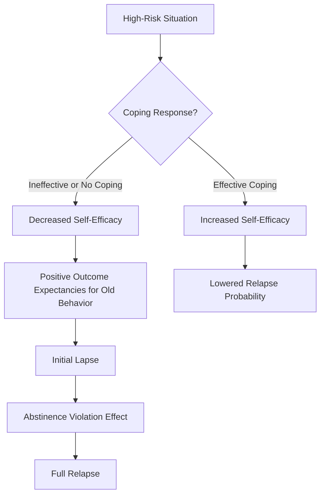
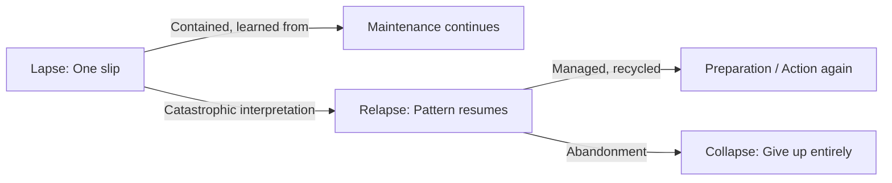
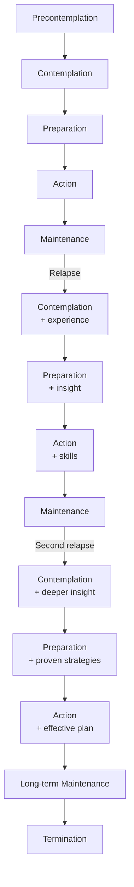

# Maintenance & Relapse Prevention

## Description

Maintenance is the most overlooked and arguably the most important stage of behavior change. It is the long, unglamorous work of sustaining change after the initial excitement of Action has faded. Relapse is not failure — it is the norm. Most changers cycle through the stages multiple times before achieving lasting maintenance. This document covers the maintenance stage in depth, Marlatt's cognitive-behavioral relapse prevention model, the difference between lapse, relapse, and collapse, and how to build a relapse prevention plan. For developers, this content provides a framework for sustaining habits, managing team culture changes, and designing systems that support long-term adherence.

## Prerequisites

- [Self-Efficacy & Decisional Balance](self-efficacy-and-decisional-balance.md) — the motivational foundations that determine whether maintenance holds or breaks

## Table of Contents

- [What Is Maintenance?](#what-is-maintenance)
- [The Unique Challenges of Maintenance](#the-unique-challenges-of-maintenance)
- [Marlatt's Relapse Prevention Model](#marlatts-relapse-prevention-model)
- [The Relapse Process](#the-relapse-process)
- [Lapse, Relapse, and Collapse](#lapse-relapse-and-collapse)
- [High-Risk Situations](#high-risk-situations)
- [The Abstinence Violation Effect](#the-abstinence-violation-effect)
- [Coping Skills and Cognitive Restructuring](#coping-skills-and-cognitive-restructuring)
- [Building a Relapse Prevention Plan](#building-a-relapse-prevention-plan)
- [Relapse as Recycling: The Spiral Perspective](#relapse-as-recycling-the-spiral-perspective)
- [Maintenance Processes in Depth](#maintenance-processes-in-depth)
- [Lifestyle Balance and Relapse Prevention](#lifestyle-balance-and-relapse-prevention)
- [Practical Applications for Developers](#practical-applications-for-developers)
- [Learning Tips](#learning-tips)
- [Glossary](#glossary)
- [Quick References](#quick-references)
- [Next Steps](#next-steps)

## Content / Material

### What Is Maintenance?

In the Transtheoretical Model, Maintenance is the stage in which a person has sustained behavior change for more than six months and is actively working to prevent relapse. It is not a static endpoint — it is a dynamic stage requiring ongoing effort, vigilance, and skill application.

**Temporal definition:** Six months of continuous change. This boundary was chosen based on epidemiological data showing that relapse risk decreases significantly after six months for most behaviors. However, this is a heuristic, not a law. For some behaviors (especially highly addictive ones), the high-risk period may extend for years.

**Psychological definition:** Maintenance is characterized by:
- Decreasing temptation — the urge to return to the old behavior diminishes over time
- Increasing confidence — each day of successful maintenance builds self-efficacy
- Lifestyle integration — the new behavior becomes woven into daily routines
- Automaticity — the new behavior requires less conscious effort and decision-making

**What Maintenance is not:**

- Maintenance is not "being cured." The risk of relapse, while decreasing, remains for many behaviors indefinitely.
- Maintenance is not coasting. It requires active use of change processes, though the intensity and frequency decrease over time.
- Maintenance is not the same for everyone. Different behaviors, contexts, and individuals have different maintenance requirements.

### The Unique Challenges of Maintenance

Maintenance is psychologically and practically different from Action. Rothman (2000) made a critical distinction between the processes that initiate change and those that sustain it.

| Dimension | Action | Maintenance |
|-----------|--------|-------------|
| Motivation driver | Outcome expectations ("Will this improve my life?") | Satisfaction with outcomes ("Is this delivering what I expected?") |
| Primary goal | Initiate the behavior | Prevent relapse |
| Time horizon | Short-term (daily, weekly) | Long-term (months, years) |
| Effort level | High, active | Moderate to low, sustained |
| Vulnerability | Temptation to stop | Complacency, lifestyle drift |
| Key processes | Self-liberation, counterconditioning | Stimulus control, lifestyle balance |
| Self-efficacy | Building rapidly | High but can be overestimated |
| Emotional trajectory | Excitement, novelty, challenge | Stability, possible boredom |

**The satisfaction gap:**

The most dangerous moment in maintenance is when the person evaluates whether the change is delivering the expected benefits. If the benefits fall short (weight loss plateaued, productivity gains did not materialize, the new behavior feels empty), motivation drops, decisional balance shifts back toward the old behavior, and relapse risk spikes. This is why unrealistic expectations at the beginning of change can cause problems months later.

**The complacency trap:**

As the new behavior becomes habitual, the person stops actively managing it. They stop using stimulus control, stop monitoring their decisional balance, and stop seeking social support. The change feels secure — and that is precisely when a high-risk situation catches them off guard.

**The fading novelty effect:**

New behaviors are exciting. Maintenance is boring. The same behavior that felt fresh and motivating in Action can feel mundane and pointless in Maintenance. Without the dopamine hit of novelty, the person may unconsciously seek stimulation through the old behavior.

### Marlatt's Relapse Prevention Model

Alan Marlatt and colleagues developed the most influential model of relapse prevention, originally for addictive behaviors but later generalized to behavior change broadly. The model is cognitive-behavioral: it focuses on the thoughts, feelings, and situational factors that lead to relapse, and the skills needed to prevent it.

**The core premise:**

Relapse is not a random event — it is a predictable process with identifiable antecedents. If you can identify the antecedents and build skills to handle them, you can prevent or limit relapse.

**The feedback loops in the model:**

1. **Effective coping loop:** High-risk situation → effective coping response → increased self-efficacy → lower relapse probability.
2. **Ineffective coping loop:** High-risk situation → ineffective or no coping → decreased self-efficacy → positive outcome expectancies for the old behavior ("It would feel so good right now") → initial lapse → abstinence violation effect → guilt, shame, and perceived loss of control → increased probability of full relapse.

The model is explicitly designed to be recursive. Each loop feeds back into the system. A successful coping experience builds self-efficacy for the next high-risk situation. A lapse that is properly managed (without the AVE) can be a learning experience that strengthens future coping.

**The importance of coping response:**

The single most important variable in the model is the coping response. Does the person have a skill to handle the high-risk situation? Not just any skill — a specific, practiced, accessible skill that can be deployed in the moment. General good intentions ("I will just resist") are not coping skills.

### The Relapse Process

Relapse is rarely a sudden event. It is a gradual process with identifiable warning signs. Understanding this process helps people catch a relapse early, when it is still a "lapse" that can be contained.

**The typical relapse sequence:**

1. **Lifestyle imbalance:** The person's life becomes unbalanced — too much "should" (work, obligations) and not enough "want" (enjoyment, rest). This creates accumulated stress and a sense of deprivation.

2. **Triggers accumulate:** Multiple small stressors pile up. None alone is serious, but together they erode coping capacity.

3. **Warning signs appear:** The person begins to think about the old behavior more often, fantasizes about it, or puts themselves in high-risk situations "accidentally." They may reduce their use of change processes without noticing.

4. **The high-risk situation:** A specific event occurs that the person is not prepared to handle — an emotional crisis, social pressure, an unexpected opportunity.

5. **No effective coping:** The person either has no coping skill for this situation or fails to apply it.

6. **Anticipation and desire:** In the absence of effective coping, the positive outcome expectancies for the old behavior dominate. The person focuses on how good the old behavior would feel, not on its consequences.

7. **The lapse:** One instance of the old behavior.

8. **The abstinence violation effect:** The person's reaction to the lapse determines whether it remains a single incident or escalates to full relapse.

9. **Full relapse:** The person returns to the old behavior pattern, often at or above previous levels.

### Lapse, Relapse, and Collapse

The distinction between these three terms is not pedantic — it is clinically and practically crucial. How a person labels their setback determines their behavioral response.

**Lapse:**

A lapse is a single instance of the old behavior after a period of change. It is a slip, not a fall. A lapse means: "I did the thing once." It is contained, time-limited, and does not necessarily lead to full relapse.

- Example: A developer who committed to no work emails after 7 PM checks their inbox one evening after a stressful meeting. They catch themselves, close the app, and return to their evening.
- Psychological impact of a lapse: Ideally, minimal. It is framed as a mistake, not a failure.

**Relapse:**

A relapse is a return to the old behavior pattern. It is not a single slip — it is a resumption of the behavior at or near previous levels. The person has "gone back to how they were."

- Example: The developer who lapsed once then decides "I have already blown it, I might as well keep checking" and returns to their previous pattern of working late every night.
- Psychological impact of a relapse: Significant. The person may experience shame, guilt, and a sense of defeat.

**Collapse:**

Collapse is the end stage of unmanaged relapse. The person not only returns to the old behavior but abandons all change efforts entirely. They conclude that change is impossible and stop trying. Collapse corresponds to a return to Precontemplation, often with the added burden of demoralization.

- Example: The developer, after months of unsuccessfully trying to maintain boundaries, concludes "I am just the kind of person who works all the time" and stops even trying to set limits.
- Psychological impact of collapse: Severe. The person may develop learned helplessness about change.

**Why the distinction matters:**

The difference between lapse and relapse is almost entirely cognitive. The same behavior — one drink, one cigarette, one skipped workout — can be either a lapse or the beginning of a relapse, depending on the person's interpretation. This is why the abstinence violation effect is so important.

### High-Risk Situations

Marlatt's research identified a set of high-risk situations that account for the majority of relapses across different behaviors.

**Categories of high-risk situations:**

| Category | Examples | Approx. % of relapses |
|----------|----------|----------------------|
| Negative emotional states | Stress, anger, anxiety, depression, boredom, frustration | ~35% |
| Interpersonal conflict | Arguments, relationship problems, social tension | ~15% |
| Social pressure | Being offered the substance, being encouraged to engage, being around others doing the behavior | ~20% |
| Positive emotional states | Celebrating, feeling good, wanting to enhance pleasure | ~10% |
| Testing personal control | "I can have just one" — testing whether moderation is possible | ~5% |
| Urges and cravings | Intense desire that feels overwhelming | ~5% |
| Physical discomfort | Pain, illness, withdrawal symptoms, fatigue | ~5% |
| Other | Unexpected situations, multiple triggers | ~5% |

**The most dangerous situation:**

Negative emotional states are consistently the strongest predictor of relapse across all behaviors and populations. When people are stressed, angry, or depressed, their coping resources are depleted, their positive expectations for the old behavior increase (it feels like relief), and their self-efficacy drops.

**Situation × Person interaction:**

Not all high-risk situations are equally risky for all people. An extrovert may be most vulnerable to social pressure. A person with anxiety may be most vulnerable to negative emotional states. A key task in relapse prevention is identifying one's personal high-risk profile.

**The "apparently irrelevant decision" (AID):**

Marlatt also identified a subtler category of high-risk antecedent: decisions that appear rational and unrelated to the behavior but that subtly increase risk. Examples:
- "I will just walk past the bar to get to the restaurant" (walking past a known trigger)
- "I can work late just this one night" (setting a precedent for boundary violation)
- "I will handle this stressful call without my usual calming routine" (skipping coping practices)

AIDs are dangerous because they bypass conscious awareness. The person does not realize they are increasing their risk until they are suddenly in a high-risk situation.

### The Abstinence Violation Effect

The abstinence violation effect (AVE) is one of Marlatt's most important contributions. It describes the cognitive and emotional reaction to a lapse that determines whether it escalates to relapse.

**The AVE mechanism:**

When a person who has been maintaining a change experiences a lapse, they make an attribution about why it happened. The nature of this attribution determines their subsequent behavior.

**Helpful attribution (prevents relapse):**

The person attributes the lapse to situational, specific, controllable factors:
- "I slipped because I was under extreme stress at work and had not slept well."
- "I made a mistake, but that does not mean I have failed."
- "This is a learning experience — now I know this situation is dangerous for me."

**Harmful attribution (promotes relapse):**

The person attributes the lapse to internal, stable, uncontrollable factors:
- "I am weak-willed."
- "I will never be able to change."
- "I have failed completely. There is no point continuing."

**The three dimensions of attribution:**

| Dimension | Healthy (prevents relapse) | Unhealthy (promotes relapse) |
|-----------|---------------------------|------------------------------|
| Internal vs. External | External: "The situation was difficult" | Internal: "I am a failure" |
| Stable vs. Unstable | Unstable: "This was a one-time thing" | Stable: "I will always be like this" |
| Global vs. Specific | Specific: "I slipped in this one situation" | Global: "I cannot change anything" |

**The cognitive dissonance factor:**

The AVE is amplified by cognitive dissonance. The person has been working hard to maintain change. The lapse contradicts their self-image as someone who has changed. To reduce the dissonance, they can:
- Increase the importance of the new identity (acknowledge the lapse as an exception, recommit to the new identity) → healthy
- Reduce the importance of the new identity ("Maybe change was not that important to me after all") → unhealthy
- Adjust their self-perception to accommodate the lapse ("I guess I really am an addict/smoker/lazy person") → leads to relapse

**Preventing the AVE:**

The most effective way to prevent the AVE is to prepare for it in advance. Before a lapse ever happens, the person should:
- Know that lapses are normal and expected (they are part of the spiral model)
- Have a predetermined response: "If I slip, I will stop immediately, reflect on what happened, adjust my plan, and continue"
- Distinguish between the behavior (lapse) and the person (still a person who is changing)
- Understand the attribution trap and practice healthy attributions

### Coping Skills and Cognitive Restructuring

Effective coping is the core of relapse prevention. Coping skills can be behavioral (actions) or cognitive (thoughts).

**Behavioral coping skills:**

| Skill | Description | Example |
|-------|-------------|---------|
| Avoidance | Remove yourself from the high-risk situation | Leave the party where everyone is smoking |
| Escape | Exit a situation that has become risky | End a conversation that is triggering cravings |
| Substitution | Replace the old behavior with a healthy alternative | Chew gum instead of smoking |
| Relaxation | Reduce arousal to manage urges | Deep breathing, progressive muscle relaxation |
| Physical activity | Use exercise to manage cravings and mood | Walk or run when the urge hits |
| Social support | Call a supportive person | Phone a friend who knows you are trying to change |
| Delay | Wait before acting on the urge | "I will wait 10 minutes before deciding" |
| Environmental change | Modify the environment to reduce risk | Remove alcohol from the house |

**Cognitive coping skills:**

| Skill | Description | Example |
|-------|-------------|---------|
| Cognitive restructuring | Challenge the thoughts that lead to relapse | "I do not need this to cope — I have other options" |
| Urge surfing | Observe the urge without acting on it, knowing it will pass | Notice craving, breathe into it, watch it fade |
| Positive outcome re-evaluation | Re-examine the anticipated pleasure of the old behavior | "That first cigarette will taste terrible, not good" |
| Consequences reminder | Focus on the negative outcomes of the old behavior | "If I smoke, I will smell bad and feel guilty" |
| Self-efficacy statement | Remind yourself that you can handle this | "I have handled this situation before" |
| Decisional balance review | Re-weigh the pros and cons in the moment | "Is this momentary pleasure worth the regret?" |
| Mindfulness | Observe the urge without judgment | "This is a craving. It is uncomfortable but temporary." |

**Cognitive restructuring in detail:**

Cognitive restructuring focuses on the specific thoughts that precede a lapse. Common cognitive distortions in the relapse process:

1. **"Just this once won't matter."** → Reframe: "This is how every relapse starts — with one exception. The road back to the old behavior is paved with 'just this once.'"

2. **"I deserve this. I have been so good."** → Reframe: "I deserve to keep the benefits of my change. Self-care is not self-sabotage."

3. **"It won't stop here. I have already failed."** → Reframe: "This is one slip. I can stop right now and return to my plan. A slip is not a relapse unless I decide it is."

4. **"The change is not working anyway."** → Reframe: "Change takes time. The benefits may not be as dramatic as I hoped, but I am better off than I was before."

5. **"I am different — I can handle it."** → Reframe: "I have handled this situation before. The data says this is a high-risk situation for me. Let me use my coping plan."

### Building a Relapse Prevention Plan

A relapse prevention plan is a proactive document that specifies exactly what the person will do in high-risk situations. It is created during Preparation or Action but used throughout Maintenance.

**Components of a comprehensive relapse prevention plan:**

#### 1. Personal High-Risk Profile

List the top 5-10 situations that pose the highest relapse risk for you personally. Be specific.

Example:
- "When I have had a terrible day at work and feel like a bad engineer"
- "When a friend invites me to happy hour after a stressful week"
- "When I am traveling for work and out of my routine"
- "When I have not exercised in 3+ days and feel sluggish"
- "When I get a critical piece of feedback that stings"

#### 2. Coping Strategies for Each High-Risk Situation

For each situation, specify at least one behavioral and one cognitive coping strategy.

Example:
- Situation: "When I have had a terrible day at work and feel like a bad engineer"
  - Behavioral: Go for a 15-minute walk before going home. Call my partner on the way.
  - Cognitive: "One bad day does not define my career. I have handled hard days before."

#### 3. Early Warning Signs

List the early indicators that you may be drifting toward relapse — before a high-risk situation occurs.

Example:
- Skipping morning meditation
- Not tracking my behavior
- Spending more time alone
- Fantasizing about the old behavior
- Feeling restless or bored
- Letting my environment drift back to old patterns

#### 4. A Lapse Protocol

A specific, step-by-step plan for what to do if a lapse occurs.

Example:
1. Stop the behavior immediately. Do not continue "because I already blew it."
2. Remove myself from the situation (physically leave if needed).
3. Breathe. Take 60 seconds to calm the emotional response.
4. Write down what happened: where, when, what triggered it.
5. Identify the attribution: "Is this a character flaw or a specific situation?"
6. Reframe: "This is a slip, not a relapse. I am still a person who is changing."
7. Re-commit: "What is the next small action I can take to get back on track?"
8. Call my support person and tell them what happened.
9. Review and adjust the plan: "What can I learn from this to prevent it happening again?"

#### 5. Lifestyle Balance Plan

Relapse is often preceded by broader lifestyle imbalance. The plan should include proactive strategies for maintaining balance.

Example:
- Schedule at least one "want" activity per day (something I enjoy for its own sake)
- Exercise at least 3x per week
- Get 7+ hours of sleep per night
- Schedule one social activity per week
- Take one full day off from work per week

#### 6. Ongoing Self-Monitoring

How will the person track their maintenance and catch early warning signs?

Example:
- Weekly check-in: rate confidence (1-10), temptation (1-10), and lifestyle balance (1-10)
- Daily: 2-minute journal entry about how the day went
- Monthly: review the relapse prevention plan and update it

### Relapse as Recycling: The Spiral Perspective

The sprial model of change (introduced in the TTM document) is essential for understanding relapse. When a person relapses, they do not return to square one. They recycle through the stages with increased knowledge and skills.

**What is learned in a relapse:**

- Specific knowledge: "I now know exactly which situations are dangerous for me"
- Skill gaps: "I now know which coping skills I was missing"
- Attribution patterns: "I now know that I am prone to catastrophic thinking after a slip"
- Support needs: "I now know I need more social support than I was getting"
- Decisional balance insight: "I now know that the pros of changing were not as stable as I thought"

**The recycling advantage:**

People who have relapsed and returned to change are not starting from zero. They are starting from a higher level of self-awareness. Research shows that the number of previous quit attempts is positively correlated with eventual success — each attempt builds skills and knowledge.

**The spiral visualized:**

**The key reframe:**

Rather than "I relapsed. I failed. I am back where I started," the constructive reframe is: "I relapsed. That means I learned something I did not know before about my change process. Now I can incorporate that learning and try again with a better plan."

This reframe is essential for preventing collapse. Without it, relapse leads to shame, shame leads to abandonment of the change effort, and abandonment leads to learned helplessness.

### Maintenance Processes in Depth

The processes of change are used differently in Maintenance than in Action. The emphasis shifts from initiation to sustainment.

**Process use in Maintenance:**

| Process | How it applies in Maintenance |
|---------|-------------------------------|
| Consciousness-Raising | Low emphasis — continued awareness but not heavy information-seeking |
| Dramatic Relief | Low emphasis — avoiding emotional arousal about the change |
| Self-Reevaluation | Moderate emphasis — occasional check: "Is who I am becoming aligned with who I want to be?" |
| Environmental Reevaluation | Moderate emphasis — continued awareness of how the change affects others |
| Social Liberation | Low to moderate — advocating for environments that support the change |
| Self-Liberation | Moderate — occasional reaffirmation of commitment |
| Helping Relationships | Moderate — maintenance of supportive relationships |
| Counterconditioning | High — continued substitution of healthy for unhealthy responses |
| Reinforcement Management | Moderate — periodic rewards for sustained maintenance |
| Stimulus Control | High — continued environmental design to support the change |

**The most important Maintenance processes:**

Stimulus control and counterconditioning are the two processes that continue to distinguish successful maintainers from relapsers years after the initial change. People who sustain changes long-term continue to structure their environment (stimulus control) and have alternative responses ready for triggering situations (counterconditioning) even when the behavior feels automatic.

**The process of "lifestyle reorganization":**

Long-term maintenance often requires broader lifestyle changes beyond the target behavior. A person who stops drinking may need to find new social activities. A developer who stops working late may need to restructure how they approach their workday. These broader changes are part of the maintenance process.

### Lifestyle Balance and Relapse Prevention

Marlatt and colleagues emphasized that relapse prevention cannot focus solely on the target behavior. Broader lifestyle factors create the conditions in which relapse either thrives or starves.

**The lifestyle balance continuum:**

| Imbalanced | Balanced |
|------------|----------|
| All work, no play | Work + recreation |
| Chronic stress | Managed stress |
| Sleep deprivation | Restorative sleep |
| Social isolation | Social connection |
| Poor nutrition | Healthy eating |
| Sedentary | Active |
| No meaning/purpose | Sense of purpose |

**The deprivation effect:**

When a person's life is out of balance, they experience a sense of deprivation. They feel they are not getting enough pleasure, rest, or enjoyment. This creates a psychological "hunger" that makes the old behavior (which used to provide pleasure or relief) seem more attractive.

**The "want/should" ratio:**

A useful heuristic: track the ratio of "want" activities (done for their own sake, pleasurable) to "should" activities (obligations, duties). When the "should" side dominates for too long, relapse risk increases. The solution is not to abandon "should" activities but to increase "want" activities — not either/or but both/and.

**The developer-specific balance challenge:**

Software development has specific lifestyle imbalance risks:
- Sedentary work with long hours
- High cognitive load leading to mental fatigue
- Screen time that bleeds into evenings
- Problem-solving orientation that is hard to turn off
- Caffeine, blue light, and irregular sleep
- Social interaction limited to Slack or code review
- Pressure to stay current (learning treadmill)

A developmental relapse prevention plan should account for these specific risks. For example: scheduled screen-free time, physical activity during the workday, intentional non-coding hobbies, and boundaries between work and rest.

### Practical Applications for Developers

**Personal skill development:**

1. **Build your high-risk profile:** List the top 5 situations where you are most likely to abandon a new habit or return to an old one. For each, write a specific behavioral coping response and a cognitive restructuring statement.

2. **Create a lapse protocol:** Write a 5-step plan for what you will do if you slip on a goal. Keep it visible — put it on your desk, your phone wallpaper, or your journal cover. You need it before you need it.

3. **Audit your lifestyle balance:** Track one week of "want" vs. "should" hours. If the ratio is more than 3:1 "should," you may be at risk for relapse. Add two "want" activities per day for the next week and see if your maintenance confidence improves.

4. **Identify your AIDs:** The "apparently irrelevant decisions" that subtly increase your risk. Do you check your phone before bed (increasing sleep disruption)? Do you skip lunch to finish a task (increasing fatigue)? Do you say yes to every meeting (depleting focus reserves)?

**Team and organizational change:**

1. **Maintenance in team culture change:** Sustaining a new team practice (e.g., daily standups, retrospectives, code review norms) requires the same relapse prevention principles. Identify high-risk situations for the team, build coping responses (e.g., what happens when a sprint is crushing — do standards slip?), and create a lapse protocol for when the team backslides.

2. **Avoid the complacency trap:** When a new team practice has been running for months, the team may stop actively maintaining it. Scheduled check-ins ("Is this practice still serving us? Has it drifted?") prevent the slow erosion of change.

3. **The "one exception" trap for teams:** "We skip the retro just this once because the sprint was crazy" — this is the team-level version of "just this once." The relapse prevention principle is the same: one exception is how the norm dies. Have a policy for what happens when the team needs to skip: reschedule, do not cancel.

**Product design for behavior change:**

1. **Design for maintenance, not just adoption:** Most behavior change products focus on getting users to start. Very few support maintenance. Features that help users sustain change include: reminders (stimulus control), alternative suggestions (counterconditioning), progress celebrations (reinforcement management), and community support (helping relationships).

2. **Build for the lapse:** Design the product's response to user absence or slip. Instead of "You lost your streak!" (triggers AVE), use "Welcome back! You have done this before. Let us pick up where you left off."

3. **Support lifestyle balance:** Products that only address the target behavior without considering broader life context will have limited long-term effectiveness. Consider how your product interacts with sleep, stress, social connection, and physical health.

### Common Misconceptions

**"Maintenance means the change is permanent."**

No change is guaranteed permanent. Maintenance is active work. Even people who have maintained for years can relapse under extreme circumstances. The goal is not permanence but resilience — the ability to handle setbacks without collapse.

**"Relapse means the change did not work."**

Relapse means the change attempt encountered an obstacle that the person was not prepared to handle. It is a gap in the plan, not a failure of the person or proof that change is impossible. Every relapse teaches something that makes the next attempt more robust.

**"The best relapse prevention is willpower."**

Willpower is a finite resource. The best relapse prevention is environmental design (stimulus control) and practiced coping skills. Willpower should be conserved for situations where it is truly needed, not relied upon as the primary strategy.

**"One slip means you have relapsed."**

No. One slip is a lapse. It becomes a relapse when the person decides "I have failed" and returns fully to the old behavior. The behavior itself is the same — the difference is the interpretation.

**"After enough time, relapse is impossible."**

Termination (zero temptation, zero risk) is achievable for some behaviors and some people, but it is not guaranteed by time alone. Time without active maintenance is not the same as time with active maintenance.

## Learning Tips

- Map your own relapse history: identify a change you attempted and later relapsed on. Walk through Marlatt's model: what was the high-risk situation? Did you have a coping response? What attribution did you make after the lapse? What did you learn?
- Write a pre-lapse plan: before you are in a high-risk situation, write a complete relapse prevention plan using the template in this document. Check back in 3 months — did you use it? Did it work? Revise it based on experience.
- Practice cognitive restructuring: take a thought you have after a slip ("I am weak," "I always fail") and systematically restructure it using the attribution dimensions (external, unstable, specific). This takes practice — it will not feel natural at first.
- Observe AIDs in your daily life: for one week, track all the "apparently irrelevant decisions" that make it harder to maintain a change you value. Do not judge them — just observe. Awareness is the first step to addressing them.
- Create a lifestyle balance intervention: identify one area where your life is out of balance (sleep, social, exercise, play). Design a one-month experiment to correct it. Track whether your maintenance confidence improves as a secondary effect.

## Glossary

| Term | Definition |
|------|------------|
| Abstinence Violation Effect | The cognitive and emotional reaction to a lapse — specifically, the attributions the person makes — that determines whether the lapse escalates to relapse |
| Apparently irrelevant decision | A decision that appears rational but subtly increases the risk of encountering a high-risk situation |
| Collapse | The end stage of unmanaged relapse — the person abandons all change efforts and returns to Precontemplation, often with demoralization |
| Coping response | A specific behavioral or cognitive skill deployed to handle a high-risk situation |
| High-risk situation | Any situation that poses a significant threat to maintaining the behavior change |
| Lapse | A single instance of the old behavior after a period of change — a slip, not a fall |
| Lapse protocol | A predetermined plan for what to do immediately after a lapse occurs |
| Lifestyle balance | The ratio of "want" activities (pleasurable, chosen freely) to "should" activities (obligations, duties) — imbalance increases relapse risk |
| Maintenance | The stage of change in which behavior has been sustained for more than six months and relapse prevention is active |
| Positive outcome expectancies | The anticipation that engaging in the old behavior will produce positive effects — a cognitive precursor to lapse |
| Recycling | The process of moving through the stages of change again after a relapse, ideally with greater insight and skills than before |
| Relapse | A return to the old behavior pattern at or near previous levels |
| Relapse prevention plan | A proactive document specifying the person's high-risk profile, coping strategies, early warning signs, and lapse protocol |
| Satisfaction gap | The discrepancy between expected and actual outcomes of change — a key driver of maintenance failure |
| Self-efficacy attribution | How a person explains their ability or inability to perform a behavior — internal/external, stable/unstable, global/specific |
| Spiral model | The depiction of change as a spiral where relapsers recycle through stages at progressively higher levels of learning |
| Stimulus control | Restructuring the environment to remove triggers for the old behavior and add cues for the new behavior |
| Termination | The stage in which a person has zero temptation and complete confidence — no ongoing relapse prevention needed |
| Trigger | A stimulus that reliably elicits a craving or urge for the old behavior |

## Quick References

- Marlatt, G. A., & Gordon, J. R. (Eds.). (1985). *Relapse Prevention: Maintenance Strategies in the Treatment of Addictive Behaviors*. Guilford Press. — The foundational text presenting Marlatt's relapse prevention model
- Marlatt, G. A., & Donovan, D. M. (Eds.). (2005). *Relapse Prevention: Maintenance Strategies in the Treatment of Addictive Behaviors* (2nd ed.). Guilford Press. — Updated and expanded edition
- Witkiewitz, K., & Marlatt, G. A. (2004). Relapse prevention for alcohol and drug problems: that was Zen, this is Tao. *American Psychologist*, 59(4), 224-235. — A review of the model's evolution and empirical support
- Rothman, A. J. (2000). Toward a theory-based analysis of behavioral maintenance. *Health Psychology*, 19(1), 64-69. — The key paper distinguishing initiation from maintenance
- Larimer, M. E., Palmer, R. S., & Marlatt, G. A. (1999). Relapse prevention: an overview of Marlatt's cognitive-behavioral model. *Alcohol Research & Health*, 23(2), 151-160. — Accessible overview of the model
- Prochaska, J. O., Norcross, J. C., & DiClemente, C. C. (1994). *Changing for Good: A Revolutionary Six-Stage Program for Overcoming Bad Habits and Moving Your Life Positively Forward*. William Morrow. — A book for general audiences that includes excellent coverage of maintenance and relapse
- Brownell, K. D., Marlatt, G. A., Lichtenstein, E., & Wilson, G. T. (1986). Understanding and preventing relapse. *American Psychologist*, 41(7), 765-782. — An influential cross-behavior analysis of relapse

## Next Steps

- [Positive Psychology](../positive-psychology/index.md) — resilience, post-traumatic growth, and the psychology of flourishing, which complement the relapse prevention framework
- [Cognitive Psychology](../cognitive-psychology/index.md) — the cognitive structures (schemas, beliefs, attention) that underlie both change and relapse
