# Processes of Change

## Description

The Transtheoretical Model identifies 10 processes of change — the covert and overt strategies that people use to progress through the stages of change. These processes are the active ingredients of transformation: they describe what people actually do when they change. Five are experiential (cognitive-affective) and five are behavioral. Understanding which processes work at which stages enables precise, stage-matched intervention design. For developers, these processes provide a toolkit for personal growth, team leadership, and product features that genuinely support user behavior change.

## Prerequisites

- [The Transtheoretical Model](the-transtheoretical-model.md) — the stage model that these processes drive

## Table of Contents

- [What Are the Processes of Change?](#what-are-the-processes-of-change)
- [Experiential Processes](#experiential-processes)
  - [Consciousness-Raising](#consciousness-raising)
  - [Dramatic Relief](#dramatic-relief)
  - [Self-Reevaluation](#self-reevaluation)
  - [Environmental Reevaluation](#environmental-reevaluation)
  - [Social Liberation](#social-liberation)
- [Behavioral Processes](#behavioral-processes)
  - [Self-Liberation](#self-liberation)
  - [Helping Relationships](#helping-relationships)
  - [Counterconditioning](#counterconditioning)
  - [Reinforcement Management](#reinforcement-management)
  - [Stimulus Control](#stimulus-control)
- [Process-Stage Matching](#process-stage-matching)
- [Empirical Validation of the Processes](#empirical-validation-of-the-processes)
- [How the Processes Interact](#how-the-processes-interact)
- [Practical Application](#practical-application)
- [Common Misapplications](#common-misapplications)
- [Learning Tips](#learning-tips)
- [Glossary](#glossary)
- [Quick References](#quick-references)
- [Next Steps](#next-steps)

## Content / Material

### What Are the Processes of Change?

Prochaska derived the 10 processes of change from a comparative analysis of 18 major psychotherapy systems. He asked: what do all these therapy systems actually do to help people change? Despite vastly different theoretical frameworks (Freudian, Skinnerian, Rogerian, cognitive, gestalt, etc.), he found common strategies that cut across them — hence "transtheoretical."

The 10 processes are divided into two higher-order categories:

**Experiential processes** (cognitive-affective): These involve thinking, feeling, and evaluating. They are most useful in the early stages (Precontemplation through Preparation) because they help people become aware of the problem, feel its impact, and reassess their relationship to the behavior.

**Behavioral processes** (overt actions): These involve doing, practicing, and structuring the environment. They become more prominent in the later stages (Action and Maintenance) when the person is actively engaged in behavior change.

The distinction is not absolute — people use both types at all stages — but the relative emphasis shifts systematically as a person progresses.

### Experiential Processes

#### Consciousness-Raising

**Definition:** Consciousness-raising involves increasing awareness of the causes, consequences, and alternatives of a behavior. It is the process of acquiring information and feedback about oneself and the problem.

**Theoretical roots:** This process draws on psychoanalytic theories of insight (making the unconscious conscious), cognitive therapies that emphasize information and education, and humanistic approaches that value self-awareness.

**How it works:**

Consciousness-raising breaks through the defenses of Precontemplation. When a person is unaware or underaware of a problem, they cannot engage with it. Consciousness-raising provides the information that challenges existing beliefs.

**Techniques:**

- Education: reading articles, watching documentaries, attending lectures
- Feedback: receiving objective information about one's own behavior (e.g., a blood pressure reading, a code review, a productivity tracker)
- Interpretation: receiving explanations that reframe one's experience
- Media exposure: public health campaigns, stories from others
- Self-monitoring: journaling, tracking, logging behavior

**Research evidence:**

In multiple studies, consciousness-raising scores increase from Precontemplation to Contemplation and then level off. It is one of the most consistently observed differences between Precontemplators and Contemplators.

**Practical example:**

A developer who repeatedly puts off refactoring legacy code may not realize the cumulative cost. Consciousness-raising could involve running a static analysis tool that quantifies technical debt, reading about the compounding cost of unmaintained code, or listening to a senior engineer describe the consequences of ignoring architectural rot.

**When it is ineffective:**

Once someone is already aware of the problem, more consciousness-raising is redundant and can even be counterproductive. A smoker who already knows the health risks does not need another article about lung cancer. They need something else — emotional engagement, identity shift, or behavioral support.

#### Dramatic Relief

**Definition:** Dramatic relief involves experiencing and expressing feelings about one's behavior and its consequences. It uses emotional arousal — fear, guilt, hope, inspiration — to motivate change.

**Theoretical roots:** This process draws on psychodrama, Gestalt therapy, and humanistic approaches that emphasize emotional release and catharsis.

**How it works:**

Emotion amplifies motivation. A person can know intellectually that their behavior is harmful but not feel it. Dramatic relief brings the consequences into emotional awareness. Fear of consequences can mobilize a Precontemplator or Contemplator. Hope about the possibility of change can sustain movement.

**Techniques:**

- Personal testimonies: hearing someone describe how the behavior affected their life
- Imagery: visualizing worst-case and best-case scenarios
- Role-playing: enacting the consequences or benefits
- Media with emotional content: films, stories, documentaries
- Cathartic expression: writing a letter to oneself, sharing in a group

**Research evidence:**

Dramatic relief peaks in Contemplation and then declines. Emotional arousal without action leads to habituation — people become desensitized if they hear the same emotionally charged message repeatedly without being offered a path forward.

**Practical example:**

A team running a postmortem after a production outage is using dramatic relief. The emotional intensity of the event creates motivation to change practices. However, if every postmortem is high-drama but nothing changes, the team becomes desensitized.

**The caution:**

Dramatic relief must be paired with a clear path forward. Fear without hope leads to avoidance. Guilt without redemption leads to shame. Effective use of dramatic relief raises the emotional stakes while simultaneously offering self-liberation (the belief that change is possible).

#### Self-Reevaluation

**Definition:** Self-reevaluation involves reassessing one's identity, values, and self-concept in relation to the problem behavior. It asks: who am I, and who do I want to become?

**Theoretical roots:** This process draws on cognitive therapies that examine self-schemas, humanistic approaches that compare the actual self to the ideal self, and existential psychotherapy that confronts questions of values and meaning.

**How it works:**

Self-reevaluation creates cognitive dissonance between the person's current behavior and their aspirational identity. A smoker who values health but continues to smoke experiences discomfort. This discomfort can be resolved by either changing the behavior or changing the identity. A person who successfully changes must shift their identity to align with the new behavior.

**Techniques:**

- Value clarification: identifying what matters most
- Imagery of oneself after change: imagining the person one would become
- Self-assessment: rating one's satisfaction with current self in relation to the behavior
- Identity statements: "I am becoming someone who..."
- Comparison of actual vs. ideal self

**Research evidence:**

Self-reevaluation begins to increase in Contemplation and peaks in Preparation and Action. It is a strong predictor of movement from Contemplation to Preparation because it transforms "I should change" into "I want to change" — a shift from external to internal motivation.

**Practical example:**

A developer who identifies as "not a morning person" cannot sustain an early-morning routine unless they can re-evaluate that identity. Self-reevaluation might involve asking: "What kind of person do I want to be? Does my identity serve my goals? Can I become a person who values mornings?" This is deeper than simple habit formation — it is identity reconstruction.

#### Environmental Reevaluation

**Definition:** Environmental reevaluation involves recognizing how one's behavior affects the wider social and physical environment. It extends the impact of the behavior beyond the self to include others and the broader world.

**Theoretical roots:** This process draws on systems theory, social ecology, and humanistic approaches that emphasize interconnectedness and social responsibility.

**How it works:**

Many problematic behaviors have externalities that the person may not fully consider. Smoking affects family members. Excessive screen time affects relationships. Poor code quality affects team productivity. Environmental reevaluation brings these externalities into conscious awareness.

**Techniques:**

- Empathy exercises: imagining how one's behavior affects specific others
- Environmental impact assessment: calculating the broader costs
- Perspective-taking: asking family members or colleagues how the behavior affects them
- Social responsibility framing: "What kind of example am I setting?"

**Research evidence:**

Environmental reevaluation increases from Precontemplation through Preparation and remains elevated through Action and Maintenance. It is particularly important for behaviors with strong social or environmental consequences.

**Practical example:**

A developer who works late every night but does not think about the impact on their colleagues (who find blockers in their code the next morning) might use environmental reevaluation by asking teammates: "How does my schedule affect you?" The recognition that behavior has interpersonal consequences can motivate change in ways that purely self-focused reasons cannot.

#### Social Liberation

**Definition:** Social liberation involves recognizing and advocating for alternative social norms, policies, and environments that support behavior change. It is the process of increasing opportunities for change in society at large.

**Theoretical roots:** This process draws on social action, community psychology, and feminist and multicultural theories that recognize the role of social structures in individual well-being.

**How it works:**

Social liberation operates at the cultural level. When society develops more alternatives for healthy behavior, individuals find it easier to change. Smoke-free laws, bike lanes, and meat alternatives are examples of social liberation — they make the desired behavior easier and more normative.

**Techniques:**

- Advocacy: pushing for policy changes that support the behavior
- Awareness of alternatives: learning about new options
- Social movement participation: joining groups that promote the change
- Normalizing the new behavior: seeing others model it
- Fighting stigma: reducing barriers to seeking help

**Research evidence:**

Social liberation increases through the early stages and remains high in Maintenance. It is the least studied of the experiential processes, partly because it operates at a collective rather than individual level.

**Practical example:**

In software development, social liberation manifests as movements that promote healthier norms. The DevOps movement normalized automation and reduced the stigma of admitting deployment failures. The developer wellness movement normalizes boundaries and mental health care. These cultural shifts make individual behavior change easier because they change the environment.

### Behavioral Processes

#### Self-Liberation

**Definition:** Self-liberation involves the belief that one can change (self-efficacy) combined with the commitment to act on that belief. It is the choice and commitment to change.

**Theoretical roots:** This process draws on Bandura's self-efficacy theory (the belief in one's capability), Frankl's logotherapy (the will to meaning and choice), and existential approaches that emphasize personal responsibility.

**How it works:**

Self-liberation is what bridges intention and action. A person can be fully aware of the problem, emotionally affected by it, and re-evaluated their identity — but still not change. Self-liberation adds the final ingredient: the belief that "I can do this" and the commitment "I will do this."

**Techniques:**

- Self-efficacy enhancement: building confidence through small successes
- Public commitment: telling others about one's intention
- Choice recognition: acknowledging that change is a conscious decision
- Implementation intentions: specific plans for when, where, and how to act
- Self-affirmation: reinforcing one's values and capabilities

**Research evidence:**

Self-liberation increases sharply from Preparation through Action. It is one of the strongest predictors of successful change initiation. People in Action score significantly higher on measures of self-liberation than people in any earlier stage.

**Practical example:**

A developer who wants to contribute to open source may use self-liberation by: (a) identifying a specific project to contribute to (choice), (b) telling a friend "I will submit my first PR by Friday" (commitment), and (c) starting with a documentation fix (self-efficacy building). The commitment is specific, public, and achievable.

#### Helping Relationships

**Definition:** Helping relationships involve seeking and using social support from others who care about one's welfare. This includes therapeutic alliances, support groups, mentoring relationships, and partnerships.

**Theoretical roots:** This process draws on Rogerian person-centered therapy (unconditional positive regard), attachment theory (secure base), and social support research (buffering hypothesis).

**How it works:**

Social support provides multiple functions: emotional support (empathy, encouragement), informational support (advice, feedback), instrumental support (tangible assistance), and accountability (someone who expects you to follow through).

**Techniques:**

- Finding a therapist or counselor
- Joining a support group (in-person or online)
- Partnering with a "change buddy" who works on similar goals
- Telling friends and family about the change
- Seeking mentorship from someone who has achieved the change

**Research evidence:**

Helping relationships are important across all stages but increase steadily from Preparation through Maintenance. The quality of the relationship matters more than the quantity. One good supportive relationship is more effective than a large network of superficial contacts.

**Practical example:**

In software, helping relationships take many forms: pair programming (real-time support), code review (accountability and feedback), mentoring relationships, and communities of practice. A developer learning a new framework benefits enormously from having someone to ask "dumb questions" without judgment.

#### Counterconditioning

**Definition:** Counterconditioning involves replacing a problem behavior with a healthier alternative. It is based on the principle that the same stimulus can elicit a new, incompatible response.

**Theoretical roots:** This process draws directly on classical and operant conditioning. Wolpe's systematic desensitization (replacing fear with relaxation) and reciprocal inhibition theory are direct ancestors.

**How it works:**

Rather than simply suppressing an unwanted behavior (which is difficult and prone to rebound), counterconditioning substitutes a competing behavior. The old stimulus becomes a cue for the new response instead.

**Techniques:**

- Substitution: replacing smoking with chewing gum, replacing social media scrolling with reading
- Relaxation training: using deep breathing instead of anxiety-driven behaviors
- Active coping: channeling the energy of a craving into an alternative activity
- Habit stacking: attaching the new behavior to an existing trigger
- Opposite action: doing the opposite of the old behavior

**Research evidence:**

Counterconditioning becomes critically important in Action and Maintenance. It is one of the strongest behavioral processes during these stages. Without counterconditioning, the old behavior leaves a vacuum that is likely to be filled by the original problem.

**Practical example:**

A developer who habitually checks social media when stuck on a difficult problem can use counterconditioning. The trigger ("I am stuck") becomes the cue for a new behavior: stand up, walk around, drink water. Over time, the "stuck" feeling no longer triggers phone-checking — it triggers walking. The same stimulus, a new response.

#### Reinforcement Management

**Definition:** Reinforcement management involves using rewards and punishments to increase the frequency of desired behaviors and decrease the frequency of undesired behaviors.

**Theoretical roots:** This process draws on Skinnerian operant conditioning — the principle that behaviors followed by reinforcement are strengthened, and behaviors followed by punishment are weakened.

**How it works:**

Reinforcement management changes the contingencies in the environment. New behaviors are rewarded (positive reinforcement), or old behaviors are punished or lose their reinforcement value (negative punishment, extinction).

**Techniques:**

- Self-reward: treating oneself after performing the new behavior
- Social reinforcement: praise and recognition from others
- Removal of rewards: making the old behavior less reinforcing
- Contingency contracting: formal agreements with consequences
- Tracking and visual feedback: seeing progress (streaks, graphs, badges)

**Research evidence:**

Reinforcement management is most important in Action and Maintenance, with some use in Preparation. Self-reward is particularly effective when the reward is immediate and contingent on the specific behavior. Delayed or non-contingent rewards are less effective.

**Practical example:**

A developer building a meditation habit might use reinforcement management by: after each meditation session (new behavior), they add a checkmark to a physical calendar. When they have 30 checkmarks, they buy themselves a new book. The reward is immediate (checkmark) and cumulative (book). The old behavior (skipping meditation) is not punished — the new behavior is simply reinforced.

#### Stimulus Control

**Definition:** Stimulus control involves restructuring the environment to remove cues for the problem behavior and add cues for the desired behavior.

**Theoretical roots:** This process draws on behaviorism, particularly the principles of antecedent control and ecological psychology. The basic idea is that behavior is controlled by its antecedents.

**How it works:**

Stimulus control makes the desired behavior easy and the problem behavior hard. It shifts the "path of least resistance" from the old behavior to the new behavior.

**Techniques:**

- Removing triggers: deleting apps, putting cigarettes out of reach, blocking distracting websites
- Adding cues: placing running shoes by the bed, setting phone reminders, leaving the book on the pillow
- Changing the environment: reorganizing the workspace, altering commuting routes
- Fading: gradually reducing exposure to triggers
- Environmental design: creating friction for the old behavior and reducing friction for the new behavior

**Research evidence:**

Stimulus control becomes increasingly important from Preparation through Maintenance. It is one of the strongest predictors of long-term maintenance. In many ways, the most robust behavior change is not about willpower at all — it is about designing an environment where the desired behavior is the default.

**Practical example:**

A developer who wants to read more technical books might use stimulus control by: putting the phone in another room while reading, keeping the book on their desk (open to the current page), closing all browser tabs except the documentation they need, and using a blue-light filter in the evening. Each of these changes the environment to make reading easier and distraction harder.

### Process-Stage Matching

One of the central findings of TTM research is that not all processes are equally useful at all stages. Using the wrong process at the wrong stage can stall progress or cause regression.

```mermaid
flowchart LR
    subgraph Precontemplation
        P1[Consciousness-Raising]
        P2[Dramatic Relief]
    end
    subgraph Contemplation
        C1[Self-Reevaluation]
        C2[Environmental Reevaluation]
    end
    subgraph Preparation
        Pr1[Self-Liberation]
        Pr2[Helping Relationships]
    end
    subgraph Action
        A1[Counterconditioning]
        A2[Reinforcement Management]
        A3[Stimulus Control]
    end
    subgraph Maintenance
        M1[All Behavioral Processes]
        M2[Reevaluation as needed]
    end

    Precontemplation --> Contemplation
    Contemplation --> Preparation
    Preparation --> Action
    Action --> Maintenance
```

**Stage-matched process use:**

| Stage | Primary Processes | Secondary Processes | Avoid |
|-------|------------------|-------------------|-------|
| Precontemplation | Consciousness-Raising, Dramatic Relief | Environmental Reevaluation | Self-Liberation, Counterconditioning |
| Contemplation | Self-Reevaluation, Environmental Reevaluation | Consciousness-Raising, Social Liberation | Stimulus Control, Counterconditioning |
| Preparation | Self-Liberation, Helping Relationships | Consciousness-Raising, Reinforcement Management | — |
| Action | Counterconditioning, Reinforcement Management, Stimulus Control | Helping Relationships, Self-Liberation | — |
| Maintenance | Stimulus Control, Counterconditioning, Reinforcement Management | Helping Relationships, Self-Reevaluation | — |

**What happens when processes are mismatched:**

- Giving behavioral strategies (counterconditioning, stimulus control) to a Precontemplator: ineffective. They are not ready to act. They need awareness first.
- Giving only consciousness-raising to someone in Action: redundant. They already know. They need behavioral support.
- Using dramatic relief on someone in Maintenance: potentially destabilizing. They have already changed. Reheating emotional distress can reintroduce instability.
- Expecting self-liberation in Precontemplation: unlikely. A person who does not believe they have a problem cannot commit to solving it.

### Empirical Validation of the Processes

The 10-process structure has been tested through exploratory and confirmatory factor analyses across multiple studies and behaviors.

**The factor structure:**

The original 10 processes emerged from clinical observation and theoretical synthesis. Later factor-analytic studies generally support the two-factor structure (experiential vs. behavioral) but have found variability in the number and composition of lower-order factors.

- Some studies find 10 distinct factors
- Others find 8-9 factors (with some processes merging)
- The experiential/behavioral distinction is robust and replicated

**Cross-behavior validity:**

The processes have been validated across smoking, exercise, diet, sun protection, alcohol use, and stress management. The pattern of process use across stages is highly consistent: experiential processes increase early, peak in Contemplation/Preparation, and decline; behavioral processes increase later, peak in Action/Maintenance, and remain elevated.

**The PROCESS questionnaire:**

The standard measure is a 30-40 item questionnaire assessing the frequency of use of each process. Respondents rate items like "I recall information people have given me about smoking" (consciousness-raising) and "I reward myself when I don't smoke" (reinforcement management) on a 5-point Likert scale.

**Limitations of the evidence:**

- Most studies are cross-sectional, correlating process use with stage membership. Longitudinal studies that track process use as people move through stages are rarer.
- Self-report measures of process use may not capture unconscious or automatic processes.
- The processes are described as universal, but cultural differences likely affect how they manifest and which are most effective.

### How the Processes Interact

The processes do not operate in isolation. They work in combination, and effective change involves orchestrating multiple processes simultaneously.

**Sequential dependency:**

Reading the processes in order reveals a natural sequence: awareness precedes emotional engagement, which precedes identity reassessment, which precedes commitment, which precedes action, which requires environmental support and social reinforcement.

**Compensatory relationships:**

A weakness in one process can be compensated by strength in another. Someone with low self-efficacy (self-liberation) might rely more heavily on helping relationships. Someone who struggles with counterconditioning might invest more in stimulus control.

**Synergistic effects:**

The most powerful combinations involve pairing an experiential process with a behavioral process. For example, self-reevaluation combined with self-liberation creates an identity commitment that is more durable than either alone. Environmental reevaluation combined with stimulus control aligns internal values with external structure.

### Practical Application

**For personal change:**

1. Identify your current stage using the temporal markers.
2. Select 2-3 processes that are most relevant for that stage.
3. Design specific actions that embody those processes.
4. Practice them consistently for 2-4 weeks.
5. Reassess your stage and adjust processes accordingly.

Example — a developer wanting to build a consistent learning habit:

| Stage | Process | Specific Action |
|-------|---------|-----------------|
| Precontemplation → Contemplation | Consciousness-Raising | Read "how learning compounds" articles; track how many hours spent on learning vs. mindless browsing |
| Contemplation → Preparation | Self-Reevaluation | Journal about "what kind of engineer do I want to be?"; compare actual self to ideal self |
| Preparation → Action | Self-Liberation | "I will study for 25 minutes every weekday at 7:00 AM"; tell a friend; prepare the study space the night before |
| Action → Maintenance | Stimulus Control | Remove games from the phone; keep the study book open on the desk; use a website blocker during study hours |
| Maintenance | Counterconditioning | When the urge to procrastinate arises, open Anki instead of Twitter |

**For supporting others (mentoring, managing, product design):**

Do not assume readiness. Assess stage before intervening. Use stage-matched processes in your communication and support.

- To a Precontemplator colleague: "Have you considered the costs of this approach?" (consciousness-raising)
- To a Contemplator: "How does this practice align with the engineer you want to be?" (self-reevaluation)
- To someone in Preparation: "What is your specific plan? Who will hold you accountable?" (self-liberation, helping relationships)
- To someone in Action: "What obstacles are you facing? How can we restructure things to make success easier?" (counterconditioning, stimulus control)

### Common Misapplications

**Relying too heavily on one process:**

Self-liberation alone ("I just need to commit harder") without behavioral support is a recipe for failure. Willpower is not enough — the environment must support the change.

**Leaping to Action prematurely:**

The most common mistake in behavior change. People and programs that jump straight to action strategies without consciousness-raising or self-reevaluation produce short-term gains followed by high relapse rates.

**Neglecting Maintenance processes:**

Once the initial change is achieved, many people stop applying processes. This is when relapse is most likely. Maintenance requires continued stimulus control, counterconditioning, and periodic self-reevaluation.

**Using experiential processes after Action:**

Continuing to focus on "why this behavior is bad" after someone has already changed is demotivating. The person needs behavioral support, not more awareness.

**Forgetting social liberation:**

Individual change happens in a social context. If the environment is hostile to the new behavior, individual willpower will eventually lose. Advocacy and environmental change (social liberation) are legitimate processes of change.

## Learning Tips

- Practice process identification: read case studies or watch interviews and identify which processes are being used (or should be used). The skill of process recognition transfers to self-awareness.
- Stage-match a real change: choose one behavior you want to change, identify your stage, select the appropriate processes, and design a 2-week experiment. Observe whether using stage-matched processes feels more natural and effective.
- Interview a successful changer: ask someone who has made a significant behavior change what they did. Map their strategies to the 10 processes. You will likely find they used multiple processes in sequence.
- Create a process inventory: for each of the 10 processes, write down: (a) what this would look like applied to your desired change, and (b) a specific action you could take this week.
- Beware of the "Action bias": notice how often your internal monologue jumps to Action ("just do it") without going through earlier processes. Practice pausing and asking: "What stage am I actually in right now?"

## Glossary

| Term | Definition |
|------|------------|
| Behavioral processes | The five overt strategies used to support change: self-liberation, helping relationships, counterconditioning, reinforcement management, stimulus control |
| Consciousness-raising | Increasing awareness of the causes, consequences, and alternatives of a behavior |
| Counterconditioning | Replacing a problem behavior with a healthier alternative in response to the same cue |
| Dramatic relief | Experiencing and expressing emotions about one's behavior and its consequences |
| Environmental reevaluation | Recognizing how one's behavior affects the wider social and physical environment |
| Experiential processes | The five cognitive-affective strategies used to prepare for change: consciousness-raising, dramatic relief, self-reevaluation, environmental reevaluation, social liberation |
| Helping relationships | Seeking and using social support from others who care about one's welfare |
| Implementation intentions | Specific plans that specify when, where, and how a behavior will be performed |
| Reinforcement management | Using rewards and punishments to shape the frequency of behaviors |
| Self-liberation | The belief that one can change combined with the commitment to act |
| Self-reevaluation | Reassessing one's identity, values, and self-concept in relation to the problem behavior |
| Social liberation | Recognizing and advocating for social norms, policies, and environments that support change |
| Stage-matched intervention | An approach that tailors change processes to the person's current stage of readiness |
| Stimulus control | Restructuring the environment to remove cues for the problem behavior and add cues for the desired behavior |
| Transtheoretical | Drawing on principles from multiple theories of psychotherapy and behavior change |

## Quick References

- Prochaska, J. O., & DiClemente, C. C. (1983). Stages and processes of self-change of smoking: toward an integrative model of change. *Journal of Consulting and Clinical Psychology*, 51(3), 390-395. — The original paper introducing stages and processes
- Prochaska, J. O., Velicer, W. F., DiClemente, C. C., & Fava, J. (1988). Measuring processes of change: applications to the cessation of smoking. *Journal of Consulting and Clinical Psychology*, 56(4), 520-528. — The validation of the processes of change measure
- Perz, C. A., DiClemente, C. C., & Carbonari, J. P. (1996). Doing the right thing at the right time? The interaction of stages and processes of change in successful smoking cessation. *Health Psychology*, 15(6), 462-468. — Evidence for the importance of stage-process matching
- Bandura, A. (1977). Self-efficacy: toward a unifying theory of behavioral change. *Psychological Review*, 84(2), 191-215. — The foundational theory underlying self-liberation
- Miller, W. R., & Rollnick, S. (2012). *Motivational Interviewing: Helping People Change*. Guilford Press. — A clinical approach that operationalizes many of the experiential processes
- Fogg, B. J. (2019). *Tiny Habits: The Small Changes That Change Everything*. — A modern, simplified approach that maps well onto behavioral processes, especially stimulus control and counterconditioning

## Next Steps

- [Self-Efficacy & Decisional Balance](self-efficacy-and-decisional-balance.md) — how confidence, temptation, and the weighing of pros and cons drive stage progression
- [Maintenance & Relapse Prevention](maintenance-and-relapse-prevention.md) — what happens after action, how to prevent relapse, and how to recycle effectively
