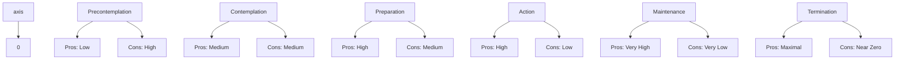

# Self-Efficacy & Decisional Balance

## Description

Self-efficacy and decisional balance are two of the most powerful psychological constructs in behavior change science. Self-efficacy — the belief in one's ability to execute a specific behavior — determines whether a person even attempts change and how persistently they pursue it. Decisional balance — the perceived pros and cons of change — explains why people get stuck, what shifts them forward, and how their motivation changes across stages. Together, these constructs form the motivational engine of the Transtheoretical Model. For developers, understanding these mechanisms explains why confidence matters more than knowledge, why incentives backfire, and how to design systems that build belief.

## Prerequisites

- [The Transtheoretical Model](the-transtheoretical-model.md) — the stage framework that makes sense of shifting efficacy and balance
- [Processes of Change](processes-of-change.md) — the strategies that build efficacy and shift decisional balance

## Table of Contents

- [Self-Efficacy Theory](#self-efficacy-theory)
- [The Four Sources of Self-Efficacy](#the-four-sources-of-self-efficacy)
- [Self-Efficacy Across the Stages](#self-efficacy-across-the-stages)
- [Confidence and Temptation](#confidence-and-temptation)
- [Measurement of Self-Efficacy](#measurement-of-self-efficacy)
- [Decisional Balance Theory](#decisional-balance-theory)
- [The Pros and Cons of Change](#the-pros-and-cons-of-change)
- [Decisional Balance Across Stages](#decisional-balance-across-stages)
- [The Relationship Between Self-Efficacy and Decisional Balance](#the-relationship-between-self-efficacy-and-decisional-balance)
- [Practical Applications](#practical-applications)
- [Common Misconceptions](#common-misconceptions)
- [Learning Tips](#learning-tips)
- [Glossary](#glossary)
- [Quick References](#quick-references)
- [Next Steps](#next-steps)

## Content / Material

### Self-Efficacy Theory

Self-efficacy was introduced by Albert Bandura in 1977 as part of his Social Cognitive Theory. It refers to a person's belief in their capability to organize and execute the courses of action required to produce given attainments. Self-efficacy is not about the skills one has — it is about the judgment of what one can do with whatever skills one possesses.

**The core distinction:**

- Self-efficacy ≠ self-esteem. Self-esteem is a global judgment of self-worth. Self-efficacy is domain-specific. A developer can have high self-efficacy for debugging but low self-efficacy for public speaking. Self-efficacy judgments are tied to specific behaviors in specific contexts.
- Self-efficacy ≠ outcome expectancy. Outcome expectancy is the belief that a given behavior will lead to a given outcome ("If I study daily, I will become a better developer"). Self-efficacy is the belief that one can perform the behavior itself ("I can study daily even when I am tired"). Both are necessary for change, but they are distinct constructs.

**Why self-efficacy matters for behavior change:**

Self-efficacy predicts:
- Whether a person will attempt change (people avoid situations they believe exceed their capabilities)
- How much effort they will invest (high efficacy → more effort)
- How persistent they will be in the face of obstacles (high efficacy → longer persistence)
- How resilient they are after setbacks (high efficacy → faster recovery)
- The level of stress and anxiety they experience in challenging situations (low efficacy → high anxiety)
- The quality of their decision-making (low efficacy → more rumination, worse choices)

In the context of the TTM, self-efficacy is the central mechanism distinguishing those who take action from those who remain in Contemplation. The most consistent finding across behavior change research is that self-efficacy is one of the strongest predictors of successful change.

### The Four Sources of Self-Efficacy

Bandura identified four sources from which self-efficacy beliefs are built. Understanding these sources is critical because it tells us how to build efficacy in ourselves and others.

#### 1. Mastery Experience

**Definition:** Personal success at performing a behavior. This is the most powerful source of self-efficacy because it provides direct, authentic evidence of capability.

**How it works:** Success builds efficacy; failure undermines it. However, the timing matters. Early failures that are overcome can build resilience, but repeated early failures can destroy efficacy before it has a chance to develop. The optimal approach is to structure experiences for success — start with easy tasks, build confidence, then gradually increase difficulty.

**The role of effort attribution:** How a person interprets their success matters. Attributing success to effort ("I succeeded because I tried hard") builds efficacy more than attributing it to luck or ability. Effort-based attribution encourages persistence because it implies that trying harder leads to success.

**Practical examples:**

- A developer who deploys their first microservice successfully gains mastery experience that builds efficacy for future deployments.
- A new runner who completes a 5k gains concrete evidence that "I am a person who runs."
- A team that successfully ships a refactored codebase builds collective efficacy for future refactoring.

**Designing for mastery:**

Mastery experiences should be:
- Challenging but achievable (not too easy, not too hard)
- Structured to produce early wins (to build initial confidence)
- Followed by reflection on what made success possible
- Gradually more difficult (to expand the zone of perceived capability)

#### 2. Vicarious Experience

**Definition:** Observing others successfully perform a behavior, especially people similar to oneself.

**How it works:** Seeing someone like oneself succeed raises the observer's belief that they too can succeed. This is the principle behind modeling, mentorship, and peer learning. The more similar the model is to the observer (in age, ability, background, context), the more powerful the effect.

**The contrast effect:** Observing someone fail can reduce efficacy, especially if the model is perceived as similar to oneself. This is why repeated exposure to failure stories can be demoralizing, while success stories from relatable sources are motivating.

**Practical examples:**

- A junior developer who watches a peer (with similar experience) give a successful tech talk increases their own public speaking efficacy.
- A team that hears about another team's successful migration to a new architecture feels "if they can do it, we can do it."
- Live coding demonstrations, recorded talks, and pair programming all provide vicarious experience.
- Diversity in visible role models matters: underrepresented developers who see people like them succeeding are more likely to believe they can succeed.

**The symbolic dimension:** Vicarious experience also operates through symbolic modeling — reading about success, watching videos, or hearing stories. Even imagined scenarios (visualizing success) can modestly increase efficacy.

#### 3. Social Persuasion

**Definition:** Verbal encouragement from others that one has the capability to succeed.

**How it works:** Persuasion alone is the weakest source of self-efficacy. "You can do it!" without supporting evidence is easily dismissed. However, when combined with mastery experiences and realistic feedback, persuasion can amplify the other sources.

**The Pygmalion effect:** When people who matter to us express confidence in our ability, we tend to internalize that confidence, especially if we respect them. Over time, this can create a self-fulfilling prophecy — high expectations lead to greater effort, which leads to success, which confirms the expectations.

**The opposite effect:** Negative persuasion ("You will never be good at this") is powerfully destructive. A single dismissive comment from an authority figure can undermine efficacy for years.

**Practical examples:**

- A manager who says "I believe you can lead this project. Here is why I think you are ready." — specific, credible persuasion.
- Code review feedback that says "This is a great start, here is how to take it further" builds efficacy. Feedback that says "This is wrong" without guidance destroys it.
- Peer encouragement in communities of practice.

**Requirements for effective persuasion:**

- The persuader must be credible (perceived as knowledgeable and trustworthy).
- The persuasion must be realistic (not wildly optimistic or condescending).
- The persuasion must be tied to specific behaviors and skills, not general personality traits.
- The persuasion should include scaffolding (specific suggestions for improvement).

#### 4. Physiological and Affective States

**Definition:** The bodily and emotional signals that people interpret as indicators of capability.

**How it works:** People read their physiological states as information. A racing heart before a presentation is interpreted either as "I am anxious, I am not capable" or as "I am energized, I am ready." The same physiological state can be interpreted differently depending on the person's learned associations and cognitive framing.

**The stress elevation paradox:** Mild physiological arousal can enhance performance (the Yerkes-Dodson law), but the interpretation matters more than the state itself. People with low self-efficacy interpret arousal as a sign of impending failure. People with high self-efficacy interpret the same arousal as readiness.

**Practical examples:**

- A developer who feels their heart race before a demo interprets it as "I am nervous, I will mess up" if they have low efficacy, or "I am excited, I am going to do well" if they have high efficacy.
- Fatigue is often interpreted as a sign that one cannot continue, when it may be merely a sign that effort is required.
- Pain during exercise is interpreted either as "I am pushing my limits and growing" or as "I am hurting myself, I should stop."

**Reframing physiological states:** Teaching people to reinterpret physiological signals (e.g., "this excitement is energy, not anxiety") modestly improves performance and efficacy. Techniques include:
- Normalizing the physical experience of challenge
- Teaching relaxation and arousal regulation skills
- Framing discomfort as growth, not damage
- Improving physical health (sleep, nutrition, exercise) to improve baseline arousal states

### Self-Efficacy Across the Stages

Self-efficacy follows a predictable trajectory across the stages of change:

| Stage | Self-Efficacy Level | Description |
|-------|---------------------|-------------|
| Precontemplation | Low | Person does not believe they can change, or does not see the point |
| Contemplation | Low to moderate | Person begins to believe change might be possible, but doubts persist |
| Preparation | Moderate | Person has taken small steps and gained some confidence |
| Action | Moderate to high | Success builds efficacy; most vulnerable point for efficacy drops |
| Maintenance | High | Accumulated evidence of success solidifies efficacy |
| Termination | Maximal | No doubt remains about capability |

The critical transition is from Contemplation to Preparation. Self-efficacy must cross a threshold for a person to move from thinking about change to planning for it. This threshold is not absolute — it depends on the behavior, the context, and the person's history.

### Confidence and Temptation

In TTM research, self-efficacy in the context of change is measured through two related but distinct constructs: confidence and temptation.

**Confidence** is the belief that one can engage in the healthy behavior across different challenging situations. It asks: "How confident are you that you can avoid smoking when you are with friends who are smoking?"

**Temptation** is the intensity of the urge to engage in the problem behavior across different challenging situations. It asks: "How tempted would you be to smoke when you are with friends who are smoking?"

**The relationship:**

Confidence and temptation are inversely related but not perfectly so. A person can have moderate confidence and low temptation (stable maintenance), low confidence and high temptation (early Precontemplation), or high confidence and moderate temptation (working Maintenance).

**Temptation across stages:**

| Stage | Temptation Level |
|-------|-----------------|
| Precontemplation | Highest — the behavior is strongly cued and reinforced |
| Contemplation | High — awareness increases but no coping skills are in place |
| Preparation | Moderate — small behavioral steps provide some control |
| Action | High at first, then decreasing — early Action is the most tempting period |
| Maintenance | Declining gradually — asymptotically approaches zero |
| Termination | Zero — no temptation in any situation |

The temptation curve in Action is counterintuitive. Even though a person is actively trying to change, temptation can be initially high because they are surrounded by the same cues and triggers but trying to resist them. Over time, as counterconditioning and stimulus control take effect, temptation declines.

**Situation-specificity:**

Both confidence and temptation are situation-specific. A recovering developer might have high confidence for avoiding checking email on weekends when they are alone but low confidence when their manager sends a late-night message. Understanding the specific situations where confidence is low and temptation is high is essential for relapse prevention planning.

### Measurement of Self-Efficacy

Self-efficacy is not a global trait — it must be measured in relation to specific behaviors in specific situations. TTM research uses several validated measures.

**The Self-Efficacy Questionnaire (SEQ):**

Typical items ask respondents to rate their confidence on a 5-point scale:
- "I am confident I can engage in my exercise program when I am tired."
- "I am confident I can engage in my exercise program when I am under stress."
- "I am confident I can engage in my exercise program when the weather is bad."

**Situation domains:**

Most self-efficacy measures for behavior change assess confidence across a set of challenging situations:
1. Negative affect (when feeling sad, angry, anxious)
2. Social pressure (when others are encouraging the old behavior)
3. Physical discomfort (when in pain, fatigued, craving)
4. Withdrawal symptoms (when experiencing physiological effects of stopping)
5. Positive social situations (when celebrating, relaxing, having fun)
6. Testing personal control (when wanting to test if you can do it "just once")

**The Temptation Scale:**

The same situations are used to assess temptation intensity:
- "How tempted would you be to smoke when you are with friends who are smoking?"
- "How tempted would you be to smoke when you are feeling stressed?"

**Responses:**
- 1 = Not at all tempted
- 2 = Not very tempted
- 3 = Moderately tempted
- 4 = Very tempted
- 5 = Extremely tempted

**A note on measurement precision:**

Self-efficacy judgments are most predictive when they are:
- Specific (not "I can be healthy" but "I can run for 30 minutes at 7 AM on a rainy Tuesday")
- Contextualized ("I can avoid checking email during family dinner")
- Tied to a specific time horizon ("Over the next week, I can...")

### Decisional Balance Theory

Decisional balance originated in Janis and Mann's (1977) conflict theory of decision-making. They proposed that before making any major decision, people weigh the potential gains (pros) against the potential losses (cons). The decision to change is no exception.

**Janis and Mann's original framework:**

They identified four categories of anticipated consequences:
1. Utilitarian gains for self (benefits to oneself)
2. Utilitarian gains for others (benefits to others)
3. Self-approval or disapproval (how the decision affects one's identity and values)
4. Social approval or disapproval (how the decision affects one's standing with others)

The TTM simplified this into two broad categories: pros and cons, operationalized for specific behaviors.

**The decisional balance sheet:**

A conventional tool for working with decisional balance is the "balance sheet" where the person lists:
- Benefits of changing (pros)
- Costs of changing (cons)
- Benefits of staying the same (pros of status quo)
- Costs of staying the same (cons of status quo)

This simple exercise reveals that not changing also has pros (the person is getting something from the behavior) and that changing also has cons (the person will lose something). The art of intervention is not about denying either side but about helping the person see both sides clearly while supporting the side of change.

### The Pros and Cons of Change

**What counts as a pro?**

A pro of changing is any anticipated benefit of adopting the new behavior or eliminating the old one. Examples include:
- Health improvements (reduced risk, better energy)
- Social benefits (better relationships, approval from others)
- Identity alignment (feeling like the person one wants to be)
- Practical benefits (more money, more time, better performance)
- Emotional benefits (less guilt, more pride, less anxiety)

**What counts as a con?**

A con of changing is any anticipated cost or loss associated with change:
- Loss of pleasure or enjoyment (the behavior was enjoyable)
- Loss of coping mechanism (the behavior served a function)
- Social costs (losing friends who share the behavior)
- Effort and discomfort (the change itself is unpleasant)
- Identity disruption (losing a sense of who one is)
- Practical costs (money, time, inconvenience)

**The asymmetry:**

Pros are often abstract and long-term. Cons are concrete and immediate. People overweight immediate consequences relative to delayed ones (temporal discounting). This means that even when the pros objectively outweigh the cons, the subjective experience may favor the status quo. This is why change is hard: the cons of changing are felt now, while the pros are felt later.

**Common pro and con items for exercise adoption:**

| Pros (anticipted benefits) | Cons (anticipated costs) |
|---------------------------|------------------------|
| I would be healthier | It takes too much time |
| I would look better | I am too tired after work |
| I would have more energy | Exercise is uncomfortable |
| I would feel proud of myself | I would have to give up other activities |
| My doctor would be happy | I do not enjoy exercising |
| I would set a good example for my family | I am not athletic enough |

### Decisional Balance Across Stages

The pattern of pro and con scores across stages is one of the most robust findings in TTM research. It has been replicated across dozens of behaviors.

**The critical transition:**

In Precontemplation, the cons of changing are significantly higher than the pros. By Contemplation, the pros have increased to match the cons — creating the ambivalence that defines this stage. In Preparation, the pros have exceeded the cons for the first time. In Action and Maintenance, the pros are substantially higher than the cons.

**The pros-first rule:**

The pros of changing always increase before the cons decrease. This is a consistent empirical finding across behaviors. It means that the first step in moving someone out of Precontemplation is not to attack their reasons for staying the same — it is to build the perceived benefits of change.

**Implications for intervention:**

- For Precontemplators: focus on increasing pros (consciousness-raising about benefits)
- For Contemplators: continue building pros and begin addressing cons (problem-solving barriers)
- For people in Preparation through Maintenance: maintain high pros and work to keep cons from creeping back up

**The "cons dip" in Action:**

One interesting finding is that the cons sometimes increase slightly in early Action. The person is doing the new behavior and discovering that some of their anticipated cons are real — the behavior really is uncomfortable, time-consuming, or inconvenient. This is a vulnerable period where support and reinforcement are critical.

### The Relationship Between Self-Efficacy and Decisional Balance

Self-efficacy and decisional balance do not operate independently. They interact in ways that shape the change process.

**Efficacy as a mediator of balance:**

People with higher self-efficacy tend to perceive more pros and fewer cons. This is because the belief that one can change makes the benefits seem more attainable and the costs seem more manageable. Conversely, low self-efficacy amplifies the perceived cons — if "I cannot do it," then the costs loom large and the benefits seem irrelevant.

**The parallel change:**

As a person progresses through the stages, both constructs shift in parallel:
- Precontemplation: low efficacy, cons dominate
- Contemplation: growing efficacy, pros and cons balanced
- Preparation: moderate efficacy, pros edge ahead
- Action: high efficacy, pros dominate
- Maintenance: very high efficacy, cons minimal

**Testing the relationship:**

Structural equation modeling shows that self-efficacy partially mediates the relationship between stage and decisional balance. In other words, part of the reason people in later stages see more pros is that they believe they can succeed — and that belief changes how they weigh the options.

**The reciprocal relationship:**

The relationship is bidirectional. Success at change (which builds efficacy) also shifts decisional balance (because the person now has firsthand experience that the pros are real and the cons are manageable). And a shift in decisional balance (seeing more pros) can motivate efforts that build efficacy. This creates the potential for either a virtuous cycle (upward spiral) or a vicious cycle (downward spiral).

**Practical example:**

A developer considering a career transition to management:

- Low efficacy view: "I cannot handle the politics. I will hate dealing with people problems."
- High efficacy view: "I can learn the interpersonal skills. The pros — broader influence, mentoring others — are worth the learning curve."

The difference is not in the objective situation but in the subjective assessment that is heavily influenced by efficacy beliefs.

### Practical Applications

**For personal change:**

1. **Assess your current efficacy-decisional balance profile:**
   - Choose a behavior you want to change
   - Rate your confidence (1-10) for maintaining the change in 5 challenging situations
   - List your top 3 pros and top 3 cons of changing
   - Identify: are you stuck in Precontemplation, Contemplation, or somewhere else?

2. **Build efficacy systematically:**
   - Create a mastery ladder: break the behavior into small steps, each building on the last
   - Find a model: identify someone like you who has succeeded and study their path
   - Get specific, credible encouragement from someone whose opinion you trust
   - Reframe physiological signals: "This discomfort is growth, not failure"

3. **Shift decisional balance:**
   - If cons dominate: do not try to deny the cons. Acknowledge them honestly, then ask "what would make the pros large enough to outweigh these cons?"
   - If you are stuck in ambivalence: write out both sides, then add a third column: "What would I do if I believed I could succeed?" This separates feasibility from desirability.
   - Use a "pros journal": each day, write one benefit you have experienced from the change, no matter how small.

**For product and system design:**

1. **Build efficacy into the user experience:**
   - Onboarding should produce early wins (mastery experience).
   - Show users what similar users have achieved (vicarious experience).
   - Use encouraging, specific feedback (social persuasion).
   - Normalize the learning curve (reframing physiological states).

2. **Support decisional balance through features:**
   - Help users articulate their pros and cons (balance sheet tool).
   - Emphasize short-term benefits (to counter temporal discounting).
   - Surface success stories that make pros vivid and concrete.
   - Reduce cons by removing friction, providing onboarding support, and designing for low initial effort.

3. **Avoid common pitfalls:**
   - Do not try to "sell" change to someone whose decisional balance is not ready — you will trigger reactance.
   - Do not overfocus on cons-reduction at the expense of pros-building.
   - Do not assume that once someone acts, their decisional balance is permanently shifted — cons can return if the change does not deliver anticipated benefits.

### Common Misconceptions

**"Self-efficacy is just confidence."**

Confidence is a colloquial term. Self-efficacy is specific, situational, and behavior-focused. A person can be confident in general but have low self-efficacy for a specific behavior. Self-efficacy also has known sources and measurable properties that general confidence does not.

**"Decisional balance is just weighing pros and cons — people do this automatically."**

People do weigh pros and cons automatically, but they do it poorly. They overweigh immediate cons, underweigh delayed pros, ignore the pros of the status quo, and fail to consider the cons of not changing. Structured decisional balance work makes these implicit calculations explicit and challenges systematic biases.

**"Efficacy follows action, not precedes it."**

This is partially true. Efficacy influences action, but action also builds efficacy. The relationship is reciprocal. However, a minimum threshold of efficacy is necessary to initiate action — very few people act without any belief that they can succeed.

**"If people saw the pros clearly, they would change."**

Not necessarily. Seeing the pros clearly is necessary but not sufficient. The person also needs self-efficacy (belief they can do it) and the right processes of change (skills, support, environmental structure). Knowledge does not equal behavior.

**"Decisional balance is static once someone takes action."**

It is not. Pros and cons fluctuate over time. A person in Maintenance may experience new cons (the new behavior becomes boring, social pressures return) or diminishing pros (the benefits plateau). Ongoing self-monitoring of decisional balance is part of effective maintenance.

## Learning Tips

- Create your own efficacy assessment: for a behavior you want to change, list 5 challenging situations and rate your current confidence for each. Now list the source of each confidence rating — was it built through mastery, modeling, persuasion, or physiological states? This reveals your dominant source and any gaps.
- Conduct a decisional balance audit: take paper and draw four quadrants: Pros of Changing, Cons of Changing, Pros of Staying, Cons of Staying. Populate each quadrant honestly. Observe which quadrant is easiest to fill (probably the Cons of Changing or the Pros of Staying). Which is hardest? What does that tell you?
- Practice the Socratic approach: when someone tells you "I cannot do this" (low efficacy), ask: "What makes you say that? Have you ever succeeded at something similar? What would it take for you to feel even slightly more capable?" When someone says "It is not worth it" (con-dominant decisional balance), ask: "What would have to be different for the benefits to seem worth the costs?"
- Study efficacy attribution: observe how you talk about your successes and failures. Do you attribute success to effort (efficacy-building) or ability (fixed)? Do you attribute failure to lack of ability (efficacy-destroying) or insufficient strategy (efficacy-protecting)? Practice shifting your attribution style.
- Track the interaction: for one month, track weekly: (a) your stage for a target behavior, (b) your confidence score for that behavior, (c) your perception of pros vs. cons. Observe how these three move together. Does confidence change first, or decisional balance? When you have a setback, which one drops first?

## Glossary

| Term | Definition |
|------|------------|
| Collective efficacy | The shared belief in a group's capability to organize and execute the actions required to achieve a goal |
| Confidence | In TTM, the belief that one can engage in a healthy behavior across challenging situations |
| Decisional balance | The relative weighing of pros (benefits) and cons (costs) of changing versus maintaining current behavior |
| Mastery experience | Personal success at performing a behavior — the strongest source of self-efficacy |
| Outcome expectancy | The belief that a given behavior will lead to a given outcome |
| Physiological states | Bodily and emotional signals that people interpret as indicators of capability |
| Pros-first principle | The empirical finding that the pros of changing always increase before the cons decrease |
| Self-efficacy | The belief in one's capability to organize and execute the courses of action required to produce given attainments |
| Social persuasion | Verbal encouragement from others that one has the capability to succeed |
| Temptation | In TTM, the intensity of the urge to engage in the problem behavior across challenging situations |
| Temporal discounting | The tendency to overweight immediate consequences relative to delayed ones |
| Vicarious experience | Observing others successfully perform a behavior — the modeling source of self-efficacy |

## Quick References

- Bandura, A. (1977). Self-efficacy: toward a unifying theory of behavioral change. *Psychological Review*, 84(2), 191-215. — The foundational paper introducing self-efficacy theory
- Bandura, A. (1997). *Self-Efficacy: The Exercise of Control*. W. H. Freeman. — The comprehensive book-length treatment by the originator of the theory
- Janis, I. L., & Mann, L. (1977). *Decision Making: A Psychological Analysis of Conflict, Choice, and Commitment*. Free Press. — The original decisional balance framework
- Prochaska, J. O., Velicer, W. F., Rossi, J. S., et al. (1994). Stages of change and decisional balance for 12 problem behaviors. *Health Psychology*, 13(1), 39-46. — The empirical demonstration of the stage-based pattern of pros and cons
- Velicer, W. F., DiClemente, C. C., Prochaska, J. O., & Brandenburg, N. (1985). Decisional balance measure for assessing and predicting smoking status. *Journal of Personality and Social Psychology*, 48(5), 1279-1289. — The original decisional balance measure
- DiClemente, C. C., Prochaska, J. O., & Gibertini, M. (1985). Self-efficacy and the stages of self-change of smoking. *Cognitive Therapy and Research*, 9(2), 181-200. — The classic paper linking self-efficacy to TTM stages
- Maddux, J. E. (1995). Self-efficacy theory: an introduction. In J. E. Maddux (Ed.), *Self-Efficacy, Adaptation, and Adjustment* (pp. 3-33). Springer. — An accessible overview of the theory

## Next Steps

- [Maintenance & Relapse Prevention](maintenance-and-relapse-prevention.md) — how self-efficacy and decisional balance determine long-term success and how to weather the setbacks
