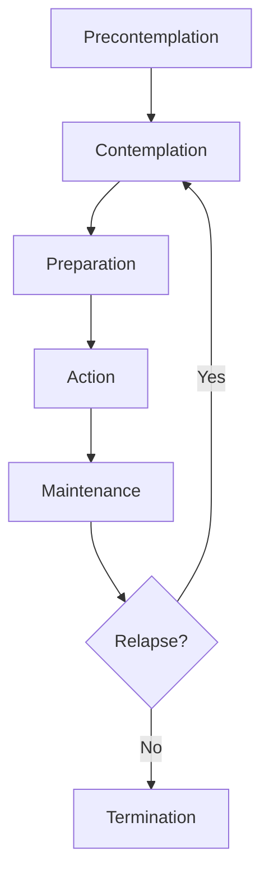

# The Transtheoretical Model

## Description

The Transtheoretical Model (TTM), developed by James O. Prochaska and Carlo C. DiClemente in the late 1970s and early 1980s, is one of the most influential frameworks for understanding intentional behavior change. It conceptualizes change as a process that unfolds across six stages — Precontemplation, Contemplation, Preparation, Action, Maintenance, and Termination — rather than a single binary event. For developers, the TTM offers a structured way to think about user adoption, habit formation, and personal transformation: it explains why people resist change, when they become ready, and how interventions can be tailored to where someone actually is, not where we wish them to be.

## Prerequisites

- [What Is Behavior Change?](intro/what-is-behavior-change.md) — the foundational concepts of the field

## Table of Contents

- [History and Origins](#history-and-origins)
- [Stage 1: Precontemplation](#stage-1-precontemplation)
- [Stage 2: Contemplation](#stage-2-contemplation)
- [Stage 3: Preparation](#stage-3-preparation)
- [Stage 4: Action](#stage-4-action)
- [Stage 5: Maintenance](#stage-5-maintenance)
- [Stage 6: Termination](#stage-6-termination)
- [The Spiral Model of Change](#the-spiral-model-of-change)
- [Decisional Balance Across Stages](#decisional-balance-across-stages)
- [Research Evidence](#research-evidence)
- [Criticisms and Limitations](#criticisms-and-limitations)
- [Why Developers Should Understand the TTM](#why-developers-should-understand-the-ttm)
- [Learning Tips](#learning-tips)
- [Glossary](#glossary)
- [Quick References](#quick-references)
- [Next Steps](#next-steps)

## Content / Material

### History and Origins

The Transtheoretical Model earned its name because it integrates principles from across several psychotherapy systems — Freudian, Skinnerian, Rogerian, and cognitive — hence "transtheoretical" (across theories). Prochaska began the work in 1977 by analyzing 18 major psychotherapy systems to identify common processes of change. He and DiClemente then applied these processes specifically to smoking cessation in the early 1980s, publishing the first stage-based model in 1983.

The original study compared self-changers to therapy-assisted changers and discovered that people passed through a series of stages regardless of the treatment modality. This was a radical finding: it suggested that change follows a natural progression irrespective of therapeutic orientation. The model was later generalized to over 50 behaviors including exercise adoption, weight loss, condom use, sun protection, medication adherence, and organizational change.

The key insight that distinguishes TTM from earlier models is that change is a process, not an event. Someone does not simply stop smoking on Monday morning. They have likely thought about it, considered it, tried before, failed, reconsidered, and restarted the cycle multiple times. The TTM provides the vocabulary and structure to describe where someone is in that cycle.

### Stage 1: Precontemplation

Precontemplation is the stage in which an individual has no intention of changing their behavior in the foreseeable future (typically defined as the next six months). They may be unaware that the behavior is problematic, underaware of its consequences, or have made so many failed attempts at change that they have become demoralized and given up.

**Key characteristics:**

- Reluctance: The person does not want to change because they do not perceive the behavior as a problem. They may enjoy the behavior or see benefits that outweigh costs.
- Rebelliousness: The person resists external pressure to change. They perceive attempts to influence them as threats to autonomy.
- Resignation: The person has tried and failed so many times that they believe change is impossible. They are stuck in hopelessness.
- Rationalization: The person constructs elaborate justifications for the behavior. "I only smoke when I drink." "Everyone I know vapes."

**Research findings:**

In Prochaska and DiClemente's original smoking research, approximately 40% of smokers in the general population were in Precontemplation. Longitudinal studies show that people in Precontemplation have the lowest rates of successful change. They typically use the fewest change processes and deny the severity of the consequences of their behavior.

**Temporal marker:** No intention to change within the next six months.

**Why people get stuck here:**

The decisional balance in Precontemplation is strongly tilted toward the pros of the behavior and against the cons. The person sees far more reasons to continue than to stop. Consciousness-raising activities (education, feedback, confrontation with reality) are the primary method of moving someone from Precontemplation to Contemplation. However, these must be applied carefully to avoid triggering reactance.

**The developer parallel:**

A team that refuses to adopt version control, automated testing, or code review exists in Precontemplation about those practices. They do not see the problem. They rationalize: "We have been fine without it." "That is for big companies." "It slows us down." The typical response — a manager mandating the practice — often triggers rebelliousness. Effective intervention requires consciousness-raising: data on defect rates, stories from teams that adopted the practice, or a personal experience of a costly bug that would have been caught.

**Intervention strategies for Precontemplation:**

- Provide personalized feedback that connects the behavior to consequences the person already cares about
- Use factual information without judgment or pressure
- Offer multiple possible reasons for change without insisting on any one
- Do not preach, confront, or demand change — these trigger reactance
- Focus on raising awareness, not pushing action

**Demoralized Precontemplators:**

A special subtype. These individuals have tried and failed multiple times. Their self-efficacy is extremely low. They may be fully aware of the consequences of their behavior and may even believe they "should" change — but they have concluded that change is impossible for them. The intervention approach is different: they need self-efficacy building (small successes) more than consciousness-raising (they already know).

### Stage 2: Contemplation

Contemplation is the stage in which a person is aware that a problem exists and is seriously thinking about overcoming it, but has not yet made a commitment to take action. The classic marker is ambivalence. Contemplators know the behavior is harmful and may even want to change, but they are not ready to act.

**Key characteristics:**

- Awareness of consequences: The person can articulate why the behavior is problematic.
- Ambivalence: They weigh pros and cons with roughly equal balance. "I know I should quit smoking, but it helps me manage stress."
- Intention without action: They intend to change at some point, but not now.
- Chronic contemplation: Some people remain in Contemplation for years — a state sometimes called "precontemplators with insight."

**The Contemplation gap:**

One of the most robust findings in TTM research is that Contemplation can last for extended periods. The behavioral intention does not automatically translate into action because the cons of the new behavior still outweigh the pros. A smoker in Contemplation acknowledges the health risks but still sees smoking as an effective way to control weight, manage stress, or socialize.

**Temporal marker:** Intends to change within the next six months.

**Movement toward Preparation:**

Movement from Contemplation to Preparation requires a shift in decisional balance. The cons of the old behavior must begin to outweigh the pros. This typically happens through dramatic relief (emotional arousal about negative consequences), self-reevaluation (reassessing one's identity in light of the behavior), and environmental reevaluation (recognizing how the behavior affects others).

**The risk of chronic contemplation:**

Some people cycle between Contemplation and Precontemplation without ever reaching Preparation. They become "professional contemplators" — people who have read every self-help book, attended every workshop, and can explain their problem in great detail, but have never taken sustained action. In this state, consciousness-raising has become an end in itself — a way to feel like one is making progress without actually changing. The antidote is to introduce a deadline or a behavioral experiment: "For the next 30 days, I will do X and observe what happens." This converts contemplation into experiential learning.

### Stage 3: Preparation

Preparation is the stage in which a person intends to take action in the immediate future (usually within the next 30 days) and has taken some behavioral steps in that direction. They may have tried to change in the past year and are planning to try again.

**Key characteristics:**

- Intent to act: The person has set a date or a plan.
- Previous attempts: Most people in Preparation have made at least one serious attempt at change in the past year.
- Small behavioral steps: They may have reduced the behavior, bought a self-help book, joined a gym, or told friends about their intention.
- Self-liberation emerging: There is a growing belief that they can change and a commitment to do so.

**The Preparation paradox:**

Preparation is the least studied and least well-defined stage in TTM. Some critics argue that it is not a discrete stage but rather the tail end of Contemplation or the beginning of Action. However, longitudinal data show that people in Preparation are significantly more likely to take successful action in the next 30 days than those in Contemplation.

**Temporal marker:** Intends to take action within the next 30 days, and has taken some behavioral steps in the past year.

**What preparation looks like:**

For a developer trying to build a morning routine, preparation might mean:
- Setting an alarm for 6:00 AM
- Buying running shoes
- Telling a friend "I am going to start running"
- Laying out workout clothes the night before
- Reading about morning routines, researching optimal habits

These small behavioral commitments signal that the person is not just thinking about change but actively gearing up for it.

**The significance of past attempts:**

One of the strongest predictors of successful action is the presence of a past attempt within the last year. This is counterintuitive — past failure seems like it would predict future failure. But the TTM research shows that people who have tried and failed are more likely to succeed on their next attempt because they have gained experiential knowledge. They know which strategies do not work for them, which situations are high-risk, and what level of commitment is required.

**Intervention strategies for Preparation:**

- Ask the person to state their plan out loud: "What exactly will you do, when, and where?"
- Help them identify and remove potential obstacles
- Encourage them to announce their intention to supportive others (public commitment)
- Break the action into small, concrete steps
- Address anticipated barriers: "What could go wrong, and what will you do if it does?"

### Stage 4: Action

Action is the stage in which individuals have made specific, observable modifications to their behavior or environment within the past six months. This is the most visible stage and the one most people think of when they talk about "change."

**Key characteristics:**

- Overt behavioral modification: The person is actively engaging in the new behavior or abstaining from the old one.
- Time commitment: Significant energy and time are devoted to maintaining the new behavior.
- Social recognition: Others notice the change and offer feedback.
- High risk of relapse: Action is the stage of greatest vulnerability. The rewards of the new behavior have not yet fully materialized, while the old behavior's temptations remain strong.

**The Action fallacy:**

Many change programs and self-help books focus exclusively on Action — as if telling someone to "just do it" is sufficient. The TTM research shows that only about 20% of people who need to change are in the Action stage. Programs aimed at Action fail for the other 80% because they are a mismatch for the person's current stage.

**Temporal marker:** Has changed behavior within the past six months.

**What sustains Action:**

People in Action need high levels of self-efficacy (confidence that they can maintain the change), strong coping skills, and effective stimulus control (removing triggers for the old behavior, adding cues for the new behavior). Reinforcement management (rewarding oneself for the new behavior) and helping relationships (social support) are also critical.

**The Action trap:**

A common pitfall is that successful Action creates overconfidence. The person thinks "I have done it" and stops using the processes that got them there. They may return to environments full of triggers, stop rewarding themselves, or let their social support network fade. This sets the stage for relapse. Effective Action includes a maintenance plan that anticipates this trap.

**Intervention strategies for Action:**

- Reinforce every success with positive feedback
- Help the person identify high-risk situations before they occur
- Teach coping skills for handling cravings, social pressure, and emotional triggers
- Support the development of alternative behaviors (counterconditioning)
- Help the person build environmental supports (stimulus control)
- Monitor for signs of overconfidence or complacency

### Stage 5: Maintenance

Maintenance is the stage in which a person has sustained the behavior change for more than six months and is working to prevent relapse. This is not a static phase — it requires active effort, vigilance, and continued application of change processes.

**Key characteristics:**

- Sustained change: The new behavior has been maintained for at least six months.
- Decreasing temptation: The urge to return to the old behavior diminishes gradually. The curve of temptation decline is not linear — it decreases quickly at first, then asymptotically approaches zero.
- Growing confidence: Self-efficacy increases as the person accumulates evidence of their ability to sustain the change.
- Lifestyle integration: The new behavior becomes increasingly automatic and integrated into the person's daily routine.

**How long does Maintenance last?**

The duration of Maintenance is behavior-dependent. For some behaviors (e.g., quitting heroin), Maintenance may need to last a lifetime. For others (e.g., adopting a new habit like flossing), Maintenance stabilizes relatively quickly. Prochaska originally defined Maintenance as lasting from six months to about 18-24 months, after which a person might enter Termination.

**Temporal marker:** Has sustained the change for more than six months.

**The two phases of Maintenance:**

Research by Rothman (2000) distinguishes between the initiation of change and its maintenance, arguing that different psychological processes govern each. Initiation is driven by outcome expectations (will this change make my life better?), while maintenance is driven by satisfaction with outcomes (is this change delivering what I expected?). This has profound implications for relapse prevention: even if a change was highly effective initially, unrealistic expectations can lead to disappointment and relapse during Maintenance.

### Stage 6: Termination

Termination is the stage in which the person has zero temptation and 100% self-efficacy. The behavior is no longer a threat or a concern. The person exits the cycle of change entirely.

**Key characteristics:**

- Complete confidence: The person has no doubt that they can maintain the change in any situation.
- Zero temptation: They feel no pull toward the old behavior, even under extreme stress or in high-risk situations.
- Behavioral automaticity: The new behavior (or absence of the old behavior) is so deeply ingrained that it requires no conscious effort.
- No relapse risk: The person would not relapse even if they were depressed, anxious, angry, or under extreme social pressure.

**Is Termination achievable?**

This is one of the most debated questions in TTM. Prochaska estimates that only about 20% of successful changers reach Termination for most behaviors. For highly addictive behaviors (e.g., smoking, heroin), Termination may be rare or unattainable. Many former smokers report occasional cravings years after quitting. For other behaviors (e.g., dietary changes, exercise), Termination may be more common.

**The Termination debate in context:**

The debate over Termination reflects a deeper question about the nature of behavior change. Is it realistic to expect that a person can reach a state where they are immune to relapse? Or is the most adaptive stance one of "eternal vigilance" — accepting that relapse remains possible and preparing for it indefinitely?

Proponents of Termination argue that without a clear endpoint, behavior change becomes a lifelong sentence rather than a liberation. Critics argue that the belief in "cure" can be dangerous: if a person believes they have terminated, they may stop using the processes that maintain change, and this complacency creates the conditions for relapse.

A pragmatic middle ground: aim for a state where maintenance requires minimal effort and the risk of relapse is low, but accept that the possibility of relapse never fully disappears. This is not Termination in the strict sense, but it is close enough for practical purposes. The label matters less than the outcome.

**Operational definition:**

Some researchers operationalize Termination as 5+ years of continuous maintenance. Others argue that Termination cannot be defined temporally because even decades of maintenance do not guarantee immunity from relapse. The distinction between Maintenance and Termination remains conceptually fuzzy.

### The Spiral Model of Change

Prochaska and DiClemente originally depicted the stages as linear (a straight progression from Precontemplation to Termination). They soon realized this was inaccurate. Most people do not move through the stages in a straight line. Instead, they cycle and recycle through the stages several times before achieving long-term maintenance.

The spiral model depicts change as a spiral upward: people progress from Precontemplation to Contemplation to Preparation to Action, then relapse (fall back to an earlier stage), and then recycle through the process again — but each time at a higher level of learning. They do not return to the same point where they started. They have gained insight, built coping skills, and increased self-awareness.

This spiral model has profound implications for how we interpret relapse. Relapse is not failure — it is recycling. Each cycle through the stages teaches new lessons and builds new skills. People who have relapsed multiple times may actually be closer to successful change than first-time attempters because they have accumulated more practical knowledge about what works and what does not.

### Decisional Balance Across Stages

The TTM adopts the decisional balance construct from Janis and Mann's (1977) conflict theory of decision-making. Decisional balance refers to the relative weighing of pros (benefits) and cons (costs) of changing versus staying the same.

**Stage-based shifts in decisional balance:**

| Stage | Pros of Changing | Cons of Changing | Ratio |
|-------|-----------------|------------------|-------|
| Precontemplation | Low | High | Pros << Cons |
| Contemplation | Medium | Medium | Pros ≈ Cons |
| Preparation | High | Medium | Pros > Cons |
| Action | High | Medium-Low | Pros >> Cons |
| Maintenance | High | Low | Pros >>> Cons |
| Termination | High | Near zero | Pros >>>>> Cons |

The critical transition occurs between Precontemplation and Contemplation. Longitudinal studies show that the pros of changing increase by approximately one standard deviation between these stages, while the cons decrease by approximately half a standard deviation. The pros tend to increase first (opening the person's awareness to the possibility of change), followed later by a decrease in cons (as the person begins to see the old behavior as less beneficial).

**The pros-first principle:**

In over 48 studies across different behaviors, the pros of changing always increase before the cons decrease. This has a practical implication: early-stage interventions should focus on increasing the perceived benefits of change rather than attacking the perceived benefits of the status quo. Trying to convince a Precontemplator that their behavior is harmful (attacking cons) is less effective than helping them see what they would gain by changing (building pros).

### Research Evidence

The TTM has been applied to over 100 health behaviors and tested in hundreds of studies. The evidence base is substantial, though not without controversy.

**Smoking cessation:**

The original application remains the most studied. A meta-analysis of 34 studies found that stage-matched interventions (where the message is tailored to the person's current stage) are significantly more effective than non-stage-matched interventions. However, effect sizes are modest — about a 20-30% increase in quit rates compared to standard treatment.

**Exercise adoption:**

Research by Marcus and colleagues found that TTM-based exercise interventions produce consistent but modest improvements in exercise adoption and maintenance. A key finding is that stage-matched interventions increase the likelihood that people will move from Contemplation to Action, but they are less effective at preventing relapse once Action is achieved.

**Other behaviors:**

TTM has shown effectiveness for: dietary fat reduction, stress management, mammography screening, sun protection, condom use, medication adherence, alcohol reduction, and organizational change. The effect sizes vary widely by behavior and population.

**The TTM in clinical populations:**

Studies with clinical populations (people diagnosed with addiction disorders, obesity, or chronic illness) show a different stage distribution than general population studies. Clinical populations tend to have higher proportions in the later stages (Preparation, Action) because they have been referred for treatment and are thus further along. However, being in a treatment program does not guarantee readiness — many treatment attendees are actually in Precontemplation or Contemplation, pushed into treatment by family, employers, or the legal system rather than by their own motivation.

**Effect sizes and practical significance:**

A meta-analysis by Norcross, Krebs, and Prochaska (2011) found that stage-matched interventions produce a weighted effect size of approximately d = 0.30 compared to non-stage-matched interventions. This is a small-to-medium effect by conventional standards. In practical terms, it means that for every 100 people receiving a stage-matched intervention, approximately 20-30 more will successfully change than if they received a one-size-fits-all intervention. This is meaningful at the population level but modest at the individual level.

**Long-term outcomes:**

Studies with long-term follow-up (12-24 months) show that the effects of TTM-based interventions persist but tend to diminish over time. The strongest predictor of long-term success is not the intervention itself but whether the person reaches Action during the intervention period. People who reach Action have approximately 40-60% probability of maintaining the change at 12 months, depending on the behavior.

**Stage distribution in populations:**

A robust finding is that across multiple behaviors, the stage distribution follows a consistent pattern:

- Precontemplation: ~40% of those needing change
- Contemplation: ~40%
- Preparation: ~20%
- Action: A small fraction at any given time
- Maintenance: Varies by behavior

This means that for any given behavior, roughly 80% of the target population is not ready for action-oriented interventions. This is the strongest argument for stage-matched approaches.

### Criticisms and Limitations

The TTM is not without its detractors. Several major criticisms have emerged.

**The stage boundary problem:**

Critics argue that the boundaries between stages are arbitrary. Where exactly does Contemplation end and Preparation begin? The temporal markers (six months, 30 days) were chosen somewhat arbitrarily and have not been empirically validated. Some researchers argue for a continuous model of readiness rather than discrete categories.

**Measurement difficulties:**

Stage classification relies on self-report questionnaires that may not accurately capture a person's actual readiness. People may over-report their stage due to social desirability bias, or they may misclassify themselves because they do not understand the questions.

**The artificial category argument:**

Referred to as the "stage vs. continuum" debate. Critics (notably Bandura, Sutton, and West) argue that the stages are artificial categorizations imposed on what is actually a continuous dimension of readiness. They contend that a simple continuous measure of intention (e.g., "How likely are you to change in the next month on a scale of 1-10?") captures as much predictive power as stage classification.

**Weak predictive validity:**

Some studies have found that stage membership at baseline does not strongly predict future behavior change. A meta-analysis by Sutton (2001) found that the TTM accounted for only modest amounts of variance in behavior change outcomes. Contemplators were only slightly more likely to change than Precontemplators.

**Lack of causal evidence:**

While there is strong evidence that people in different stages use different processes, there is weaker evidence that stage-matched interventions cause people to progress. The observed correlation between stage and process use could be explained by other variables.

**Does stage matching matter?**

The most serious criticism is the practical question: do stage-matched interventions outperform one-size-fits-all interventions? While many studies show positive effects, the effect sizes are modest, and some high-quality randomized controlled trials have found no advantage for stage-matched approaches. The evidence is strongest for smoking cessation and weakest for other behaviors.

**The practical question:**

For developers evaluating whether to use the TTM: the model is best understood as a heuristic framework, not a precise predictive tool. Its value lies in:
1. Shifting the intervention focus from Action to the person's actual readiness
2. Providing a shared language for discussing readiness and change
3. Guiding the selection of appropriate change processes at each stage
4. Destigmatizing relapse by normalizing it as part of the change cycle
5. Offering a systematic framework for tailoring interventions

It is less useful as a precise measurement tool or a basis for strict stage-based algorithms. The stage boundaries are fuzzy, the measurement is imperfect, and the predictive power is modest. But as a conceptual framework for understanding why people change (or do not), it remains one of the most valuable models available.

**Response to criticisms:**

Prochaska and colleagues acknowledge many of these limitations but argue that:
1. The stage boundaries are useful heuristics that guide intervention design.
2. The modest effect sizes reflect the difficulty of behavior change generally, not a weakness of TTM specifically.
3. Even if stages are artificial, the approach is more nuanced than simple continuous measures.
4. The TTM is not designed to be the sole framework but should be integrated with other models.

### Why Developers Should Understand the TTM

The TTM has direct relevance to software development, product design, team leadership, and personal productivity.

**Product adoption as behavior change:**

Users do not adopt new tools overnight. They move through stages. A user in Precontemplation about adopting a new code editor needs different messaging than one in Preparation. Early-stage users need to be made aware of the benefits (consciousness-raising), while late-stage users need implementation intention support (self-liberation).

**Feature adoption and onboarding:**

Most onboarding experiences are Action-stage interventions. They assume the user is ready to engage. But many users are in Contemplation — they have not yet committed. Onboarding flows that assume readiness may cause drop-off. Better: meet users where they are. Offer a low-commitment preview (Contemplation), then gradually increase commitment.

**Team and organizational change:**

Developers often advocate for new workflows, tools, or practices. The TTM explains why a team may resist: they are in Precontemplation or Contemplation. Pushing for Action before they are ready creates reactance. Instead, raise consciousness about the problem (provide data), increase the pros of the new approach (demonstrate benefits), and allow gradual movement through stages.

**Personal development:**

The TTM destigmatizes relapse. A developer who commits to a new learning routine but stops after two weeks has not failed — they have recycled. The insight gained from the attempt can inform the next cycle. Understanding the stage model reduces shame and promotes persistence.

**Practical takeaways:**

- Change is a process, not an event.
- Most people who need to change are not ready for action.
- Action-stage interventions fail for 80% of the target population.
- Relapse is recycling, not failure.
- Different processes work at different stages.

## Learning Tips

To deeply learn the TTM, try these exercises:

- Map yourself: choose a behavior you are trying to change (or should change) and identify your current stage. Then ask: what would move me to the next stage?
- Map someone else: think of a person in your life who is "stuck." What stage are they in? What would a stage-matched intervention look like?
- Study the spiral: recall a past change attempt that ended in relapse. What did you learn from that recycling that you now know that you did not know before?
- Apply to product: choose a feature in a product you use or build. Map the stages of adoption and identify what would move a user from one stage to the next.
- Read the original: Prochaska and DiClemente's 1983 paper is one of the most cited in health psychology. The writing is clear and the methodology is accessible.

## Glossary

| Term | Definition |
|------|------------|
| Action | The stage in which individuals have made specific, observable modifications to their behavior within the past six months |
| Ambivalence | The state of simultaneously wanting and not wanting to change — the defining experience of Contemplation |
| Chronic contemplation | A state in which a person remains stuck in Contemplation for extended periods, aware of the problem but never committing to action |
| Consciousness-raising | A change process involving increased awareness of the causes, consequences, and alternatives of a behavior |
| Contemplation | The stage in which a person is aware of a problem and thinking about change but has not committed to action |
| Decisional balance | The relative weighing of pros and cons of changing versus maintaining current behavior |
| Dramatic relief | A change process involving emotional arousal about the negative consequences of the behavior |
| Environmental reevaluation | A change process involving recognition of how one's behavior affects others |
| Maintenance | The stage in which behavior change has been sustained for more than six months and relapse prevention is active |
| Precontemplation | The stage in which a person has no intention of changing behavior in the foreseeable future |
| Preparation | The stage in which a person intends to take action within the next 30 days and has taken some behavioral steps |
| Reactance | Psychological resistance experienced when one's freedom or autonomy is threatened |
| Recycling | The process of moving through stages again after relapse, ideally with greater insight each time |
| Relapse | The return to an earlier stage of change after having progressed |
| Self-efficacy | Confidence in one's ability to perform a specific behavior in specific situations |
| Self-liberation | A change process involving the belief that one can change and the commitment to act on that belief |
| Self-reevaluation | A change process involving reassessment of one's identity and values in relation to the behavior |
| Spiral model | The depiction of change as a spiral upward, where relapsers recycle through stages at higher levels of learning |
| Stage-matched intervention | An intervention tailored to a person's current stage of change |
| Termination | The stage in which a person has zero temptation and complete confidence — no relapse risk remains |
| Transtheoretical Model | An integrative framework describing intentional behavior change across six stages, drawing on multiple psychotherapy theories |

## Quick References

- Prochaska, J. O., & DiClemente, C. C. (1983). Stages and processes of self-change of smoking: toward an integrative model of change. *Journal of Consulting and Clinical Psychology*, 51(3), 390-395. — The foundational paper introducing the TTM
- Prochaska, J. O., & Velicer, W. F. (1997). The transtheoretical model of health behavior change. *American Journal of Health Promotion*, 12(1), 38-48. — A comprehensive review of the model and its applications
- Prochaska, J. O., DiClemente, C. C., & Norcross, J. C. (1992). In search of how people change: applications to addictive behaviors. *American Psychologist*, 47(9), 1102-1114. — The classic spiral model paper
- Sutton, S. (2001). Back to the drawing board? A review of applications of the transtheoretical model to substance use. *Addiction*, 96(1), 175-196. — A key critical review
- West, R. (2005). Time for a change: putting the Transtheoretical (Stages of Change) Model to rest. *Addiction*, 100(8), 1036-1039. — A prominent critique arguing for alternative models
- Marcus, B. H., & Forsyth, L. H. (2009). *Motivating People to Be Physically Active*. Human Kinetics. — Practical application of TTM to exercise promotion
- DiClemente, C. C. (2018). *Addiction and Change: How Addictions Develop and Addicted People Recover*. Guilford Press. — A comprehensive book-length treatment by the co-developer

## Next Steps

- [Processes of Change](processes-of-change.md) — the 10 processes that drive movement through the stages
- [Self-Efficacy & Decisional Balance](self-efficacy-and-decisional-balance.md) — confidence, temptation, and the weighing of pros and cons across stages
