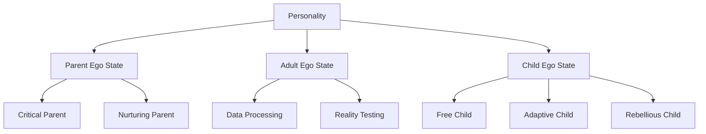
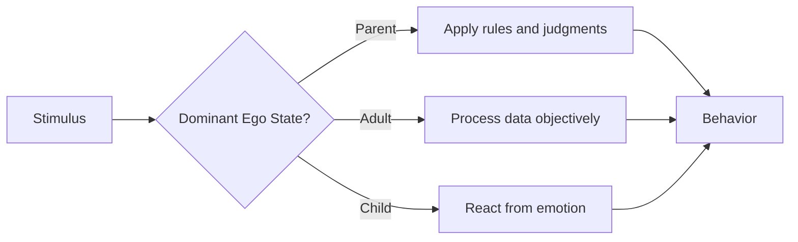

# Ego State Theory

## Description

Ego state theory, developed by Eric Berne in the 1950s and 1960s, provides a structured model for understanding how the personality is organized into distinct internal states — each carrying its own thoughts, feelings, and behavioral patterns. Originally part of transactional analysis, the model has since been expanded by Watkins and Watkins, John, and others into a broader framework with clinical, developmental, and self-awareness applications. For developers, ego state theory offers a practical vocabulary for understanding internal dialogue, recognizing which psychological mode is active in any given moment, and developing the capacity to choose response over reaction. This document presents the theory comprehensively: its origins, its structural model, its clinical applications, and its practical utility for self-awareness and interpersonal effectiveness.

## Prerequisites

- [What Is Cognitive Psychology?](intro/what-is-cognitive-psychology.md) — the broader study of mental processes and internal states
- [Self-Discovery](../../level-up/resilience/self-discovery.md) — the narrative framework for internal self-awareness

## Table of Contents

- [Origins of Ego State Theory](#origins-of-ego-state-theory)
- [What Is an Ego State?](#what-is-an-ego-state)
- [The Structural Model](#the-structural-model)
- [Parent Ego State](#parent-ego-state)
- [Adult Ego State](#adult-ego-state)
- [Child Ego State](#child-ego-state)
- [Ego State Dynamics](#ego-state-dynamics)
- [Ego State Transactions](#ego-state-transactions)
- [Ego State Pathology](#ego-state-pathology)
- [The Watkins Model: Structural Dissociation](#the-watkins-model-structural-dissociation)
- [Ego States and Neuroscience](#ego-states-and-neuroscience)
- [Ego States for Developers](#ego-states-for-developers)
- [Therapeutic Applications](#therapeutic-applications)
- [Self-Assessment: Mapping Your Ego States](#self-assessment-mapping-your-ego-states)
- [Learning Tips](#learning-tips)
- [Glossary](#glossary)
- [Quick References](#quick-references)
- [Next Steps](#next-steps)

## Content / Material

### Origins of Ego State Theory

Eric Berne developed ego state theory in the late 1950s as part of his broader framework of transactional analysis. Berne was trained as a psychoanalyst but became dissatisfied with classical Freudian structural theory — the id, ego, and superego — which he considered too abstract to be clinically useful. He wanted a model that was observable, testable, and practically applicable in the therapeutic setting.

Berne's key insight was that the personality is not a single, unified agent but a collection of distinct states, each of which can be observed and described. He borrowed the term "ego state" from Federn (1952) and Paul Federn's student Weiss, but gave it a precise operational definition: an ego state is a coherent system of thoughts, feelings, and behaviors that corresponds to a consistent pattern of functioning, observable in real time.

The three-state model — Parent, Adult, Child — was Berne's simplification of the Freudian structural model. Where Freud's id, ego, and superego were theoretical constructs inferred from analysis, Berne's ego states were observable phenomena. You could see someone shifting from Adult to Parent in a conversation. You could observe the behavioral, verbal, and physiological markers of each state. The model was designed to be practical, not theoretical.

Berne's original formulation has been refined over the decades. The relational school expanded the model to include more ego states. The Watkins and Watkins model (1997) introduced structural dissociation — the idea that ego states can range from normal personality states to dissociated states associated with trauma. The contemporary field recognizes the original three-state model as a useful simplification of a more complex reality.

### What Is an Ego State?

An ego state is a total pattern of experience and behavior. It is not a thought, not a feeling, not a behavior in isolation. It is the entire package — the thoughts, feelings, physiological responses, behavioral impulses, and relational patterns that activate together as a unit.

Berne offered three criteria for identifying an ego state:

1. **Behavioral consistency.** The thoughts, feelings, and behaviors within an ego state form a coherent, internally consistent pattern. The Critical Parent is consistently critical. The Free Child is consistently spontaneous. There is no contradiction within a single state.

2. **Homogeneity.** Each ego state is qualitatively distinct from the others. The Parent state is qualitatively different from the Adult state, which is qualitatively different from the Child state. The differences are not just in degree but in kind.

3. **Boundary definition.** Ego states have boundaries that can be more or less flexible or rigid. In healthy functioning, the boundaries are flexible — the person can shift between states as the situation demands. In pathological functioning, the boundaries are rigid — the person is stuck in one state and cannot access the others.

The key distinction is between ego states as parts of a normal personality and ego states as dissociated fragments. In the standard model, every person has Parent, Adult, and Child states, and the capacity to shift between them is healthy. In the Watkins model, trauma can cause ego states to become so rigidly separated that they function as independent identities — each with its own name, memories, and sense of self. This is structural dissociation, and it represents the pathological end of the ego state spectrum.

### The Structural Model

Berne's structural model describes the personality as composed of three primary ego states. Each state has a developmental origin, a characteristic set of thoughts and feelings, and a functional role in the personality system.

The Parent ego state is a set of feelings, attitudes, and behaviors copied from parents or parent figures. It is not the parent. It is the internalized version of the parent — the collection of rules, judgments, nurturing behaviors, and attitudes that were absorbed during childhood. Everyone carries an internalized parent, even those who had absent or dysfunctional parents, because the child also absorbs the absence or dysfunction as a rule.

The Adult ego state is a set of feelings, attitudes, and behaviors that are oriented toward the objective assessment of reality. It processes information, weighs evidence, makes decisions, and tests hypotheses. The Adult is the closest thing to a rational agent within the personality system. It does not carry rules or emotions from the past — it responds to the present.

The Child ego state is a set of feelings, attitudes, and behaviors that are replayed from childhood. It is the internalized child — the emotional, creative, spontaneous, and sometimes fearful part of the personality. The Child carries the feelings of early experience: joy, anger, fear, sadness, curiosity, and the strategies that were developed to cope with the environment.

The three states are not hierarchical in the sense that one is "correct" and the others are "incorrect." All three serve essential functions. The Parent provides standards and care. The Adult provides reality testing. The Child provides emotion and creativity. The problem is not having these states. The problem is when one state dominates to the exclusion of the others, or when the boundaries between states are so rigid that the person cannot shift flexibly.

### Parent Ego State

The Parent ego state contains two primary functional modes: the Critical Parent and the Nurturing Parent.

**The Critical Parent** (also called the Controlling Parent) carries the rules, prohibitions, judgments, and standards absorbed from authority figures. It is the internal voice that says "You should," "You must," "That is wrong," "You are not good enough." The Critical Parent is the source of guilt, shame, and moral judgment. It is not inherently destructive — it provides necessary structure and boundaries. But when it dominates, it becomes the inner critic — a relentless source of self-attack.

The Critical Parent's content is directly copied from external authority figures. The specific rules vary across individuals, but the form is universal: the parent who said "Do not be lazy" becomes the internal voice that attacks laziness. The parent who said "Do not make mistakes" becomes the internal voice that attacks imperfection. The parent who said "Be strong" becomes the internal voice that attacks vulnerability.

**The Nurturing Parent** (also called the Nourishing Parent) carries the care, support, protection, and encouragement absorbed from caring authority figures. It is the internal voice that says "It will be okay," "You did your best," "I am here for you." The Nurturing Parent is the source of self-compassion, empathy, and emotional support. When it dominates, it can become overprotective — preventing the person from taking necessary risks or facing necessary challenges.

The Nurturing Parent's content comes from the caregivers who provided comfort, safety, and encouragement. It is the internalized version of the parent who held you when you cried, who celebrated your achievements, who made you feel safe. Even in the absence of nurturing caregivers, some individuals develop a Nurturing Parent through other relationships — teachers, mentors, therapists, or friends who provided the care that the original caregivers did not.

The balance between Critical and Nurturing Parent determines the quality of the internal environment. A person with a strong Nurturing Parent and a moderate Critical Parent has a supportive but structured internal world. A person with a strong Critical Parent and a weak Nurturing Parent has a harsh, punitive internal world. The goal of ego state work is often to strengthen the Nurturing Parent and moderate the Critical Parent.

### Adult Ego State

The Adult ego state is the reality-testing component of the personality. It processes information objectively, without the distortion of parental rules or childhood emotions. The Adult asks: "What are the facts? What are the probabilities? What is the most effective response?"

The Adult has several distinctive characteristics:

**Data processing.** The Adult gathers information, weighs evidence, and makes decisions based on probability rather than emotion or rules. It is the part of you that debugs code — methodically, systematically, without emotional attachment to any particular outcome.

**Boundary testing.** The Adult checks the claims of the Parent and Child against reality. The Parent says "You must be perfect." The Adult asks "Is perfection actually required here, or is competence sufficient?" The Child says "This will be a disaster." The Adult asks "What is the actual probability of disaster, based on evidence?"

**Autonomy.** The Adult is the only ego state that is not borrowed from someone else. The Parent is copied from parents. The Child is replayed from childhood. The Adult is original — your own genuine response to the present situation. This is why the Adult is considered the healthiest state for decision-making: it is the only state that is fully yours.

**Temporal orientation.** The Parent lives in the past (the rules of childhood). The Child lives in the past (the feelings of childhood). The Adult lives in the present. It processes what is happening now, not what happened then. When someone says "You always make mistakes," the Adult evaluates the claim on current evidence rather than reacting to the childhood fear of criticism.

The Adult is not always active. In fact, most people spend relatively little time in pure Adult functioning. The Parent and Child are older, more practiced, and more automatic. The Adult requires deliberate activation — the conscious decision to set aside rules and emotions and process the situation as it is. This is why ego state awareness is valuable: it allows you to notice when you have left the Adult and return to it intentionally.

### Child Ego State

The Child ego state is the most complex of the three because it contains multiple sub-states, each with its own developmental origin and emotional character.

**The Free Child** (also called the Natural Child) carries the spontaneous, creative, emotional, and pleasure-seeking aspects of the personality. It is the part of you that feels joy without permission, expresses anger without censorship, and plays without guilt. The Free Child is the source of creativity, spontaneity, humor, and intimacy. When it dominates, it can become impulsive, irresponsible, or emotionally overwhelming.

The Free Child's content comes from early childhood, before socialization imposed its constraints. It is the toddler who dances without self-consciousness, who cries without apology, who explores with boundless curiosity. Adults who have strong access to their Free Child tend to be creative, emotionally expressive, and playful. Adults who have suppressed their Free Child tend to be rigid, controlled, and emotionally flat.

**The Adaptive Child** carries the behaviors and attitudes developed in response to the demands of authority figures. It is the part of you that complies, apologizes, seeks approval, and avoids conflict. The Adaptive Child is the source of people-pleasing, perfectionism, and the compulsion to be good. When it dominates, it produces the person who cannot say no, who takes responsibility for others' emotions, and who defines worth through performance.

The Adaptive Child's content comes from the specific demands of the child's environment. If the environment demanded achievement, the Adaptive Child becomes the Achieving Child — driven, competitive, and terrified of failure. If the environment demanded obedience, the Adaptive Child becomes the Compliant Child — agreeable, passive, and unable to assert needs. If the environment was unpredictable, the Adaptive Child becomes the Hypervigilant Child — constantly scanning for danger and adjusting behavior to maintain safety.

**The Rebellious Child** carries the resistance, defiance, and anger that were suppressed by the demands of authority. It is the part of you that says "No" — not because saying no is strategically useful, but because the internalized demand to comply has generated an equally strong internal demand to resist. The Rebellious Child is the source of counter-dependency, opposition, and the refusal to be controlled. When it dominates, it produces the person who resists everything — including things that would benefit them.

The Rebellious Child's content is reactive, not original. It is defined by what it opposes, not by what it wants. The Rebellious Child who refuses to follow rules is still controlled by the rules — it defines itself in relation to them. True autonomy comes from the Adult, not from the Rebellious Child.

### Ego State Dynamics

Ego states do not exist in isolation. They interact dynamically, and the quality of a person's functioning depends on the flexibility of these interactions.

**Ego state dominance.** At any given moment, one ego state is dominant — it controls the person's thoughts, feelings, and behavior. The dominant state determines the person's response to any situation. A person dominated by the Critical Parent will respond to a mistake with self-punishment. A person dominated by the Adaptive Child will respond with self-blame and apology. A person dominated by the Adult will respond with problem-solving.

**Ego state flexibility.** Healthy functioning requires the ability to shift between ego states as the situation demands. A parent playing with a child needs the Free Child. A manager giving difficult feedback needs the Critical Parent (in its constructive form). A person processing a complex decision needs the Adult. The more flexible the ego state boundaries, the more adaptive the functioning.

**Ego state conflict.** When two ego states are active simultaneously and their demands are contradictory, internal conflict results. The Parent says "You should work." The Child says "You want to play." The Adult mediates: "Work for two hours, then play for one." This internal negotiation is normal and healthy. When the negotiation fails — when one state overrides the others completely — the person becomes rigid, impulsive, or compulsive.

**Ego state exclusion.** When a person cannot access a particular ego state, that state is excluded. A person who has excluded the Nurturing Parent cannot offer themselves comfort. A person who has excluded the Free Child cannot experience spontaneous joy. A person who has excluded the Adult cannot make reality-based decisions. Exclusion is the most common form of ego state pathology and the primary target of therapeutic intervention.

### Ego State Transactions

Berne's transactional analysis focuses on the interactions between people's ego states. A transaction is the exchange of ego states between two people — one person's ego state triggers a response from a specific ego state in the other person.

**Complementary transactions** occur when the ego states match. The Parent-to-Child transaction is the most common: one person's Critical Parent triggers the other person's Adaptive Child. Example: a manager says "This code is sloppy" (Critical Parent), and the developer responds "I am sorry, I will fix it" (Adaptive Child). This transaction is complementary because it can continue indefinitely — each response reinforces the other's state.

**Crossed transactions** occur when the ego states mismatch. One person speaks from Adult, but the other responds from Child. Example: a colleague says "What time is the meeting?" (Adult), and the developer responds "Why are you always asking me things?" (Rebellious Child). The crossed transaction disrupts communication because the expected ego state pairing has been violated.

**Ulterior transactions** occur when the surface message is from one ego state but the hidden message is from another. Example: a developer says "That is an interesting approach" (Adult surface) while implying "That is a terrible idea" (Critical Parent hidden). Ulterior transactions are the mechanism of manipulation, passive aggression, and double binds.

Understanding transactions allows developers to recognize communication patterns in teams, identify when they have been triggered into a non-Adult state, and choose more effective response strategies.

### Ego State Pathology

When ego state functioning becomes rigid, the result is characteristic patterns of dysfunction:

**Critical Parent dominance.** The internal critic becomes the dominant voice. The person is unable to offer themselves comfort, unable to recognize their own achievements, and unable to set realistic standards. This manifests as chronic self-criticism, perfectionism, burnout, and depression.

**Adaptive Child dominance.** The person becomes permanently compliant, unable to assert needs, unable to set boundaries, and unable to make decisions without external approval. This manifests as people-pleasing, codependency, and the loss of personal identity.

**Excluded Adult.** The person loses access to reality testing. They make decisions based on rules (Parent) or emotions (Child) without the mediating influence of objective assessment. This manifests as impulsivity, magical thinking, or rigid adherence to rules that no longer apply.

**Frozen Free Child.** The person suppresses all spontaneous emotion, creativity, and pleasure. They become mechanical, controlled, and emotionally flat. This manifests as anhedonia, creative blocks, and the inability to experience joy.

These patterns are not diagnoses. They are descriptions of ego state functioning that can be modified through awareness and deliberate practice. The goal of ego state work is not to eliminate any state but to restore flexibility — the ability to access any state as the situation demands and to maintain Adult dominance for decision-making.

### The Watkins Model: Structural Dissociation

Watkins and Watkins (1997) expanded ego state theory to address dissociation — the fragmentation of personality that occurs in response to trauma. In their model, ego states exist on a spectrum from normal personality states to dissociated states that function as separate identities.

**Apparently Normal Part (ANP).** The part of the personality that manages daily life — goes to work, maintains relationships, handles routine tasks. The ANP is typically Adult-dominated and may suppress awareness of the emotional parts to maintain functioning.

**Emotional Part (EP).** The part of the personality that carries the trauma-related emotions, memories, and responses. The EP is typically stuck in a Child state, reliving the traumatic experience. It is dissociated from the ANP, meaning the ANP may have little or no awareness of the EP's existence.

In normal functioning, ANP and EP coexist with flexible boundaries. The person can access trauma-related material when they choose to process it and can return to daily functioning afterward. In pathological functioning, the boundary is rigid: the ANP cannot access the EP's material, and the EP cannot be integrated into the personality system.

The Watkins model has important implications for therapy: the goal is not to eliminate dissociated states but to facilitate communication and integration between them. Each ego state has valuable information, and integration — not elimination — is the path to health.

### Ego States and Neuroscience

Contemporary neuroscience provides biological grounding for ego state theory. The prefrontal cortex, which mediates executive function, reality testing, and impulse control, corresponds approximately to Adult ego state functioning. The limbic system, which processes emotion and threat, corresponds to Child ego state functioning. The anterior cingulate cortex, which mediates conflict monitoring and error detection, plays a role in mediating between competing ego states.

Neuroimaging studies have shown that different ego states activate different neural networks. The Parent state activates networks associated with moral reasoning and social norms. The Adult state activates networks associated with analytical processing. The Child state activates networks associated with emotional memory and automatic response patterns. These are not metaphors — they are observable differences in brain activation patterns that correspond to the theoretical model.

The Default Mode Network (DMN), which is active during self-referential processing and mind-wandering, may correspond to the automatic switching between ego states that occurs during daily life. When the DMN is active, the person is unconsciously cycling through Parent, Adult, and Child states in response to internal stimuli. When the DMN is suppressed — as during focused task performance — one ego state (typically the Adult) remains dominant.

The implication for self-awareness practice: mindfulness meditation, which reduces DMN activity, may help increase the time spent in Adult ego state functioning by reducing the automatic cycling triggered by internal stimuli. This is consistent with the evidence that mindfulness improves emotional regulation and decision-making.

### Ego States for Developers

Ego state theory has specific applications in the developer context:

**Debugging your internal dialogue.** When you encounter a difficult problem, notice which ego state is speaking. The Critical Parent says "You should know this." The Adaptive Child says "I am not smart enough for this." The Adult says "What information do I need, and where can I find it?" Identifying the dominant ego state allows you to redirect toward Adult functioning.

**Code review interactions.** When you receive critical feedback, notice which ego state is triggered. The Critical Parent amplifies the criticism: "They are right — you are incompetent." The Adaptive Child absorbs the criticism: "I am sorry, I will do better." The Adult evaluates the feedback: "Three points are valid; one is subjective. I will address the valid points." Choosing the Adult response is a skill that improves with practice.

**Team communication.** When a team conversation escalates, identify the ego state transactions. Are two people locked in a Parent-Child complementary transaction? (One criticizes, the other complies or rebels.) Is someone speaking from a Rebellious Child, opposing everything regardless of merit? Is someone's Adult being suppressed by a dominant Critical Parent? Recognizing the transaction pattern allows you to shift the dynamic by changing your own ego state.

**Career decisions.** Major career decisions require Adult functioning, but they are often made from Parent or Child states. The Parent says "You must be practical" (absorbed from parents' financial anxieties). The Child says "I want to do what I love" (replaying childhood passions without adult assessment). The Adult says "What are the actual constraints, opportunities, and trade-offs?" The Adult does not eliminate the Parent's practicality or the Child's passion — it integrates both into a reality-tested decision.

**Impostor syndrome.** Impostor syndrome is an ego state phenomenon. The Adaptive Child believes "I am not worthy of this position." The Critical Parent confirms "You are a fraud." The Adult evaluates "I was hired based on evidence of competence. I have delivered results. The feeling of fraudulence does not match the evidence." Impostor syndrome is the Child state overriding the Adult's reality testing.

### Ego States and Decision-Making

Every decision you make originates from an ego state, and the ego state determines the quality of the decision. Understanding this relationship is essential for improving decision-making in professional and personal contexts.

**Parent-originated decisions.** When a decision comes from the Parent, it is driven by rules, shoulds, and inherited values. "I should take the higher-paying job because that is what responsible people do." "I should not negotiate because it is rude." These decisions may be appropriate — the Parent contains genuine wisdom — but they are appropriate for the wrong reasons. The decision is made because a rule says so, not because the situation warrants it.

**Child-originated decisions.** When a decision comes from the Child, it is driven by emotion, desire, or fear. "I want to quit my job and travel." "I am afraid of this new technology, so I will stick with what I know." These decisions may also be appropriate — the Child contains genuine data about needs and preferences — but they are made without the Adult's reality testing. The desire is real. The feasibility may not be.

**Adult-originated decisions.** When a decision comes from the Adult, it integrates the Parent's standards and the Child's desires with a realistic assessment of the situation. "The higher-paying job aligns with my financial goals (Parent) and I am genuinely interested in the work (Child). Given the current market conditions and my career trajectory (Adult assessment), this is a sound choice." The Adult does not suppress the Parent or the Child. It incorporates their data while adding the dimension of reality testing.

The practical implication: before making a significant decision, identify which ego state is driving. If the decision is purely rule-based (Parent) or purely emotional (Child), pause and invite the Adult to evaluate. The Adult does not need to override — it needs to inform. The best decisions integrate all three states: the Parent's standards, the Child's desires, and the Adult's reality assessment.

### Therapeutic Applications

Ego state therapy, developed by John and Watkins, uses direct dialogue between ego states to resolve internal conflict and facilitate integration. The therapist facilitates communication between states that have been isolated or dissociated, helping each state express its needs, concerns, and functions.

Key therapeutic techniques include:

**Ego state identification.** The client learns to identify which ego state is active in any given moment. This is the foundation of all subsequent work. The identification is not labeling — it is the lived experience of noticing "I am in my Critical Parent right now" or "My Adaptive Child is activated." The noticing itself is therapeutic because it creates distance between the observer (Adult) and the observed state.

**Ego state dialogue.** The client learns to facilitate communication between ego states — to allow the Parent to speak to the Child, the Adult to mediate between them, and the excluded states to express their needs. The dialogue is not metaphorical. It is literal: the client speaks as each state in turn, allowing each to express its perspective fully. The Critical Parent says: "I push you because I am afraid you will fail and be rejected." The Free Child says: "I want to play because I am tired of being judged." The Adult says: "Both of your concerns are valid. Here is how we can honor both."

**Negotiation.** The therapist helps the client negotiate between competing ego states — finding solutions that honor the needs of all states rather than allowing one state to dominate. The Critical Parent wants high standards. The Free Child wants rest. The Adult negotiates: "We will work hard for four hours, then rest for one. The standards will be high but realistic." The negotiation produces a solution that serves the whole person rather than a single state.

**Internal leader development.** Over time, the client develops a stronger Adult ego state that can serve as the internal leader — the state that mediates between the other states, makes decisions, and maintains coherence. The internal leader is not the elimination of the other states. It is the development of a central authority that can draw on the wisdom of all states while maintaining the capacity for reality-based decision-making.

**Integration.** Over time, the boundaries between ego states become more flexible, and the states become more integrated into a cohesive personality. The goal is not the elimination of any state but the restoration of flexibility and communication. The Parent's wisdom is accessible. The Child's creativity is accessible. The Adult mediates. The system functions as a team rather than as a collection of isolated fragments.

The duration of ego state therapy varies. Simple ego state conflicts — such as the tension between the Critical Parent and the Adult — may resolve in a few sessions. More complex presentations — such as structural dissociation related to trauma — may require months or years of work. The complexity of the presentation determines the duration of the treatment.

### Self-Assessment: Mapping Your Ego States

The following exercise provides a structured approach to mapping your own ego state functioning. It is not a clinical assessment. It is a self-awareness tool.

**Step 1: Identify dominant states.**

For each of the following contexts, note which ego state tends to dominate:

| Context | Dominant State | Behavior |
|---------|---------------|----------|
| Receiving criticism at work | | |
| Making major life decisions | | |
| Spending time with close friends | | |
| Dealing with authority figures | | |
| When something goes wrong unexpectedly | | |
| When you achieve something | | |
| During creative work | | |
| When you are tired or stressed | | |

**Step 2: Identify excluded states.**

Which ego state do you have the least access to? When was the last time you experienced each of the following?

- The Nurturing Parent comforting yourself after a failure
- The Free Child experiencing spontaneous joy
- The Adult making a purely rational decision without emotional distortion
- The Rebellious Child refusing something you did not want to do

**Step 3: Identify conflict zones.**

Where do two ego states pull you in opposite directions? Common conflict zones:

- Parent vs. Child: "I should work" vs. "I want to play"
- Parent vs. Adult: "I must be perfect" vs. "Good enough is sufficient"
- Adult vs. Child: "This is the rational choice" vs. "I do not want to"

**Step 4: Map the internal boardroom.**

Draw a simple diagram of your internal boardroom:

1. Write "Adult" in the center
2. Write "Critical Parent" and "Nurturing Parent" above
3. Write "Free Child," "Adaptive Child," and "Rebellious Child" below
4. For each state, write one sentence describing its characteristic message to you
5. Note which state has the loudest voice and which has the quietest

This map is a snapshot of your current ego state functioning. It changes as you develop awareness and practice flexibility.

### Worked Example: Ego States in a Developer's Day

Consider a developer, Sam, going through a typical workday. The following illustrates how ego states shift across contexts and how the dominant state determines the quality of response.

**9:00 AM — Standup meeting.** Sam reports what they did yesterday and what they plan to do today. The dominant state is the Adult — straightforward, factual, no distortion. The Adult state produces clear communication. The standup is efficient and productive.

**11:00 AM — Code review from a senior developer.** The review contains several critical comments. Sam's Critical Parent activates: "You should have known better. This is sloppy." The Adaptive Child follows: "I am sorry. I will fix everything immediately." The Adult is temporarily offline. Sam spends the next thirty minutes in a shame spiral, rewriting code that was actually fine, driven by the Parent-Child complementary transaction.

**2:00 PM — Mentoring a junior developer.** The junior developer asks a question Sam does not know the answer to. The Adaptive Child says "Admitting you do not know will damage your credibility." The Critical Parent says "You should know this." The Adult intervenes: "I do not know, but I can help you find the answer. Let us look it up together." The Adult response is honest, helpful, and builds trust.

**5:00 PM — Planning a weekend project.** Sam wants to build something for fun. The Free Child is excited: "Let me build a game!" The Critical Parent says "You should be learning a new framework instead." The Adult mediates: "You have been working hard all week. Building something for fun is a valid use of time. And you can use the new framework if you want to — or not. It is your choice." The Adult integrates the Child's desire with the Parent's practicality.

**9:00 PM — Reflection before bed.** Sam notices that the code review triggered a significant shame response. The Critical Parent is still active: "You are falling behind." The Nurturing Parent — which Sam has been deliberately cultivating — responds: "You handled the code review well. You acknowledged the valid points, addressed them, and moved on. That is growth." The Adult confirms: "The review contained three valid points and two subjective preferences. You addressed the valid points. The objective evidence supports the assessment that you handled it well."

This example illustrates several principles:

1. **Ego states shift throughout the day.** No single state dominates permanently. The dominant state changes with context, triggers, and energy level.
2. **The same person can access different states.** Sam accesses the Adult, Critical Parent, Adaptive Child, Free Child, and Nurturing Parent within a single day.
3. **Awareness enables choice.** When Sam notices the shame spiral after the code review, the Adult can intervene. Without awareness, the shame spiral continues unchecked.
4. **Deliberate practice changes the default.** Sam has been deliberately cultivating the Nurturing Parent. Over time, this state becomes faster to activate and more natural to access.
5. **The Adult mediates.** In each conflict between Parent and Child, the Adult provides the integrative response that honors both perspectives while adds reality testing.

### Ego States and Decision-Making

Every decision you make is made from a specific ego state. The quality of the decision depends on which state made it.

**Parent-driven decisions** are made from rules, obligations, and shoulds. "I should take this job because it is the responsible choice." "I must work overtime because hard work is the right thing to do." The Parent-driven decision may be objectively correct, but it is made from obligation rather than choice. The cost is resentment — the slow accumulation of suppressed desire that eventually produces either burnout or rebellion.

**Child-driven decisions** are made from emotions, impulses, and desires. "I want to quit because I am frustrated." "I do not feel like working on this, so I will work on something else." The Child-driven decision may be emotionally honest, but it is made without reality testing. The cost is consequence — the impulsive choice that feels right in the moment and produces problems in the long term.

**Adult-driven decisions** are made from evidence, analysis, and values. "This job offers better alignment with my stated priorities, despite the short-term risk." "I am frustrated, and the frustration is valid. I will address the source of the frustration rather than fleeing from it." The Adult-driven decision integrates the Parent's awareness of obligation and the Child's awareness of emotion without being dominated by either. The cost is effort — the Adult requires more cognitive work than the Parent or Child.

The practical application: before making any significant decision, identify which ego state is making it. If the decision is coming from the Parent or Child, pause. Invite the Adult to assess. The Adult does not override the Parent or Child. It integrates their perspectives with reality testing. The resulting decision is more likely to be both honest and wise.

**The decision audit.** Review your last five significant decisions. For each one, identify:

1. Which ego state made the decision?
2. What information did that state use?
3. What information did that state ignore?
4. What would the Adult have added to the analysis?
5. Would the Adult have made the same choice?

The audit reveals patterns. If most of your decisions are Parent-driven, you are living from obligation. If most are Child-driven, you are living from impulse. If most are Adult-driven, you are living from awareness. The goal is not to eliminate Parent and Child from decision-making. The goal is to ensure the Adult is always part of the conversation.

**The decision journal.** For one week, record every significant decision you make. For each decision, note: (1) the ego state that made it, (2) the reasoning used, (3) the emotional tone, and (4) the outcome. At the end of the week, review the journal. The patterns will be visible. The patterns are the starting point for change.

The most common pattern in developers is the oscillation between Parent-driven obligation ("I must work harder") and Child-driven escape ("I want to play video games instead"). The Adult — which mediates between obligation and desire, integrating both with reality testing — is offline during the oscillation. The return to Adult functioning is the return to conscious choice rather than reactive pattern.

**Ego states and learning.** The ego state that dominates during learning determines the quality of learning. Parent-driven learning produces knowledge accumulation without understanding — "I should learn this because it is important." Child-driven learning produces enjoyment without retention — "This is fun right now." Adult-driven learning produces genuine integration — "This connects to what I already know, solves a problem I actually have, and fills a gap I have identified." The Adult learner is the effective learner.

**Ego states and creativity.** Creative work requires the Free Child — the spontaneous, playful, associative part of the personality that makes unexpected connections. The Critical Parent kills creativity by judging every idea before it can develop. The Adaptive Child kills creativity by seeking the "right" answer instead of the interesting one. The Adult supports creativity by providing structure and reality testing without judgment. The ideal creative state is the Adult- Free Child collaboration — playful exploration guided by realistic assessment.

**Ego states and conflict.** Interpersonal conflict is almost always a transaction between ego states. The conflict escalates when the Critical Parent of one person triggers the Adaptive Child of the other, producing a complementary transaction that loops without resolution. The de-escalation occurs when someone shifts to the Adult — either in themselves or by eliciting the Adult in the other person. The Adult response to the Critical Parent is neither submission (Adaptive Child) nor counterattack (Rebellious Child) but acknowledgment: "I hear your concern. Let us look at the facts together."

**Ego states and emotional regulation.** Emotional regulation is essentially ego state management. When you are dysregulated — overwhelmed by emotion, unable to think clearly, reacting impulsively — you are in a Child state (or occasionally in a critical Parent state). Regulation means returning to the Adult. The techniques of emotional regulation — deep breathing, naming the emotion, stepping away, counting to ten — are all Adult-initiated actions that interrupt the Child's reactive pattern. The developer who can regulate their ego states under pressure is the developer who remains effective when things go wrong.

**Ego states and team dynamics.** Every team has ego state dynamics. The team where the Critical Parent dominates is a team characterized by blame, fear, and risk aversion. The team where the Free Child dominates is a team characterized by enthusiasm but poor follow-through. The team where the Adult dominates is a team characterized by clear communication, realistic planning, and effective problem-solving. The team lead's primary job is not technical. It is ego state management — creating the conditions that support Adult functioning in every team member. The blameless post-mortem is an Adult-instituted practice. The sprint retrospective is an Adult-instituted practice. The code review is an Adult-instituted practice — when it works. When the review becomes a vehicle for the Critical Parent, the Adult must intervene to restore the practice to its intended function.

**Ego states and burnout.** Burnout is, in ego state terms, the prolonged dominance of the Critical Parent and Adaptive Child at the expense of the Adult and Free Child. The Critical Parent drives the relentless standard: "You should work harder. You should do more. You should be better." The Adaptive Child complies: "I will work late. I will skip lunch. I will sacrifice my weekend." The Adult is offline — unable to reality-test the demands or advocate for the body's needs. The Free Child is suppressed — unable to play, rest, or experience joy. The recovery from burnout requires the reactivation of the Adult (to set realistic boundaries) and the Free Child (to restore the capacity for enjoyment). The developer recovering from burnout is not lazy. They are rebuilding the ego state diversity that burnout destroyed.

**Ego states and personal growth.** Personal growth, in ego state terms, is the expansion of Adult functioning and the integration of Parent and Child material into Adult awareness. The Parent's values are examined and either adopted consciously or released. The Child's desires are acknowledged and either honored or redirected through Adult reality testing. The Adult becomes the integrative center — not the dictator that suppresses Parent and Child, but the mediator that hears all voices and makes conscious choices. The goal is not a personality without Parent or Child. The goal is a personality where the Adult is always present, always aware, and always choiceful.

## Learning Tips

- **Practice state identification in real time.** During conversations, notice which ego state is active in yourself and in the other person. Do this without judgment — just observation. Over time, the ability to identify states becomes automatic.
- **Use the Adult as a checkpoint.** When you notice strong emotion or rigid thinking, pause and ask: "Which ego state is active right now?" Then ask: "What would the Adult say about this?" This practice builds the habit of returning to Adult functioning.
- **Name your states.** Give each ego state a nickname or character. The Perfectionist (Critical Parent). The Pushover (Adaptive Child). The Rebel (Rebellious Child). The Wise One (Adult). Naming creates distance and makes the states easier to observe.
- **Practice ego state dialogue.** In a journal, write a conversation between your Parent and Child states. Let each state express its concerns fully. Then write the Adult's response, integrating both perspectives.
- **Connect with practice.** For the experiential approach to working with internal voices, see [Self-Discovery](../../level-up/resilience/self-discovery.md) and [The Compassionate Self](../../level-up/resilience/compassionate-self.md).

## Glossary

| Term | Definition |
|------|------------|
| **Ego state** | A coherent system of thoughts, feelings, and behaviors that corresponds to a consistent pattern of functioning, observable in real time (Berne, 1961) |
| **Parent ego state** | A set of feelings, attitudes, and behaviors copied from parents or parent figures, containing both Critical and Nurturing sub-states |
| **Adult ego state** | A set of feelings, attitudes, and behaviors oriented toward objective assessment of reality, processing information without distortion from rules or emotions |
| **Child ego state** | A set of feelings, attitudes, and behaviors replayed from childhood, containing Free, Adaptive, and Rebellious sub-states |
| **Critical Parent** | The sub-state of the Parent containing rules, prohibitions, judgments, and standards absorbed from authority figures |
| **Nurturing Parent** | The sub-state of the Parent containing care, support, protection, and encouragement absorbed from caring authority figures |
| **Free Child** | The sub-state of the Child containing spontaneous, creative, emotional, and pleasure-seeking aspects of the personality |
| **Adaptive Child** | The sub-state of the Child containing behaviors developed in response to the demands of authority figures — compliance, people-pleasing, and approval-seeking |
| **Rebellious Child** | The sub-state of the Child containing resistance, defiance, and anger suppressed by the demands of authority |
| **Transaction** | An exchange of ego states between two people — one person's ego state triggers a response from a specific ego state in the other |
| **Complementary transaction** | A transaction where the ego states match — the expected response from the triggered state |
| **Crossed transaction** | A transaction where the ego states mismatch — the response comes from an unexpected state |
| **Ulterior transaction** | A transaction where the surface message is from one ego state but the hidden message is from another |
| **Structural dissociation** | The fragmentation of personality into apparently normal and emotional parts in response to trauma (Watkins & Watkins, 1997) |
| **Apparently Normal Part (ANP)** | The part of the personality that manages daily life, typically Adult-dominated |
| **Emotional Part (EP)** | The part of the personality that carries trauma-related emotions and responses, typically stuck in a Child state |

## Quick References

- Berne, E. (1961). *Transactional Analysis in Psychotherapy*. New York: Grove Press. — The foundational text of ego state theory and transactional analysis.
- Berne, E. (1964). *Games People Play*. New York: Grove Press. — The popularization of transactional analysis and ego state dynamics in everyday interactions.
- Watkins, J. G., & Watkins, H. H. (1997). *Ego States: Theory and Therapy*. New York: W.W. Norton. — The expansion of ego state theory to address dissociation and structural dissociation.
- John, M. S. (1985). *Internal Family Systems Therapy*. New York: Guilford Press. — A related framework that conceptualizes ego states as internal family members.
- Cook-Gotiner, C. (2019). *Ego State Therapy*. Chagrin Falls, OH: Crown House. — A contemporary clinical manual for ego state therapy applications.

## Next Steps

- [Self-Discovery](../../level-up/resilience/self-discovery.md) — the narrative experience of working with internal voices
- [The Compassionate Self](../../level-up/resilience/compassionate-self.md) — developing the Nurturing Parent through self-compassion
- [Self-Compassion](../positive-psychology/self-compassion.md) — the science of self-kindness as a clinical and developmental tool
- [Identity Change](../behavioral-psychology/identity-change.md) — how ego state work connects to identity transformation
- [Self-Discovery](../../level-up/resilience/self-discovery.md) — the narrative framework for internal self-awareness
- [Authenticity](../../philosophy/existentialism/authenticity.md) — the philosophical tradition of living from the Adult state
