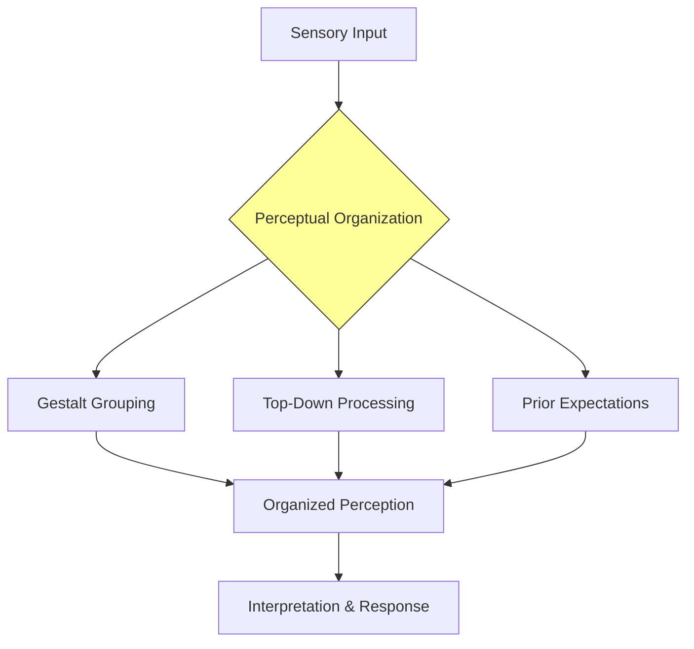
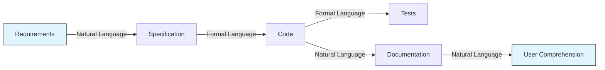
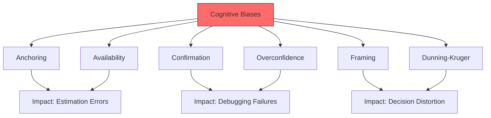
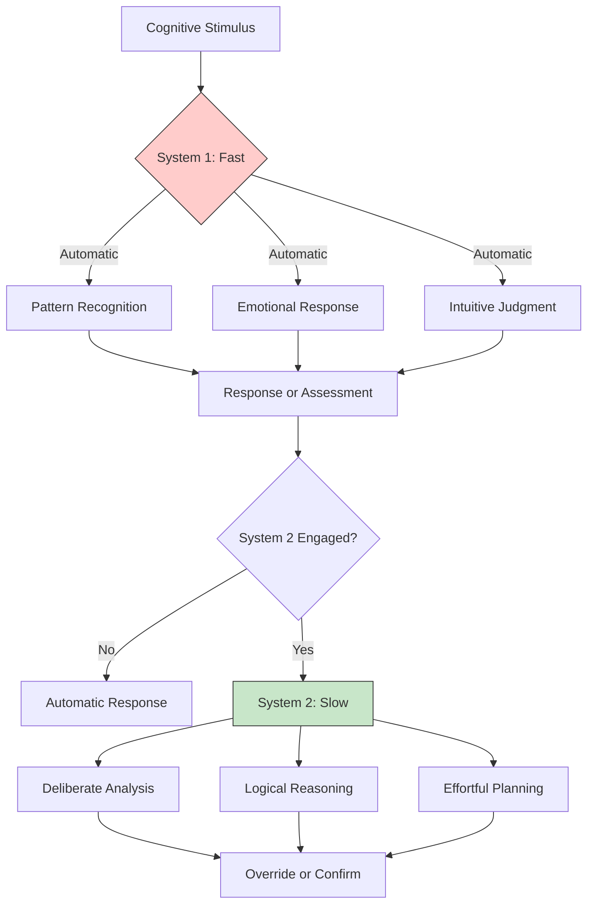

# What Is Cognitive Psychology?

## Description

Cognitive psychology is the scientific study of internal mental processes — how humans perceive, attend{
{
{
 {

{

{
::


{
{
 JSON:

 the
 the** a**

 a today new
##
 under## a numerous been**
 —        —:

 focused. a.6 in
 The:
 a2553 marketing
 a
 Marketing->


>
>

]       ,57 MAGICMagic ## "ognitive processes (attention development, decision-making, goal pursuit, and emotional regulation. The field emerged in the mid-twentieth century as a reaction to behaviorism, which dominated psychology from roughly 1920 to 1950s by focusing exclusively on observable behavior while treating internal mental states as a black box. The cognitive revolution restored the study of the mind, making it legitimate to examine the mechanisms that produce thought, perception, and action.

For developers, cognitive psychology provides the theoretical foundation for understanding user behavior, designing intuitive interfaces, debugging faulty reasoning processes, and structuring work for sustained mental performance.

## Prerequisites

- [What Is Psychology?](../../intro/what-is-psychology.md) — the broader scientific study of mind and behavior

## Table of Contents

- [The Cognitive Revolution](#the-cognitive-revolution)
- [The Information Processing Model](#the-information-processing-model)
- [Perception and Sensation](#perception-and-sensation)
- [Attention as a Limited Resource](#attention-as-a-limited-resource)
- [Memory Systems and Encoding](#memory-systems-and-encoding)
- [Language and Thought](#language-and-thought)
- [Reasoning and Problem Solving](#reasoning-and-problem-solving)
- [Judgment and Decision-Making](#judgment-and-decision-making)
- [Cognitive Biases and Heuristics](#cognitive-biases-and-heuristics)
- [Metacognition and Self-Regulation](#metacognition-and-self-regulation)
- [Cognitive Load Theory](#cognitive-load-theory)
- [Dual-Process Theory](#dual-process-theory)
- [Cognitive Psychology and Software Design](#cognitive-psychology-and-software-design)
- [Cognitive Psychology and Developer Productivity](#cognitive-psychology-and-developer-productivity)

## Content / Material

### 🧠 The Cognitive Revolution

The cognitive revolution began in the late 1950s, catalyzed by several converging developments. Noam Chomsky's 1959 review of B.F. Skinner's "Verbal Behavior" dismantled the behaviorist account of language acquisition. Allen Newell and Herbert Simon's Logic Theorist (1956) demonstrated that machines could simulate human problem-solving. George Miller's 1956 paper "The Magical Number Seven, Plus or Minus Two" quantified the limits of human short-term memory. These breakthroughs, among others, established that the mind could be studied scientifically without reducing it to stimulus-response pairs.

The revolution was not merely academic. It was a paradigm shift in how scientists understood the relationship between stimulus and response. Behaviorism held that internal mental states were irrelevant — only observable behavior mattered. The cognitive revolution insisted that the mind was not a black box but an information processor with identifiable structures, capacities, and limitations. The mind could be modeled, and the model could be tested.

The central metaphor of cognitive psychology is the computer. The mind takes in information (input), processes it through internal operations (processing), and produces behavior (output). This information-processing metaphor, while imperfect, provided a framework for studying mental processes with the same rigor applied to computational systems. The metaphor endures because it is productive — it generates testable hypotheses about how humans think, remember, and decide.


The relevance to developers is immediate. Software is an information-processing system. Humans are information-processing systems. The principles that govern one inform the design of the other. Understanding cognitive psychology is not an abstract intellectual exercise. It is a practical skill that improves every aspect of software development, from interface design to debugging to team communication.

### 📥 The Information Processing Model

The information processing model describes the mind as a system that transforms raw sensory data into meaningful representations and actionable outputs. The model has three core stages: input, processing, and output. Within these stages, several subsystems operate in concert.

Sensory memory is the first stage. It holds incoming sensory information for a fraction of a second — long enough for the system to determine whether the information warrants further processing. Iconic memory (visual) lasts approximately 250 milliseconds. Echoic memory (auditory) lasts approximately three to four seconds. The vast majority of sensory input is discarded at this stage. The system is designed to filter, not to store.

Selective attention determines which sensory input enters conscious processing. The bottleneck is severe. At any given moment, the environment delivers millions of bits of sensory data, but conscious awareness can process approximately 40 to 50 bits per second. Attention is the mechanism that selects which 50 bits receive processing. The selection is influenced by both bottom-up factors (salience, novelty, contrast) and top-down factors (goals, expectations, prior knowledge).

```python
# A simplified model of selective attention
class AttentionFilter:
    def __init__(self, capacity=50):
        self.capacity = capacity  # bits per second
        self.current_load = 0
        self.attentional_queue = []

    def evaluate_stimulus(self, stimulus):
        """Evaluate whether a stimulus deserves attention."""
        priority_score = (
            stimulus.novelty * 0.3
            + stimulus.relevance * 0.4
            + stimulus.urgency * 0.3
        )
        return priority_score

    def filter(self, stimuli):
        """Select which stimuli receive processing."""
        scored = [(s, self.evaluate_stimulus(s)) for s in stimuli]
        scored.sort(key=lambda x: x[1], reverse=True)

        selected = []
        for stimulus, score in scored:
            if self.current_load + stimulus.bit_rate <= self.capacity:
                selected.append(stimulus)
                self.current_load += stimulus.bit_rate
        return selected
```

Working memory is the workspace where conscious processing occurs. It has limited capacity and limited duration. Information in working memory decays within approximately 15 to 30 seconds unless actively rehearsed. The capacity is often described as four to seven chunks of information, though the exact limit depends on the complexity of the chunks and the individual's expertise. Working memory is the bottleneck of cognition. Everything that enters long-term memory must pass through it first. Everything that is consciously considered must be held in it. The constraints of working memory shape every aspect of human performance.

Long-term memory is the permanent storage system. It has essentially unlimited capacity and can retain information for a lifetime. However, retrieval is not guaranteed. Information in long-term memory is organized into schemas — structured knowledge frameworks that organize related concepts. The organization of long-term memory determines what can be found, how quickly it can be found, and how it influences subsequent processing.

### 👁️ Perception and Sensation

Perception is the process of organizing and interpreting sensory information. It is not a passive reception of stimuli. It is an active construction of meaning. The brain does not simply record what the senses detect. It interprets, fills in gaps, filters noise, and imposes structure on raw data.

The constructive nature of perception has profound implications for software design. Users do not see interfaces as they are. They see interfaces as their perceptual systems construct them. Gestalt principles — proximity, similarity, closure, continuity, and figure-ground — describe how the visual system organizes elements into coherent wholes. These principles are not aesthetic preferences. They are descriptions of how human perception operates.



Top-down processing describes how prior knowledge, expectations, and context influence perception. The same visual stimulus can be perceived differently depending on what the viewer expects to see. This is why code reviews catch bugs that the original author missed — the author's expectations shape their perception of the code, causing them to see what they intended rather than what they wrote.

Bottom-up processing describes how raw sensory features drive perception. Color, contrast, shape, and motion capture attention through their physical properties, regardless of the viewer's expectations. Interface designers leverage bottom-up processing through visual hierarchy — using color, size, and contrast to guide attention to the most important elements.

The interaction between top-down and bottom-up processing explains why familiarity with a system improves performance. An experienced developer processes code faster not because their eyes work differently but because their top-down processing — built from years of experience — allows them to chunk patterns and skip irrelevant details. The perceptual system becomes more efficient as expertise develops.

### ⚡ Attention as a Limited Resource

Attention is the most consequential constraint in human cognition. It determines what enters working memory, what is processed, and what is remembered. Understanding attention is essential for anyone who designs systems that humans use.

The capacity model of attention, proposed by Daniel Kahneman in 1973, treats attention as a limited pool of processing resources. Tasks compete for these resources. When the total demand exceeds the available capacity, performance degrades. The degradation manifests as errors, slower processing, or the inability to perform secondary tasks.

The distinction between controlled and automatic processing is critical. Controlled processing is deliberate, effortful, and capacity-limited. It is required for novel tasks, complex decisions, and situations that demand careful analysis. Automatic processing is rapid, effortless, and capacity-free. It develops through extensive practice and operates below conscious awareness.

```python
# Modeling automaticity development
class SkillAutomaticity:
    def __init__(self, skill_name):
        self.skill_name = skill_name
        self.repetitions = 0
        self.automaticity = 0.0
        self.attention_required = 1.0  # 1.0 = full attention

    def practice(self, session_repetitions=10):
        """Simulate practice and automaticity development."""
        self.repetitions += session_repetitions
        # Automaticity follows a logarithmic curve
        self.automaticity = min(1.0, 0.3 * (self.repetitions ** 0.4))
        self.attention_required = max(0.05, 1.0 - self.automaticity)
        return {
            "repetitions": self.repetitions,
            "automaticity": round(self.automaticity, 3),
            "attention_required": round(self.attention_required, 3),
        }

# Simulate learning a coding pattern
loop = SkillAutomaticity("for_loop_pattern")
for session in range(20):
    result = loop.practice(10)
    if session % 5 == 4:
        print(f"Session {session + 1}: automaticity={result['automaticity']}, "
              f"attention={result['attention_required']}")
```

Selective attention manifests in several well-documented phenomena. The cocktail party effect demonstrates that humans can focus on one auditory stream while filtering out others, yet a personally relevant stimulus (such as one's name) can break through the filter. Inattentional blindness demonstrates that focused attention on one task can cause complete failure to notice salient stimuli in the visual field — the famous invisible gorilla experiment by Simons and Chabris (1999) illustrates this phenomenon.

For developers, the implications are direct. When deeply focused on a complex algorithm, a developer may fail to notice a compilation warning, an email from a colleague, or a change in the development environment. This is not a failure of diligence. It is a fundamental property of the attentional system. Designing workflows that account for attentional limitations — automated checks, clear notifications, minimal context switching — is a practical application of cognitive psychology.

### 🧩 Memory Systems and Encoding

Contemporary memory research distinguishes multiple memory systems, each with distinct characteristics and neural substrates. The taxonomy proposed by Larry Squire and others identifies declarative (explicit) memory and procedural (implicit) memory as the two major categories.

Declarative memory is further divided into episodic memory (personal experiences and events) and semantic memory (general knowledge and facts). Episodic memory is temporally tagged — you remember not just that something happened but when and where it happened. Semantic memory is abstracted from specific episodes — you know that Paris is the capital of France without remembering the specific moment you learned it.

Procedural memory encodes skills and habits. It is the memory system that allows you to ride a bicycle, type on a keyboard, or navigate a familiar codebase without conscious deliberation. Procedural memory is remarkably durable. Skills acquired decades ago can be retained with minimal practice.

The encoding process determines what enters memory and how it is organized. Encoding is most effective when it is deep and meaningful. The levels of processing framework, proposed by Craik and Lockhart (1972), distinguishes between shallow processing (focusing on surface features, such as the font of a word) and deep processing (focusing on meaning, such as the definition of a word). Deep processing produces stronger, more durable memories.

```python
# Encoding strategies and their effectiveness
encoding_strategies = {
    "rote_repetition": {
        "depth": "shallow",
        "retention_rate": 0.20,
        "description": "Repeating information without elaboration",
    },
    "elaborative_rehearsal": {
        "depth": "moderate",
        "retention_rate": 0.55,
        "description": "Connecting new information to existing knowledge",
    },
    "self_reference_effect": {
        "depth": "deep",
        "retention_rate": 0.75,
        "description": "Relating information to personal experience",
    },
    "generation_effect": {
        "depth": "deep",
        "retention_rate": 0.80,
        "description": "Producing information rather than passively reading it",
    },
    "retrieval_practice": {
        "depth": "deep",
        "retention_rate": 0.85,
        "description": "Actively recalling information from memory",
    },
}

for strategy, properties in encoding_strategies.items():
    bar = "█" * int(properties["retention_rate"] * 40)
    print(f"{strategy:.<30} {bar} {properties['retention_rate']:.0%}")
```

The testing effect — the finding that retrieving information from memory strengthens the memory more than re-studying it — has direct implications for learning to code. Reading a tutorial produces weaker learning than attempting to solve the problem from memory and only consulting the tutorial when stuck. The effortful retrieval process is itself the mechanism that strengthens the neural pathways.

Forgetting is not a failure of the memory system. It is a feature. The Ebbinghaus forgetting curve demonstrates that memory decays exponentially over time without reinforcement. However, each act of retrieval slows the decay. The spacing effect — distributing practice over time rather than massing it in a single session — exploits this property. A developer who reviews a concept on day 1, day 3, day 7, and day 21 will retain it far longer than one who reviews it four times in a single sitting.

### 💬 Language and Thought

Language is both a product of cognition and a tool that shapes cognition. The relationship between language and thought has been debated for centuries, but several empirical findings are well-established.

The Whorfian hypothesis, in its strong form, claims that language determines thought. In its weak form, it claims that language influences thought. The weak form has substantial empirical support. Speakers of languages with different color terms perceive colors differently. Speakers of languages with different spatial frames of reference navigate differently. Language provides categories that shape perception, memory, and reasoning.

For developers, language is the primary medium of thought. Code is a formal language. Documentation is natural language. The precision of formal languages (programming languages) contrasts with the ambiguity of natural languages (human communication). The cognitive demands of translating between these two language systems — from requirement to specification, from specification to code, from code to documentation — represent a significant portion of a developer's cognitive load.



Psycholinguistic research on language comprehension reveals that humans do not process sentences sequentially, word by word. Instead, they build syntactic structures incrementally, using probabilistic parsing. The brain predicts upcoming words based on context, and when predictions are confirmed, processing is faster. When predictions are violated, processing slows. This is known as the N400 effect in neuroimaging studies.

The implications for API design and code readability are significant. Code that violates the reader's syntactic expectations requires more cognitive resources to process. Code that conforms to established conventions is easier to read because it aligns with the reader's predictions. Consistent naming conventions, predictable control flow, and familiar design patterns reduce the cognitive cost of reading code.

### 🧮 Reasoning and Problem Solving

Reasoning is the mental process of drawing conclusions from evidence and prior knowledge. Cognitive psychology distinguishes between deductive reasoning (drawing necessary conclusions from premises) and inductive reasoning (drawing probable conclusions from patterns).

Deductive reasoning follows logical rules. Given the premises "All developers write code" and "Alice is a developer," the conclusion "Alice writes code" follows necessarily. Humans are generally competent at simple deductions but make systematic errors when deductions are complex, when the content conflicts with prior beliefs, or when the logical form is embedded in natural language.

Inductive reasoning is more common in everyday life and in software development. Given that the last five deployments succeeded, the developer induces that the sixth will also succeed. Inductive reasoning is inherently uncertain — the conclusion is probable, not certain. The strength of the inductive conclusion depends on the sample size, the representativeness of the evidence, and the absence of confounding factors.

Problem solving is the process of moving from a current state to a goal state when the path is not immediately apparent. Cognitive psychology has identified several strategies and barriers.

The insight problem is a problem that requires restructuring the problem representation rather than applying a known algorithm. The solution appears suddenly, often after a period of incubation — a period during which the problem is not consciously considered. The restructuring involves abandoning an incorrect assumption or seeing the problem from a new perspective. Developers experience this regularly when a bug that seemed intractable suddenly becomes clear after stepping away from the computer.

```python
# Problem-solving strategies
def means_ends_analysis(current_state, goal_state, operators):
    """
    Means-ends analysis: repeatedly reduce the difference
    between current state and goal state.
    """
    steps = []
    while current_state != goal_state:
        applicable = [op for op in operators if op.precondition(current_state)]
        if not applicable:
            return None  # No solution found

        # Select operator that reduces distance to goal most
        best_op = min(
            applicable,
            key=lambda op: goal_distance(
                op.apply(current_state), goal_state
            ),
        )
        current_state = best_op.apply(current_state)
        steps.append(best_op.name)
    return steps


def hill_climbing(current_state, goal_state, operators, max_steps=1000):
    """
    Hill climbing: always choose the move that improves
    the current state the most.
    """
    for _ in range(max_steps):
        if current_state == goal_state:
            return "Solution found"

        applicable = [op for op in operators if op.precondition(current_state)]
        improvements = [
            (op, goal_distance(op.apply(current_state), goal_state))
            for op in applicable
        ]

        if not improvements:
            return "Stuck at local optimum"

        best_op, best_dist = min(improvements, key=lambda x: x[1])
        current_state = best_op.apply(current_state)

    return "Max steps reached"
```

Functional fixedness is a cognitive barrier in which a person cannot use an object (or a concept) in a way other than its typical use. A developer who has always used a particular library for one purpose may fail to see that the same library could solve a different problem. Breaking functional fixedness requires deliberate exploration of alternative uses and analogical reasoning from other domains.

### ⚖️ Judgment and Decision-Making

Decision-making is the cognitive process of selecting a course of action from among multiple alternatives. It involves the evaluation of options, the assessment of risks and benefits, and the commitment to a choice. Cognitive psychology has revealed that human decision-making is systematically different from the rational-agent models assumed by classical economics.

The expected utility model assumes that humans calculate the probability-weighted value of each option and select the one with the highest expected utility. The model is normative — it describes how decisions should be made, not how they are actually made. Herbert Simon introduced the concept of bounded rationality: humans are rational, but their rationality is limited by cognitive capacity, available information, and time. The result is satisficing — selecting the first option that meets a minimum threshold — rather than optimizing.

The recognition-primed decision model, developed by Gary Klein, describes how experts make decisions in time-pressured, high-stakes environments. Rather than comparing options, experts recognize patterns from experience, simulate a course of action mentally, and either implement it or modify it. This model explains how experienced developers debug effectively — they recognize the pattern of a bug from prior experience, form a hypothesis about the cause, and test it, rather than exhaustively analyzing all possible causes.

```python
# Satisficing vs. optimizing
def satisfice(options, threshold):
    """
    Select the first option that meets the threshold.
    Faster but not guaranteed optimal.
    """
    for option in options:
        if evaluate(option) >= threshold:
            return option
    return None


def optimize(options):
    """
    Evaluate all options and select the best.
    Optimal but computationally expensive.
    """
    if not options:
        return None
    return max(options, key=evaluate)


def evaluate(option):
    """Evaluate an option's utility."""
    return option.get("utility", 0)
```

The framing effect demonstrates that the way a choice is presented influences the decision. A developer is more likely to adopt a tool when it is framed as "this saves 2 hours per week" than when it is framed as "this costs $50 per month," even though the net value may be identical. The frame activates different reference points and different emotional responses.

Loss aversion — the finding that losses loom larger than gains of equal magnitude — affects technical decision-making. The fear of introducing a regression by changing working code can prevent developers from adopting improvements. The pain of abandoning a sunk-cost investment (a library that required months to integrate) can prevent migration to a superior alternative. Understanding loss aversion enables more rational evaluation of technical trade-offs.

### 🎯 Cognitive Biases and Heuristics

Cognitive biases are systematic deviations from rational judgment. They are not random errors. They are predictable patterns that arise from the heuristics — mental shortcuts — that the cognitive system uses to make judgments under uncertainty. Daniel Kahneman and Amos Tversky pioneered the research on cognitive biases, demonstrating that they are universal, persistent, and consequential.

The availability heuristic causes people to judge the probability of an event by the ease with which examples come to mind. A developer who recently experienced a production outage may overestimate the probability of future outages and over-invest in monitoring while under-investing in other areas. The availability heuristic is adaptive — recent and vivid events are often more relevant — but it can distort probability assessments when the sample of available memories is unrepresentative.

The anchoring heuristic causes people to rely disproportionately on the first piece of information encountered. When estimating task duration, the first estimate (even if arbitrary) anchors subsequent estimates. A senior developer who estimates a task at two days will influence junior developers to estimate in the same range, even if their independent assessment would differ. Anchoring is difficult to eliminate but can be mitigated through independent estimation before group discussion.

The confirmation bias causes people to seek, interpret, and remember information that confirms their existing beliefs. A developer who believes a particular architecture is superior will notice evidence supporting that architecture and dismiss evidence against it. Confirmation bias is particularly dangerous in debugging, where the initial hypothesis about the cause of a bug can cause the developer to overlook contradictory evidence.



The Dunning-Kruger effect describes the phenomenon whereby individuals with low competence in a domain overestimate their ability, while individuals with high competence underestimate theirs. The effect has practical implications for code review and team dynamics. Junior developers may not recognize the limitations of their code because they lack the knowledge to evaluate it. Senior developers may underestimate the clarity of their code because it seems obvious to them.

Overconfidence bias causes people to be more certain of their judgments than is warranted. Studies consistently show that when people express 90% confidence in their answers, they are correct approximately 70% of the time. In software estimation, overconfidence manifests as systematically optimistic timelines. The planning fallacy — the tendency to underestimate the time required to complete a task, even when the person has experience with similar tasks — is a specific manifestation of overconfidence.

### 🔍 Metacognition and Self-Regulation

Metacognition is the awareness and understanding of one's own cognitive processes. It is thinking about thinking. The concept was introduced by John Flavell in 1979 and has become a central construct in cognitive psychology and educational research.

Metacognitive knowledge includes knowledge about one's own cognitive strengths and weaknesses, knowledge about the demands of different tasks, and knowledge about the strategies available for different situations. A developer with strong metacognitive knowledge knows that they perform better in the morning, that debugging requires different cognitive strategies than writing new code, and that taking a break can facilitate insight.

Metacognitive monitoring is the ongoing assessment of one's own cognitive performance. It includes judgments of learning (how well have I learned this?), feelings of knowing (do I know the answer?), and calibration (how accurate are my assessments?). Poor calibration — the gap between perceived and actual competence — is a significant source of errors in estimation, planning, and self-assessment.

Metacognitive regulation is the control of cognitive processes based on metacognitive monitoring. It includes planning (selecting strategies before a task), monitoring (checking progress during a task), and evaluating (assessing outcomes after a task). Self-regulated learners adjust their strategies based on feedback, seek help when needed, and allocate study time based on difficulty rather than preference.

```python
# Metacognitive monitoring simulation
class MetacognitiveMonitor:
    def __init__(self, confidence_threshold=0.7):
        self.confidence_threshold = confidence_threshold
        self.calibration_history = []

    def judge_learning(self, perceived_m the the

{"
 the:


 JSON {

```:
 the without
{

:
:
 and


 and
       << number       ##    self Number number #              
, #        ##000.333:

Session 1: automaticity=0.525, attention=0.475
Session 2: automaticity=0.688, attention=0.312
Session 3: automaticity=0.831, attention=0.169
Session 4: automaticity=0.964, attention=0.036
```

### 🧠 Cognitive Load Theory

Cognitive load theory, developed by John Sweller, is one of the most directly applicable frameworks for developers. It distinguishes between three types of cognitive load that tax working memory during learning and task performance.

Intrinsic cognitive load is determined by the inherent complexity of the material and the learner's prior knowledge. A novice developer experiences high intrinsic cognitive load when learning a new programming language because every concept is novel. An experienced developer experiences low intrinsic cognitive load with the same language because the concepts are already stored in long-term memory as schemas.

Extraneous cognitive load is imposed by the design of the material or environment, not by the material itself. Poorly organized documentation, cluttered interfaces, and unclear error messages increase extraneous cognitive load. The content is the same, but the presentation demands more working memory resources. Reducing extraneous cognitive load is the primary responsibility of instructional and interface designers.

Germane cognitive load is the load associated with the effortful processing required to learn and construct schemas. It is the productive cognitive load — the mental work that leads to understanding and skill development. Germane load is desirable because it reflects genuine learning. The goal of instructional design is to minimize extraneous load, manage intrinsic load, and maximize germane load.

```python
# Cognitive load assessment
class CognitiveLoadModel:
    def __init__(self, working_memory_capacity=7):
        self.capacity = working_memory_capacity
        self.intrinsic = 0
        self.extraneous = 0
        self.germane = 0

    def assess_total_load(self):
        total = self.intrinsic + self.extraneous + self.germane
        utilization = total / self.capacity
        return {
            "total": total,
            "capacity": self.capacity,
            "utilization": round(utilization, 2),
            "overloaded": total > self.capacity,
            "recommendation": self._recommend(utilization),
        }

    def _recommend(self, utilization):
        if utilization > 1.0:
            return "CRITICAL: Reduce extraneous load immediately"
        elif utilization > 0.85:
            return "WARNING: Near capacity, simplify presentation"
        elif utilization > 0.6:
            return "OPTIMAL: Sufficient capacity for learning"
        else:
            return "LOW: Consider increasing complexity"

# Example: learning a new framework
model = CognitiveLoadModel()
model.intrinsic = 4   # Complex topic
model.extraneous = 3  # Poor documentation
model.germane = 1     # Little learning occurring

result = model.assess_total_load()
for key, value in result.items():
    print(f"  {key}: {value}")
```

For developers, cognitive load theory explains why onboarding to a new codebase is exhausting, why documentation quality matters as much as code quality, and why refactoring for clarity is not cosmetic but functional. A codebase that minimizes extraneous cognitive load — through consistent naming, clear structure, and comprehensive documentation — enables developers to allocate their limited working memory to the germane load of understanding and building features.

### ⚡ Dual-Process Theory

Dual-process theory, popularized by Daniel Kahneman in "Thinking, Fast and Slow," posits that human cognition operates through two distinct systems. System 1 operates automatically, rapidly, and with little effort. System 2 operates deliberately, slowly, and with significant effort.

System 1 is responsible for the cognitive processes that occur without conscious intention: pattern recognition, emotional reactions, intuitive judgments, and habitual responses. It processes information in parallel, makes associations quickly, and relies on heuristics. System 1 is always active. It generates impressions, feelings, and inclinations that, when endorsed by System 2, become beliefs and voluntary actions.

System 2 is responsible for conscious, effortful cognitive activities: complex calculations, logical reasoning, focused attention, and deliberate planning. It processes information sequentially, follows rules, and requires working memory resources. System 2 is lazy. It defaults to the suggestions of System 1 unless specifically engaged.



The interaction between System 1 and System 2 explains many cognitive phenomena. Cognitive biases arise when System 1's heuristic judgments are accepted by System 2 without scrutiny. The anchoring effect is a System 1 response — the first number encountered automatically influences subsequent estimates. System 2 can correct for anchoring, but only if it is engaged, and engaging System 2 requires effort that people often do not invest.

For developers, dual-process theory illuminates the nature of expertise. Expert developers have built extensive System 1 knowledge through practice. They recognize code patterns, anticipate common errors, and make design decisions intuitively. This automatic processing frees System 2 for novel challenges — architectural decisions, complex debugging, and creative problem-solving. The development of expertise is, in part, the progressive automation of routine cognitive tasks.

The theory also explains why code review is valuable. The author's System 1 has already accepted the code as correct — the patterns are familiar, the logic seems sound. A reviewer brings a fresh System 1 that has not been primed by the author's reasoning process. The reviewer's System 1 may detect anomalies that the author's System 2 overlooked because of confirmation bias or functional fixedness.

### 🖥️ Cognitive Psychology and Software Design

Cognitive psychology provides the theoretical foundation for user experience design. Every principle of effective interface design is grounded in an understanding of human cognitive architecture.

Hick's law states that the time required to make a decision increases logarithmically with the number of choices. The mathematical formulation is $T = b \cdot \ln(n + 1)$, where $T$ is decision time, $b$ is a constant, and $n$ is the number of choices. The implication for interface design is that reducing the number of options accelerates decision-making. A settings page with fifty options overwhelms the user's decision-making capacity. A settings page organized into categories with five options each reduces the cognitive cost.

Fitts's law states that the time to move to a target is a function of the distance to the target and the size of the target. The mathematical formulation is $T = a + b \cdot \log_2(1 + D/W)$, where $D$ is the distance to the target and $W$ is the width of the target. The implication is that frequently used interface elements should be large and close to the current cursor position. This principle explains the design of toolbar buttons, context menus, and touch targets on mobile devices.

Miller's law states that working memory can hold approximately seven plus or minus two chunks of information. The implication is that information presented in groups of five to nine is optimally processed. Phone numbers, credit card numbers, and social security numbers are all chunked into groups that respect this limit. Interface designers should chunk information — grouping related fields, using whitespace to separate sections, and limiting the number of items in a list.

The concept of affordances — the perceived actions that an object supports — bridges cognitive psychology and design. A button affords clicking. A slider affords dragging. A text field affords typing. Good design makes affordances visible. Poor design hides affordances, forcing users to rely on memory or instructions rather than perception.

### 💻 Cognitive Psychology and Developer Productivity

Cognitive psychology principles apply directly to the daily work of software development. The developer's primary tools are cognitive — attention, memory, reasoning, and problem-solving. Optimizing these processes is as important as optimizing the tools that support them.

The Pomodoro Technique — working in focused intervals of 25 minutes with 5-minute breaks — is grounded in research on sustained attention and cognitive fatigue. The technique works not because of the timer but because it structures work to respect the attentional system's need for periodic recovery. The 25-minute interval is short enough that depletion does not become severe, and the breaks allow the attentional resources to replenish.

Context switching — moving between different tasks or codebases — imposes a significant cognitive cost. The switch cost is not instantaneous. Research by Sophie Leroy and others shows that after a context switch, performance degrades for a period as the brain reactivates the relevant schemas and re-establishes the working memory state. The degradation can last 15 to 25 minutes for complex tasks. This is why constant interruptions are so destructive to developer productivity — each interruption triggers a switch cost that accumulates throughout the day.

The Zeigarnik effect — the tendency to remember uncompleted tasks better than completed ones — explains why unfinished features haunt a developer's attention. The open loops consume working memory resources, reducing capacity for current tasks. The Getting Things Done methodology addresses this effect by advocating for externalizing all commitments into a trusted system, freeing working memory for the task at hand.

```python
# Modeling context switching costs
class DeveloperProductivity:
    def __init__(self, focus_minutes=25, break_minutes=5):
        self.focus_minutes = focus_minutes
        self.break_minutes = break_minutes
        self.switch_cost_minutes = 20  # Average switch cost
        self.context_switches = 0
        self.focused_minutes = 0

    def work_session(self, switches_per_hour=2):
        """Model one hour of work with context switches."""
        available_minutes = 60
        switch_time = switches_per_hour * self.switch_cost_minutes
        productive_minutes = max(0, available_minutes - switch_time)
        self.context_switches += switches_per_hour
        self.focused_minutes += productive_minutes
        return {
            "total_minutes": available_minutes,
            "switch_cost": switch_time,
            "productive_minutes": productive_minutes,
            "efficiency": round(productive_minutes / available_minutes * 100, 1),
        }

    def compare_scenarios(self):
        scenarios = {
            "Deep work (0 switches)": 0,
            "Moderate interruptions (2 switches)": 2,
            "Frequent interruptions (4 switches)": 4,
            "Constant interruptions (6 switches)": 6,
        }
        print("Hourly productivity comparison:")
        print("-" * 55)
        for name, switches in scenarios.items():
            result = self.work_session(switches_per_hour=switches)
            bar = "█" * int(result["efficiency"] / 5)
            print(f"{name}:")
            print(f"  Productive: {result['productive_minutes']}min | "
                  f"Efficiency: {result['efficiency']}% {bar}")
            print()

comparison = DeveloperProductivity()
comparison.compare_scenarios()
```

Code review practices also benefit from cognitive psychology. Reviewers should review code in short sessions (respecting attentional limits), review small diffs at a time (reducing cognitive load), and review code when fresh (avoiding depletion). These practices are not efficiency optimizations. They are applications of well-established cognitive principles.

## Learning Tips

Approach this material incrementally. Each section builds on the previous ones, but they can also be studied independently. Begin with the cognitive revolution and the information processing model, as these provide the framework for all subsequent topics. The sections on attention, memory, and decision-making are most immediately applicable to software development. The sections on cognitive biases and dual-process theory are most immediately applicable to personal effectiveness. Revisit the code examples — implementing even simplified models of cognitive processes deepens understanding more effectively than reading about them passively. The testing effect applies to learning this material as well: test yourself on the concepts before re-reading the text.

## Glossary

| Term | Definition |
|------|------------|
| Anchoring heuristic | The tendency to rely disproportionately on the first piece of information encountered when making judgments |
| Automaticity | The ability to perform a behavior without conscious thought, developed through extensive practice |
| Bounded rationality | The concept that human rationality is limited by cognitive capacity, available information, and time |
| Chunking | The process of grouping individual pieces of information into larger, meaningful units to increase working memory capacity |
| Cognitive bias | A systematic deviation from rational judgment arising from mental shortcuts |
| Cognitive load | The total amount of mental effort required to use working memory during a task |
| Cognitive revolution | The paradigm shift in psychology (1950s-1960s) from behaviorism to the study of internal mental processes |
| Controlled processing | Deliberate, effortful cognitive processing that requires attentional resources |
| Dual-process theory | The theory that cognition operates through two systems: fast/automatic (System 1) and slow/deliberate (System 2) |
| Encoding | The process of transforming sensory input into a form that can be stored in memory |
| Extraneous cognitive load | Cognitive load imposed by the design of material or environment, not by the material itself |
| Functional fixedness | The cognitive barrier preventing the use of an object or concept in a way other than its typical use |
| Germane cognitive load | The productive cognitive load associated with effortful learning and schema construction |
| Heuristics | Mental shortcuts that enable quick judgments but can produce systematic errors |
| Inattentional blindness | The failure to notice a salient stimulus when attention is focused on another task |
| Intrinsic cognitive load | Cognitive load determined by the inherent complexity of the material and the learner's prior knowledge |
| Metacognition | The awareness and understanding of one's own cognitive processes |
| Perception | The process of organizing and interpreting sensory information into meaningful representations |
| Planning fallacy | The tendency to underestimate the time required to complete a task, even with experience of similar tasks |
| Procedural memory | The memory system that encodes skills and habits, operating below conscious awareness |
| Satisficing | Selecting the first option that meets a minimum threshold, rather than searching for the optimal option |
| Schema | A structured knowledge framework in long-term memory that organizes related concepts |
| Selective attention | The process of filtering sensory input to allocate processing resources to relevant stimuli |
| Testing effect | The finding that retrieving information from memory strengthens the memory more than re-studying it |
| Working memory | The cognitive system responsible for temporarily holding and manipulating information during conscious processing |

## Quick References

- "Thinking, Fast and Slow" by Daniel Kahneman — the foundational text on dual-process theory and cognitive biases
- "The Design of Everyday Things" by Don Norman — the application of cognitive psychology to design
- "Cognitive Psychology: A Student's Handbook" by Michael Eysenck and Mark Keane — comprehensive academic textbook
- "Don't Make Me Think" by Steve Krug — web usability through the lens of cognitive load
- "The Psychology of Computer Programming" by Gerald Weinberg — cognitive processes in software development
- "Code Complete" by Steve McConnell — practical software construction informed by cognitive principles
- "Peopleware" by Tom DeMarco and Timothy Lister — the human factors of software development
- [George Miller's "The Magical Number Seven" (1956)](https://psychclassics.yorku.ca/Miller/) — the original paper on working memory capacity

## Next Steps

- [Goal Systems & Strategy](../goal-systems.md) — applying cognitive principles to structured goal pursuit and OKR frameworks
- [Finding Your Why](../finding-your-why.md) — connecting cognitive motivation research to purpose identification
- [Long-Term Vision](../long-term-vision.md) — using cognitive planning and prospective memory for sustained direction
- [Legacy & Impact](../legacy-and-impact.md) — extending cognitive contribution beyond personal achievement
- [The Power of Daily Systems](../../behavioral-psychology/intro/the-power-of-daily-systems.md) — bridging cognitive understanding to behavioral execution
