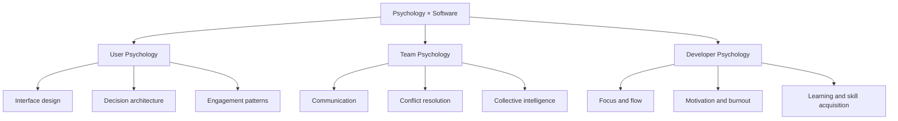
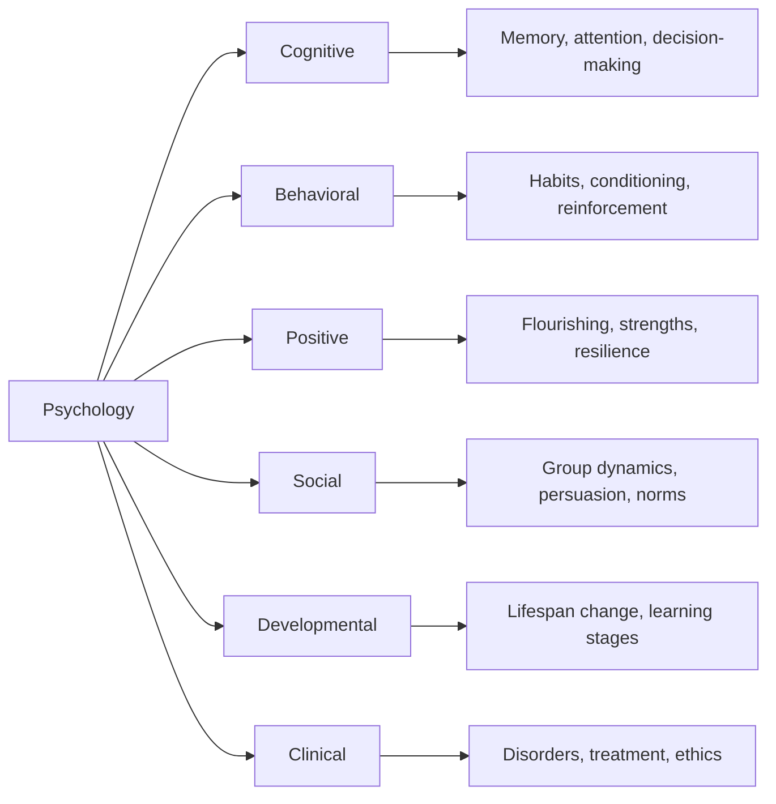
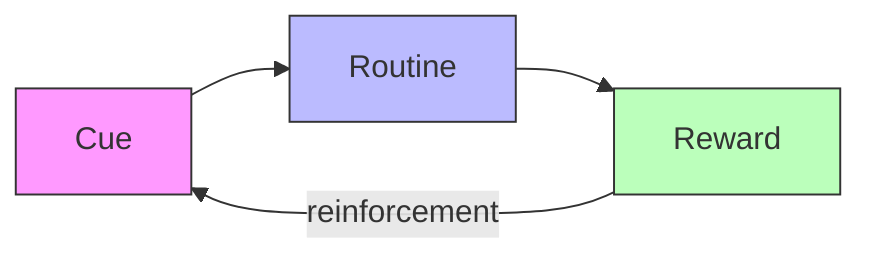

# What Is Psychology?

## Description

Psychology is the scientific study of mind and behavior — how humans perceive, learn, remember, decide, and relate to one another. It bridges biology, philosophy, and social science, offering empirical methods to investigate questions that were once the exclusive domain of speculative reasoning. For developers, psychology provides the foundational understanding of the human beings who use, build, and are affected by software systems.

## Prerequisites

- None. This is the introductory document for the psychology subject.

## Table of Contents

- [Why Psychology Matters for Developers](#why-psychology-matters-for-developers)
- [The Historical Foundations of Psychology](#the-historical-foundations-of-psychology)
- [The Major Branches of Psychology](#the-major-branches-of-psychology)
- [Research Methods in Psychology](#research-methods-in-psychology)
- [Core Concepts Every Developer Should Know](#core-concepts-every-developer-should-know)
- [Psychology and the Software Development Lifecycle](#psychology-and-the-software-development-lifecycle)
- [The Philosophy of Mind Meets the Machine](#the-philosophy-of-mind-meets-the-machine)
- [Common Misconceptions About Psychology](#common-misconceptions-about-psychology)
- [Learning Tips](#learning-tips)
- [Glossary](#glossary)
- [Quick References](#quick-references)
- [Next Steps](#next-steps)

## Content / Material

### Why Psychology Matters for Developers 🔍

Software is built by humans, for humans. Every line of code exists within a web of human motivations, cognitive limitations, social dynamics, and behavioral patterns. The developer who ignores these realities produces systems that technically function but humanly fail. The developer who understands psychology produces systems that align with how people actually think, decide, and act.

Consider the problem of user onboarding. A technically elegant system with a steep learning curve will be abandoned by most users — not because the system is flawed, but because the designers did not account for cognitive load, the limited capacity of working memory to process new information simultaneously. Psychology provides the vocabulary and the empirical evidence to diagnose such problems before they reach production.

```python
# The gap between technical correctness and human reality
system_design = {
    "technical_specification": "correct, performant, scalable",
    "human_reality": {
        "cognitive_load": "users have limited working memory",
        "attention": "users are distracted and impatient",
        "motivation": "users need immediate value to persist",
        "habit_formation": "users default to existing behaviors",
    },
    "psychology_informed_design": {
        "progressive_disclosure": "reveal complexity gradually",
        "immediate_feedback": "confirm actions within 100ms",
        "social_proof": "show what others are doing",
        "loss_aversion": "frame changes as preventing loss",
    },
}
```

Psychology also matters for the developer's own practice. Burnout, imposter syndrome, procrastination, and decision fatigue are not personal failures — they are predictable consequences of working in a high-complexity, high-ambiguity environment. Understanding the psychological mechanisms behind these experiences transforms them from sources of shame into problems with known solutions.

The relationship between psychology and software development can be understood through three lenses:



Each lens reveals problems and opportunities that purely technical training does not address. A team of brilliant engineers who cannot communicate effectively will produce inferior products. A beautifully designed interface that manipulates users into compulsive behavior raises ethical questions that only psychological literacy can answer. A developer who does not understand their own cognitive patterns will repeatedly fall into the same traps of procrastination and perfectionism.

### The Historical Foundations of Psychology 📜

Psychology's identity as a discipline is shaped by its history — a gradual, contested separation from philosophy, punctuated by paradigm shifts that continue to influence how practitioners think about the mind.

#### The Philosophical Roots

Questions about the mind, perception, and human nature are as old as recorded thought. Aristotle's *De Anima* (On the Soul) investigated perception, memory, and dreaming. Plato argued that knowledge is recollection — that the mind contains innate ideas awaiting activation. Descartes proposed the dualist framework of mind and body as distinct substances, a position that continues to shape debates about consciousness and artificial intelligence.

These philosophical traditions did not disappear when psychology became empirical. They evolved. The modern debate about whether consciousness can be reduced to neural activity is a direct descendant of the Cartesian mind-body problem. The question of whether AI systems can genuinely understand, versus merely simulate understanding, is a contemporary version of questions philosophers posed centuries ago.

#### The Birth of Experimental Psychology

Wilhelm Wundt established the first psychology laboratory in Leipzig in 1879, an event conventionally cited as the birth of psychology as a distinct empirical discipline. Wundt's method — trained introspection, in which observers reported the contents of their own conscious experience under controlled conditions — was imperfect, but the underlying commitment was revolutionary: the mind could be studied scientifically.

William James, at Harvard, published *The Principles of Psychology* in 1890, a work that remains remarkably relevant. James introduced concepts such as the stream of consciousness, habit as a social flywheel, and the James-Lange theory of emotion. His pragmatic approach — asking what beliefs and mental states *do* in practice rather than what they *are* in abstraction — anticipated modern applied psychology.

```python
# Timeline of key psychology milestones
milestones = [
    {"year": 1879, "event": "Wundt opens first psychology laboratory"},
    {"year": 1890, "event": "James publishes Principles of Psychology"},
    {"year": 1905, "event": "Binet and Simon develop first intelligence test"},
    {"year": 1913, "event": "Watson publishes behaviorist manifesto"},
    {"year": 1920, "event": "Freud and Jung popularize psychoanalysis"},
    {"year": 1953, "event": "Skinner publishes Science and Human Behavior"},
    {"year": 1956, "event": "Miller publishes 'The Magical Number Seven'"},
    {"year": 1967, "event": "Neisser publishes Cognitive Psychology"},
    {"year": 1998, "event": "Seligman launches positive psychology movement"},
    {"year": 2002, "event": "Kahneman wins Nobel for decision-making research"},
]
```

#### The Behaviorist Interlude

In the early twentieth century, John B. Watson and later B.F. Skinner argued that psychology should abandon the study of internal mental states — which could not be directly observed — and focus exclusively on observable behavior. Behaviorism held that all behavior is learned through conditioning: associations between stimuli and responses, reinforced by consequences.

Behaviorism's influence on software design is pervasive, even when unrecognized. Variable-ratio reinforcement schedules — the psychological mechanism behind slot machines — are the foundation of social media notification systems. Gamification frameworks that reward users with points, badges, and streaks are applied operant conditioning. The developer who understands reinforcement schedules can use them ethically (to support habit formation for beneficial behaviors) or recognize when they are being used manipulatively.

#### The Cognitive Revolution

By the 1950s and 1960s, dissatisfaction with behaviorism's refusal to study internal processes led to the cognitive revolution. Researchers like George Miller, Ulric Neisser, and Herbert Simon demonstrated that the mind could be studied scientifically through careful experimentation, computational modeling, and the analysis of information-processing mechanisms.

The cognitive revolution borrowed heavily from computer science — and computer science borrowed from it. The metaphor of the mind as an information-processing system, with input, storage, retrieval, and output, was developed collaboratively by psychologists and computer scientists. Working memory, long-term memory, attention, and decision-making were formalized as computational processes. This cross-pollination continues: cognitive architectures like ACT-R are implemented as running computer programs, and machine learning models are evaluated against human cognitive benchmarks.

#### The Rise of Neuroscience

The late twentieth and early twenty-first centuries saw an explosion of neuroimaging technology — fMRI, EEG, PET — that allowed researchers to observe the living brain in action. Cognitive neuroscience bridges the gap between mental processes and neural substrates, revealing how perception, memory, emotion, and decision-making are implemented in biological hardware.

For developers, neuroscience provides grounding for psychological claims. When research shows that multitasking degrades performance, neuroscience explains why: the brain does not truly multitask but rapid-switches between tasks, incurring a cognitive switching cost with each transition. When research shows that sleep deprivation impairs judgment, neuroscience explains the mechanism: adenosine accumulation in the prefrontal cortex degrades executive function.

### The Major Branches of Psychology 🧭

Psychology is not a monolithic discipline. It comprises numerous specialized branches, each with its own theoretical frameworks, methods, and practical applications. The following taxonomy covers the branches most relevant to developers.

#### Cognitive Psychology

Cognitive psychology investigates the mental processes underlying perception, attention, memory, language, reasoning, and decision-making. It asks how humans encode information, store it, retrieve it, and use it to solve problems.

Key findings with direct software relevance:

- **Working memory capacity** is limited to approximately four chunks of information simultaneously. This constraint shapes interface design, documentation structure, and API design.
- **Cognitive load theory** distinguishes between intrinsic load (inherent complexity of the material), extraneous load (unnecessary complexity imposed by presentation), and germane load (effort directed at learning). Effective documentation minimizes extraneous load.
- **Heuristics and biases** — Daniel Kahneman's System 1 (fast, automatic) and System 2 (slow, deliberate) framework — explain why users make errors, why they resist change, and why default options are disproportionately influential.

```python
# Cognitive load in API design
class PoorAPI:
    """High extraneous cognitive load"""
    def process(data, format, encoding, timeout, retry_count,
                backoff_strategy, cache_policy, validation_rules):
        pass  # Seven parameters — overwhelming for a new user

class GoodAPI:
    """Low extraneous cognitive load"""
    def process(data, **kwargs):
        """
        Process data with sensible defaults.
        Override timeout, retry, or caching via kwargs.
        """
        defaults = {"timeout": 30, "retry_count": 3}
        config = {**defaults, **kwargs}
        pass  # One required parameter — immediately usable
```

#### Behavioral Psychology

Behavioral psychology, rooted in the work of Pavlov, Watson, and Skinner, studies how organisms learn through interaction with their environment. Classical conditioning (associating stimuli) and operant conditioning (associating behaviors with consequences) are its core mechanisms.

For developers, behavioral psychology is directly applicable to:

- **Habit formation** — the habit loop (cue → routine → reward) described by Charles Duhigg and modeled by Wendy Wood's research on automaticity.
- **Environment design** — shaping behavior by modifying environmental cues rather than relying on willpower.
- **Reinforcement schedules** — understanding how different reward patterns produce different behavioral patterns, relevant to both user engagement and personal productivity.

#### Positive Psychology

Positive psychology, founded by Martin Seligman in 1998, studies human flourishing — the conditions and processes that enable individuals and communities to thrive. Rather than focusing exclusively on pathology and dysfunction, positive psychology investigates strengths, virtues, and optimal functioning.

Central constructs include:

- **The PERMA model** — Positive emotion, Engagement, Relationships, Meaning, and Accomplishment as the five pillars of well-being.
- **Flow** — the state of complete absorption in a challenging but manageable task, described by Mihaly Csikszentmihalyi. Flow is directly relevant to developer productivity and satisfaction.
- **Resilience** — the capacity to recover from adversity, which determines whether setbacks become permanent failures or temporary obstacles.
- **Growth mindset** — Carol Dweck's research on how beliefs about the malleability of intelligence affect learning, persistence, and achievement.

#### Social Psychology

Social psychology studies how individuals are influenced by the actual, imagined, or implied presence of others. It investigates conformity, persuasion, group dynamics, prejudice, cooperation, and conflict.

For developers, social psychology illuminates:

- **Team dynamics** — why groups make poor decisions (groupthink), why diverse teams outperform homogeneous ones (cognitive diversity), and how psychological safety enables innovation.
- **Open-source communities** — how social identity, status, and reciprocity norms govern participation and contribution patterns.
- **User behavior** — how social proof (seeing others use a product), authority bias (trusting expert endorsements), and scarcity (perceiving limited availability) influence adoption and engagement.

#### Developmental Psychology

Developmental psychology studies how humans change across the lifespan — physically, cognitively, and socially. Jean Piaget's stages of cognitive development, Lev Vygotsky's zone of proximal development, and Erik Erikson's stages of psychosocial development are foundational frameworks.

For developers, developmental psychology matters in several contexts:

- **Designing for age diversity** — interfaces for children differ fundamentally from interfaces for elderly users, not merely aesthetically but cognitively.
- **Learning design** — understanding how novices differ from experts in their mental models, and designing documentation and tutorials accordingly.
- **Career development** — recognizing that professional growth follows predictable patterns of competence acquisition, identity formation, and mastery.

#### Clinical Psychology

Clinical psychology assesses, diagnoses, and treats psychological disorders. While not the primary focus for most developers, clinical psychology provides essential context for:

- **Mental health awareness** — recognizing symptoms of anxiety, depression, and burnout in oneself and colleagues.
- **Evidence-based treatment** — understanding that effective psychological interventions (cognitive-behavioral therapy, dialectical behavior therapy) are grounded in empirical research, not folk wisdom.
- **Ethical design** — recognizing when software features exploit psychological vulnerabilities (addiction, anxiety, compulsive behavior) and designing with harm reduction in mind.



### Research Methods in Psychology 🔬

Understanding how psychological knowledge is produced is as important as understanding the knowledge itself. Psychology's empirical methods distinguish it from philosophy, self-help, and anecdotal reasoning.

#### Experimental Design

The randomized controlled experiment is the gold standard for establishing causal relationships. A psychologist manipulates an independent variable, measures its effect on a dependent variable, and controls for confounding variables through random assignment to conditions.

```python
# Experimental design structure
experiment = {
    "hypothesis": "Reducing cognitive load increases task completion rate",
    "independent_variable": "number_of_form_fields",
    "dependent_variable": "task_completion_rate",
    "conditions": {
        "control": "10 form fields",
        "treatment": "3 form fields with progressive disclosure",
    },
    "control_variables": ["user_expertise", "task_complexity", "device_type"],
    "randomization": "random assignment of users to conditions",
    "measurement": "completion_rate, time_on_task, error_rate",
}
```

#### Correlational Studies

When experimental manipulation is impractical or unethical, researchers measure the statistical association between variables. Correlation does not imply causation — a principle that is frequently violated in popular interpretations of psychological research.

```python
# Correlation vs. causation
correlation = {
    "observation": "teams_that_use_standing_desks_report_higher_productivity",
    "logical_fallacy": "standing_desks_cause_higher_productivity",
    "confound": "companies_that_invest_in_standing_desks_also_invest_in_other_productivity_measures",
    "lesson": "correlational_data_requires_controls_before_causal_claims",
}
```

#### Longitudinal and Cross-Sectional Studies

Longitudinal studies follow the same individuals over extended periods, tracking changes in behavior, cognition, or well-being. Cross-sectional studies compare different individuals at a single point in time. Each has strengths and limitations: longitudinal studies capture genuine change but suffer from attrition; cross-sectional studies are efficient but cannot distinguish age effects from cohort effects.

#### Meta-Analysis and Replication

Psychology has undergone a significant replication crisis since 2011, when large-scale replication attempts found that many published findings could not be reproduced. This crisis has been productive: it has led to pre-registration of studies, larger sample sizes, open data practices, and meta-analytic methods that aggregate findings across multiple studies to estimate effect sizes more reliably.

For developers, the replication crisis offers a cautionary parallel. Software engineering, like psychology, relies on empirical claims — about which technologies are more productive, which methodologies produce better outcomes, which practices reduce defects. The same standards of evidence that psychology now applies to itself should be applied to claims about software development practices.

### Core Concepts Every Developer Should Know 🧠

Several psychological concepts are so broadly applicable that every developer benefits from understanding them, regardless of specialization.

#### Cognitive Load Theory

John Sweller's cognitive load theory (1988) distinguishes three types of cognitive load:

1. **Intrinsic load** — the inherent complexity of the material being learned, determined by the number of elements that must be processed simultaneously and the degree of interaction between them.
2. **Extraneous load** — unnecessary complexity imposed by the way material is presented, which interferes with learning.
3. **Germane load** — the effort devoted to constructing and automating schemas, which directly supports learning.

```python
# Cognitive load applied to documentation design
def assess_documentation_quality(document):
    intrinsic = measure_conceptual_complexity(document)
    extraneous = measure_presentation_overhead(document)
    germane = measure_learning_focused_content(document)

    # Good documentation: minimize extraneous, manage intrinsic, maximize germane
    if extraneous > threshold:
        return "Simplify formatting, remove redundant information"
    if germane < threshold:
        return "Add worked examples, practice exercises, analogies"
    return "Well-designed documentation"
```

The practical implication is clear: every design decision that adds unnecessary complexity to an interface, a codebase, or a documentation set imposes a cognitive cost on the user. The goal is not to eliminate complexity — some complexity is inherent in the problem domain — but to ensure that the complexity the user encounters is the complexity they need.

#### The Habits Loop

Charles Duhigg popularized the habit loop model: cue → routine → reward. Wendy Wood's research demonstrates that approximately 43% of daily actions are performed habitually — in response to stable contextual cues, without conscious deliberation.

For developers, this model explains why refactoring is difficult (existing coding habits resist change), why new tools have adoption friction (no established habit loop exists yet), and why environment design is more effective than motivation (changing the cue is easier than overriding the automatic response).



#### Mental Models and Expertise

Mental models are internal representations of how the world works. A novice programmer's mental model of a computer might be simple and linear; an expert's mental model includes layers of abstraction — from transistors to logic gates to assembly to high-level language constructs.

Research on expertise, particularly by K. Anders Ericsson, demonstrates that expert performance is not the result of innate talent but of deliberate practice — focused, effortful activity designed to improve specific aspects of performance, with immediate feedback. This distinction has profound implications for how developers approach skill acquisition.

#### Motivation: Self-Determination Theory

Edward Deci and Richard Ryan's self-determination theory (SDT) identifies three basic psychological needs that, when satisfied, produce intrinsic motivation:

1. **Autonomy** — the feeling that one's actions are self-directed rather than externally controlled.
2. **Competence** — the feeling that one is effective and capable.
3. **Relatedness** — the feeling of connection to others.

SDT explains why micromanagement destroys productivity (violates autonomy), why trivial bug reports are demoralizing (threaten competence), and why remote work can feel isolating (undermines relatedness). It also explains why well-designed software feels empowering: it enhances the user's sense of autonomy and competence.

```python
# Self-determination theory in team management
def assess_team_motivation(team):
    autonomy = measure_decision_making_freedom(team)
    competence = measure_skill_challenge_match(team)
    relatedness = measure_social_connection(team)

    if autonomy < threshold:
        return "Increase delegation, reduce micromanagement"
    if competence < threshold:
        return "Adjust task difficulty, provide skill-building opportunities"
    if relatedness < threshold:
        return "Create shared rituals, pair programming, social spaces"
    return "Team motivation needs are being met"
```

#### Attention and Distraction

Attention is the cognitive resource that determines what information enters conscious processing. It is limited, selective, and easily disrupted. Research on attention demonstrates several critical phenomena:

- **Selective attention** — the brain filters the vast majority of sensory input, processing only what is relevant to current goals. This is why users miss prominently placed UI elements that do not match their current mental model.
- **Divided attention** — the myth of multitasking. The brain does not process multiple streams of information simultaneously but switches between them, incurring a performance cost of 20–40% on each switch.
- **Sustained attention** — vigilance declines after approximately 20 minutes of continuous monitoring, a phenomenon known as the vigilance decrement.

### Psychology and the Software Development Lifecycle 🔄

Psychological principles are not abstract luxuries — they are operational requirements at every stage of building software.

#### Requirements Gathering

Understanding user psychology transforms requirements gathering from a mechanical cataloging of features into an investigation of human needs, contexts, and behaviors. Techniques derived from psychology — contextual inquiry, think-aloud protocols, empathic design — produce requirements that reflect how users actually behave rather than how stakeholders assume they behave.

```python
# Psychology-informed requirements gathering
requirements_process = {
    "traditional": {
        "method": "stakeholder interviews, feature lists",
        "assumption": "users know what they want",
        "risk": "builds what stakeholders want, not what users need",
    },
    "psychology_informed": {
        "method": "contextual inquiry, behavioral observation, think-aloud",
        "assumption": "users' actual behavior differs from their stated preferences",
        "benefit": "discovers latent needs, pain points, and workarounds",
    },
}
```

#### Design and Prototyping

Cognitive psychology directly informs interface design. The Gestalt principles of perception (proximity, similarity, closure, continuity) explain why certain visual arrangements are perceived as coherent wholes. Fitts's Law quantifies the time required to move to a target area, providing a mathematical basis for button sizing and placement. Hick's Law models decision time as a function of the number of choices, supporting the principle of progressive disclosure.

#### Development and Code Quality

Psychological factors affect code quality in ways that are rarely discussed in technical literature:

- **Decision fatigue** — the depletion of executive function after prolonged periods of decision-making, leading to poorer code quality in afternoon reviews compared to morning reviews.
- **The Dunning-Kruger effect** — the tendency of novices to overestimate their competence, leading to overconfident code that lacks defensive programming practices.
- **Flow states** — the conditions under which developers produce their best work: clear goals, immediate feedback, and a balance between challenge and skill.

#### Testing and Quality Assurance

Psychological principles explain why testing is difficult: confirmation bias leads testers to test paths they expect to succeed, omission bias leads them to focus on errors of commission rather than omission, and the curse of knowledge makes it difficult for developers to anticipate how novices will interact with their systems.

#### Deployment and Adoption

The technology acceptance model (TAM) and its successor, UTAUT (Unified Theory of Acceptance and Use of Technology), identify perceived usefulness and perceived ease of use as the primary determinants of technology adoption. These constructs are psychological, not technical — they live in the user's mind, not in the system's architecture.

### The Philosophy of Mind Meets the Machine 🤖

The intersection of philosophy of mind and computer science raises questions that are no longer merely academic. As AI systems become more sophisticated, developers must grapple with issues that psychologists and philosophers have debated for centuries.

#### Functionalism and Computational Theory of Mind

Functionalism holds that mental states are defined by their functional roles — the causal relationships between inputs, internal states, and outputs — rather than by their physical substrate. This view is the philosophical foundation of artificial intelligence: if cognition is computation, then a sufficiently powerful computer could, in principle, instantiate genuine mental states.

```python
# Functionalism: mental states defined by causal roles
class MentalState:
    """
    Under functionalism, what matters is not WHAT implements
    the state, but WHAT THE STATE DOES — its causal relations
    to sensory inputs, behavioral outputs, and other states.
    """
    def __init__(self, input_history, current_state):
        self.input_history = input_history
        self.current_state = current_state

    def transition(self, new_input):
        # The same functional transition could be implemented
        # in neurons, silicon, or any other substrate
        self.current_state = self.compute_next_state(new_input)
        return self.produce_output()

    def compute_next_state(self, input):
        pass  # Implementation-independent

    def produce_output(self):
        pass  # Defined by causal role, not physical composition
```

#### Consciousness and the Hard Problem

David Chalmers distinguished between the "easy problems" of consciousness — explaining cognitive functions like discrimination, integration, and reportability — and the "hard problem" — explaining why there is subjective experience at all. The easy problems are amenable to standard scientific investigation. The hard problem resists explanation in terms of physical processes alone.

For developers working on AI systems, the hard problem is practically relevant: we can build systems that process information, learn from data, and generate responses that are functionally indistinguishable from human outputs. Whether these systems have any subjective experience — whether there is "something it is like" to be a large language model — remains an open question with ethical implications for how we design, deploy, and regulate these technologies.

#### Embodied and Situated Cognition

The embodied cognition thesis holds that cognition is not confined to the brain but is shaped by the body and its interactions with the environment. The situated cognition thesis holds that cognition is fundamentally social and cultural, shaped by the context in which it occurs.

These perspectives challenge the computational theory of mind and have practical implications for software design: interfaces that leverage physical intuition (drag-and-drop, spatial organization) succeed partly because they align with embodied cognition. Collaborative tools succeed partly because they support situated cognition — the social construction of meaning within shared contexts.

### Common Misconceptions About Psychology ⚠️

Several misconceptions about psychology persist, particularly among technically trained professionals who may dismiss the discipline as "soft science."

#### "Psychology Is Just Common Sense"

Psychological research frequently contradicts common sense. People do not consistently act in their own self-interest. Memory is not a recording but a reconstruction. Willpower is not a character trait but a depletable resource. The findings of psychology are counterintuitive precisely because they are empirical — they describe how humans actually behave, not how we expect them to behave.

#### "Sample Sizes Are Too Small"

The replication crisis revealed that many published psychology studies had inadequate sample sizes, leading to inflated effect sizes and false positives. However, the field has responded with dramatic methodological reforms: pre-registration, registered reports, large-sample online studies, and mandatory statistical power analyses. Contemporary psychology research meets standards that many other empirical disciplines have not yet adopted.

#### "It Is Not Relevant to Software"

The most damaging misconception is that psychology is peripheral to software development. Every decision in software — from the number of items in a navigation menu to the default settings in a configuration file to the wording of an error message — has psychological implications. The developer who ignores these implications does not avoid psychology; they simply practice it unconsciously and badly.

#### "Findings Do Not Apply to Me"

Psychological research describes general patterns, not universal laws. Individual variation is real and significant. However, the existence of individual differences does not invalidate general findings — it contextualizes them. The developer who believes they are immune to cognitive biases is more susceptible to those biases, not less, because awareness of bias is itself a partial defense against its effects.

## Learning Tips 📋

1. **Start with primary sources.** Popular psychology books often oversimplify or sensationalize findings. Read the original research or reputable summaries (Annual Review of Psychology, Psychological Science) before relying on popular accounts.

2. **Apply concepts immediately.** Psychology becomes meaningful when connected to lived experience. After learning about cognitive load, audit a documentation set you maintain. After learning about reinforcement schedules, analyze the notification system of an app you use.

3. **Maintain skepticism proportional to the claim.** Extraordinary claims (e.g., "this one technique will double your productivity") require extraordinary evidence. Favor findings that have been replicated across multiple studies and populations.

4. **Study the methods, not just the findings.** Understanding *how* a conclusion was reached is more valuable than memorizing the conclusion itself. A developer who understands experimental design can evaluate psychological claims independently.

5. **Connect branches to one another.** Psychology's branches are not isolated silos. Cognitive load affects motivation. Habits interact with social identity. Resilience depends on both individual psychology and social support. The most valuable insights come from integrating across branches.

6. **Recognize the limits of psychological science.** Psychology provides frameworks and evidence, not certainties. Human behavior is complex, context-dependent, and influenced by factors that empirical research has not yet identified. Treat psychological knowledge as a guide for decision-making, not as a set of immutable laws.

## Glossary

| Term | Definition |
|------|------------|
| **Behaviorism** | A psychological school that studies observable behavior through conditioning mechanisms, excluding internal mental states from scientific inquiry. |
| **Cognitive load** | The total amount of mental effort required to process information in working memory at a given moment. |
| **Cognitive revolution** | The mid-twentieth-century shift from behaviorism to the scientific study of internal mental processes, enabled by computational metaphors and experimental methods. |
| **Conditioning** | A learning process in which behavior is modified through association (classical) or consequence (operant). |
| **Dependent variable** | The variable measured in an experiment to determine the effect of the independent variable. |
| **Developmental psychology** | The branch of psychology that studies how humans change physically, cognitively, and socially across the lifespan. |
| **Embodied cognition** | The thesis that cognitive processes are shaped by the body and its sensory-motor interactions with the environment, not confined to the brain alone. |
| **Experimental design** | A research method in which the investigator manipulates an independent variable and measures its effect on a dependent variable while controlling for confounds. |
| **Flow** | A state of complete absorption in a task that is challenging but manageable, characterized by deep focus, loss of self-consciousness, and intrinsic reward. |
| **Functionalism** | The philosophical position that mental states are defined by their functional roles — causal relationships between inputs, outputs, and other states — rather than by physical substrate. |
| **Habit loop** | A behavioral model in which a cue triggers a routine, which produces a reward that reinforces the loop for future repetition. |
| **Independent variable** | The variable manipulated in an experiment to test its effect on the dependent variable. |
| **Meta-analysis** | A statistical method that aggregates results across multiple studies to estimate the overall effect size and assess consistency of findings. |
| **Mental model** | An internal representation of how a system or domain works, used to predict behavior, diagnose problems, and guide action. |
| **Operant conditioning** | A form of learning in which behavior is strengthened or weakened by its consequences — rewards or punishments. |
| **Positive psychology** | The scientific study of human flourishing, strengths, and optimal functioning, founded by Martin Seligman in 1998. |
| **Reinforcement schedule** | The pattern by which rewards are delivered following a behavior, influencing the strength and persistence of that behavior. |
| **Replication crisis** | The ongoing methodological challenge in psychology (and other sciences) of reproducing published research findings, leading to significant reforms in research practice. |
| **Self-determination theory** | A theory of motivation identifying autonomy, competence, and relatedness as three basic psychological needs whose satisfaction produces intrinsic motivation. |
| **Social psychology** | The branch of psychology that studies how individuals are influenced by the actual, imagined, or implied presence of others. |

## Quick References

- [Psychology — Wikipedia](https://en.wikipedia.org/wiki/Psychology) — comprehensive overview of the discipline's history, branches, and methods.
- [APS: Association for Psychological Science](https://www.psychologicalscience.org/) — leading professional organization for empirical psychology research.
- [APA: American Psychological Association](https://www.apa.org/) — the largest professional organization of psychologists in the United States.
- [The Stanford Encyclopedia of Philosophy: Philosophy of Mind](https://plato.stanford.edu/entries/mind/) — rigorous philosophical treatments of consciousness, mental content, and the mind-body problem.
- [Replication Crisis — Wikipedia](https://en.wikipedia.org/wiki/Replication_crisis_in_psychology) — overview of the methodological challenges and reforms in psychological science.

## Next Steps

- [The Power of Daily Systems](../behavioral-psychology/intro/the-power-of-daily-systems.md) — how behavioral psychology explains the compounding effect of small daily habits.
- [What Is Behavior Change?](../behavior-change/intro/what-is-behavior-change.md) — the Transtheoretical Model and the mechanics of lasting behavioral transformation.
- [What Is Cognitive Psychology?](../cognitive-psychology/intro/what-is-cognitive-psychology.md) — deeper exploration of mental processes, goal pursuit, and decision-making.
- [What Is Positive Psychology?](../positive-psychology/intro/what-is-positive-psychology.md) — the science of flourishing, resilience, and human strengths.
- [What Is Philosophy?](../../philosophy/intro/what-is-philosophy.md) — the philosophical traditions that preceded and continue to inform psychological inquiry.
- [The Level Up Philosophy](../../level-up/intro/the-level-up-philosophy.md) — existential recovery, resilience, habits, meaning, and purpose.
