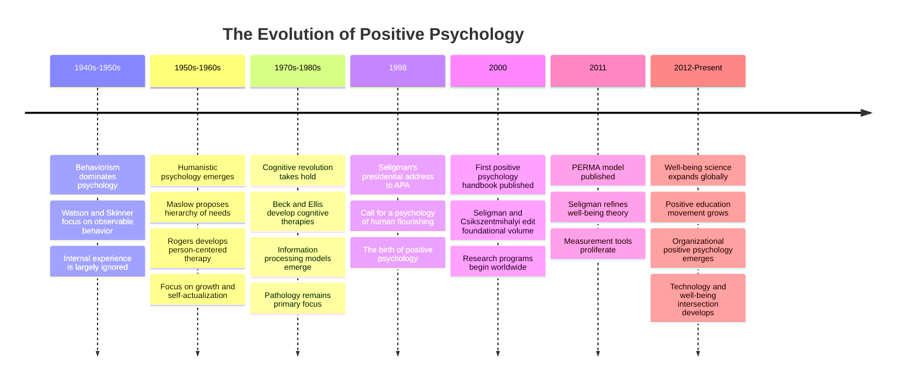
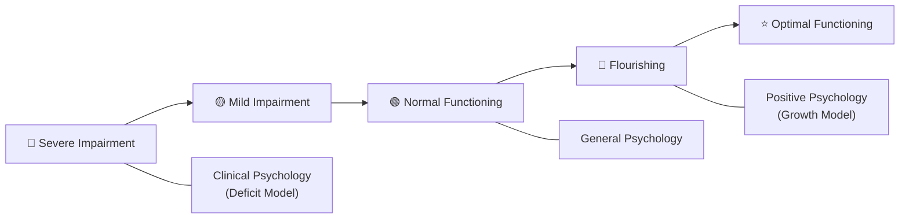
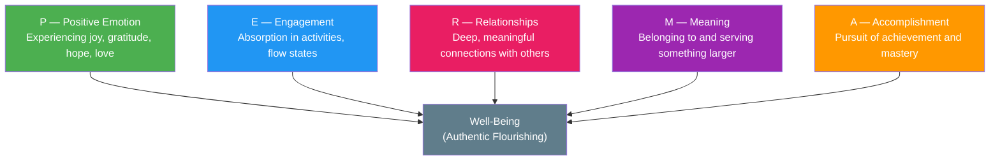
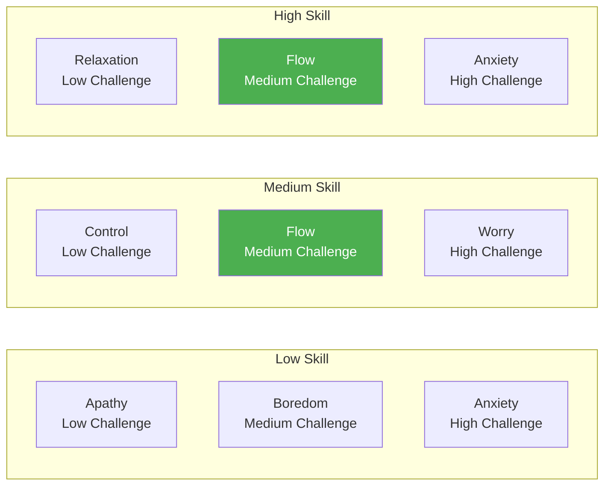

# What Is Positive Psychology?

## Description

Positive psychology is the scientific study of human flourishing — what makes life worth living, how people thrive, and how to cultivate strengths, resilience, and well-being. Founded by Martin Seligman in the late 1990s, it shifted the field of psychology from a deficit model focused on treating mental illness to a growth model focused on building mental fitness. For developers, positive psychology provides an evidence-based framework for sustaining motivation, achieving flow states, building resilient teams, and designing products that genuinely improve people's lives.

## Prerequisites

- [What Is Psychology?](../../intro/what-is-psychology.md) — the broader field of psychology and its major branches

## Table of Contents

- [Origins and Historical Context](#origins-and-historical-context)
- [The Deficit Model vs The Growth Model](#the-deficit-model-vs-the-growth-model)
- [Core Theories and Frameworks](#core-theories-and-frameworks)
- [Character Strengths and Virtues](#character-strengths-and-virtues)
- [Key Concepts in Positive Psychology](#key-concepts-in-positive-psychology)
- [Measurement and Methodology](#measurement-and-methodology)
- [Positive Psychology in Practice](#positive-psychology-in-practice)
- [Positive Psychology for Developers](#positive-psychology-for-developers)
- [Criticisms and Limitations](#criticisms-and-limitations)
- [Learning Tips](#learning-tips)
- [Glossary](#glossary)
- [Quick References](#quick-references)
- [Next Steps](#next-steps)

## Content / Material

### Origins and Historical Context

Positive psychology emerged from a specific intellectual and cultural moment. By the late 1990s, clinical psychology had become dominant, and the field was overwhelmingly focused on pathology — diagnosing disorders, treating dysfunction, and studying what goes wrong in the human mind. Martin Seligman, then president of the American Psychological Association, argued that this deficit-centered approach left a critical gap. Psychology understood how to make miserable people less miserable, but it had little to say about how to make flourishing people flourish.

In 1998, Seligman used his presidential address to call for a new branch of psychology that would study human strengths, optimal functioning, and the conditions that enable people to thrive. He was not dismissing the importance of treating mental illness. He was arguing that psychology needed a second mission — understanding and cultivating the positive dimensions of human experience alongside the remediation of the negative.

The intellectual roots, however, go deeper. Humanistic psychology in the 1950s and 1960s, particularly the work of Abraham Maslow and Carl Rogers, had already challenged the field's focus on dysfunction. Maslow's hierarchy of needs culminated not in the treatment of pathology but in self-actualization — the realization of one's fullest potential. Rogers' person-centered approach emphasized the inherent tendency toward growth. These ideas were largely marginalized by the rise of behaviorism and later cognitive-behavioral approaches, which prioritized measurable, treatable conditions. Positive psychology reclaimed and operationalized these earlier insights with empirical rigor.



The institutionalization of positive psychology happened rapidly. The first Positive Psychology Handbook, edited by Seligman and Csikszentmihalyi, was published in 2000. The International Positive Psychology Association was founded in 2007. Academic journals dedicated to the field — the Journal of Positive Psychology and the Journal of Happiness Studies — attracted growing readerships. By the 2010s, positive psychology interventions were being implemented in schools, organizations, healthcare systems, and military training programs worldwide.

For developers, the relevance is immediate. The software industry operates under enormous psychological pressure — constant learning, ambiguous problems, tight deadlines, and imposter syndrome. Understanding the science of flourishing provides tools for sustaining performance and well-being in this demanding environment. Moreover, developers increasingly build products that shape user well-being, making positive psychology directly relevant to product design, user experience, and ethical technology development.

### The Deficit Model vs The Growth Model

The distinction between the deficit model and the growth model is the foundational tension in positive psychology. Understanding this distinction is essential for grasping why the field exists and what it aims to accomplish.

**The deficit model** focuses on identifying and treating what is broken. In clinical psychology, this means diagnosing disorders, understanding risk factors, and developing interventions that reduce symptoms. The deficit model asks: What is wrong? How did it go wrong? How do we fix it? This approach has produced remarkable advances in treating depression, anxiety, PTSD, and schizophrenia. Cognitive-behavioral therapy (CBT), exposure therapy, and psychopharmacology are products of the deficit model, and they have saved millions of lives.

**The growth model** focuses on identifying and cultivating what works. It asks: What makes life worth living? What are people good at? How can strengths be leveraged? What conditions enable people to flourish? The growth model does not replace the deficit model — it complements it. A car mechanic who can only fix broken engines understands half of automotive engineering. The other half is understanding how engines are designed to perform optimally and how to make them run better than factory specifications.

The relationship between these models can be formalized. Consider a continuum of human functioning:



Clinical psychology operates primarily on the left side of this continuum — moving people from impairment toward normal functioning. Positive psychology operates on the right side — moving people from normal functioning toward flourishing and optimal functioning. Both are necessary. Neither is sufficient alone.

Consider a concrete example. A developer experiencing burnout benefits from clinical interventions — therapy to address anxiety, sleep hygiene to restore circadian rhythms, stress management to reduce allostatic load. This is the deficit model in action. But once the developer has recovered, they benefit from positive psychology — learning to cultivate flow states, identify and deploy character strengths, build meaningful connections with colleagues, and construct a career narrative that aligns with their values. This is the growth model in action.

The growth model also challenges a subtle but pervasive assumption in psychology: that the opposite of mental illness is merely the absence of mental illness. Seligman argued that this assumption is as flawed as assuming that the opposite of poverty is merely the absence of poverty. True well-being is a positive state with its own characteristics, measurement, and developmental pathways — not simply the negative space left when suffering is removed.

This has practical implications. If you design a meditation app that reduces anxiety, you have addressed a deficit. If you design one that also cultivates gratitude, awe, and meaningful connection, you have promoted flourishing. The first is necessary. The second is what positive psychology adds.

### Core Theories and Frameworks

Positive psychology is not a single theory but a collection of theories and frameworks that share a focus on human flourishing. The most influential are described below.

#### The PERMA Model

Martin Seligman's PERMA model, published in his 2011 book Flourish, is the most widely cited framework in positive psychology. It identifies five pillars of well-being, each measurable, each independently cultivable, and each contributing to what Seligman calls "authentic happiness" or, more accurately, "well-being theory."



**Positive Emotion** is the classical component — the experience of joy, gratitude, serenity, interest, hope, pride, amusement, inspiration, awe, and love. Barbara Fredrickson's broaden-and-build theory (discussed below) provides the theoretical mechanism: positive emotions broaden the scope of attention and cognition, building enduring personal resources.

**Engagement** refers to complete absorption in an activity — what Csikszentmihalyi called flow. When you are writing code and lose track of time, you are in a state of engagement. Engagement is not pleasant in the moment — it often involves struggle and concentration — but it produces deep satisfaction afterward. It requires a match between the challenge level of the task and your skill level.

**Relationships** reflects the robust finding that social connection is one of the strongest predictors of well-being across all cultures, age groups, and life circumstances. The Harvard Study of Adult Development, which has tracked participants for over 80 years, consistently finds that the quality of relationships is the single best predictor of health and happiness in later life.

**Meaning** involves belonging to and serving something larger than the self. This might be a family, a community, a cause, or a spiritual tradition. Viktor Frankl's logotherapy demonstrated that the ability to find meaning in suffering is one of the most powerful predictors of survival in extreme adversity. For developers, meaning often connects to the impact of their work — solving real problems for real people.

**Accomplishment** is the pursuit of achievement for its own sake. Humans are inherently motivated to master skills, solve problems, and accomplish goals. This is distinct from external reward — the satisfaction of accomplishment is intrinsic. For developers, this maps to the deep satisfaction of solving a difficult algorithmic problem, shipping a well-designed feature, or contributing to a meaningful open-source project.

The PERMA model is not a hierarchy. All five elements contribute independently to well-being. A person can have high positive emotion and low meaning, or strong relationships and low engagement. The goal is to cultivate all five, understanding that the optimal balance differs across individuals and life stages.

```python
# A simple PERMA self-assessment framework
# Rate each dimension from 1 (very low) to 10 (very high)
# This is not a validated instrument — it is a reflective tool

def assess_perma():
    """
    Self-assessment of the five PERMA dimensions.
    Reflect on the past week and rate each dimension.
    """
    dimensions = {
        "Positive Emotion": {
            "description": "How much joy, gratitude, hope, and love did you experience?",
            "questions": [
                "Did you experience moments of genuine happiness this week?",
                "Did you feel gratitude for something specific?",
                "Did you experience hope or optimism about the future?",
                "Did you feel love or deep affection for someone?"
            ]
        },
        "Engagement": {
            "description": "How often were you fully absorbed in what you were doing?",
            "questions": [
                "Did you lose track of time while working on something?",
                "Did you experience a state of flow at any point?",
                "Were you deeply focused rather than merely busy?",
                "Did the challenge level match your skill level?"
            ]
        },
        "Relationships": {
            "description": "How meaningful were your connections with others?",
            "questions": [
                "Did you have a deep, genuine conversation with someone?",
                "Did you feel supported by your social network?",
                "Did you invest time in relationships that matter to you?",
                "Did you feel a sense of belonging in any community?"
            ]
        },
        "Meaning": {
            "description": "How connected did you feel to something larger than yourself?",
            "questions": [
                "Did your work feel purposeful and significant?",
                "Did you contribute to something beyond your own interests?",
                "Did you feel part of a community with shared values?",
                "Did you experience a sense of direction or calling?"
            ]
        },
        "Accomplishment": {
            "description": "How much progress did you make toward meaningful goals?",
            "questions": [
                "Did you complete something you set out to do?",
                "Did you master a new skill or deepen an existing one?",
                "Did you make measurable progress on a project?",
                "Did you experience the satisfaction of getting something right?"
            ]
        }
    }

    print("=" * 60)
    print("PERMA Self-Assessment")
    print("=" * 60)
    print("Rate each dimension from 1 to 10 based on the past week.\n")

    scores = {}
    for dimension, info in dimensions.items():
        print(f"\n--- {dimension} ---")
        print(f"   {info['description']}")
        for question in info["questions"]:
            print(f"   → {question}")

        while True:
            try:
                score = int(input(f"\n   Your rating for {dimension} (1-10): "))
                if 1 <= score <= 10:
                    scores[dimension] = score
                    break
                print("   Please enter a number between 1 and 10.")
            except ValueError:
                print("   Please enter a valid integer.")

    print("\n" + "=" * 60)
    print("Your PERMA Profile")
    print("=" * 60)

    total = 0
    for dimension, score in scores.items():
        bar = "█" * score + "░" * (10 - score)
        print(f"   {dimension:20s} [{bar}] {score}/10")
        total += score

    average = total / 5
    print(f"\n   Overall Well-Being Index: {average:.1f}/10")

    lowest = min(scores, key=scores.get)
    highest = max(scores, key=scores.get)
    print(f"\n   Strongest pillar: {highest} ({scores[highest]}/10)")
    print(f"   Weakest pillar:   {lowest} ({scores[lowest]}/10)")
    print(f"\n   Consider one small action this week to strengthen your")
    print(f"   weakest pillar. Small, consistent improvements compound.")
    print("=" * 60)

assess_perma()
```

#### Broaden-and-Build Theory

Barbara Fredrickson's broaden-and-build theory provides the theoretical foundation for why positive emotions matter beyond subjective pleasantness. The theory proposes two core claims.

First, positive emotions broaden the scope of attention and cognition. While negative emotions narrow attention to the immediate threat (fear focuses attention on the predator; anger focuses it on the obstacle), positive emotions expand it. Joy widens the visual field. Interest enhances curiosity. Serenity promotes receptivity to new ideas. This broadened attentional scope enables exploration, creativity, and the discovery of novel thoughts and actions.

Second, this broadened awareness builds enduring personal resources. These resources are not consumed in the moment but accumulate over time. Social bonds formed during positive interactions become lasting support networks. Knowledge gained during states of interest becomes permanent expertise. Physical health improved during states of joy becomes lasting resilience.

The theory includes a critical concept: the positivity ratio. Fredrickson's research suggested that flourishing requires a ratio of positive to negative emotions of approximately 3:1 — three positive emotions for every negative one. Later work by Losada and Fredrickson (2005) refined this, though the precise mathematical model was challenged by Brown, Sokal, and Friedman (2013). The qualitative finding — that flourishing requires substantially more positive than negative emotional experience — remains robust, even if the exact ratio is debated.

The broaden-and-build theory has direct implications for developers. When you are debugging a complex issue and feeling frustrated (a negative emotion narrowing your attention), deliberately broadening your state — taking a walk, discussing the problem with a colleague, or reframing it as a puzzle rather than a threat — can shift you into a broader cognitive mode that is more likely to discover the solution. This is not naive positivity. It is strategic deployment of emotional states for cognitive benefit.

#### Self-Determination Theory

Edward Deci and Richard Ryan's self-determination theory (SDT) identifies three innate psychological needs that, when satisfied, promote well-being and intrinsic motivation:

1. **Autonomy** — the need to feel volitional and self-endorsed in one's actions. It is not independence or solitude; it is the sense that your behavior is self-chosen rather than externally controlled.
2. **Competence** — the need to feel effective and capable. It involves mastery, skill development, and the experience of meeting challenges successfully.
3. **Relatedness** — the need to feel connected to others. It involves belonging, mutual care, and the sense that your relationships are genuine and meaningful.

When these three needs are met, people experience intrinsic motivation, vitality, and well-being. When they are thwarted, people experience amotivation, anxiety, and diminished performance.

SDT has profound implications for software development environments. Teams that provide autonomy (flexible work arrangements, input into technical decisions), competence (challenging but achievable problems, opportunities to learn), and relatedness (psychological safety, genuine collaboration) produce higher-quality work, lower burnout, and greater job satisfaction. Teams that undermine these needs — through micromanagement, trivial tasks, or interpersonal conflict — produce the opposite.

#### Flow Theory

Mihaly Csikszentmihalyi's flow theory describes a state of complete absorption in an activity where the challenge level matches the skill level. Flow is characterized by:

- Clear goals at every step
- Immediate feedback on progress
- A balance between challenge and skill
- Merging of action and awareness
- Loss of self-consciousness
- Altered sense of time
- Autotelic (intrinsically rewarding) experience

Flow is not relaxation. It occurs at the edge of one's abilities, where the challenge is high enough to require full concentration but not so high as to produce anxiety. The relationship between challenge and skill produces a characteristic pattern:



For developers, flow is the state where the best work happens. It is why experienced developers guard their focus time so fiercely. Context switching, meetings, and interruptions are not merely inconvenient — they are flow-killers that prevent the cognitive conditions necessary for deep problem-solving. Designing your work environment to facilitate flow — dedicated focus blocks, minimal interruptions, clear task objectives — is one of the most impactful applications of positive psychology to software development.

### Character Strengths and Virtues

In 2004, Peterson and Seligman published the Handbook of Character Strengths and Virtues (CSV), which attempted to create a comprehensive classification of positive human traits. The work drew from six major world traditions — Greek philosophy (Aristotle's cardinal virtues), Buddhist tradition, Hindu tradition, Confucian tradition, Islamic tradition, and Judeo-Christian tradition — to identify universal virtues. They found remarkable convergence across cultures on six core virtues:

| Virtue | Definition | Example Strengths |
|--------|------------|-------------------|
| Wisdom and Knowledge | Acquisition and use of knowledge | Creativity, curiosity, love of learning, perspective |
| Courage | Emotional exercise despite adversity | Bravery, perseverance, honesty, zest |
| Humanity | Interpersonal friendships and kindness | Love, kindness, social intelligence |
| Justice | Civic and community life | Teamwork, fairness, leadership |
| Temperance | Moderation and protection from excess | Forgiveness, humility, prudence, self-regulation |
| Transcendence | Connections to the larger universe | Gratitude, hope, humor, spirituality |

Under these six virtues, the CSV identifies 24 character strengths. Each person has a signature profile — a unique combination of strengths that feel authentic, energizing, and natural. Research shows that using signature strengths in new ways increases happiness and decreases depression for up to six months.

For developers, the character strengths framework provides a language for understanding why certain aspects of work feel energizing while others feel draining. A developer with high curiosity and love of learning thrives in a role that requires exploring new technologies. One with high perseverance excels in debugging complex systems. One with high social intelligence and teamwork excels in collaborative design and mentoring. Understanding your signature strengths enables more intentional career decisions.

```python
# Mapping character strengths to developer roles
# This is an illustrative mapping, not a validated career assessment

STRENGTH_ROLE_MAPPING = {
    "Wisdom and Knowledge": {
        "strengths": ["creativity", "curiosity", "love_of_learning", "perspective"],
        "developer_roles": [
            "Research engineer",
            "Data scientist",
            "Systems architect",
            "Technical lead"
        ],
        "work_environment": [
            "Complex, novel problems",
            "Time for exploration",
            "Access to learning resources",
            "Autonomy in technical decisions"
        ]
    },
    "Courage": {
        "strengths": ["bravery", "perseverance", "honesty", "zest"],
        "developer_roles": [
            "Startup engineer",
            "Security researcher",
            "Incident commander",
            "Technical risk-taker"
        ],
        "work_environment": [
            "High-stakes decisions",
            "Tight deadlines",
            "Need for rapid iteration",
            "Honest, direct culture"
        ]
    },
    "Humanity": {
        "strengths": ["love", "kindness", "social_intelligence"],
        "developer_roles": [
            "Engineering manager",
            "Mentor",
            "User experience researcher",
            "Developer advocate"
        ],
        "work_environment": [
            "Strong interpersonal connections",
            "Opportunities to help others",
            "Collaborative teams",
            "User-facing impact"
        ]
    },
    "Justice": {
        "strengths": ["teamwork", "fairness", "leadership"],
        "developer_roles": [
            "Team lead",
            "Engineering manager",
            "Open-source maintainer",
            "Process improvement specialist"
        ],
        "work_environment": [
            "Clear organizational structure",
            "Fair decision-making processes",
            "Team-based objectives",
            "Transparent communication"
        ]
    },
    "Temperance": {
        "strengths": ["forgiveness", "humility", "prudence", "self_regulation"],
        "developer_roles": [
            "Code reviewer",
            "QA engineer",
            "DevOps engineer",
            "Compliance engineer"
        ],
        "work_environment": [
            "Structured, predictable workflows",
            "Quality-focused culture",
            "Attention to detail valued",
            "Sustainable pace"
        ]
    },
    "Transcendence": {
        "strengths": ["gratitude", "hope", "humor", "spirituality"],
        "developer_roles": [
            "Open-source contributor",
            "Mission-driven startup engineer",
            "Educational technology developer",
            "Non-profit technologist"
        ],
        "work_environment": [
            "Clear sense of purpose",
            "Connection to larger mission",
            "Community engagement",
            "Opportunities for creative expression"
        ]
    }
}


def recommend_roles(strengths_profile):
    """
    Given a developer's top strengths, recommend roles and environments.
    """
    print("\n" + "=" * 60)
    print("Strength-Based Role Recommendations")
    print("=" * 60)

    role_scores = {}

    for virtue, data in STRENGTH_ROLE_MAPPING.items():
        strength_match = sum(1 for s in data["strengths"] if s in strengths_profile)
        if strength_match > 0:
            for role in data["developer_roles"]:
                role_scores[role] = role_scores.get(role, 0) + strength_match

    sorted_roles = sorted(role_scores.items(), key=lambda x: x[1], reverse=True)

    print("\nRecommended roles based on your strengths:\n")
    for rank, (role, score) in enumerate(sorted_roles[:5], 1):
        bar = "█" * (score * 3)
        print(f"   {rank}. {role:35s} {bar}")

    print("\nRecommended work environments:\n")
    environments_shown = set()
    for virtue, data in STRENGTH_ROLE_MAPPING.items():
        for s in data["strengths"]:
            if s in strengths_profile:
                for env in data["work_environment"]:
                    if env not in environments_shown:
                        print(f"   ✓ {env}")
                        environments_shown.add(env)

    print("\n" + "=" * 60)


# Example usage
my_strengths = ["curiosity", "love_of_learning", "creativity", "perseverance"]
recommend_roles(my_strengths)
```

### Key Concepts in Positive Psychology

Several key concepts deserve dedicated treatment because they form the conceptual vocabulary of the field.

#### Flourishing

Flourishing is the overarching goal of positive psychology. It is not merely the absence of suffering but the presence of positive functioning across multiple life domains. Corey Keyes identified three components of flourishing: emotional well-being (positive affect, life satisfaction), psychological well-being (autonomy, environmental mastery, personal growth, positive relations with others, purpose in life, self-acceptance), and social well-being (social contribution, social coherence, social integration, social acceptance, social actualization).

A flourishing person is not happy all the time. They experience the full range of human emotions. The defining characteristic is that they have the resources, relationships, and meaning to navigate adversity without losing their sense of well-being. Flourishing is dynamic — it fluctuates with circumstances but maintains a baseline that reflects genuine psychological health.

#### Well-Being

Well-being is a multidimensional construct. It encompasses subjective well-being (hedonic: positive affect, negative affect, life satisfaction), psychological well-being (eudaimonic: meaning, growth, autonomy), and social well-being (connection, contribution, belonging). These dimensions are related but distinct. A person can have high life satisfaction but low meaning, or strong relationships but high negative affect.

The distinction between hedonic and eudaimonic well-being is important. Hedonic well-being is the presence of pleasure and the absence of pain. Eudaimonic well-being is the realization of one's potential and the experience of meaning. Research consistently shows that eudaimonic well-being is a stronger predictor of long-term health, resilience, and life satisfaction than hedonic well-being alone. Activities that promote meaning — volunteering, mentoring, pursuing mastery — produce more lasting well-being than activities that produce only pleasure.

#### Positive Emotions

Fredrickson's research identified ten common positive emotions: joy, gratitude, serenity, interest, hope, pride, amusement, inspiration, awe, and love. Each serves a distinct function:

- **Joy** signals safety and new resources, prompting play and exploration
- **Gratitude** signals social support, prompting prosocial behavior
- **Serenity** signals contentment, prompting savouring and openness
- **Interest** signals novelty, prompting exploration and learning
- **Hope** signals the possibility of improvement, prompting perseverance
- **Pride** signals accomplishment, prompting continued mastery
- **Amusement** signals social bonding, prompting laughter and connection
- **Inspiration** signals excellence, prompting aspiration and effort
- **Awe** signals vastness, prompting humility and cognitive restructuring
- **Love** signals deep connection, prompting bonding and care

For developers, understanding the function of specific positive emotions enables deliberate cultivation. When facing a complex problem, cultivating interest broadens attention. When recovering from a failure, gratitude provides perspective. When mentoring a junior developer, love and kindness strengthen the relationship. This is not sentimentality — it is strategic emotional regulation grounded in empirical research.

#### Growth Mindset

Carol Dweck's growth mindset research, while not exclusively a positive psychology topic, is deeply intertwined with the field. A growth mindset is the belief that abilities can be developed through effort, learning, and persistence. A fixed mindset is the belief that abilities are innate and unchangeable.

The implications for developers are significant. Developers with a growth mindset view bugs as learning opportunities, code reviews as growth mechanisms, and career challenges as developmentally valuable. Developers with a fixed mindset view these same events as threats to their identity and competence. The growth mindset predicts greater persistence, deeper learning, and more effective collaboration.

#### Gratitude

Robert Emmons' research on gratitude has consistently demonstrated that deliberate gratitude practice improves well-being, reduces depression, strengthens relationships, and enhances sleep quality. The mechanism is attentional: gratitude redirects attention from what is lacking to what is present. This is not denial — it is balanced attention.

The "three good things" exercise, originally developed by Seligman, is the most widely studied gratitude intervention. Each evening, write down three things that went well and why. This simple practice, sustained for one week, has been shown to increase happiness and decrease depressive symptoms for up to six months. The exercise works by training the brain to scan for positive events rather than exclusively monitoring threats.

### Measurement and Methodology

Positive psychology employs rigorous measurement methodologies, though measurement of positive constructs presents unique challenges compared to measuring pathology.

**Subjective well-being measures:**

- The Satisfaction With Life Scale (SWLS) — 5 items measuring cognitive evaluation of one's life. Sample item: "In most ways my life is close to my ideal." Strong internal consistency and cross-cultural validity.
- The Positive and Negative Affect Schedule (PANAS) — 20 items measuring positive and negative emotional experience over a specified time period. Widely used in both research and clinical settings.
- The Oxford Happiness Questionnaire (OHQ) — 29 items measuring subjective happiness across multiple dimensions.

**Psychological well-being measures:**

- The PERMA Profiler — 23 items measuring the five PERMA dimensions. Useful for identifying specific strengths and areas for development.
- The Ryff Scales of Psychological Well-Being — 84 items (short forms available) measuring autonomy, environmental mastery, personal growth, positive relations with others, purpose in life, and self-acceptance.
- The Flourishing Scale — 8 items measuring overall psychological functioning.

**Character strengths measures:**

- The VIA Survey of Character Strengths — 240 items measuring the 24 character strengths identified in the CSV. Available in over 15 languages. Provides a ranked profile of signature strengths.

**Experience sampling:**

- The Day Reconstruction Method (DRM) — developed by Kahneman, Krueger, and colleagues. Participants reconstruct the previous day, reporting activities, emotions, and social interactions. This method reduces recall bias compared to global self-report measures.
- Ecological Momentary Assessment (EMA) — real-time data collection via mobile devices. Participants report their emotional state multiple times per day, providing high-resolution temporal data on well-being fluctuations.

**Limitations of measurement.** Positive psychology measures share several limitations with psychological measurement generally. Self-report measures are subject to social desirability bias, recall bias, and cultural response styles. Cross-cultural research reveals that the experience and expression of positive emotions vary significantly across cultures — high-arousal emotions (excitement, enthusiasm) are valued more in individualistic cultures, while low-arousal emotions (calm, serenity) are valued more in collectivistic cultures. Any measurement approach must account for these cultural variations.

### Positive Psychology in Practice

Positive psychology has moved well beyond academic research into applied practice across multiple domains.

**Positive psychotherapy (PPT):** Developed by Tayyab Rashid and Seligman, PPT integrates positive psychology principles into clinical treatment. Unlike traditional therapy that focuses primarily on reducing symptoms, PPT simultaneously builds positive experiences — gratitude, meaning, engagement, and relationships. Randomized controlled trials show that PPT is as effective as traditional CBT for moderate depression while producing additional gains in life satisfaction and well-being.

**Positive education:** The Geelong Grammar School in Australia, in collaboration with Seligman, developed a positive education model that integrates well-being skills into the curriculum. Students learn resilience, gratitude, mindfulness, character strengths, and emotional regulation alongside academic subjects. Evaluations show improved well-being, engagement, and academic performance.

**Workplace well-being:** Organizations like Google, Zappos, and Patagonia have implemented positive psychology principles in their cultures. Seligman's consultancy, Authentic Happiness, has worked with the U.S. Army on the Comprehensive Soldier and Family Fitness program, which trains resilience and character strengths. Results show reduced PTSD symptoms, increased resilience, and improved life satisfaction among participants.

**Technology design:** The field of positive computing — designing technology that supports human well-being — draws directly from positive psychology research. Applications include well-being tracking, gratitude apps, mindfulness platforms, and tools designed to facilitate flow states. Understanding positive psychology principles enables developers to design products that genuinely improve well-being rather than exploiting psychological vulnerabilities.

### Positive Psychology for Developers

The application of positive psychology to software development is not merely academic — it addresses specific psychological challenges unique to the profession.

**Flow optimization.** Developers who understand flow theory can structure their work environments to facilitate deep focus. This means protecting uninterrupted work blocks, matching task difficulty to skill level, setting clear goals for each work session, and minimizing context switching. The most productive developers are not those who work the longest hours but those who spend the most time in flow states.

**Strength-based career development.** Understanding your character strengths enables more intentional career decisions. A developer whose signature strengths include creativity and curiosity may thrive in a research-oriented role. One whose strengths include teamwork and leadership may thrive in engineering management. One whose strengths include prudence and self-regulation may excel in security or compliance. Aligning work with strengths produces both better performance and greater well-being.

**Team well-being.** The PERMA model provides a framework for evaluating team health. Teams with high positive emotion celebrate wins and maintain morale. Teams with high engagement have challenging, meaningful work. Teams with strong relationships have genuine trust and psychological safety. Teams with clear meaning understand why their work matters. Teams with high accomplishment set and achieve ambitious goals. Assessing your team against these five dimensions reveals specific areas for improvement.

**Product design.** Developers increasingly build products that shape user well-being. A social media app that maximizes engagement through outrage optimizes for one PERMA element (engagement) at the expense of others (positive emotion, meaning, relationships). Understanding positive psychology enables developers to design products that support genuine well-being rather than exploiting psychological vulnerabilities. This is not merely an ethical consideration — it is a business advantage, as products that genuinely improve well-being build lasting user trust.

**Burnout prevention.** The broaden-and-build theory provides a specific mechanism for preventing burnout. Chronic negative emotion narrows cognitive resources and depletes resilience. Deliberate cultivation of positive emotions — through gratitude practices, social connection, and engagement in meaningful work — builds a reservoir of psychological resources that buffer against depletion. Developers who regularly invest in positive experiences have more cognitive and emotional resources available when crisis hits. This is not indulgence — it is strategic resource building.

**The gratitude journal for developers.** A practical application: keep a brief log of three things each day — one thing you learned, one thing you accomplished, and one interaction that went well. This takes less than five minutes and trains your attention to notice positive events. Over weeks and months, this practice shifts your default attentional pattern from threat-monitoring to resource-awareness, which directly supports sustained performance and well-being.

```python
# A developer gratitude journal implementation
# Run this daily as an end-of-day reflection

import datetime
import json
import os


JOURNAL_FILE = "gratitude_journal.json"


def load_journal():
    """Load existing journal entries from disk."""
    if os.path.exists(JOURNAL_FILE):
        with open(JOURNAL_FILE, "r") as f:
            return json.load(f)
    return {"entries": []}


def save_journal(journal):
    """Persist journal entries to disk."""
    with open(JOURNAL_FILE, "w") as f:
        json.dump(journal, f, indent=2)


def add_entry():
    """Add a new daily gratitude entry."""
    journal = load_journal()
    today = datetime.date.today().isoformat()

    print("\n" + "=" * 60)
    print(f"Developer Gratitude Journal — {today}")
    print("=" * 60)

    print("\n1. What did you LEARN today?")
    print("   (A concept, a debugging technique, a colleague's insight)")
    learned = input("   > ").strip()

    print("\n2. What did you ACCOMPLISH today?")
    print("   (Shipped a feature, fixed a bug, helped a teammate)")
    accomplished = input("   > ").strip()

    print("\n3. What INTERACTION went well?")
    print("   (A code review, a pair programming session, a conversation)")
    interaction = input("   > ").strip()

    entry = {
        "date": today,
        "learned": learned,
        "accomplished": accomplished,
        "interaction": interaction,
    }

    journal["entries"].append(entry)
    save_journal(journal)

    print("\n" + "-" * 60)
    print("Entry saved. Here is your reflection for today:")
    print("-" * 60)
    print(f"  Learned:       {learned}")
    print(f"  Accomplished:  {accomplished}")
    print(f"  Interaction:   {interaction}")
    print("-" * 60)
    print(f"  Total entries: {len(journal['entries'])}")
    print("\n  Consistency matters more than perfection.")
    print("  Even brief entries compound into lasting attentional shifts.")
    print("=" * 60)


def show_streak():
    """Display current journaling streak."""
    journal = load_journal()
    if not journal["entries"]:
        print("\nNo entries yet. Start your first entry today.")
        return

    dates = [entry["date"] for entry in journal["entries"]]
    unique_dates = sorted(set(dates), reverse=True)

    streak = 0
    check_date = datetime.date.today()
    date_set = set(datetime.date.fromisoformat(d) for d in unique_dates)

    while check_date in date_set:
        streak += 1
        check_date -= datetime.timedelta(days=1)

    print(f"\nCurrent streak: {streak} day(s)")
    print(f"Total entries: {len(journal['entries'])}")

    if streak >= 7:
        print("A full week of practice. The attentional shift is beginning.")
    elif streak >= 3:
        print("Building momentum. The habit is forming.")
    else:
        print("Every journey starts with a few days. Keep going.")


add_entry()
show_streak()
```

### Criticisms and Limitations

Positive psychology has faced substantive criticism that practitioners and researchers must acknowledge honestly.

**The positivity problem.** Critics argue that positive psychology can slide into toxic positivity — the denial or minimization of negative experiences. Barbara Ehrenreich's book Bright-Sided (2009) critiqued the pressure to maintain positive emotions even in the face of genuine adversity. The concern is valid: a positive psychology that suppresses negative emotion is not psychology at all — it is propaganda. The field's best practitioners distinguish between cultivating positive emotions and denying negative ones. Both are necessary for well-being.

**Replication concerns.** Like many areas of psychology, positive psychology has faced replication challenges. The Losada ratio — the mathematical model claiming an optimal positivity ratio of 2.9013:1 — was debunked by Brown, Sokal, and Friedman (2013) as a misapplication of nonlinear dynamics. The "power posing" effect, while not exclusively a positive psychology topic, was closely associated with the field and has shown mixed replication results. These episodes highlight the importance of methodological rigor.

**WEIRD bias.** Much of the research in positive psychology has been conducted on Western, Educated, Industrialized, Rich, and Democratic (WEIRD) populations. The concepts of individual flourishing, personal achievement, and subjective well-being may not translate directly to collectivistic cultures where group harmony, relational well-being, and social obligation are the primary markers of a good life. The field is working to address this through cross-cultural research, but the bias remains significant.

**Measurement challenges.** Measuring positive states is inherently more difficult than measuring pathology. Depression has clear diagnostic criteria and validated instruments. Flourishing is multidimensional, context-dependent, and culturally variable. Self-report measures are subject to numerous biases. The field needs continued development of more objective, culturally sensitive, and context-aware measurement approaches.

**Overemphasis on individual agency.** Positive psychology has been criticized for placing too much emphasis on individual effort and too little on structural factors. Telling someone to practice gratitude while they are experiencing poverty, discrimination, or systemic injustice is insufficient at best and harmful at worst. The best positive psychology research acknowledges that individual flourishing depends on environmental conditions and that structural change is a prerequisite for population-level well-being improvement.

Despite these limitations, the core insight of positive psychology remains valid and important: understanding what makes life worth living is as scientifically important as understanding what makes life miserable. The field's errors are the errors of a young discipline finding its footing. Its contributions — to well-being science, education, organizational design, and clinical practice — are substantial and growing.

## Learning Tips

- **Start with the PERMA self-assessment.** Rate each of the five PERMA dimensions honestly. This reveals which areas of your well-being are strong and which need attention. Do not try to improve all five simultaneously — pick the weakest dimension and focus there for a month.
- **Practice the three good things exercise.** Every evening for one week, write down three things that went well and why. This is the most well-validated positive psychology intervention and requires minimal time investment. Research shows effects lasting up to six months after just one week of practice.
- **Map your character strengths.** Take the VIA Survey of Character Strengths (available free online) and identify your top five signature strengths. Look for ways to use these strengths in your daily work. The research shows that using signature strengths in new ways increases happiness and reduces depression.
- **Distinguish hedonic and eudaimonic well-being.** When you feel dissatisfied, ask whether the deficit is in pleasure (hedonic) or meaning (eudaimonic). The solutions are different: hedonic deficits respond to enjoyable activities; eudaimonic deficits respond to purposeful, growth-oriented activities.
- **Apply broaden-and-build strategically.** When you are stuck on a problem, deliberately shift into a positive emotional state before continuing. Take a walk, listen to music, or have a pleasant conversation. The broadened attentional scope will help you see solutions that narrow, frustrated attention obscures.
- **Use the growth mindset deliberately.** When you encounter a failure or setback, practice adding the word "yet" to your self-assessment. "I cannot solve this" becomes "I cannot solve this yet." This simple linguistic shift activates the growth mindset framework.
- **Design your environment for flow.** Track your flow states for one week. Identify when they occur, what conditions enable them, and what disrupts them. Use this data to redesign your work schedule and environment to maximize flow opportunities.
- **Apply positive psychology to your team.** Assess your team against the five PERMA dimensions. Which are strong? Which are weak? Propose one specific intervention for the weakest dimension. This transforms positive psychology from personal development into organizational improvement.
- **Build a gratitude practice into your codebase.** Create a `KUDOS.md` file in your team repository where team members can acknowledge each other's contributions. This institutionalizes gratitude and strengthens relational well-being.
- **Avoid the positivity trap.** Positive psychology does not require constant happiness. It requires a balance of positive and negative emotions, with the positive outweighing the negative. Allow yourself to feel frustration, disappointment, and anger. These emotions carry important information. The goal is not to eliminate them but to ensure they do not dominate.

## Glossary

| Term | Definition |
|------|------------|
| Positive psychology | The scientific study of human flourishing, strengths, and optimal functioning |
| PERMA model | Seligman's five-pillar framework: Positive emotion, Engagement, Relationships, Meaning, Accomplishment |
| Broaden-and-build theory | Fredrickson's theory that positive emotions broaden cognition and build lasting personal resources |
| Self-determination theory | Deci and Ryan's framework identifying autonomy, competence, and relatedness as core psychological needs |
| Flow | A state of complete absorption where challenge level matches skill level, coined by Csikszentmihalyi |
| Flourishing | A state of optimal functioning across emotional, psychological, and social dimensions |
| Hedonic well-being | Well-being defined by pleasure, positive affect, and life satisfaction |
| Eudaimonic well-being | Well-being defined by meaning, growth, and realization of potential |
| Character strengths | Positive, trait-like capacities for thinking, feeling, and behaving in ways that benefit oneself and others |
| Signature strengths | An individual's highest-ranking character strengths that feel authentic and energizing |
| Growth mindset | The belief that abilities can be developed through effort, learning, and persistence (Dweck) |
| Fixed mindset | The belief that abilities are innate and unchangeable, leading to avoidance of challenge |
| Positivity ratio | The ratio of positive to negative emotional experiences proposed to predict flourishing |
| Deficit model | The traditional psychological focus on identifying and treating pathology |
| Growth model | The positive psychology focus on cultivating strengths and optimal functioning |
| Positive psychotherapy | A therapeutic approach integrating positive psychology principles into clinical treatment |
| Experience sampling | Real-time data collection method capturing emotional states in naturalistic settings |
| Day reconstruction method | A retrospective method where participants reconstruct the previous day's activities and emotions |
| WEIRD bias | The overrepresentation of Western, Educated, Industrialized, Rich, and Democratic populations in research |
| Positive computing | The design of technology that supports and promotes human well-being |
| Authentic happiness | Seligman's earlier framework emphasizing pleasure, engagement, and meaning as pillars of happiness |
| Character strengths and virtues | Peterson and Seligman's classification of 24 positive traits organized under six universal virtues |
| Intrinsic motivation | Motivation driven by internal satisfaction rather than external rewards |
| Allostatic load | The cumulative physiological cost of chronic stress, relevant to well-being degradation |
| Psychological capital | Individual positive psychological resources including efficacy, optimism, hope, and resilience |
| Amotivation | The absence of motivation, often resulting from thwarted autonomy, competence, or relatedness |
| Savoring | The deliberate attention to and appreciation of positive experiences to prolong their impact |
| Awe | An emotion triggered by perceived vastness that shifts attention away from the self toward something larger |
| Self-efficacy | Bandura's concept of the belief in one's ability to execute behaviors necessary to produce specific outcomes |
| Social capital | The resources available to individuals through their social networks and relationships |
| Post-traumatic growth | Positive psychological change that emerges from the struggle with highly challenging life circumstances |
| Resilience | The process of adapting well in the face of adversity, trauma, or significant stress |
| Learned optimism | Seligman's framework for challenging negative explanatory styles and developing constructive thinking patterns |

## Quick References

- [Seligman, M. E. P. (2011). Flourish: A Visionary New Understanding of Happiness and Well-Being. Free Press.](https://www.simonandschuster.com/books/Flourish/Martin-E-P-Seligman/9781439190760) — Seligman's definitive statement on well-being theory and the PERMA model
- [Csikszentmihalyi, M. (1990). Flow: The Psychology of Optimal Experience. Harper & Row.](https://www.harpercollins.com/products/flow-mihaly-csikszentmihalyi) — the foundational text on flow theory
- [Fredrickson, B. L. (2001). The role of positive emotions in positive psychology: The broaden-and-build theory. American Psychologist, 56(3), 218-226.](https://doi.org/10.1037/0003-066X.56.3.218) — the seminal paper on broaden-and-build theory
- [Deci, E. L., & Ryan, R. M. (2000). The "what" and "why" of goal pursuits. Psychological Inquiry, 11(4), 227-268.](https://doi.org/10.1207/S15327965PLI1104_01) — the foundational self-determination theory paper
- [Peterson, C., & Seligman, M. E. P. (2004). Character Strengths and Virtues: A Handbook and Classification. Oxford University Press.](https://www.oxfordscholarship.com/view/10.1093/acprof:oso/9780195167023.001.0001/acprof-9780195167023) — the VIA classification of character strengths
- [Dweck, C. S. (2006). Mindset: The New Psychology of Success. Random House.](https://www.penguinrandomhouse.com/books/292456/mindset-by-carol-s-dweck-phd/) — growth vs fixed mindset research
- [Emmons, R. A., & McCullough, M. E. (2003). Counting blessings versus burdens. Journal of Personality and Social Psychology, 84(2), 377-389.](https://doi.org/10.1037/0022-3514.84.2.377) — the foundational gratitude intervention study
- [Seligman, M. E. P., Steen, T. A., Park, N., & Peterson, C. (2005). Positive psychology progress. American Psychologist, 60(5), 410-421.](https://doi.org/10.1037/0003-066X.60.5.410) — validation of positive psychology interventions
- [Kahneman, D., Krueger, A. B., Schkade, D. A., Schwarz, N., & Stone, A. A. (2004). A survey method for characterizing daily life experience. Science, 306(5702), 1776-1780.](https://doi.org/10.1126/science.1103572) — the Day Reconstruction Method
- [Keyes, C. L. M. (2002). The mental health continuum: From languishing to flourishing in life. Journal of Health and Social Behavior, 43(2), 207-222.](https://doi.org/10.2307/3090197) — the flourishing framework

## Next Steps

- [What Resilience Really Means](../what-is-resilience.md) — the science of adaptive recovery and bouncing back from adversity
- [Mental Toughness](../mental-toughness.md) — the capacity to persist in pursuing goals despite difficulty and discomfort
- [Post-Traumatic Growth](../post-traumatic-growth.md) — how struggle can produce genuine transformation beyond mere recovery
- [Antifragility](../antifragility.md) — designing systems that gain from disorder, volatility, and stress
- [What Is Cognitive Psychology?](../../cognitive-psychology/intro/what-is-cognitive-psychology.md) — the mental processes that underpin thought, memory, and decision-making
